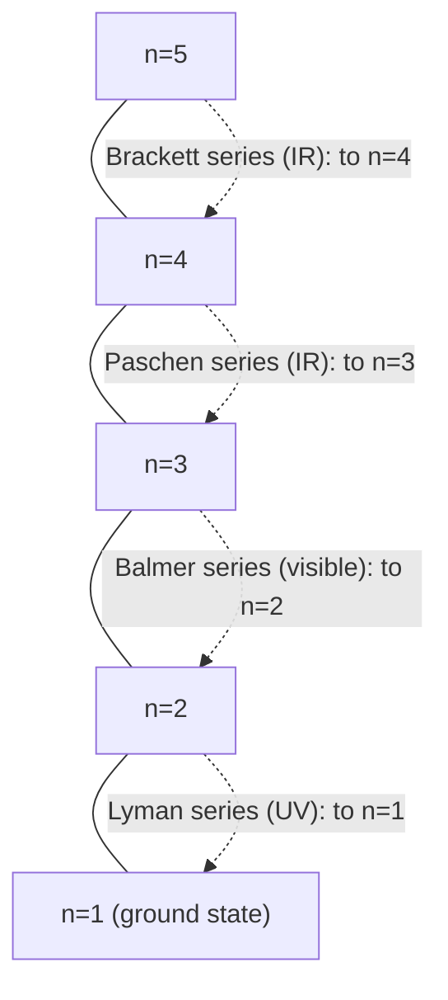

## Atomic Spectra and Spectral Series

### Overview

Atomic spectra are the discrete patterns of electromagnetic radiation emitted or absorbed by atoms as electrons transition between quantized energy levels. These discrete line spectra — rather than continuous spectra — provided the first direct experimental evidence for energy quantization and remain a cornerstone diagnostic tool across astrophysics, plasma physics, chemical analysis, and atomic physics.

### Emission and Absorption Spectra

**Emission spectrum**: When an electron transitions from a higher energy state $E_i$ to a lower energy state $E_f$, the atom emits a photon carrying the energy difference:

$$h\nu = E_i - E_f$$

**Absorption spectrum**: An atom in a lower energy state $E_f$ can absorb a photon of exactly the right energy to be excited to a higher state $E_i$, removing that specific wavelength from an incident continuous spectrum (producing dark absorption lines, as in the Fraunhofer lines of sunlight passing through the solar atmosphere).

**Key Points**

- Because energy levels are discrete, only photons of specific, discrete frequencies/wavelengths are emitted or absorbed — producing **line spectra** rather than continuous spectra.
- Emission and absorption spectra for the same atom occur at **identical wavelengths** (Kirchhoff's law of spectroscopy), since both processes connect the same pair of energy levels.

### The Hydrogen Spectrum and the Rydberg Formula

For hydrogen, the empirically discovered **Rydberg formula** predicts all observed spectral line wavelengths:

$$\frac{1}{\lambda} = R_H\left(\frac{1}{n_f^2} - \frac{1}{n_i^2}\right)$$

where $R_H \approx 1.097 \times 10^7\text{ m}^{-1}$ is the **Rydberg constant**, $n_f$ is the final (lower) principal quantum number, and $n_i > n_f$ is the initial (upper) principal quantum number.

This formula was originally empirical (found by fitting observed spectral lines before quantum mechanics existed) but is exactly derivable from the Bohr model and confirmed by the full quantum-mechanical solution of the hydrogen atom, using $E_n = -13.6\text{ eV}/n^2$:

$$h\nu = E_i - E_f \;\Rightarrow\; \frac{hc}{\lambda} = 13.6\text{ eV}\left(\frac{1}{n_f^2}-\frac{1}{n_i^2}\right)$$

### The Named Spectral Series of Hydrogen

Each series corresponds to a fixed final state $n_f$, with $n_i$ ranging over all integers greater than $n_f$:

| Series Name | $n_f$ | Spectral Region | Discoverer/Year |
| --- | --- | --- | --- |
| Lyman | 1 | Ultraviolet | Lyman, 1906 |
| Balmer | 2 | Visible | Balmer, 1885 |
| Paschen | 3 | Infrared | Paschen, 1908 |
| Brackett | 4 | Infrared | Brackett, 1922 |
| Pfund | 5 | Infrared | Pfund, 1924 |

**Key Points**

- The **Balmer series** ($n_f=2$) was historically discovered first (1885) because its lines fall in the visible range, making them observable with simple optical spectroscopy — well before the Lyman (UV) or Paschen (IR) series were identified.
- As $n_i \to \infty$ within any series, $1/\lambda \to R_H/n_f^2$, defining the **series limit** — the shortest wavelength (highest energy) line in that series, corresponding to the electron being freed from the atom entirely (ionization from level $n_f$).

### Worked Example 1: Balmer Series H-alpha Line

**Example**

Calculate the wavelength of the H$\alpha$ line (the first line of the Balmer series, $n_i=3 \to n_f=2$).

$$\frac{1}{\lambda} = R_H\left(\frac{1}{2^2}-\frac{1}{3^2}\right) = 1.097\times10^7\left(\frac{1}{4}-\frac{1}{9}\right) = 1.097\times10^7 \times \frac{5}{36}$$

$$\frac{1}{\lambda} = 1.524\times10^6\text{ m}^{-1} \quad\Rightarrow\quad \lambda = 656.3\text{ nm}$$

**Output**

This matches the well-known red H$\alpha$ emission line at 656.3 nm, visible in astronomical spectra of hydrogen-rich nebulae and used extensively in solar and stellar spectroscopy to trace hydrogen gas.

### Worked Example 2: Lyman Series Limit (Ionization Energy Check)

**Example**

Calculate the series limit wavelength of the Lyman series ($n_f=1$, $n_i \to \infty$) and confirm it corresponds to the hydrogen ionization energy.

$$\frac{1}{\lambda_{\text{limit}}} = R_H\left(\frac{1}{1^2} - 0\right) = R_H = 1.097\times10^7\text{ m}^{-1}$$

$$\lambda_{\text{limit}} = 91.2\text{ nm}$$

**Output**

Converting to photon energy: $E = hc/\lambda = 13.6\text{ eV}$, exactly matching the hydrogen ground-state ionization energy. This confirms the series limit represents complete removal of the electron from the $n_f=1$ ground state — the physical boundary between the discrete bound-state spectrum and the continuous (unbound, ionized) spectrum above it.

### Fine Structure of Spectral Lines

High-resolution spectroscopy reveals that spectral lines are not perfectly single wavelengths but exhibit **fine structure** — small splittings due to:

1. **Spin-orbit coupling**: interaction between electron spin and orbital magnetic moment, splitting levels of the same $n,l$ into different $j = l\pm\tfrac12$ sub-levels (as detailed in the Orbital and Spin Angular Momentum topic).
2. **Relativistic kinetic energy correction**: correction to the non-relativistic kinetic energy expression, of the same order of magnitude as spin-orbit coupling.

The famous **sodium D-line doublet** (589.0 nm and 589.6 nm) is a well-known example: transitions from the split $3p_{3/2}$ and $3p_{1/2}$ levels down to the $3s_{1/2}$ ground state produce two closely-spaced yellow lines rather than one.

[Inference] Even finer splittings (hyperfine structure), arising from interaction between electron angular momentum and nuclear spin/magnetic moment, produce further sub-splitting (e.g., the hydrogen 21 cm line), though these effects are typically several orders of magnitude smaller than fine structure and require radio-frequency-level spectral resolution to observe.

### Selection Rules for Allowed Transitions

Not all conceivable transitions between energy levels actually occur; **electric dipole selection rules** (derived from time-dependent perturbation theory and parity/angular-momentum conservation, as covered in that topic) restrict allowed transitions to:

$$\Delta l = \pm 1, \qquad \Delta m_l = 0, \pm1, \qquad \Delta j = 0, \pm1 \;(\text{but } j=0\to j=0\text{ forbidden})$$

Transitions violating these rules are called **forbidden transitions** — they can still occur via higher-order processes (magnetic dipole, electric quadrupole radiation) but at dramatically reduced rates, often manifesting as long-lived **metastable states**.

**Key Points**

- Forbidden transitions are of major importance in astrophysics: certain nebular emission lines (e.g., the historically misidentified "nebulium" lines, later explained as forbidden transitions of doubly-ionized oxygen, O III) are observable only in the extremely low-density environment of interstellar space, where collisional de-excitation (which would otherwise dominate over the slow radiative forbidden transition) is negligible.
- The $2s \to 1s$ transition in hydrogen is strictly forbidden by electric dipole selection rules ($\Delta l = 0$, not $\pm1$); this metastable $2s$ state decays primarily via a much slower two-photon emission process.

### Diagram: Hydrogen Spectral Series Energy Level Diagram

### Diagram: Balmer Series Transitions on Energy Level Diagram (svg_diagram)

<svg xmlns="http://www.w3.org/2000/svg" viewBox="0 0 460 340">
<text x="230" y="25" font-size="16" font-weight="bold" text-anchor="middle" fill="#1a1a1a">Balmer Series: Transitions to n=2 (svg_diagram)</text>

<line x1="80" y1="280" x2="380" y2="280" stroke="#1a1a1a" stroke-width="2" />
<text x="60" y="284" font-size="13" fill="#1a1a1a">n=1</text>
<line x1="80" y1="220" x2="380" y2="220" stroke="#1a1a1a" stroke-width="2" />
<text x="60" y="224" font-size="13" fill="#1a1a1a">n=2</text>
<line x1="80" y1="170" x2="380" y2="170" stroke="#1a1a1a" stroke-width="2" />
<text x="60" y="174" font-size="13" fill="#1a1a1a">n=3</text>
<line x1="80" y1="130" x2="380" y2="130" stroke="#1a1a1a" stroke-width="2" />
<text x="60" y="134" font-size="13" fill="#1a1a1a">n=4</text>
<line x1="80" y1="95" x2="380" y2="95" stroke="#1a1a1a" stroke-width="2" />
<text x="60" y="99" font-size="13" fill="#1a1a1a">n=5</text>
<line x1="80" y1="60" x2="380" y2="60" stroke="#999" stroke-width="1.5" stroke-dasharray="4,3" />
<text x="50" y="64" font-size="12" fill="#666">n=inf</text>

<line x1="200" y1="170" x2="200" y2="220" stroke="#c0392b" stroke-width="2" />
<polygon points="196,216 200,228 204,216" fill="#c0392b" />
<text x="210" y="200" font-size="11" fill="#c0392b">H-alpha 656nm</text>
<line x1="250" y1="130" x2="250" y2="220" stroke="#2980b9" stroke-width="2" />
<polygon points="246,216 250,228 254,216" fill="#2980b9" />
<text x="260" y="175" font-size="11" fill="#2980b9">H-beta 486nm</text>
<line x1="300" y1="95" x2="300" y2="220" stroke="#27ae60" stroke-width="2" />
<polygon points="296,216 300,228 304,216" fill="#27ae60" />
<text x="310" y="160" font-size="11" fill="#27ae60">H-gamma 434nm</text>

<text x="230" y="320" font-size="12" text-anchor="middle" fill="`#1a1a1a`">Downward transitions to n=2 produce visible Balmer emission lines</text>

</svg>

### Common Misconceptions

- **Assuming the Rydberg formula applies to any atom**: The simple Rydberg formula (with constant $R_H$) is exact only for hydrogen and hydrogen-like ions (single electron, e.g., He$^+$, Li$^{2+}$, with $R$ scaled by $Z^2$); multi-electron atoms have far more complex spectra due to electron-electron interactions and screening.
- **Believing all transitions between any two levels are allowed**: Selection rules ($\Delta l = \pm1$, etc.) forbid many transitions at the electric dipole level; "forbidden" does not always mean "impossible," only "much less probable," occurring via weaker higher-order radiative mechanisms.
- **Confusing emission and absorption line positions**: These occur at *identical* wavelengths for a given atom (same energy level pairs), differing only in whether the atom starts in the higher or lower state.
- **Assuming series limits represent an actual observed spectral line**: The series limit is a mathematical convergence point (continuum edge) rather than a single discrete line; it marks where the discrete line spectrum transitions into a continuous ionization spectrum.

### Conclusion

Atomic spectra arise from photon emission or absorption accompanying electron transitions between quantized energy levels, with hydrogen's spectrum precisely described by the Rydberg formula and organized into named series (Lyman, Balmer, Paschen, etc.) according to the final-state quantum number $n_f$. Fine structure splitting and electric-dipole selection rules further refine which transitions occur and at what precise wavelengths, with forbidden transitions playing a crucial diagnostic role in low-density astrophysical environments. Atomic spectroscopy remains one of the most direct and historically foundational experimental windows into quantum energy level structure.

**Related Topics**

- Bohr model derivation of hydrogen energy levels
- Fine structure, hyperfine structure, and the hydrogen 21 cm line
- Zeeman and Stark effects on spectral lines
- Astrophysical spectroscopy: stellar classification and redshift measurement
- X-ray spectra, Moseley's law, and characteristic X-ray lines
- Forbidden transitions and metastable states in nebular astrophysics
- Laser physics and population inversion via spectral transitions