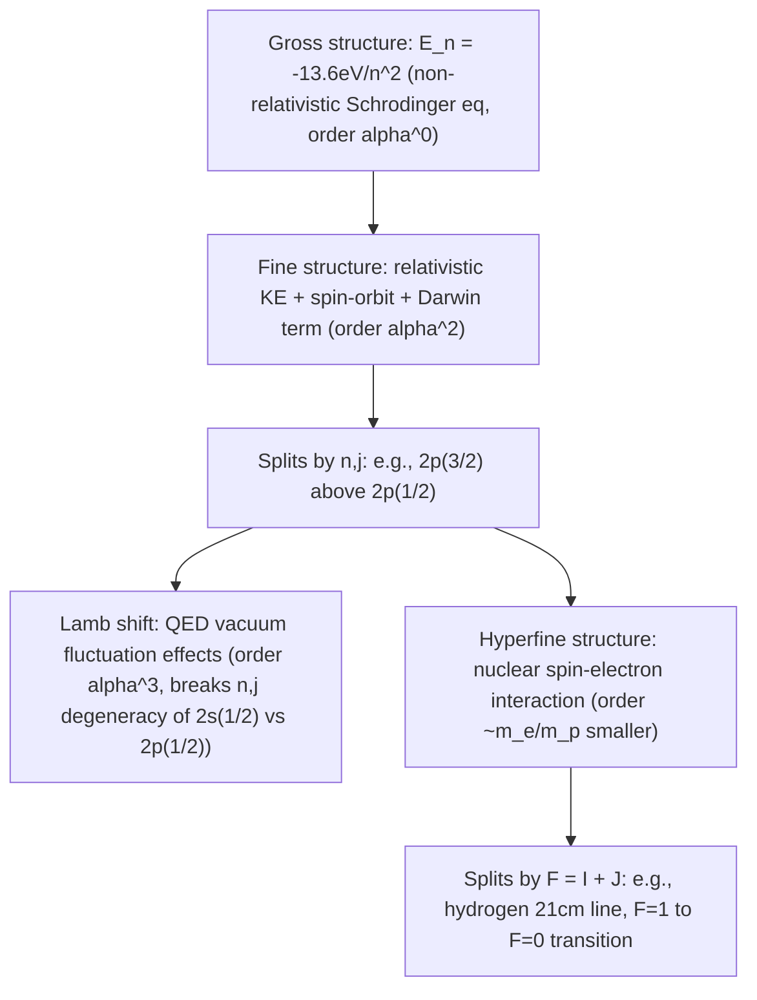

## Fine and Hyperfine Structure

### Overview

Fine structure and hyperfine structure refer to small energy-level splittings that refine the basic quantum picture of atomic energy levels beyond the simple $E_n = -13.6\text{ eV}/n^2$ (hydrogen) or single-configuration approximation. Fine structure arises from relativistic effects and spin-orbit coupling at order $\alpha^2$ relative to the gross structure ($\alpha$ being the fine structure constant), while hyperfine structure arises from interactions with the nucleus's magnetic and electric moments, roughly $10^3$ times smaller still. Together they explain observed spectral line splittings inaccessible to the non-relativistic, point-nucleus Schrödinger treatment.

### Origin of Fine Structure: Three Contributions

For the hydrogen atom (and hydrogen-like ions), fine structure arises from three physically distinct corrections, each of comparable magnitude ($\sim\alpha^2 \times$ gross structure energy):

**1. Relativistic Kinetic Energy Correction**

The non-relativistic kinetic energy $p^2/2m$ is the leading term of the full relativistic expression $\sqrt{p^2c^2+m^2c^4}-mc^2$. Expanding to next order gives a correction operator:

$$\hat{H}_{\text{rel}} = -\frac{\hat{p}^4}{8m^3c^2}$$

**2. Spin-Orbit Coupling**

The orbiting electron experiences a magnetic field (in its own rest frame) generated by the apparent orbital motion of the nucleus; this field interacts with the electron's intrinsic spin magnetic moment:

$$\hat{H}_{SO} = \frac{1}{2m^2c^2}\frac{1}{r}\frac{dV}{dr}\,\hat{\mathbf{L}}\cdot\hat{\mathbf{S}}$$

(the factor of $\tfrac12$ relative to the naive classical estimate is the **Thomas precession** correction, a relativistic kinematic effect from the electron's accelerating, non-inertial rest frame).

**3. Darwin Term**

A purely quantum-relativistic correction with no classical analog, arising from *zitterbewegung* (rapid oscillatory motion) of the electron implied by the Dirac equation, affecting only $s$-orbitals ($l=0$, where the wavefunction is nonzero at the origin):

$$\hat{H}_{\text{Darwin}} = \frac{\pi\hbar^2}{2m^2c^2}\frac{e^2}{4\pi\epsilon_0}\delta^3(\mathbf{r})$$

**Key Points**

- All three corrections scale as $\alpha^2$ relative to the gross-structure (Bohr) energy, where $\alpha = e^2/(4\pi\epsilon_0\hbar c) \approx 1/137$ is the fine structure constant — hence the term "fine structure."
- Remarkably, when combined, the three contributions produce a total fine-structure energy shift depending **only on $n$ and $j$** (not separately on $l$), a non-trivial cancellation confirmed by the exact solution of the Dirac equation for hydrogen.

### The Combined Fine Structure Formula

Using degenerate perturbation theory in the coupled $|n,l,j,m_j\rangle$ basis (where $\hat{\mathbf{L}}\cdot\hat{\mathbf{S}} = \tfrac{\hbar^2}{2}[j(j+1)-l(l+1)-s(s+1)]$ diagonalizes the spin-orbit term), the total fine-structure correction to the hydrogen energy levels is:

$$E_{\text{fs}} = \frac{13.6\text{ eV}}{n^2}\cdot\frac{\alpha^2}{n}\left[\frac{3}{4} - \frac{n}{j+\tfrac12}\right]$$

giving the corrected energy levels:

$$E_{n,j} = -\frac{13.6\text{ eV}}{n^2}\left\{1 + \frac{\alpha^2}{n^2}\left[\frac{n}{j+\tfrac12} - \frac{3}{4}\right]\right\}$$

**Key Points**

- For fixed $n$, states with the same $j$ but different $l$ (e.g., $2s_{1/2}$ and $2p_{1/2}$) remain **exactly degenerate** in this formula — this specific degeneracy is only lifted by an even smaller effect, the **Lamb shift** (a quantum electrodynamics/vacuum-fluctuation effect not captured by the Dirac equation alone).
- The relative size of fine structure splitting scales as $\alpha^2 \approx 5\times10^{-5}$ times the gross structure energy — small but readily resolvable with modern spectroscopy.

### Worked Example: Sodium D-Line Fine Structure Splitting

**Example**

Explain the physical origin of the sodium D-line doublet (589.0 nm, $3p_{3/2}\to3s_{1/2}$; and 589.6 nm, $3p_{1/2}\to3s_{1/2}$) in terms of fine structure.

The single $3p$ subshell (in the absence of spin-orbit coupling) would give one emission wavelength to the $3s$ ground state. Spin-orbit coupling splits the $3p$ level according to $j = l\pm\tfrac12 = 1\pm\tfrac12$, giving $3p_{1/2}$ and $3p_{3/2}$ sublevels at slightly different energies (with $3p_{3/2}$ higher, since $\langle\hat{\mathbf{L}}\cdot\hat{\mathbf{S}}\rangle$ is positive for $j=l+\tfrac12$).

**Output**

Each sublevel decays independently to the (fine-structure-split, but here effectively single since $3s_{1/2}$ has only $j=1/2$) ground state, producing two distinct, closely-spaced emission wavelengths — the observed D-line doublet. [Inference] Because sodium is a multi-electron atom (not hydrogen), the exact hydrogen fine-structure formula above does not directly apply numerically, but the qualitative spin-orbit-coupling mechanism generating the splitting is the same.

### Hyperfine Structure: Nuclear Contributions

Hyperfine structure arises from the interaction between atomic electrons and the **nuclear magnetic dipole moment** (and, for nuclei with spin $I \geq 1$, the nuclear electric quadrupole moment). The dominant contribution is the **magnetic dipole hyperfine interaction**:

$$\hat{H}_{\text{hf}} = A\,\hat{\mathbf{I}}\cdot\hat{\mathbf{J}}$$

where $\hat{\mathbf{I}}$ is the nuclear spin operator, $\hat{\mathbf{J}}$ is the total electronic angular momentum, and $A$ is the hyperfine coupling constant (dependent on the specific atomic state and nuclear magnetic moment).

**Total Angular Momentum Including Nuclear Spin**

Define the grand total angular momentum $\hat{\mathbf{F}} = \hat{\mathbf{I}} + \hat{\mathbf{J}}$, with quantum number $F$ ranging (via the triangle rule) from $|I-J|$ to $I+J$. The hyperfine energy shift is:

$$E_{\text{hf}} = \frac{A}{2}\left[F(F+1) - I(I+1) - J(J+1)\right]$$

**Key Points**

- Hyperfine splittings are typically $\sim10^3$ times smaller than fine structure splittings, since the effect scales with the ratio of electron to proton mass ($m_e/m_p \approx 1/1836$), reflecting the much weaker nuclear (versus electronic) magnetic moment.
- Nuclear spin $I$ is a fixed, isotope-specific property (e.g., $I=1/2$ for hydrogen-1's proton); different isotopes of the same element can have different $I$ and therefore different hyperfine structure, even with identical electronic structure.

### Worked Example: The Hydrogen 21 cm Line

**Example**

Explain the origin of the famous hydrogen 21 cm radio line used extensively in radio astronomy, in terms of hyperfine structure.

In the hydrogen ground state ($1s$, $L=0$, $S=1/2$, so $J=1/2$), the proton has nuclear spin $I=1/2$. Coupling $\hat{\mathbf{F}} = \hat{\mathbf{I}}+\hat{\mathbf{J}}$ gives allowed values $F = 0$ (antiparallel electron/proton spins) or $F=1$ (parallel spins), from the triangle rule with $I=J=1/2$.

**Output**

The magnetic dipole-dipole interaction between the electron and proton spins makes the parallel-spin ($F=1$) configuration very slightly higher in energy than the antiparallel ($F=0$) configuration. The transition $F=1 \to F=0$ (a spin-flip, magnetic-dipole transition — forbidden at the electric-dipole level and therefore extremely slow, with a spontaneous transition lifetime of about $10^7$ years [Inference] under isolated-atom conditions) emits a photon at $\lambda = 21.1\text{ cm}$ (frequency $\approx 1420\text{ MHz}$). Despite the transition's extreme rarity per atom, the enormous quantity of interstellar neutral hydrogen makes the 21 cm line one of the most important observational tools in radio astronomy for mapping galactic structure and detecting cosmic hydrogen distribution.

### Beyond Fine Structure: The Lamb Shift (Brief Note)

[Inference] The Lamb shift — the small energy splitting between $2s_{1/2}$ and $2p_{1/2}$ states in hydrogen, degenerate according to the Dirac equation's fine-structure formula above — arises from quantum electrodynamic (QED) effects: the electron's interaction with vacuum fluctuations of the quantized electromagnetic field. Its historical measurement (Lamb and Retherford, 1947) was pivotal experimental motivation for the development of renormalized quantum electrodynamics, though the full theoretical treatment lies outside the scope of the fine/hyperfine structure formalism covered here.

### Diagram: Hierarchy of Atomic Structure Splittings

### Diagram: Hydrogen n=2 Level Splitting Cascade (svg_diagram)

<svg xmlns="http://www.w3.org/2000/svg" viewBox="0 0 560 340">
<text x="280" y="25" font-size="16" font-weight="bold" text-anchor="middle" fill="#1a1a1a">n=2 Level: Gross to Fine to Lamb Shift (svg_diagram)</text>

<line x1="40" y1="150" x2="140" y2="150" stroke="#1a1a1a" stroke-width="3" />
<text x="90" y="180" font-size="11" text-anchor="middle" fill="#1a1a1a">n=2 (gross)</text>
<line x1="160" y1="150" x2="220" y2="150" stroke="#999" stroke-width="1" stroke-dasharray="3,3" />

<line x1="240" y1="110" x2="340" y2="110" stroke="#c0392b" stroke-width="3" />
<text x="290" y="100" font-size="11" text-anchor="middle" fill="#c0392b">2p(3/2)</text>
<line x1="240" y1="170" x2="340" y2="170" stroke="#2980b9" stroke-width="3" />
<text x="290" y="195" font-size="11" text-anchor="middle" fill="#2980b9">2s(1/2), 2p(1/2) [degenerate in Dirac theory]</text>
<line x1="360" y1="170" x2="420" y2="170" stroke="#999" stroke-width="1" stroke-dasharray="3,3" />

<line x1="440" y1="150" x2="540" y2="150" stroke="#27ae60" stroke-width="3" />
<text x="490" y="140" font-size="11" text-anchor="middle" fill="#27ae60">2s(1/2)</text>
<line x1="440" y1="185" x2="540" y2="185" stroke="#e67e22" stroke-width="3" />
<text x="490" y="210" font-size="11" text-anchor="middle" fill="#e67e22">2p(1/2)</text>

<text x="280" y="280" font-size="12" text-anchor="middle" fill="`#1a1a1a`">Fine structure splits by j; Lamb shift (QED) further splits</text>

<text x="280" y="300" font-size="12" text-anchor="middle" fill="`#1a1a1a`">states of equal j but different l (2s_1/2 vs 2p_1/2)</text>

</svg>

### Common Misconceptions

- **Assuming fine structure is a single effect**: Fine structure is the sum of three distinct physical contributions (relativistic KE correction, spin-orbit coupling, Darwin term); each individually does not reproduce the correct $n,j$-only dependence — only their combination does.
- **Confusing fine structure with hyperfine structure**: Fine structure originates from relativistic/spin-orbit effects within the electron cloud itself; hyperfine structure specifically originates from the nucleus's magnetic (and quadrupole) moment interacting with the electrons — a distinct, much smaller effect.
- **Believing the Dirac equation fully explains all fine-level splitting**: The Dirac equation correctly predicts fine structure (via the $n,j$ formula) but still leaves the $2s_{1/2}$/$2p_{1/2}$ degeneracy unbroken; resolving this required the Lamb shift and full QED.
- **Assuming hyperfine splitting is negligible/unobservable**: While much smaller than fine structure, hyperfine splitting is readily observable (e.g., the 21 cm line) and of major practical importance in atomic clocks (e.g., the cesium hyperfine transition defining the SI second) and radio astronomy.

### Conclusion

Fine structure splits atomic energy levels according to total angular momentum $j$ through the combined effects of relativistic kinetic energy correction, spin-orbit coupling, and the Darwin term (all order $\alpha^2$), producing observable splittings like the sodium D-line doublet, while hyperfine structure — roughly $10^3$ times smaller — arises from nuclear spin-electron interactions characterized by grand total angular momentum $F=I+J$, exemplified by the astronomically vital hydrogen 21 cm line. The residual $2s_{1/2}$-$2p_{1/2}$ degeneracy left unresolved even by the relativistic Dirac equation is finally lifted by the Lamb shift, a quantum electrodynamic effect marking the historical transition from relativistic quantum mechanics to full quantum field theory.

**Related Topics**

- Dirac equation and relativistic quantum mechanics
- Lamb shift and quantum electrodynamics (QED)
- Zeeman effect (normal and anomalous) and hyperfine Zeeman splitting
- Atomic clocks and the cesium hyperfine transition standard
- 21 cm radio astronomy and galactic hydrogen mapping
- Nuclear magnetic resonance (NMR) and nuclear spin physics
- Landé g-factor and magnetic moment calculations