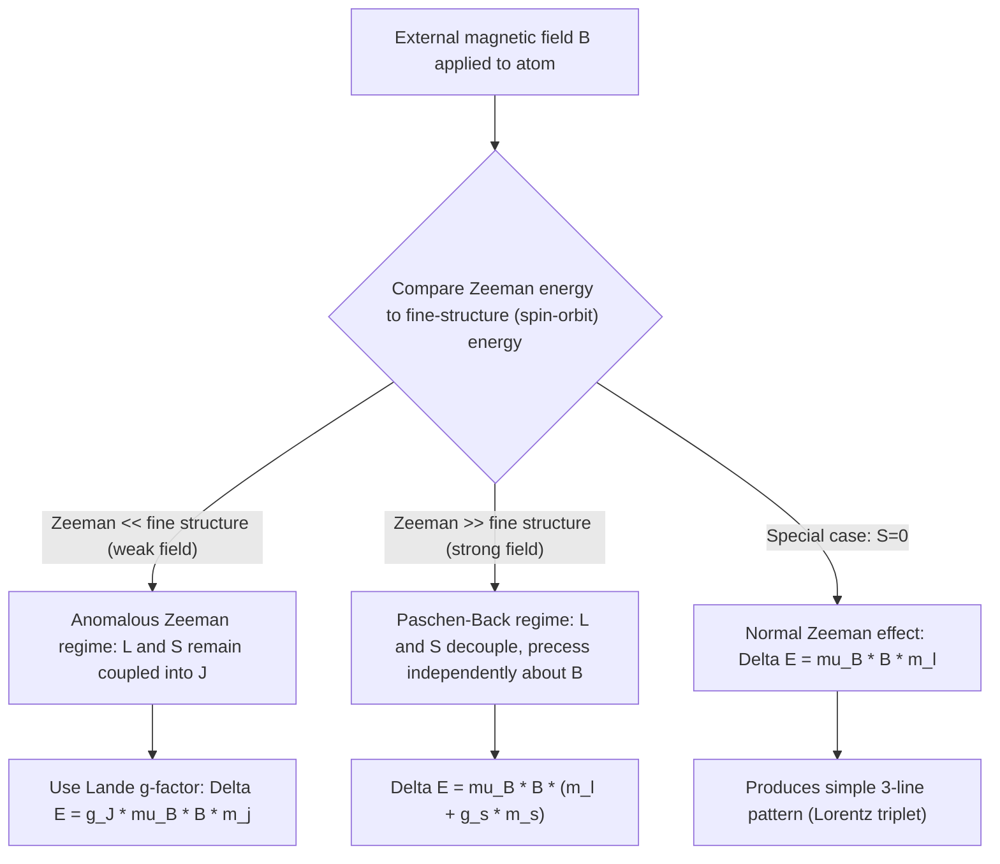

## The Zeeman Effect

### Overview

The Zeeman effect is the splitting of atomic spectral lines into multiple components when an atom is placed in an external magnetic field. Discovered experimentally by Pieter Zeeman in 1896, it provided early evidence for the quantization of angular momentum and remains a key tool for measuring magnetic fields in astrophysics (e.g., sunspot fields) and probing atomic structure. Two distinct regimes exist — the **normal Zeeman effect** (simpler, historically first understood) and the **anomalous Zeeman effect** (more common, requiring electron spin for explanation) — plus the **Paschen-Back effect** in the strong-field limit.

### Physical Origin: Magnetic Interaction Energy

An external magnetic field $\mathbf{B} = B\hat{z}$ interacts with an atom's total magnetic dipole moment $\boldsymbol{\mu}$, adding a perturbation term to the Hamiltonian:

$$\hat{H}_Z = -\boldsymbol{\mu}\cdot\mathbf{B}$$

The atomic magnetic moment has contributions from both orbital motion and electron spin:

$$\boldsymbol{\mu} = -\frac{\mu_B}{\hbar}(\hat{\mathbf{L}} + g_s\hat{\mathbf{S}})$$

where $\mu_B = e\hbar/2m_e$ is the **Bohr magneton** and $g_s \approx 2$ is the electron spin g-factor (the anomalous factor of 2, rather than 1, is a relativistic quantum electrodynamic result, first derived from the Dirac equation).

### The Normal Zeeman Effect (Spin-Zero Case)

**Simplifying assumption**: When total spin $S=0$ (e.g., singlet states in atoms with paired electrons), $\boldsymbol{\mu}$ depends only on orbital angular momentum:

$$\hat{H}_Z = \frac{\mu_B}{\hbar}\hat{L}_z B = \mu_B m_l B$$

This gives an energy shift linear in $m_l$:

$$\Delta E = \mu_B B\, m_l, \qquad m_l = -l, \ldots, +l$$

**Key Points**

- A given level with orbital quantum number $l$ splits into exactly $2l+1$ equally-spaced sublevels, separated by $\mu_B B$.
- Because electric dipole selection rules require $\Delta m_l = 0, \pm1$, a transition between two levels (each split into $2l+1$ sublevels) produces **only three distinct spectral lines** — the central undisplaced line ($\Delta m_l=0$, the $\pi$ component) and two symmetric shifted lines ($\Delta m_l = \pm1$, the $\sigma^\pm$ components) — regardless of how many sublevels each sub-level itself contains, since the energy spacing is identical for both initial and final $l$ states.

### Worked Example: Normal Zeeman Triplet

**Example**

A spin-singlet atomic transition between an $l=1$ (P) state and an $l=0$ (S) state occurs in an external field $B = 1\text{ T}$. Find the frequency shifts of the resulting Zeeman components.

The $l=0$ state has $m_l=0$ only (unsplit). The $l=1$ state splits into $m_l = -1, 0, +1$, each shifted by $\Delta E = \mu_B B\, m_l$.

Allowed transitions ($\Delta m_l = 0, \pm1$) from $l=1$ to $l=0$ ($m_l=0$):

- $m_l = -1 \to 0$: $\Delta m_l = +1$, shifted by $-\mu_B B$ relative to unperturbed line (net photon energy is lower)
- $m_l = 0 \to 0$: $\Delta m_l = 0$, unshifted ($\pi$ component)
- $m_l = +1 \to 0$: $\Delta m_l = -1$, shifted by $+\mu_B B$ relative to unperturbed line (net photon energy is higher)

Using $\mu_B = 9.274\times10^{-24}\text{ J/T}$ and $B=1\text{ T}$: $\Delta E = 9.274\times10^{-24}\text{ J} = 5.79\times10^{-5}\text{ eV}$.

**Output**

The single unperturbed spectral line splits into a symmetric triplet, with the two outer lines shifted by $\pm5.79\times10^{-5}\text{ eV}$ from the central unshifted line. This clean three-line pattern is precisely why this configuration is called the "normal" Zeeman effect — it matches the earliest classical (Lorentz) theoretical prediction, made before electron spin was even known to exist.

### The Anomalous Zeeman Effect (Spin-Nonzero Case)

**The complication**: When $S \neq 0$, the magnetic moment $\boldsymbol{\mu} \propto (\hat{\mathbf{L}}+g_s\hat{\mathbf{S}})$ is **not parallel** to the total angular momentum $\hat{\mathbf{J}} = \hat{\mathbf{L}}+\hat{\mathbf{S}}$, because $g_s \neq 1$. Since $\hat{\mathbf{J}}$ (not $\hat{\mathbf{L}}$ or $\hat{\mathbf{S}}$ separately) is the conserved quantity in the presence of spin-orbit coupling (weak-field regime, where Zeeman splitting is much smaller than fine-structure splitting), the Zeeman Hamiltonian must be projected onto the $\hat{\mathbf{J}}$ direction using degenerate perturbation theory within each fine-structure level.

**The Landé g-factor**

The effective magnetic moment projection along $\hat{\mathbf{J}}$ introduces the **Landé g-factor**:

$$g_J = 1 + \frac{j(j+1)+s(s+1)-l(l+1)}{2j(j+1)}$$

The resulting energy shift becomes:

$$\Delta E = g_J\,\mu_B B\, m_j, \qquad m_j = -j,\ldots,+j$$

**Key Points**

- $g_J$ depends on $l$, $s$, and $j$ — different fine-structure levels (even within the same term) generally have *different* $g_J$ values, so the energy spacing between adjacent $m_j$ sublevels differs between the upper and lower levels of a transition.
- Because upper and lower level spacings generally differ, transitions no longer collapse into a simple three-line pattern; instead, **more than three spectral components** typically appear — hence "anomalous" (a historical misnomer, since this case is actually the *more common* one; the "normal" effect is the special, simpler case of $S=0$).

### Worked Example: Landé g-Factor for the Sodium D-Lines

**Example**

Calculate the Landé g-factor for the $3p_{3/2}$ state of sodium ($l=1$, $s=1/2$, $j=3/2$).

$$g_J = 1 + \frac{\tfrac32(\tfrac32+1) + \tfrac12(\tfrac12+1) - 1(1+1)}{2\cdot\tfrac32(\tfrac32+1)} = 1 + \frac{\tfrac{15}{4}+\tfrac34-2}{2\cdot\tfrac{15}{4}} = 1+\frac{\tfrac{10}{4}}{\tfrac{15}{2}} = 1+\frac{1}{3} = \frac{4}{3}$$

**Output**

For comparison, the $3s_{1/2}$ ground state ($l=0$, $s=1/2$, $j=1/2$) gives $g_J = 2$ (a pure-spin state, correctly recovering $g_s \approx 2$ since orbital contribution vanishes). Because $g_{3p_{3/2}}=4/3 \neq g_{3s_{1/2}}=2$, the sodium D2 line ($3p_{3/2}\to3s_{1/2}$) splits into more than the naive 3-line pattern under a weak magnetic field — the hallmark signature of the anomalous Zeeman effect, observed experimentally as a more complex multi-line splitting pattern for this transition.

### The Paschen-Back Effect (Strong-Field Limit)

**Regime**: When the external magnetic field is strong enough that the Zeeman interaction energy *exceeds* the fine-structure (spin-orbit coupling) energy, the coupling scheme changes qualitatively. In this limit, $\hat{\mathbf{L}}$ and $\hat{\mathbf{S}}$ decouple from each other and instead precess independently and rapidly about the (now dominant) external field direction $\hat{z}$, so $m_l$ and $m_s$ (rather than $m_j$) become the relevant good quantum numbers.

The energy shift simplifies back to an additive, "normal-looking" form:

$$\Delta E = \mu_B B(m_l + g_s m_s)$$

**Key Points**

- The Paschen-Back effect represents the opposite coupling limit from the anomalous Zeeman effect: strong-field (Paschen-Back) decouples $\mathbf{L}$ and $\mathbf{S}$ individually to the field; weak-field (anomalous Zeeman) keeps them coupled into $\mathbf{J}$, which then precesses about the field as a whole.
- The transition between these two regimes as field strength increases is smooth but non-trivial, generally requiring full diagonalization of the combined spin-orbit-plus-Zeeman Hamiltonian at intermediate field strengths (no simple closed-form formula applies in the crossover region).

### Diagram: Weak-Field vs. Strong-Field Coupling Regimes

### Diagram: Normal Zeeman Splitting Producing a Triplet (svg_diagram)

<svg xmlns="http://www.w3.org/2000/svg" viewBox="0 0 500 320">
<text x="250" y="25" font-size="16" font-weight="bold" text-anchor="middle" fill="#1a1a1a">Normal Zeeman Effect: l=1 to l=0 Transition (svg_diagram)</text>

<line x1="60" y1="80" x2="180" y2="80" stroke="#c0392b" stroke-width="3" />
<text x="190" y="84" font-size="12" fill="#c0392b">m_l = +1</text>
<line x1="60" y1="120" x2="180" y2="120" stroke="#1a1a1a" stroke-width="3" />
<text x="190" y="124" font-size="12" fill="#1a1a1a">m_l = 0</text>
<line x1="60" y1="160" x2="180" y2="160" stroke="#2980b9" stroke-width="3" />
<text x="190" y="164" font-size="12" fill="#2980b9">m_l = -1</text>

<text x="120" y="55" font-size="12" text-anchor="middle" fill="`#1a1a1a`">l=1 (B field on)</text>

<line x1="60" y1="260" x2="180" y2="260" stroke="#1a1a1a" stroke-width="3" />
<text x="120" y="285" font-size="12" text-anchor="middle" fill="#1a1a1a">l=0, m_l=0</text>

<line x1="90" y1="80" x2="90" y2="260" stroke="#2980b9" stroke-width="1.5" />
<line x1="120" y1="120" x2="120" y2="260" stroke="#1a1a1a" stroke-width="1.5" />
<line x1="150" y1="160" x2="150" y2="260" stroke="#c0392b" stroke-width="1.5" />

<text x="350" y="120" font-size="13" fill="`#c0392b`">sigma+ (higher freq)</text>

<text x="350" y="160" font-size="13" fill="`#1a1a1a`">pi (unshifted)</text>

<text x="350" y="200" font-size="13" fill="`#2980b9`">sigma- (lower freq)</text>

<text x="250" y="300" font-size="12" text-anchor="middle" fill="`#1a1a1a`">Three equally-spaced lines from Delta m_l = -1, 0, +1 selection rule</text>

</svg>

### Common Misconceptions

- **Assuming "anomalous" means rare or unusual**: The anomalous Zeeman effect is actually the *more common* case physically (any state with nonzero spin); the name is a historical artifact from before electron spin was understood, when the simpler spin-zero case was assumed to be the general rule.
- **Using $g_s = 1$ in Landé g-factor calculations**: The correct electron spin g-factor is $g_s \approx 2$ (not 1, as for orbital angular momentum), and this distinction is precisely why $\boldsymbol{\mu}$ is not parallel to $\hat{\mathbf{J}}$, producing the anomalous splitting pattern in the first place.
- **Expecting a fixed 3-line pattern regardless of field strength**: The 3-line "Lorentz triplet" pattern is specific to the normal Zeeman effect ($S=0$) in the weak-field limit; anomalous Zeeman transitions typically show 4, 6, or more components, and the pattern changes further entering the Paschen-Back (strong-field) regime.
- **Confusing the weak-field (anomalous Zeeman) and strong-field (Paschen-Back) Hamiltonians**: These represent genuinely different physical coupling schemes (J-coupled vs. L,S-decoupled), not merely different magnitudes of the same formula; applying the wrong formula in the wrong regime gives qualitatively incorrect splitting patterns.

### Conclusion

The Zeeman effect splits atomic energy levels in an external magnetic field, with the simple case of zero total spin producing the classic three-line "normal" Zeeman pattern via $\Delta E = \mu_B B\,m_l$, while the more general and more common case of nonzero spin produces the "anomalous" Zeeman effect, requiring the Landé g-factor $g_J$ to correctly project the non-collinear magnetic moment onto the conserved total angular momentum $\hat{\mathbf{J}}$. In sufficiently strong fields, the Paschen-Back effect decouples orbital and spin angular momenta entirely, restoring a simpler additive splitting formula. Collectively, these regimes provide precise experimental access to atomic angular momentum coupling and remain essential tools for magnetic field measurement in laboratory and astrophysical plasmas.

**Related Topics**

- Landé g-factor derivation and vector model of angular momentum
- Fine structure and spin-orbit coupling (prerequisite formalism)
- Stark effect: electric-field analog of the Zeeman effect
- Nuclear magnetic resonance (NMR) and electron spin resonance (ESR)
- Zeeman effect applications in solar and stellar magnetic field measurement
- Optical pumping and magnetic sublevel population techniques
- Hyperfine Zeeman effect (Zeeman splitting of hyperfine F-levels)