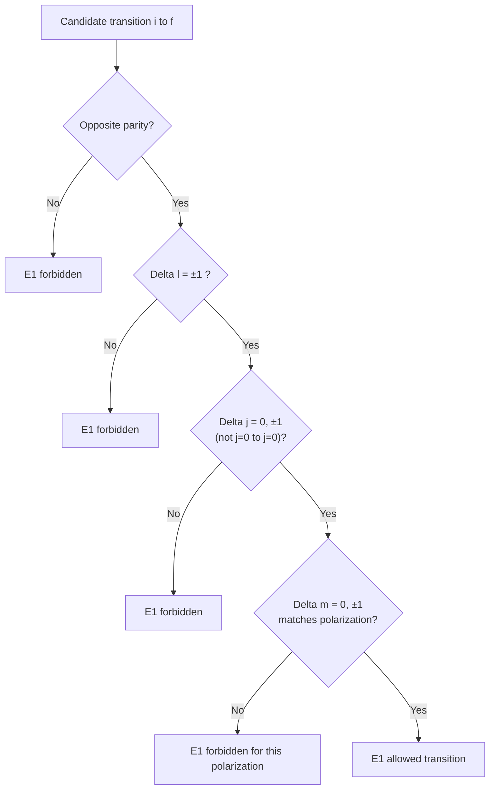

## Selection Rules for Transitions

### Overview

Selection rules determine which transitions between quantum states are allowed and which are forbidden under a given interaction mechanism (typically electromagnetic radiation). They arise from the requirement that transition matrix elements be nonzero, which in turn follows from symmetry properties (parity, angular momentum conservation) and the multipole character of the radiation field.

**Key Points**

- A transition rate depends on the matrix element $\langle f|\hat{O}|i\rangle$ of some operator $\hat{O}$ connecting initial and final states
- Selection rules specify which changes in quantum numbers ($\Delta n$, $\Delta\ell$, $\Delta m$, $\Delta j$, parity) yield nonzero matrix elements
- Different interaction types (electric dipole, magnetic dipole, electric quadrupole) obey different selection rules
- Strictly "forbidden" transitions are only forbidden to leading order; they may still occur via higher-order (weaker) mechanisms

---

### General Formalism

The transition rate between states $|i\rangle$ and $|f\rangle$ under a perturbation is governed by Fermi's Golden Rule:

$$\Gamma_{i\to f} = \frac{2\pi}{\hbar}|\langle f|H'|i\rangle|^2 \rho(E_f)$$

For radiative transitions, $H'$ is expanded in a multipole series. The dominant term for most atomic transitions is the **electric dipole (E1)** interaction:

$$H' = -\mathbf{d}\cdot\mathbf{E} = e\mathbf{r}\cdot\mathbf{E}$$

Whether $\langle f|\mathbf{r}|i\rangle$ vanishes is determined entirely by the symmetry of the initial and final wavefunctions — this is the origin of selection rules.

---

### Electric Dipole (E1) Selection Rules

For atomic states labeled by $(n, \ell, m_\ell, s, m_s, j, m_j)$, the electric dipole operator $\mathbf{r}$ transforms as a rank-1 spherical tensor. Using the Wigner-Eckart theorem, the matrix element factors into a reduced matrix element and a geometric (Clebsch-Gordan) factor that vanishes unless:

**Orbital angular momentum:**

$$\Delta \ell = \pm 1$$

**Parity:**

$$\pi_i \pi_f = -1 \quad \text{(opposite parity required)}$$

**Magnetic quantum number:**

$$\Delta m_\ell = 0, \pm 1$$

(with $\Delta m_\ell = 0$ for linearly polarized light along $z$; $\Delta m_\ell = \pm 1$ for circularly polarized light)

**Total angular momentum (with spin-orbit coupling, LS-coupling scheme):**

$$\Delta j = 0, \pm 1 \quad (j=0 \to j=0 \text{ forbidden})$$

$$\Delta m_j = 0, \pm 1$$

**Spin:**

$$\Delta s = 0$$

(since $\mathbf{r}$ does not act on spin; this rule can be violated in heavy atoms due to spin-orbit mixing, leading to "intercombination lines")

**Total electronic angular momentum in multi-electron atoms:**

$$\Delta L = 0, \pm 1 \quad (L=0 \to L=0 \text{ forbidden})$$

$$\Delta S = 0$$

$$\Delta J = 0, \pm 1 \quad (J=0 \to J=0 \text{ forbidden})$$

**Key Points**

- The parity rule follows because $\mathbf{r}$ is a polar vector (odd under inversion); the integrand $\psi_f^* \mathbf{r} \psi_i$ must be even overall for the integral to survive
- The $\Delta \ell = \pm 1$ rule reflects that $\mathbf{r}$ carries angular momentum $\ell=1$, so combining with the initial state's $\ell_i$ via angular momentum addition only reaches $\ell_i \pm 1$ (with $\ell_i - 1 \to \ell_i +1$ transitions like $s \to s$ excluded since $\ell=0$ to $\ell=0$ would require $\Delta \ell = 0$, itself forbidden by parity)

---

### Derivation Sketch: Why $\Delta \ell = \pm 1$

The position operator components can be written in terms of spherical harmonics ($\ell=1$ tensor):

$$z = r\cos\theta \propto rY_1^0, \qquad x\pm iy \propto rY_1^{\pm1}$$

The angular integral in the matrix element is:

$$\int Y_{\ell_f}^{m_f *}\, Y_1^{q}\, Y_{\ell_i}^{m_i}\, d\Omega$$

This integral is nonzero only when $\ell_f, 1, \ell_i$ satisfy the triangle inequality **and** the integrand's parity is even. Since $Y_\ell^m$ has parity $(-1)^\ell$, the product has parity $(-1)^{\ell_f + 1 + \ell_i}$, requiring $\ell_f + \ell_i$ to be odd — combined with the triangle rule $|\ell_i - 1| \le \ell_f \le \ell_i+1$, this forces $\ell_f = \ell_i \pm 1$ exclusively (ruling out $\Delta \ell = 0$).

---

### Selection Rule Decision Flow (svg_diagram)

---

### Higher-Order Multipole Selection Rules

When E1 is forbidden (e.g., $\Delta \ell = 0$ or same parity), transitions may still proceed via weaker multipole channels:

| Transition Type | Operator Rank/Type | Parity Requirement | $\Delta \ell$ | $\Delta J$ | Relative Strength |
| --- | --- | --- | --- | --- | --- |
| Electric Dipole (E1) | Polar vector, rank 1 | Opposite ($\pi_i\pi_f = -1$) | $\pm 1$ | $0, \pm1$ ($0\to0$ forbidden) | $\sim 1$ (reference) |
| Magnetic Dipole (M1) | Axial vector, rank 1 | Same ($\pi_i\pi_f = +1$) | $0$ | $0, \pm1$ ($0\to0$ forbidden) | $\sim \alpha^2 \sim 10^{-5}$ |
| Electric Quadrupole (E2) | Rank 2 tensor | Same ($\pi_i\pi_f = +1$) | $0, \pm2$ ($0\to0$ forbidden) | $0,\pm1,\pm2$ ($0\to0,0\to1$ forbidden) | $\sim (a_0/\lambda)^2$ |

**Key Points**

- M1 transitions arise from $\mathbf{L} + 2\mathbf{S}$ coupling to the magnetic field component of radiation; same-parity requirement follows because angular momentum is an axial vector (even under inversion)
- E2 transitions arise from the next term in the multipole expansion of $e^{i\mathbf{k}\cdot\mathbf{r}} \approx 1 + i\mathbf{k}\cdot\mathbf{r} - \ldots$; the rank-2 tensor character permits $\Delta\ell = 0, \pm 2$
- These forbidden-but-observable lines are critical in astrophysics: e.g., the auroral green line of atomic oxygen (557.7 nm) and many nebular emission lines are M1/E2 transitions with lifetimes of seconds, observable only in the extremely low densities of interstellar space (where collisional de-excitation cannot compete)

---

### Vibrational and Rotational Selection Rules (Molecular Context)

For completeness within atomic/molecular spectroscopy:

**Rotational transitions (rigid rotor, dipole-allowed):**

$$\Delta J = \pm 1$$

(requires a permanent electric dipole moment — homonuclear diatomics like $\text{N}_2$ have no pure rotational spectrum)

**Vibrational transitions (harmonic oscillator, dipole-allowed):**

$$\Delta v = \pm 1$$

(strict only in the harmonic approximation; anharmonicity permits weak overtone transitions $\Delta v = \pm 2, \pm3,\ldots$)

**Vibration-rotation transitions:**

$$\Delta v = \pm 1, \quad \Delta J = \pm 1 \quad (\Delta J = 0 \text{ forbidden for } \Sigma \text{ electronic states})$$

giving rise to the characteristic P-branch ($\Delta J = -1$) and R-branch ($\Delta J=+1$) structure, with a "missing" Q-branch line at the band origin for most diatomics.

---

### Example: Hydrogen Balmer Series

**Example**

The Balmer-$\alpha$ transition $3p \to 2s$ ($n=3\to n=2$) is E1-allowed: $\Delta \ell = 1 \to 0$ (i.e., $|\Delta\ell|=1$), opposite parity ($\ell=1$ odd, $\ell=0$ even). By contrast, $2s \to 1s$ is **E1-forbidden**: both states have $\ell=0$ (same parity, $\Delta\ell = 0$), so this decay cannot proceed via single-photon E1 emission. The hydrogen $2s$ state is metastable and instead decays predominantly via:

- Two-photon electric dipole emission (E1×E1), with a long lifetime of order $0.1$ s
- Collisional or field-induced mixing with the nearby $2p$ state (relevant to the linear Stark effect discussed previously), which can induce fast E1 decay once the states are mixed by an external field

This is a textbook illustration of how selection rules dictate observed atomic lifetimes and spectral line intensities.

---

### Intensity and Lifetime Consequences

- Allowed (E1) transitions have typical spontaneous emission rates $A \sim 10^7$–$10^9\ \text{s}^{-1}$ (nanosecond lifetimes)
- Forbidden (M1/E2) transitions have rates typically $10^{-3}$–$10^3\ \text{s}^{-1}$ slower, producing metastable states with lifetimes from microseconds to seconds (or longer)
- [Inference] The precise suppression factor for a given forbidden line depends on the specific atomic structure and cannot be captured by a single universal scaling constant; order-of-magnitude estimates from $(a_0/\lambda)^2$ or $\alpha^2$ scaling are guidelines, not exact predictors

---

### Related Topics

- The Stark Effect (field-induced state mixing that relaxes selection rules)
- Zeeman Effect and $\Delta m$ Selection Rules under Magnetic Fields
- Einstein A and B Coefficients, Spontaneous vs. Stimulated Emission
- Two-Photon Transitions and Multiphoton Spectroscopy
- Forbidden Lines in Astrophysical Nebulae
- Wigner-Eckart Theorem and Tensor Operators
- LS Coupling vs. jj Coupling in Multi-Electron Atoms
- Vibrational-Rotational Spectra of Diatomic Molecules