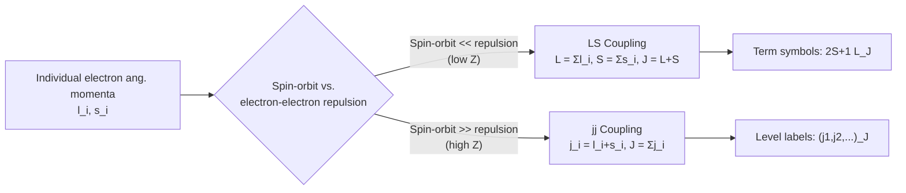

## Multi-Electron Atoms

### Overview

Multi-electron atoms cannot be solved exactly due to electron-electron repulsion, which prevents separation of the Schrödinger equation into single-particle coordinates. Understanding their structure requires approximation methods (central field approximation, Hartree-Fock theory), the Pauli exclusion principle, and angular momentum coupling schemes to classify states and predict spectra.

**Key Points**

- The many-body Hamiltonian includes pairwise $1/r_{ij}$ electron-electron repulsion terms that prevent exact separability
- The **central field approximation** treats each electron as moving in an effective spherically symmetric potential from the nucleus plus the averaged effect of other electrons
- The **Pauli exclusion principle** governs electron configuration and shell filling
- **LS (Russell-Saunders) coupling** and **jj coupling** describe how individual electron angular momenta combine into total atomic angular momentum, valid in different regimes

---

### The Multi-Electron Hamiltonian

For an atom with $Z$ electrons and nuclear charge $Ze$:

$$H = \sum_{i=1}^{Z}\left(-\frac{\hbar^2}{2m}\nabla_i^2 - \frac{Ze^2}{4\pi\epsilon_0 r_i}\right) + \sum_{i<j}\frac{e^2}{4\pi\epsilon_0 r_{ij}}$$

The first sum consists of single-particle hydrogenic terms (solvable exactly); the second term — electron-electron repulsion — couples all coordinates together and has no closed-form solution for $Z > 1$.

**Key Points**

- Without the repulsion term, the problem would separate into $Z$ independent hydrogenic problems
- The repulsion term is comparable in magnitude to the nuclear attraction term, so it cannot be treated as a small perturbation in general (unlike fine-structure corrections)
- Exact numerical solution is intractable beyond small systems; controlled approximation schemes are required

---

### Central Field Approximation

The dominant simplification replaces the exact electron-electron repulsion with an averaged, spherically symmetric effective potential $V_{\text{eff}}(r_i)$ for each electron:

$$H \approx \sum_i \left(-\frac{\hbar^2}{2m}\nabla_i^2 + V_{\text{eff}}(r_i)\right) + H_{\text{residual}}$$

where $V_{\text{eff}}(r)$ interpolates between:

- $V_{\text{eff}}(r) \to -\frac{Ze^2}{4\pi\epsilon_0 r}$ as $r \to 0$ (electron sees full nuclear charge at short range, unscreened by other electrons)
- $V_{\text{eff}}(r) \to -\frac{e^2}{4\pi\epsilon_0 r}$ as $r \to \infty$ (electron sees net charge $+1e$, fully screened by the other $Z-1$ electrons)

This approximation:

- Preserves separability into single-electron orbitals, each still labeled by $(n, \ell, m_\ell, m_s)$
- Breaks the exact $\ell$-degeneracy present in pure hydrogen: for fixed $n$, states with smaller $\ell$ penetrate closer to the nucleus (less effective screening) and are therefore **lower in energy** than higher-$\ell$ states at the same $n$
- Leads to the energy ordering $E_{n,\ell=0} < E_{n,\ell=1} < E_{n,\ell=2} < \ldots$ within a given shell — the physical basis of the **quantum defect** and of anomalies like the $4s$ orbital filling before $3d$

---

### Hartree and Hartree-Fock Methods

**Hartree method**: Each electron's orbital is found self-consistently by solving a Schrödinger equation in the potential generated by the nucleus plus the (charge-density-averaged) potential of all other electrons:

$$\left[-\frac{\hbar^2}{2m}\nabla^2 - \frac{Ze^2}{4\pi\epsilon_0 r} + \sum_{j\neq i}\int \frac{e^2|\psi_j(\mathbf{r}')|^2}{4\pi\epsilon_0|\mathbf{r}-\mathbf{r}'|}d^3r'\right]\psi_i(\mathbf{r}) = \epsilon_i \psi_i(\mathbf{r})$$

This must be solved iteratively (the potential depends on orbitals, which depend on the potential) until self-consistency is reached — the **self-consistent field (SCF)** method.

**Hartree-Fock method**: Improves on Hartree by properly antisymmetrizing the total wavefunction (Slater determinant), which automatically enforces the Pauli exclusion principle and introduces an additional **exchange term**:

$$\Psi(\mathbf{r}_1,\ldots,\mathbf{r}_Z) = \frac{1}{\sqrt{Z!}}\det\left[\psi_i(\mathbf{r}_j)\right]$$

The exchange term lowers the energy of parallel-spin configurations relative to Hartree theory (related to Hund's first rule) and has no classical analog — it is a purely quantum statistical effect from antisymmetrization.

**Key Points**

- Hartree-Fock is variational: it finds the best single-Slater-determinant approximation to the true ground state
- It systematically omits **electron correlation** (the fact that electrons dynamically avoid each other beyond the mean-field description); post-Hartree-Fock methods (configuration interaction, coupled cluster, density functional theory) are needed for higher precision
- [Inference] The magnitude of correlation energy neglected by Hartree-Fock varies by system but is typically a small percentage of total electronic energy, though it can be critical for accurately predicting bond energies, ionization energies, and fine spectral details

---

### Electron Configuration and the Pauli Exclusion Principle

Each single-electron state is specified by four quantum numbers $(n, \ell, m_\ell, m_s)$; the Pauli exclusion principle forbids any two electrons from sharing identical values of all four. This gives shell capacities:

$$\text{Subshell } (n,\ell) \text{ capacity} = 2(2\ell+1)$$

| Subshell | $\ell$ | Max electrons |
| --- | --- | --- |
| s | 0 | 2 |
| p | 1 | 6 |
| d | 2 | 10 |
| f | 3 | 14 |

**Aufbau ordering** (approximate, following the $n+\ell$ rule with lower $n$ breaking ties):

$$1s < 2s < 2p < 3s < 3p < 4s < 3d < 4p < 5s < 4d < \ldots$$

**Example**

Iron ($Z=26$) ground-state configuration: $1s^2\,2s^2\,2p^6\,3s^2\,3p^6\,4s^2\,3d^6$. Note that $4s$ fills before $3d$ despite $n=3 < n=4$, reflecting the central-field energy ordering rather than the pure hydrogenic $n$-dependence — the $4s$ orbital penetrates closer to the nucleus at low $r$ and is lower in energy for the neutral atom configuration.

---

### Angular Momentum Coupling Schemes

Beyond single-electron quantum numbers, multi-electron states are classified by how individual angular momenta combine.

**LS (Russell-Saunders) Coupling** — valid when spin-orbit interaction is weak compared to electron-electron repulsion (light to intermediate $Z$):

1. Individual orbital angular momenta combine: $\mathbf{L} = \sum_i \boldsymbol{\ell}_i$
2. Individual spins combine: $\mathbf{S} = \sum_i \mathbf{s}_i$
3. Total combines last: $\mathbf{J} = \mathbf{L} + \mathbf{S}$

States are labeled by term symbols:

$$^{2S+1}L_J$$

where $2S+1$ is the spin multiplicity, $L$ is denoted by letter ($S,P,D,F,\ldots$ for $L=0,1,2,3,\ldots$), and $J$ is the total angular momentum quantum number.

**jj Coupling** — valid when spin-orbit interaction dominates over electron-electron repulsion (heavy atoms, high $Z$, since spin-orbit coupling scales as $Z^4$):

1. Each electron's own $j_i = \ell_i + s_i$ is formed first
2. Total: $\mathbf{J} = \sum_i \mathbf{j}_i$

Most real atoms lie in an intermediate coupling regime, with LS coupling a good approximation for light elements and jj coupling improving for the heaviest elements.

---

### Coupling Scheme Transition (svg_diagram)

---

### Hund's Rules

For determining the ground-state term symbol of a given electron configuration:

1. **Maximize $S$** (maximum spin multiplicity) — minimizes electron-electron repulsion via the exchange interaction, since parallel-spin electrons are kept apart by antisymmetrization (Pauli principle)
2. **Maximize $L$** (subject to rule 1) — larger orbital angular momentum corresponds to electrons orbiting more "in step," reducing repulsion
3. **Minimize $J$ for less-than-half-filled shells; maximize $J$ for more-than-half-filled shells** — determined by the sign of the spin-orbit coupling constant

**Example**

Carbon ($1s^2 2s^2 2p^2$): the two $2p$ electrons give possible terms $^1S, ^1D, ^3P$. Hund's rules select $^3P$ as the ground state (maximum $S=1$), and since the $2p$ subshell is less than half-filled, $J_{\min} = 0$ is chosen, giving the ground term $^3P_0$.

---

### Term Symbol Determination Table

| Configuration Type | Example | Possible Terms | Ground Term (Hund's Rules) |
| --- | --- | --- | --- |
| $p^1$ | B ($2p^1$) | $^2P$ | $^2P_{1/2}$ |
| $p^2$ | C ($2p^2$) | $^1S,\ ^1D,\ ^3P$ | $^3P_0$ |
| $p^3$ | N ($2p^3$) | $^2P,\ ^2D,\ ^4S$ | $^4S_{3/2}$ |
| $p^4$ | O ($2p^4$) | $^1S,\ ^1D,\ ^3P$ | $^3P_2$ |

---

### Spectra of Multi-Electron Atoms

- **Screening breaks $\ell$-degeneracy**: unlike hydrogen, transitions within the same $n$ but different $\ell$ have distinct, resolvable energies
- **Fine structure**: spin-orbit coupling splits terms into levels distinguished by $J$; splitting scales roughly as $Z^4$ for inner-shell-like penetration, making fine structure far more pronounced in heavy atoms
- **Selection rules for LS-coupled multi-electron transitions** (electric dipole): $\Delta L = 0,\pm1$ ($L=0\to L=0$ forbidden), $\Delta S = 0$, $\Delta J = 0,\pm1$ ($J=0\to J=0$ forbidden), parity must change
- **Intercombination lines**: weak transitions violating $\Delta S = 0$ occur when spin-orbit coupling mixes states of different $S$ (more prominent in heavier atoms where LS coupling breaks down), such as the well-known mercury intercombination line at 253.7 nm

---

### Alkali Atoms as a Bridge Case

Alkali atoms (one valence electron outside closed shells) are the simplest multi-electron systems to treat analytically, since the closed inner shells act approximately as a spherically symmetric screening core. Their spectra are described by the **quantum defect**:

$$E_{n\ell} = -\frac{13.6\ \text{eV}}{(n-\delta_\ell)^2}$$

where $\delta_\ell$ (the quantum defect) is largest for low $\ell$ (greatest penetration of the core) and approaches zero for high $\ell$ (nearly hydrogenic, since high-$\ell$ orbitals have little overlap with the core).

---

### Related Topics

- Selection Rules for Transitions (LS-coupling dipole selection rules)
- The Stark Effect (field-induced mixing in multi-electron atoms)
- X-Ray Spectra and Moseley's Law (inner-shell transitions and screening)
- Fine Structure and Spin-Orbit Coupling
- Quantum Defect Theory for Alkali Atoms
- Hartree-Fock and Density Functional Theory
- Hund's Rules and Term Symbol Determination
- Configuration Interaction and Electron Correlation