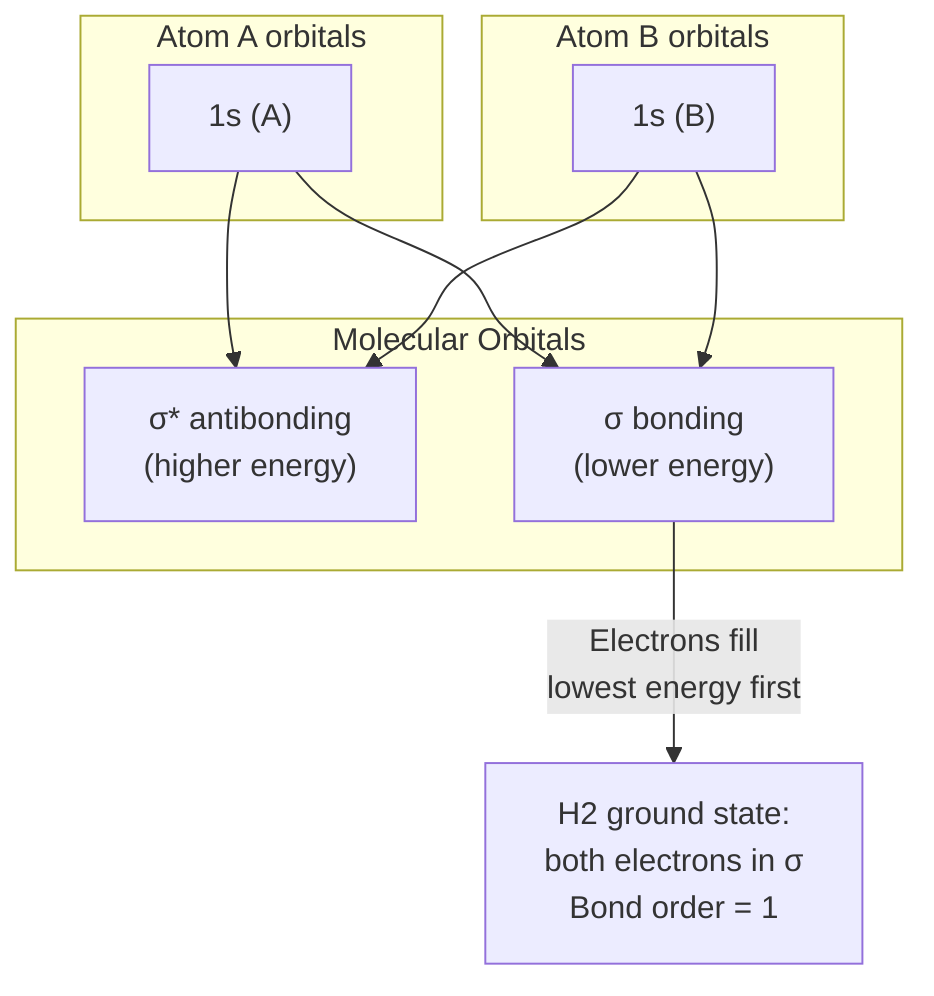

## Molecular Bonding: Ionic and Covalent

### Overview

Molecular bonding describes how atoms combine to form stable molecules through the redistribution or sharing of valence electrons. The two idealized limits — ionic bonding (electron transfer) and covalent bonding (electron sharing) — arise from a single underlying quantum mechanical framework in which the total electronic energy is minimized relative to separated atoms. Most real bonds lie on a continuum between these limits, characterized by the electronegativity difference between bonded atoms.

**Key Points**

- Bonding occurs when the total energy of the combined system is lower than that of the separated atoms
- **Ionic bonding**: dominated by electrostatic attraction between oppositely charged ions formed by near-complete electron transfer
- **Covalent bonding**: dominated by quantum mechanical exchange/resonance energy from shared electron density between nuclei
- The distinction is quantified by electronegativity difference and bond polarity, not a sharp physical boundary

---

### Quantum Mechanical Origin of Bonding

Both bond types ultimately derive from solving the molecular Schrödinger equation in the Born-Oppenheimer approximation, which separates fast electronic motion from slow nuclear motion:

$$H_{\text{elec}}(\mathbf{r}; \mathbf{R})\,\psi_{\text{elec}}(\mathbf{r};\mathbf{R}) = E_{\text{elec}}(\mathbf{R})\,\psi_{\text{elec}}(\mathbf{r};\mathbf{R})$$

Solving this at fixed internuclear separation $\mathbf{R}$ and varying $\mathbf{R}$ produces the **potential energy curve** $E_{\text{elec}}(R)$, whose minimum defines the equilibrium bond length and dissociation energy.

**Key Points**

- A bound state requires $E_{\text{elec}}(R)$ to have a minimum below the separated-atom limit ($R \to \infty$)
- The specific shape and depth of this curve differ substantially between ionic and covalent bonding mechanisms, though both are described by the same formalism

---

### Ionic Bonding

Ionic bonding occurs when one atom's ionization energy is low and the partner atom's electron affinity is high, favoring near-complete electron transfer to form two oppositely charged ions bound primarily by Coulomb attraction.

**Energetics of ionic bond formation:**

$$E_{\text{bond}} \approx IE(A) - EA(B) - \frac{e^2}{4\pi\epsilon_0 R} + E_{\text{repulsion}}(R)$$

where:

- $IE(A)$ is the ionization energy of atom A (energy cost to remove an electron)
- $EA(B)$ is the electron affinity of atom B (energy released when B gains an electron)
- The Coulomb term is the electrostatic attraction between the resulting ions at separation $R$
- $E_{\text{repulsion}}(R)$ is short-range repulsion from overlapping closed-shell electron clouds (Pauli exclusion), often modeled empirically (e.g., Born-Landé model: $E_{\text{rep}} \propto 1/R^n$)

**Key Points**

- Ionic bonds form preferentially between elements with large electronegativity difference (typically $\Delta\chi \gtrsim 1.7$ on the Pauling scale), classically between alkali/alkaline-earth metals and halogens/chalcogens
- The bond is essentially non-directional — ionic solids form extended lattices (e.g., NaCl rock-salt structure) rather than discrete molecules, since Coulomb attraction has no preferred angular orientation
- Bond strength (lattice energy) is well described by the Born-Landé or Born-Mayer equations, incorporating the Madelung constant for the specific crystal geometry

**Example**

For NaCl formation: $IE(\text{Na}) = 5.14\ \text{eV}$, $EA(\text{Cl}) = 3.61\ \text{eV}$. The net cost of electron transfer alone is $5.14 - 3.61 = 1.53\ \text{eV}$ (endothermic). This is more than compensated by the Coulomb attraction energy at the equilibrium ionic separation $R \approx 2.36$ Å:

$$E_{\text{Coulomb}} = \frac{e^2}{4\pi\epsilon_0 R} \approx 6.1\ \text{eV}$$

making the overall bond formation strongly exothermic despite the unfavorable electron-transfer step — illustrating that ionic bond stability is a lattice/pairwise electrostatic effect, not simply a consequence of favorable electron transfer alone.

---

### Covalent Bonding

Covalent bonding arises when atoms share electron density between their nuclei, lowering the total energy through both electrostatic effects and, critically, a purely quantum **exchange (resonance) interaction** with no classical analog.

**Valence Bond (Heitler-London) Treatment of H₂:**

The simplest quantitative model considers two hydrogen atoms with wavefunction:

$$\Psi_\pm = \frac{1}{\sqrt{2(1\pm S^2)}}\left[\psi_A(1)\psi_B(2) \pm \psi_A(2)\psi_B(1)\right]$$

where $S$ is the orbital overlap integral. Evaluating the energy gives:

$$E_\pm = 2E_{1s} + \frac{J \pm K}{1 \pm S^2}$$

- $J$ is the **Coulomb integral** (classical electrostatic interaction of overlapping charge densities)
- $K$ is the **exchange integral** (purely quantum mechanical, arising from electron indistinguishability)

**Key Points**

- The symmetric spatial combination ($\Psi_+$, requiring antiparallel/singlet spin state by the overall antisymmetry requirement) is lower in energy and forms the **bonding** molecular state
- The antisymmetric spatial combination ($\Psi_-$, requiring parallel/triplet spin) is higher in energy and is the **antibonding** state — no stable bond forms
- The exchange integral $K$ provides the dominant contribution to bond stabilization; this "exchange energy" has no classical counterpart and is a direct manifestation of quantum statistics (Pauli exclusion / wavefunction symmetry)

---

### Molecular Orbital (MO) Theory

An alternative and more generally applicable framework builds molecular orbitals as linear combinations of atomic orbitals (LCAO):

$$\psi_{\text{MO}} = c_A\psi_A \pm c_B\psi_B$$

For two identical atoms (e.g., H₂), symmetry gives $c_A = \pm c_B$, producing:

$$\sigma_g = \frac{1}{\sqrt{2(1+S)}}(\psi_A + \psi_B) \quad \text{(bonding)}$$

$$\sigma_u^* = \frac{1}{\sqrt{2(1-S)}}(\psi_A - \psi_B) \quad \text{(antibonding)}$$

**Key Points**

- The bonding orbital $\sigma_g$ has enhanced electron density *between* the nuclei, which screens internuclear repulsion and lowers energy
- The antibonding orbital $\sigma_u^*$ has a node between the nuclei (zero electron density), increasing energy relative to separated atoms
- **Bond order** is defined as:

  $$\text{Bond order} = \frac{1}{2}(n_{\text{bonding}} - n_{\text{antibonding}})$$

  where $n$ counts electrons in each type of orbital; bond order correlates with bond strength and inversely with bond length

---

### MO Energy Diagram for Diatomic Molecules (svg_diagram)

---

### Comparison: Ionic vs. Covalent Bonding

| Property | Ionic Bond | Covalent Bond |
| --- | --- | --- |
| Mechanism | Electron transfer, Coulomb attraction | Electron sharing, exchange/resonance energy |
| Directionality | Non-directional (isotropic) | Directional (orbital overlap dependent) |
| Typical structure | Extended crystal lattice | Discrete molecules |
| Electronegativity difference | Large ($\Delta\chi \gtrsim 1.7$) | Small to moderate ($\Delta\chi \lesssim 1.7$) |
| Melting point (solids) | High | Variable; molecular solids often low |
| Electrical conductivity | Poor as solid; conducts molten/dissolved | Generally poor (except delocalized systems) |
| Key quantum term | Coulomb electrostatics dominant | Exchange integral $K$ dominant |

---

### Bond Polarity and the Ionic-Covalent Continuum

Real bonds are rarely purely ionic or purely covalent. The degree of ionic character can be estimated from the **dipole moment** relative to the fully ionic limit:

$$\%\text{ionic character} = \frac{\mu_{\text{observed}}}{\mu_{\text{fully ionic}}} \times 100\%$$

where $\mu_{\text{fully ionic}} = eR$ (charge separation of a full electron charge across the bond length).

**Pauling's electronegativity-based estimate:**

$$\%\text{ionic character} \approx \left(1 - e^{-\frac{1}{4}(\chi_A-\chi_B)^2}\right) \times 100\%$$

**Example**

HCl has a measured dipole moment of $\mu \approx 1.03$ D at bond length $R \approx 1.27$ Å. The fully ionic dipole moment would be $\mu_{\text{ionic}} = eR \approx 6.1$ D (using $1\ e\cdot\text{Å} \approx 4.8$ D). This gives:

$$\%\text{ionic character} \approx \frac{1.03}{6.1}\times100\% \approx 17\%$$

confirming HCl is predominantly covalent with modest ionic character — consistent with the moderate electronegativity difference between H and Cl ($\Delta\chi \approx 0.96$).

---

### Polar Covalent Bonds and Electronegativity

Between the pure limits, **polar covalent bonds** feature unequal electron sharing, described by partial charges $\delta^+$ and $\delta^-$. The molecular orbital picture generalizes naturally: for heteronuclear diatomics, the LCAO coefficients become unequal ($c_A \neq c_B$), with the more electronegative atom contributing a larger share of the bonding orbital's electron density.

**Key Points**

- Electronegativity (Pauling, Mulliken, or Allred-Rochow scales) quantifies an atom's tendency to attract shared electron density
- Bond polarity determines molecular dipole moment, which in turn governs microwave/rotational spectroscopic activity (see rotational selection rules) and intermolecular forces
- [Inference] The precise ionic-covalent character percentage depends on which theoretical/empirical method is used (Pauling electronegativity, dipole-moment-based, or computational charge population analysis), so quoted percentages should be understood as model-dependent estimates rather than exact physical quantities

---

### Related Topics

- Molecular Orbital Theory and LCAO Method
- Hybridization and VSEPR Geometry
- Rotational and Vibrational Molecular Spectra
- Selection Rules for Transitions (dipole requirement for rotational spectra)
- Van der Waals Forces and Intermolecular Interactions
- Multi-Electron Atoms (valence electron configuration underlying bonding behavior)
- Born-Oppenheimer Approximation
- Crystal Lattice Energy and the Madelung Constant