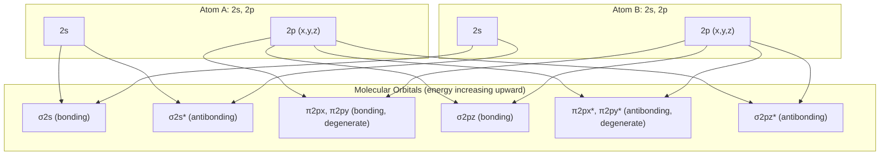

## Molecular Orbital Theory

### Overview

Molecular Orbital (MO) theory describes electrons in a molecule as occupying delocalized orbitals extending over the entire nuclear framework, rather than being confined to individual atoms or localized bonds. It is constructed by combining atomic orbitals (LCAO approach) and provides the standard quantum mechanical framework for understanding bonding, molecular spectra, magnetism, and reactivity across diatomic and polyatomic systems.

**Key Points**

- Molecular orbitals are eigenfunctions of an effective one-electron Hamiltonian in the molecular (multi-nuclear) potential
- The **LCAO approximation** builds MOs as linear combinations of atomic orbitals (AOs) on the constituent atoms
- MOs are classified by symmetry (σ, π, δ) and by bonding/antibonding/nonbonding character
- Electron configurations in MOs, combined with the Pauli principle and Hund's rules, determine bond order, magnetism, and spectroscopic properties

---

### The LCAO Approximation

For a diatomic molecule AB, a molecular orbital is approximated as:

$$\psi_{\text{MO}} = c_A\phi_A + c_B\phi_B$$

where $\phi_A, \phi_B$ are atomic orbitals centered on nuclei A and B, and $c_A, c_B$ are variationally determined coefficients. Substituting into the Schrödinger equation and applying the variational principle yields the **secular equations**:

$$\begin{pmatrix} H_{AA}-E & H_{AB}-ES \\ H_{AB}-ES & H_{BB}-E \end{pmatrix}\begin{pmatrix}c_A\\c_B\end{pmatrix} = 0$$

where:

- $H_{AA} = \langle \phi_A|H|\phi_A\rangle$ (Coulomb integral, approximately the atomic orbital energy)
- $H_{AB} = \langle \phi_A|H|\phi_B\rangle$ (resonance/exchange integral, governs bonding strength)
- $S = \langle \phi_A|\phi_B\rangle$ (overlap integral)

Nontrivial solutions require the secular determinant to vanish, giving two energy eigenvalues (bonding and antibonding) for each pair of combined atomic orbitals.

---

### Homonuclear Diatomic Case

For identical atoms ($H_{AA} = H_{BB} \equiv \alpha$), symmetry forces $c_A = \pm c_B$, giving:

$$E_\pm = \frac{\alpha \pm H_{AB}}{1 \pm S}$$

$$\psi_+ = \frac{1}{\sqrt{2(1+S)}}(\phi_A + \phi_B) \quad \text{(bonding, } E_+ < \alpha\text{)}$$

$$\psi_- = \frac{1}{\sqrt{2(1-S)}}(\phi_A - \phi_B) \quad \text{(antibonding, } E_- > \alpha\text{)}$$

**Key Points**

- Since $H_{AB}$ is typically negative (attractive resonance integral) for orbitals of matching symmetry, $E_+ < \alpha < E_-$: the bonding combination is stabilized, the antibonding combination is destabilized, and the antibonding destabilization typically exceeds the bonding stabilization in magnitude when $S \neq 0$ is properly accounted for
- The bonding MO has constructive interference (enhanced electron density between nuclei); the antibonding MO has a node between nuclei (destructive interference)

---

### Molecular Orbital Symmetry Classification

MOs are labeled by their symmetry under rotation about the internuclear axis, analogous to atomic $s, p, d$ labels:

| Symbol | $|m_\ell|$ (angular momentum about bond axis) | Formed From |

|---|---|---|

| $\sigma$ | 0 | $s$-$s$, $p_z$-$p_z$, head-on overlap |

| $\pi$ | 1 | $p_x$-$p_x$, $p_y$-$p_y$, side-on overlap |

| $\delta$ | 2 | $d$-$d$, four-lobe overlap |

Each is further labeled:

- **Bonding vs. antibonding**: asterisk denotes antibonding (e.g., $\sigma^*$, $\pi^*$)
- **Parity (centrosymmetric molecules only)**: $g$ (gerade, even under inversion) or $u$ (ungerade, odd under inversion)

**Key Points**

- $\sigma$ orbitals are cylindrically symmetric about the bond axis (no angular node containing the axis)
- $\pi$ orbitals have one nodal plane containing the internuclear axis
- For $p$-orbital combinations: $p_z$-$p_z$ (aligned along bond axis) forms $\sigma_g$ and $\sigma_u^*$; $p_x$-$p_x$ and $p_y$-$p_y$ (perpendicular to bond axis) each form degenerate $\pi_u$ and $\pi_g^*$ pairs

---

### MO Diagram for Second-Row Homonuclear Diatomics (svg_diagram)

**Note on energy ordering**: For light diatomics (Li₂ through N₂), $s$-$p$ mixing pushes $\sigma_{2p}$ *above* $\pi_{2p}$ in energy. For O₂, F₂, and Ne₂, this mixing is weaker and the "expected" ordering ($\sigma_{2p}$ below $\pi_{2p}$) is restored. This ordering difference has direct spectroscopic consequences (see below).

---

### Bond Order and Electron Filling

**Bond order** quantifies net bonding character:

$$\text{Bond order} = \frac{1}{2}\left(n_{\text{bonding}} - n_{\text{antibonding}}\right)$$

Electrons fill MOs following the Aufbau principle, Pauli exclusion, and Hund's rule (maximum multiplicity for degenerate orbitals).

**Example**

$O_2$ electron configuration: $(\sigma_{2s})^2(\sigma_{2s}^*)^2(\sigma_{2p})^2(\pi_{2p})^4(\pi_{2p}^*)^2$

Bond order $= \frac{1}{2}(8 - 4) = 2$ (consistent with the classical O=O double bond).

Critically, the two electrons in the degenerate $\pi_{2p}^*$ orbitals occupy separate orbitals with **parallel spins** (Hund's rule), giving $O_2$ a net electron spin — correctly predicting its **paramagnetism**, a landmark early success of MO theory that Lewis structure/valence bond pictures fail to explain (since simple Lewis structures predict all electrons paired).

---

### Diatomic Molecule Property Table

| Molecule | Valence Electrons | Bond Order | Magnetic Property |
| --- | --- | --- | --- |
| $H_2$ | 2 | 1 | Diamagnetic |
| $He_2$ | 4 | 0 | Unbound (does not exist as stable molecule) |
| $N_2$ | 10 | 3 | Diamagnetic |
| $O_2$ | 12 | 2 | Paramagnetic |
| $F_2$ | 14 | 1 | Diamagnetic |
| $Ne_2$ | 16 | 0 | Unbound |

**Key Points**

- $He_2$'s zero bond order (2 bonding, 2 antibonding electrons) correctly predicts that helium does not form a stable diatomic molecule under ordinary conditions — a direct, immediate confirmation of MO theory's predictive power
- Bond order correlates inversely with bond length and directly with bond dissociation energy and vibrational force constant across an isoelectronic or related series

---

### Heteronuclear Diatomics and Polar Bonds

When $H_{AA} \neq H_{BB}$ (atoms of different electronegativity), the LCAO coefficients become unequal:

$$c_A \neq c_B$$

The MO becomes polarized toward the more electronegative atom in the bonding orbital (and correspondingly polarized toward the less electronegative atom in the antibonding orbital). As the atomic orbital energy difference $|H_{AA}-H_{BB}|$ grows large relative to the resonance integral $H_{AB}$, the bonding MO's character approaches that of the lower-energy atomic orbital — the MO description smoothly connects to the ionic bonding limit.

**Key Points**

- This provides the natural bridge between covalent MO theory and ionic bonding: as electronegativity difference increases, MO coefficients become increasingly asymmetric, until in the extreme limit the "bonding MO" is essentially a pure atomic orbital on the more electronegative atom (full electron transfer)
- Dipole moments, partial charges, and percent ionic character all follow directly from the LCAO coefficient asymmetry

---

### Extension to Polyatomic Molecules

For polyatomic systems, MOs are constructed from linear combinations of atomic orbitals across all constituent atoms, often organized via **symmetry-adapted linear combinations (SALCs)** using group theory to simplify the secular equations by symmetry block-diagonalization.

**Key Points**

- **Hückel theory** provides a simplified LCAO treatment for π-systems in planar conjugated molecules (e.g., benzene), using a truncated basis of $p_z$ orbitals and simplified (empirical) resonance/overlap parameters
- Delocalized π-MOs in conjugated systems (aromatic rings, polyenes) explain phenomena inaccessible to localized bonding pictures, such as aromatic stabilization energy and characteristic UV-Vis absorption spectra
- Computational quantum chemistry (Hartree-Fock, density functional theory) generalizes LCAO-MO theory using large numerical atomic-orbital-like basis sets, solved self-consistently

---

### MO Theory vs. Valence Bond Theory

| Aspect | Molecular Orbital Theory | Valence Bond Theory |
| --- | --- | --- |
| Electron description | Delocalized over whole molecule | Localized in bonds between atom pairs |
| Paramagnetism (e.g., $O_2$) | Correctly predicted | Not predicted by simple Lewis structures |
| Excited states / spectra | Naturally described via MO transitions | Requires resonance structures, less direct |
| Conjugated/aromatic systems | Naturally delocalized description | Requires resonance among Kekulé structures |
| Computational tractability | Well suited to systematic ab initio methods | Conceptually intuitive for simple bonds |

[Inference] Neither framework is universally "more correct" — they are complementary approximations, and modern computational chemistry typically starts from MO-based methods (Hartree-Fock, DFT) due to their more systematic mathematical structure, while valence bond concepts remain useful for qualitative and pedagogical reasoning about bonding.

---

### Spectroscopic Consequences

- **Electronic transitions** between MOs (e.g., $\pi \to \pi^*$, $n \to \pi^*$) underlie UV-visible molecular absorption spectroscopy
- **Photoelectron spectroscopy** directly probes MO orbital energies, providing experimental validation of MO energy-level orderings (including the $s$-$p$ mixing effects noted above for light diatomics)
- MO symmetry governs **selection rules** for electronic transitions in molecules, analogous to atomic dipole selection rules but incorporating molecular point-group symmetry

---

### Related Topics

- Molecular Bonding: Ionic and Covalent
- Rotational and Vibrational Molecular Spectra
- Hückel Theory and Conjugated π-Systems
- Group Theory and Molecular Symmetry
- Selection Rules for Transitions
- Hartree-Fock and Density Functional Theory
- Photoelectron Spectroscopy
- Hybridization and VSEPR Geometry