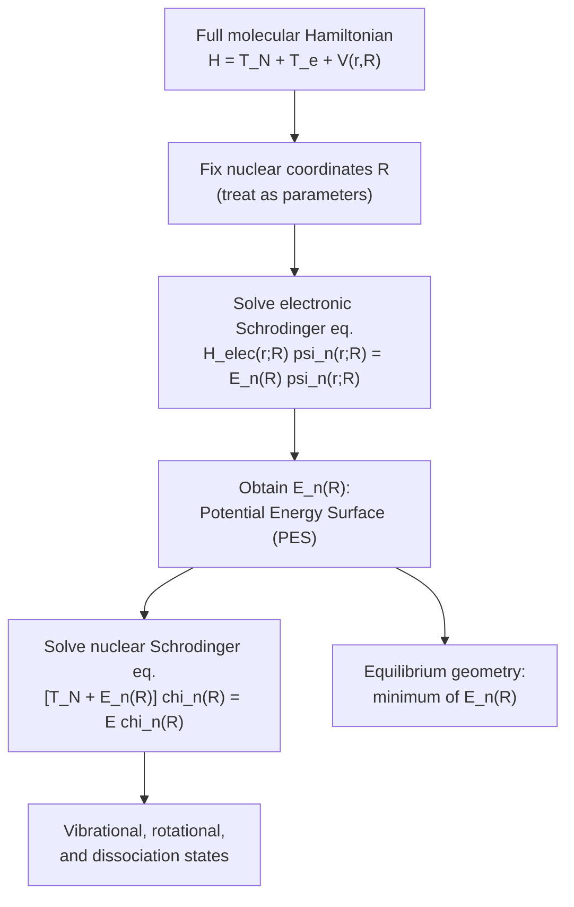

## The Born-Oppenheimer Approximation

### Overview

The Born-Oppenheimer (BO) approximation is the foundational simplification underlying nearly all of molecular quantum mechanics. It exploits the enormous mass disparity between electrons and nuclei to separate the full molecular Schrödinger equation into an electronic problem (solved at fixed nuclear positions) and a nuclear problem (governed by an effective potential energy surface derived from the electronic solution). Without this approximation, the coupled many-body Schrödinger equation for even simple molecules would be computationally and conceptually intractable.

**Key Points**

- Exploits the mass ratio $m_e/M_{\text{nucleus}} \sim 10^{-4}$–$10^{-3}$: electrons respond essentially instantaneously to nuclear motion
- Separates the total wavefunction into an electronic part (parametrically dependent on nuclear positions) and a nuclear part (governed by the electronic energy as an effective potential)
- Generates the concept of the **potential energy surface (PES)**, the basis for molecular structure, vibrational spectra, and reaction dynamics
- Breaks down near electronic degeneracies (conical intersections) and in situations requiring non-adiabatic coupling

---

### The Full Molecular Hamiltonian

For a molecule with nuclei (coordinates $\mathbf{R}$, masses $M_\alpha$) and electrons (coordinates $\mathbf{r}$, mass $m_e$):

$$H = -\sum_\alpha \frac{\hbar^2}{2M_\alpha}\nabla_\alpha^2 - \sum_i\frac{\hbar^2}{2m_e}\nabla_i^2 + V_{ee}(\mathbf{r}) + V_{nn}(\mathbf{R}) + V_{ne}(\mathbf{r},\mathbf{R})$$

$$H = T_N + T_e + V(\mathbf{r},\mathbf{R})$$

where $T_N$ is nuclear kinetic energy, $T_e$ is electronic kinetic energy, and $V$ collects all Coulomb interactions (electron-electron, nucleus-nucleus, and electron-nucleus). This full Hamiltonian couples electronic and nuclear coordinates through $V_{ne}(\mathbf{r},\mathbf{R})$, making exact separation impossible in general.

---

### Physical Justification: The Mass Disparity

The ratio of electron to nuclear (proton) mass is:

$$\frac{m_e}{M_p} \approx \frac{1}{1836}$$

**Key Points**

- Electrons, being far lighter, move much faster than nuclei for comparable momenta/energies, and their characteristic timescales (orbital periods $\sim 10^{-16}$ s) are much shorter than nuclear vibrational periods ($\sim 10^{-14}$–$10^{-13}$ s)
- This timescale separation means electrons can be treated as instantaneously adjusting to any given (slowly changing) nuclear configuration — electrons "see" a quasi-static nuclear framework
- This is directly analogous to adiabatic approximations elsewhere in physics: a system with fast and slow degrees of freedom, where the fast subsystem remains in its instantaneous eigenstate as the slow variables evolve

---

### Formal Separation Procedure

**Step 1 — Electronic problem at fixed nuclear geometry:**

Treat $\mathbf{R}$ as a fixed parameter (not an operator) and solve:

$$H_{\text{elec}}(\mathbf{r};\mathbf{R})\,\psi_n(\mathbf{r};\mathbf{R}) = E_n(\mathbf{R})\,\psi_n(\mathbf{r};\mathbf{R})$$

where:

$$H_{\text{elec}} = T_e + V_{ee}(\mathbf{r}) + V_{ne}(\mathbf{r},\mathbf{R}) + V_{nn}(\mathbf{R})$$

This yields electronic eigenstates $\psi_n(\mathbf{r};\mathbf{R})$ and eigenvalues $E_n(\mathbf{R})$ that depend *parametrically* on the nuclear coordinates — the semicolon notation distinguishes "parametric" dependence on $\mathbf{R}$ from the explicit dynamical dependence on $\mathbf{r}$.

**Step 2 — Nuclear problem on the resulting potential energy surface:**

The total wavefunction is approximated as a single product (the Born-Oppenheimer ansatz):

$$\Psi(\mathbf{r},\mathbf{R}) \approx \psi_n(\mathbf{r};\mathbf{R})\,\chi_n(\mathbf{R})$$

Substituting into the full Schrödinger equation and neglecting terms where the nuclear kinetic energy operator acts on the electronic wavefunction's parametric $\mathbf{R}$-dependence (the **adiabatic approximation**) gives an effective nuclear Schrödinger equation:

$$\left[T_N + E_n(\mathbf{R})\right]\chi_n(\mathbf{R}) = E\,\chi_n(\mathbf{R})$$

**Key Points**

- $E_n(\mathbf{R})$, the electronic energy eigenvalue as a function of nuclear geometry, becomes the effective potential in which the nuclei move — this is the **potential energy surface (PES)**
- Nuclei move on this PES exactly as if in an external potential, allowing separate treatment of electronic structure (chemistry) and nuclear dynamics (vibration, rotation, reaction pathways)

---

### Born-Oppenheimer Procedure Flow (svg_diagram)

---

### The Potential Energy Surface

For a diatomic molecule, the PES reduces to a one-dimensional curve $E_n(R)$ versus internuclear distance $R$. Its key features:

- **Equilibrium bond length** $R_e$: the minimum of $E_n(R)$
- **Dissociation energy** $D_e$: the depth of the well relative to the separated-atom limit
- **Curvature at the minimum**: determines the vibrational force constant

$$k = \left.\frac{d^2E_n(R)}{dR^2}\right|_{R=R_e}$$

which directly sets the vibrational frequency via $\omega = \sqrt{k/\mu}$ (with $\mu$ the reduced mass) — this is precisely how the harmonic oscillator model of molecular vibration is grounded in the BO framework.

For polyatomic molecules, the PES becomes a $(3N-6)$-dimensional hypersurface (or $3N-5$ for linear molecules), and its stationary points (minima, saddle points) correspond to stable conformers and transition states in reaction dynamics.

---

### Validity and Breakdown of the Approximation

**Key Points**

- The BO approximation is excellent when electronic energy gaps between states are large compared to nuclear kinetic energy scales — the electronic wavefunction can adiabatically "follow" nuclear motion without inducing transitions to other electronic states
- It breaks down near **conical intersections** or regions of near-degeneracy between electronic potential energy surfaces, where the neglected nuclear-kinetic-energy coupling terms (non-adiabatic coupling) become significant and can drive transitions between electronic states
- Non-adiabatic effects are critical in photochemistry (e.g., internal conversion, photoisomerization), predissociation phenomena in electronically excited molecules, and certain vibronic coupling problems (e.g., the Jahn-Teller effect)
- [Inference] The specific energy gap threshold below which non-adiabatic corrections become quantitatively important is system-dependent; no universal numerical criterion applies uniformly across all molecules

---

### Consequences for Molecular Spectroscopy

The BO approximation naturally separates molecular energy into a hierarchy of scales:

$$E_{\text{total}} \approx E_{\text{electronic}} + E_{\text{vibrational}} + E_{\text{rotational}}$$

with typical magnitude ordering:

$$E_{\text{electronic}} \gg E_{\text{vibrational}} \gg E_{\text{rotational}}$$

reflecting the same mass ratio $m_e/M$ that justifies the approximation itself (each successive energy scale is suppressed by roughly $\sqrt{m_e/M}$ or $m_e/M$ relative to the previous one).

**Example**

Typical orders of magnitude for a diatomic molecule:

- Electronic transitions: $\sim 1$–$10\ \text{eV}$ (UV-visible spectral region)
- Vibrational transitions: $\sim 0.01$–$0.5\ \text{eV}$ (infrared region)
- Rotational transitions: $\sim 10^{-4}$–$10^{-3}\ \text{eV}$ (microwave region)

This hierarchy directly explains the structured appearance of molecular spectra: electronic transitions display superimposed vibrational "bands," which themselves display superimposed rotational fine structure — the basis of rotational-vibrational-electronic (rovibronic) spectroscopy.

---

### Comparison: Exact vs. Born-Oppenheimer Treatment

| Aspect | Exact (Full) Treatment | Born-Oppenheimer Approximation |
| --- | --- | --- |
| Wavefunction form | Fully coupled $\Psi(\mathbf{r},\mathbf{R})$ | Product form $\psi_n(\mathbf{r};\mathbf{R})\chi_n(\mathbf{R})$ |
| Computational cost | Intractable beyond few-particle systems | Standard for routine molecular calculations |
| Electronic-nuclear coupling | Fully included | Neglected (except in non-adiabatic corrections) |
| Applicability | Universally valid | Excellent except near electronic degeneracies |
| Key output | N/A (too complex to solve directly) | Potential energy surface $E_n(\mathbf{R})$ |

---

### Relation to Other Molecular Physics Topics

- The PES minimum and curvature directly determine parameters used in the **harmonic oscillator model of molecular vibration**
- **Molecular orbital theory** and **valence bond theory** both operate entirely within the electronic-structure step ($H_{\text{elec}}$) of the BO procedure
- The **Franck-Condon principle** governing vibronic transition intensities is a direct consequence of the BO separation: since nuclei are much slower than electrons, electronic transitions occur at essentially fixed nuclear geometry, and the transition probability depends on the overlap of vibrational wavefunctions on the two different PESs

---

### Related Topics

- Molecular Orbital Theory
- Molecular Bonding: Ionic and Covalent
- Rotational and Vibrational Molecular Spectra
- The Franck-Condon Principle
- Potential Energy Surfaces and Reaction Dynamics
- Non-Adiabatic Coupling and Conical Intersections
- The Jahn-Teller Effect
- Harmonic Oscillator Model of Molecular Vibration