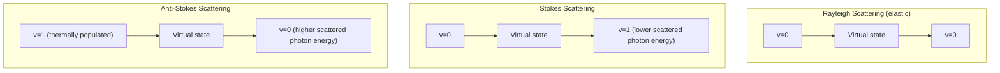

## Raman Spectroscopy

### Overview

Raman spectroscopy probes molecular vibrations (and rotations) through inelastic scattering of light, rather than direct absorption. Incident photons exchange energy with molecular vibrational/rotational modes, producing scattered light shifted in frequency by the energy of the mode involved. Because it relies on a change in molecular **polarizability** (rather than dipole moment, as in IR absorption), Raman spectroscopy is sensitive to a complementary set of molecular motions and provides a powerful non-destructive structural probe.

**Key Points**

- Based on **inelastic light scattering**, not absorption — a fundamentally different physical mechanism from IR spectroscopy
- Selection rule: the molecular **polarizability must change** during the vibration/rotation, $\left(\dfrac{d\alpha}{dQ}\right)_{Q=0} \neq 0$
- For centrosymmetric molecules, the **mutual exclusion rule** applies: modes active in Raman are IR-inactive, and vice versa
- Produces Stokes and anti-Stokes lines symmetrically shifted from the strong, unshifted Rayleigh line

---

### Classical Picture: Induced Dipole and Polarizability

When an oscillating electric field $\mathbf{E} = E_0\cos(\omega_0 t)$ from incident light interacts with a molecule, it induces a dipole moment:

$$\mathbf{p} = \alpha\mathbf{E}$$

where $\alpha$ is the molecular polarizability. If the molecule is vibrating with normal-mode coordinate $Q(t) = Q_0\cos(\omega_{\text{vib}}t)$, and $\alpha$ depends on $Q$, a Taylor expansion gives:

$$\alpha(Q) \approx \alpha_0 + \left(\frac{d\alpha}{dQ}\right)_0 Q + \ldots$$

Substituting $Q(t)$ and $\mathbf{E}(t)$ into $\mathbf{p} = \alpha(Q)\mathbf{E}$ and using a product-to-sum trigonometric identity:

$$p(t) = \alpha_0 E_0\cos(\omega_0 t) + \frac{1}{2}\left(\frac{d\alpha}{dQ}\right)_0 Q_0 E_0\left[\cos((\omega_0-\omega_{\text{vib}})t) + \cos((\omega_0+\omega_{\text{vib}})t)\right]$$

**Key Points**

- The first term (frequency $\omega_0$) is **Rayleigh scattering** — elastic, same frequency as incident light, and by far the most intense component
- The second term produces scattering at $\omega_0 - \omega_{\text{vib}}$ (**Stokes line**) and $\omega_0+\omega_{\text{vib}}$ (**anti-Stokes line**) — but only if $(d\alpha/dQ)_0 \neq 0$
- This immediately gives the classical derivation of the Raman selection rule: a vibration is Raman-active only if it modulates the molecular polarizability

---

### Quantum Mechanical Picture

Quantum mechanically, Raman scattering is a two-photon process proceeding through a short-lived **virtual state** (not a real eigenstate of the molecule):

1. An incident photon of energy $h\nu_0$ is absorbed, promoting the molecule to a virtual state
2. The molecule immediately re-emits a photon, relaxing to a real vibrational (or rotational) state

**Stokes scattering**: molecule starts in $v=0$, ends in $v=1$ (or higher), scattered photon has *lower* energy than incident:

$$h\nu_{\text{scattered}} = h\nu_0 - \Delta E_{\text{vib}}$$

**Anti-Stokes scattering**: molecule starts in $v=1$ (thermally populated), ends in $v=0$, scattered photon has *higher* energy:

$$h\nu_{\text{scattered}} = h\nu_0 + \Delta E_{\text{vib}}$$

**Key Points**

- The virtual state is not a true stationary state of the system — it is a mathematical construct representing the instantaneous, non-resonant polarization response of the molecule to the incident field; the process occurs on a timescale governed by the energy-time uncertainty relation
- Anti-Stokes lines are systematically **weaker** than Stokes lines because the initial excited vibrational state ($v=1$) has a smaller thermal population than the ground state ($v=0$), per the Boltzmann distribution — the anti-Stokes/Stokes intensity ratio is therefore temperature-dependent and used as a non-contact thermometry technique

---

### Raman Scattering Process (svg_diagram)

---

### The Raman Selection Rule and Polarizability Tensor

The polarizability $\alpha$ is generally a rank-2 tensor (not a scalar), so the Raman activity condition is more precisely:

$$\left(\frac{\partial \alpha_{ij}}{\partial Q}\right)_{Q=0} \neq 0 \quad \text{for some tensor component } ij$$

This tensorial nature underlies several distinctive Raman phenomena:

- **Depolarization ratio**: the ratio of scattered light intensities polarized perpendicular vs. parallel to the incident polarization, $\rho = I_\perp/I_\parallel$, distinguishes totally symmetric vibrational modes (small $\rho$, "polarized" bands) from non-totally-symmetric modes (larger $\rho$, up to the theoretical depolarized limit of $3/4$)
- This provides a symmetry diagnostic complementary to frequency alone, useful for assigning vibrational modes in molecules with several bands of similar energy

---

### Mutual Exclusion Rule

For molecules possessing a **center of inversion symmetry** (centrosymmetric molecules), group theory dictates that no normal mode can be simultaneously IR-active and Raman-active:

- **Gerade (g) modes** (symmetric under inversion) can be Raman-active but are IR-inactive
- **Ungerade (u) modes** (antisymmetric under inversion) can be IR-active but are Raman-inactive

**Example**

For linear $CO_2$ (centrosymmetric, $D_{\infty h}$ point group):

| Mode | Symmetry | IR Activity | Raman Activity |
| --- | --- | --- | --- |
| Symmetric stretch ($\nu_1$) | $\Sigma_g^+$ | Inactive | Active |
| Bend ($\nu_2$, doubly degenerate) | $\Pi_u$ | Active | Inactive |
| Asymmetric stretch ($\nu_3$) | $\Sigma_u^+$ | Active | Inactive |

This complementarity makes combined IR and Raman spectroscopy a standard strategy for complete vibrational mode characterization, since neither technique alone reveals the full set of vibrational frequencies in a centrosymmetric molecule. Non-centrosymmetric molecules (e.g., water, most organic molecules) do not obey strict mutual exclusion — many of their modes can be both IR- and Raman-active, though with generally different relative intensities.

---

### Rotational Raman Spectroscopy

Because polarizability (unlike dipole moment) is generally anisotropic even for molecules with no permanent dipole moment, **rotational Raman scattering** can occur even in homonuclear diatomics (e.g., $N_2$, $O_2$, $H_2$) that have no pure rotational IR/microwave spectrum.

**Selection rule for linear molecule rotational Raman:**

$$\Delta J = 0, \pm 2$$

(rather than $\Delta J = \pm1$ for dipole-allowed rotational transitions), since the polarizability tensor is a rank-2 object and rotational Raman scattering is a two-photon process.

**Key Points**

- $\Delta J = +2$ (Stokes, S-branch) and $\Delta J=-2$ (anti-Stokes, O-branch) lines are observed, with spacing $4B(J+3/2)$ between adjacent lines — twice the $2B$ spacing seen in dipole rotational spectra
- Rotational Raman spectroscopy is the **only** practical spectroscopic method for directly measuring rotational constants (and hence bond lengths) of homonuclear diatomic molecules, since they lack a permanent dipole moment entirely

---

### Comparison: IR Absorption vs. Raman Scattering

| Property | IR Absorption Spectroscopy | Raman Spectroscopy |
| --- | --- | --- |
| Mechanism | Direct photon absorption | Inelastic light scattering |
| Selection rule | $d\mu/dQ \neq 0$ | $d\alpha/dQ \neq 0$ |
| Homonuclear diatomics | Inactive (no dipole moment) | Rotational Raman active |
| Centrosymmetric molecules | u-symmetry modes active | g-symmetry modes active |
| Sample requirements | Sensitive to strong solvent (e.g., water) absorption | Water is a weak Raman scatterer — well suited to aqueous samples |
| Signal strength | Relatively strong (direct absorption) | Intrinsically weak (spontaneous Raman scattering is inefficient) |

---

### Practical Considerations and Modern Techniques

- **Signal weakness**: Spontaneous Raman scattering is an inherently inefficient process (only a small fraction of scattered photons are Raman-shifted, the rest being Rayleigh-scattered), historically requiring intense monochromatic sources; the advent of lasers made routine Raman spectroscopy practical
- **Resonance Raman spectroscopy**: When the incident photon energy approaches a real electronic transition, Raman scattering intensity is dramatically enhanced (by orders of magnitude) for vibrational modes coupled to that electronic transition, providing high sensitivity and electronic-vibrational structural information simultaneously
- **Surface-Enhanced Raman Spectroscopy (SERS)**: Molecules adsorbed on nanostructured metal surfaces (commonly gold or silver) can show Raman signal enhancement of many orders of magnitude, enabling single-molecule-sensitivity detection in some configurations. [Inference] The precise enhancement factor is highly dependent on surface geometry, molecule-surface distance, and excitation wavelength, and is best treated as a system-specific experimental quantity rather than derived from a single universal formula
- **Fluorescence interference**: A key practical limitation — many samples exhibit strong fluorescence that can overwhelm the intrinsically weak Raman signal, often mitigated with near-infrared excitation or specialized techniques (e.g., time-gated detection)

---

### Applications

- **Materials characterization**: crystal structure, phase identification, stress/strain analysis (via peak shifts), and defect characterization in semiconductors and carbon materials (graphene, carbon nanotubes have distinctive, well-studied Raman signatures)
- **Biomedical and pharmaceutical analysis**: non-destructive analysis of biological tissue, drug polymorph identification, given Raman's compatibility with aqueous environments
- **Planetary and astrobiology missions**: Raman spectrometers (e.g., aboard Mars rovers) are used for in-situ mineralogical and potential biosignature analysis, since Raman requires no sample preparation and works through transparent containers
- **Process monitoring**: real-time, non-invasive chemical monitoring in industrial and pharmaceutical manufacturing

---

### Related Topics

- Vibrational Spectra of Molecules
- Rotational Spectra of Molecules
- Selection Rules for Transitions
- Group Theory and Molecular Symmetry
- Molecular Orbital Theory
- Fluorescence and Resonance Effects in Spectroscopy
- Surface-Enhanced Raman Spectroscopy (SERS)
- Molecular Polarizability and the Stark Effect