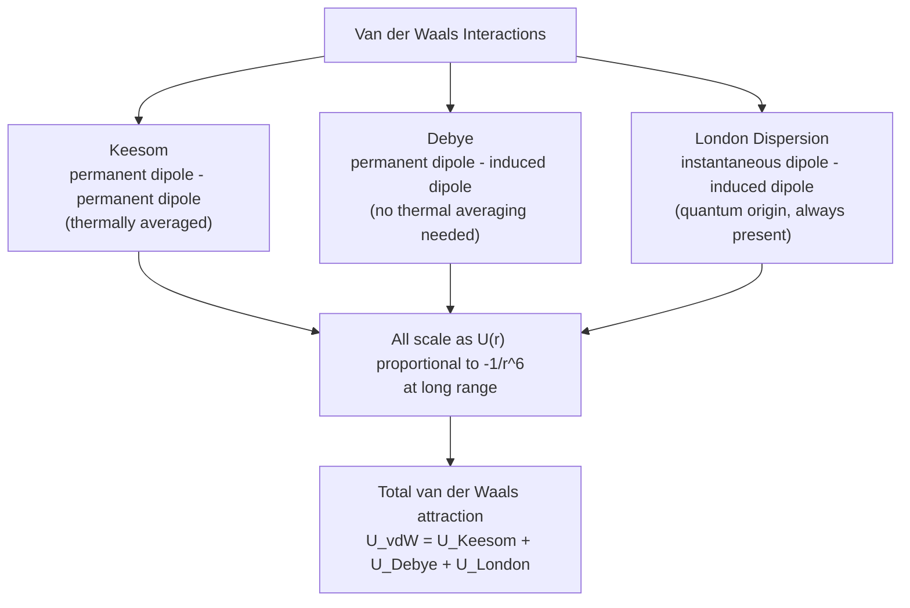

## Van der Waals Forces

### Overview

Van der Waals forces are relatively weak, non-covalent intermolecular interactions arising from electrostatic effects between neutral atoms and molecules. They encompass several distinct physical mechanisms — permanent dipole-dipole interactions, dipole-induced dipole interactions, and instantaneous-dipole/induced-dipole (dispersion) interactions — unified by a characteristic $1/r^6$ dependence of the interaction energy at long range. These forces govern the physical properties of condensed matter (boiling points, viscosity), the structure of biological macromolecules, and physisorption phenomena.

**Key Points**

- Van der Waals forces are substantially weaker than covalent or ionic bonds (typically 0.1 to a few kJ/mol, versus 100s of kJ/mol for covalent bonds)
- Three principal contributions: **Keesom** (dipole-dipole), **Debye** (dipole-induced dipole), and **London dispersion** (induced dipole-induced dipole)
- All three contributions share the same functional form at long range: $U(r) \propto -1/r^6$
- **London dispersion forces** are universal — present between *any* pair of atoms or molecules, even those with no permanent dipole moment (e.g., noble gas atoms)

---

### Keesom Forces (Dipole-Dipole Interaction)

For two polar molecules with permanent dipole moments $\mu_1$ and $\mu_2$, the classical electrostatic interaction energy depends on their relative orientation:

$$U(r,\theta_1,\theta_2,\phi) = \frac{\mu_1\mu_2}{4\pi\epsilon_0 r^3}\left[\sin\theta_1\sin\theta_2\cos\phi - 2\cos\theta_1\cos\theta_2\right]$$

At finite temperature, thermal motion causes the molecules to sample all orientations, with lower-energy (attractive) orientations statistically favored (Boltzmann weighting). Averaging over orientations (to leading order in $1/k_BT$) yields the **Keesom potential**:

$$U_{\text{Keesom}}(r) = -\frac{2\mu_1^2\mu_2^2}{3(4\pi\epsilon_0)^2 k_BT\,r^6}$$

**Key Points**

- The $1/r^6$ dependence, despite the underlying $1/r^3$ dipole-dipole interaction, arises from the thermal (Boltzmann) orientational averaging process — not from the raw electrostatic interaction itself
- This interaction is inherently **temperature-dependent**: it weakens at higher temperature as thermal motion increasingly randomizes molecular orientation
- Relevant for interactions between molecules with permanent dipole moments (e.g., HCl-HCl, water-water beyond hydrogen bonding contributions)

---

### Debye Forces (Dipole-Induced Dipole Interaction)

A permanent dipole on one molecule can polarize a neighboring molecule (polar or nonpolar), inducing a dipole moment in it. The induced dipole is $\mu_{\text{induced}} = \alpha E$, where $\alpha$ is the polarizability of the second molecule and $E$ is the electric field from the first molecule's permanent dipole. The resulting (orientationally averaged, but not requiring thermal averaging since the induced response always favors attraction) interaction energy is:

$$U_{\text{Debye}}(r) = -\frac{\mu_1^2\alpha_2 + \mu_2^2\alpha_1}{(4\pi\epsilon_0)^2 r^6}$$

**Key Points**

- Unlike the Keesom interaction, the Debye interaction is **not temperature-dependent**, since the induced dipole always aligns favorably with the inducing field regardless of orientation (no orientational averaging over unfavorable configurations is needed)
- Requires at least one permanent dipole; the second species can be polar or nonpolar
- Generally the smallest of the three contributions for typical small polar molecules, though its relative importance grows with the polarizability of the non-dipolar partner

---

### London Dispersion Forces (Induced Dipole-Induced Dipole)

Even atoms/molecules with **zero permanent dipole moment** (noble gas atoms, nonpolar molecules like $CH_4$ or $N_2$) attract one another via London dispersion forces. The physical origin is quantum mechanical: instantaneous fluctuations in electron distribution create a transient dipole moment, which induces a correlated dipole in a neighboring atom, producing a net attractive interaction even though the time-averaged dipole moment of each atom is zero.

**Simplified quantum mechanical derivation (second-order perturbation theory)** treats the interaction between two atoms as a perturbation on their combined electronic Hamiltonian, giving:

$$U_{\text{London}}(r) = -\frac{3}{4}\frac{\alpha_1\alpha_2}{(4\pi\epsilon_0)^2 r^6}\cdot\frac{I_1 I_2}{I_1+I_2}$$

(the **London formula**), where $\alpha_1,\alpha_2$ are static polarizabilities and $I_1,I_2$ are the ionization energies of the two species.

**Key Points**

- London dispersion is a **purely quantum mechanical effect** — it has no classical explanation, since a classical charge distribution with zero average dipole moment would exert no time-averaged electrostatic force
- It is the **only** van der Waals contribution present between fully nonpolar species (e.g., two argon atoms, or two methane molecules)
- Scales with polarizability: larger, more diffuse electron clouds (heavier atoms, larger molecules) have greater polarizability and correspondingly stronger dispersion interactions — this explains the trend of increasing boiling points down a series of noble gases or halogens ($F_2 < Cl_2 < Br_2 < I_2$)

---

### Origin of the $1/r^6$ Dependence: Unified Physical Picture (svg_diagram)

---

### The Lennard-Jones Potential

Combining the attractive $1/r^6$ van der Waals term with a short-range repulsive term (arising from Pauli exclusion / electron cloud overlap at close approach) gives the widely used **Lennard-Jones 12-6 potential**:

$$U_{LJ}(r) = 4\epsilon\left[\left(\frac{\sigma}{r}\right)^{12} - \left(\frac{\sigma}{r}\right)^6\right]$$

where $\epsilon$ is the depth of the potential well and $\sigma$ is the finite distance at which $U_{LJ}=0$.

**Key Points**

- The repulsive $r^{-12}$ term is chosen largely for computational convenience (it is the square of the attractive term, simplifying evaluation); it is a phenomenological approximation to the much steeper, more physically justified exponential repulsion from overlapping electron clouds
- The potential minimum occurs at $r_{\min} = 2^{1/6}\sigma$, with well depth $U(r_{\min}) = -\epsilon$
- This potential is a cornerstone of molecular dynamics simulations, providing a computationally efficient model for non-bonded intermolecular interactions across chemistry, materials science, and biophysics

---

### Comparison of Intermolecular Force Types

| Interaction Type | Requires Permanent Dipole? | Distance Dependence | Temperature Dependence | Typical Magnitude |
| --- | --- | --- | --- | --- |
| Keesom | Both molecules | $1/r^6$ | Yes (weakens with $T$) | Small to moderate |
| Debye | At least one molecule | $1/r^6$ | No | Usually smallest contribution |
| London dispersion | No (universal) | $1/r^6$ | No | Dominant for nonpolar/large molecules |
| Hydrogen bonding | N/A (distinct mechanism) | Shorter range, directional | N/A | Stronger than typical vdW ($\sim$10-40 kJ/mol) |
| Covalent bond | N/A | N/A | N/A | Strongest ($\sim$100s kJ/mol) |

**Key Points**

- Hydrogen bonding, while sometimes loosely grouped with van der Waals forces in casual usage, is typically classified as a **distinct** interaction type due to its directionality and partial covalent/electrostatic character, and is significantly stronger than typical van der Waals contributions
- For most molecules of moderate polarity and size, London dispersion is the **dominant** van der Waals contribution, even when permanent dipoles are present — a frequently underappreciated point, since polarizability tends to scale with molecular size faster than typical dipole moments do

---

### Example: Relative Contributions in HCl

**Example**

For HCl gas ($\mu \approx 1.08$ D, $\alpha \approx 2.63\times10^{-24}\ \text{cm}^3$, $I \approx 12.7$ eV), calculations of the three contributions at typical intermolecular separations show that **London dispersion dominates** the total van der Waals attraction, contributing on the order of 80–90% of the total interaction energy, with Keesom and Debye contributions comprising the remainder. [Unverified] Precise percentage breakdowns depend sensitively on the specific separation, temperature, and calculation method used, so this should be regarded as an illustrative order-of-magnitude statement rather than an exact universal figure. This pattern — dispersion dominance even for moderately polar molecules — is general and becomes even more pronounced for larger, more polarizable molecules.

---

### Physical Manifestations and Applications

- **Boiling and melting points**: van der Waals forces (primarily dispersion) explain trends across homologous series (e.g., increasing boiling point with chain length in alkanes) and across the noble gases and halogens
- **Physisorption**: weak, reversible adsorption of gas molecules onto surfaces, governed by van der Waals attraction (as opposed to the stronger, often irreversible chemisorption involving covalent bond formation)
- **Real gas behavior**: the van der Waals equation of state directly incorporates these attractive intermolecular forces (via the $a/V^2$ correction term) to describe deviations from ideal gas behavior
- **Molecular biology and materials science**: van der Waals forces contribute to protein folding, DNA base-stacking interactions, adhesion phenomena (e.g., the gecko foot-hair adhesion mechanism), and colloidal stability (as described by DLVO theory)
- **Van der Waals radius**: the effective "size" of an atom in non-bonded contact, defined by the distance at which van der Waals attraction and repulsion balance — used extensively in molecular modeling and crystallography

---

### Related Topics

- Molecular Bonding: Ionic and Covalent
- Molecular Orbital Theory
- Raman Spectroscopy (polarizability connections)
- The Lennard-Jones Potential and Molecular Dynamics
- Real Gas Equations of State
- Hydrogen Bonding
- DLVO Theory and Colloidal Stability
- Physisorption vs. Chemisorption