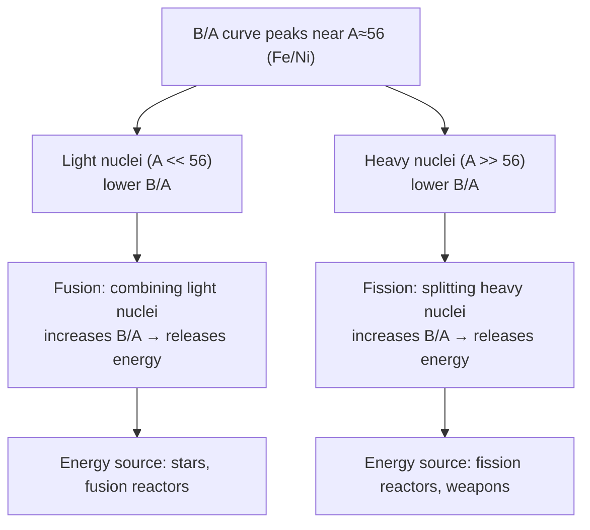

## Binding Energy and the Mass Defect

### Overview

The mass of an assembled nucleus is always less than the sum of the masses of its constituent free nucleons. This mass deficit — the mass defect — corresponds, via Einstein's mass-energy relation, to the energy that was released when the nucleus formed, and equivalently to the energy required to disassemble it. Binding energy is the central quantity for understanding nuclear stability, and its systematics across the chart of nuclides explain fusion, fission, and the abundance patterns of elements in nature.

**Key Points**

- The **mass defect** $\Delta m$ is the difference between the summed mass of free constituent nucleons and the actual nuclear mass
- **Binding energy** $B = \Delta m\, c^2$ is the energy equivalent of this mass difference
- **Binding energy per nucleon**, $B/A$, is the standard metric for comparing nuclear stability across different nuclides
- The shape of the $B/A$ curve (peaking near $A\approx 56$) is the fundamental reason both fusion (light nuclei) and fission (heavy nuclei) release energy

---

### Definition of Mass Defect

For a nucleus with $Z$ protons and $N$ neutrons (mass number $A=Z+N$), the mass defect is:

$$\Delta m = Zm_p + Nm_n - M_{\text{nucleus}}(A,Z)$$

where $m_p$ and $m_n$ are the free proton and neutron masses, and $M_{\text{nucleus}}$ is the actual measured mass of the bound nucleus.

**Key Points**

- $\Delta m$ is always positive for a bound nucleus — the bound system is always lighter than its separated constituents, reflecting the energy released during binding
- In practice, nuclear masses are usually tabulated as **atomic masses** (including electrons), so binding energy calculations typically use atomic mass values with the electron masses canceling appropriately (to good approximation) between the nucleus-plus-electrons system and the sum of neutral hydrogen atoms and free neutrons

---

### Binding Energy from Mass-Energy Equivalence

Applying Einstein's relation $E=mc^2$ directly to the mass defect:

$$B(A,Z) = \Delta m\, c^2 = \left[Zm_p + Nm_n - M(A,Z)\right]c^2$$

Using atomic mass units (u), where $1\ \text{u} \cdot c^2 = 931.494\ \text{MeV}$, allows binding energies to be computed directly from tabulated atomic mass values.

**Key Points**

- Binding energy represents the minimum energy that must be supplied to completely separate a nucleus into individual free nucleons (or equivalently, the energy released when free nucleons combine to form the nucleus)
- This is a direct, quantitative manifestation of mass-energy equivalence — one of the clearest and most precisely verified applications of special relativity in physics, since nuclear mass defects are measurable to extremely high precision via mass spectrometry

---

### Worked Example: Binding Energy of the Deuteron

**Example**

The deuteron ($^2_1\text{H}$, one proton + one neutron) is the simplest bound nucleus. Using standard mass values:

$$m_p = 1.007276\ \text{u}, \qquad m_n = 1.008665\ \text{u}, \qquad M_d = 2.013553\ \text{u}$$

$$\Delta m = (1.007276 + 1.008665) - 2.013553 = 0.002388\ \text{u}$$

Converting to energy:

$$B = 0.002388\ \text{u} \times 931.494\ \text{MeV/u} \approx 2.224\ \text{MeV}$$

This matches the well-established experimental deuteron binding energy of 2.224 MeV, directly measurable via the energy of the gamma ray emitted in neutron-proton radiative capture ($n+p\to d+\gamma$), one of the most precisely characterized reactions in nuclear physics.

---

### Binding Energy per Nucleon

To compare stability across nuclei of different size, binding energy is normalized per nucleon:

$$\frac{B}{A} = \frac{\left[Zm_p+Nm_n-M(A,Z)\right]c^2}{A}$$

**Key Points**

- $B/A$ rises steeply for the lightest nuclei, reaching a broad maximum of approximately 8.7–8.8 MeV/nucleon in the vicinity of iron ($^{56}$Fe) and nickel ($^{62}$Ni)
- $B/A$ then decreases gradually for heavier nuclei, dropping to approximately 7.6 MeV/nucleon for uranium ($^{238}$U)
- A **higher** $B/A$ indicates a **more tightly bound**, more stable nucleus — the peak near $A\approx 56$ therefore identifies the most stable nuclides in nature, consistent with iron's prominence in stellar nucleosynthesis end-products and planetary cores

---

### Why the Curve Peaks: Competing Effects

The characteristic shape of $B/A$ vs. $A$ reflects two competing physical effects, both captured in the semi-empirical mass formula:

1. **Surface effect (dominant for light nuclei)**: nucleons at the nuclear surface have fewer neighbors to bond with via the short-range strong force, so they are less tightly bound than interior nucleons. Small nuclei have a proportionally larger surface-to-volume ratio, suppressing $B/A$
2. **Coulomb repulsion (dominant for heavy nuclei)**: as $Z$ grows, cumulative electrostatic repulsion between all proton pairs grows roughly as $Z^2$, competing against the saturating (short-range, roughly $\propto A$) nuclear attraction — this progressively reduces $B/A$ for heavier nuclei

**Key Points**

- The peak near $A\approx 56$ represents the point where surface effects have become small (large enough nucleus) but Coulomb repulsion has not yet grown large (not yet too many protons) — an optimal balance
- [Inference] The precise location and value of the peak depend on the specific combination of empirical parameters used in the mass formula, though the qualitative location near the iron/nickel region is a robust, well-established experimental result

---

### Binding Energy Consequences: Fusion and Fission (svg_diagram)

---

### Energy Release in Fusion Reactions

**Example**

The proton-proton fusion chain step $^2_1\text{H} + {^1_1\text{H}} \to {^3_2\text{He}} + \gamma$, and ultimately reactions such as deuterium-tritium fusion:

$$^2_1\text{H} + {^3_1\text{H}} \to {^4_2\text{He}} + {^1_0\text{n}}$$

release substantial energy because the product $^4$He has a much higher $B/A$ ($\approx 7.07$ MeV/nucleon) than the reactants (deuteron $B/A \approx 1.11$ MeV/nucleon, triton $B/A \approx 2.83$ MeV/nucleon). The total energy released in this specific reaction is approximately 17.6 MeV, computed directly from the mass difference between reactants and products via $E = \Delta m\,c^2$.

---

### Energy Release in Fission Reactions

**Example**

For uranium-235 neutron-induced fission (schematically):

$$^{235}_{92}\text{U} + n \to \text{fission fragments} + \text{neutrons} + \text{energy}$$

Since the fission fragments (typically mass numbers in the 90–145 range) have $B/A$ values closer to the peak (~8.5 MeV/nucleon) than the parent $^{235}$U ($B/A \approx 7.6$ MeV/nucleon), the mass difference releases approximately 200 MeV per fission event — this large per-event energy release (compared to chemical reactions, which release only a few eV per reaction) is the fundamental reason nuclear fission is such a concentrated energy source.

---

### Mass Defect vs. Binding Energy Table

| Nuclide | Mass Defect $\Delta m$ (u) | Binding Energy $B$ (MeV) | $B/A$ (MeV/nucleon) |
| --- | --- | --- | --- |
| $^2$H (deuteron) | 0.00239 | 2.22 | 1.11 |
| $^4$He | 0.03038 | 28.30 | 7.07 |
| $^{56}$Fe | 0.52846 | 492.26 | 8.79 |
| $^{238}$U | 1.93420 | 1801.7 | 7.57 |

**Key Points**

- $^4$He's exceptionally high $B/A$ relative to its neighbors (a local peak in the curve, not just the smooth overall trend) reflects its doubly-magic shell structure (2 protons, 2 neutrons, both closed shells) — this anomalous stability is why alpha particle emission is energetically favorable in many heavy-nucleus decays, and why $^4$He nuclei are common fusion products in stellar nucleosynthesis
- Comparing successive isotopes' binding energies (via **neutron/proton separation energies**, $S_n = B(A,Z)-B(A-1,Z)$) reveals shell closure effects directly, since separation energies drop sharply just beyond a closed shell

---

### Nucleon Separation Energies

Closely related to total binding energy are **separation energies** — the energy required to remove a single nucleon:

$$S_n = \left[M(A-1,Z) + m_n - M(A,Z)\right]c^2 \quad \text{(neutron separation energy)}$$

$$S_p = \left[M(A-1,Z-1) + m_p - M(A,Z)\right]c^2 \quad \text{(proton separation energy)}$$

**Key Points**

- These are the nuclear physics analog of atomic ionization energies, and show similarly abrupt drops immediately after magic-number shell closures — direct experimental evidence supporting the nuclear shell model
- Separation energies are essential in astrophysical nucleosynthesis calculations, determining which isotopes are accessible via sequential neutron or proton capture in stellar and explosive nucleosynthesis environments

---

### Related Topics

- Nuclear Structure and Composition
- The Semi-Empirical Mass Formula (Liquid Drop Model)
- The Nuclear Shell Model and Magic Numbers
- Nuclear Fission Mechanisms and Chain Reactions
- Nuclear Fusion and Stellar Nucleosynthesis
- Radioactive Decay: Alpha, Beta, and Gamma Processes
- Mass Spectrometry and Precision Nuclear Mass Measurement
- Special Relativity and Mass-Energy Equivalence