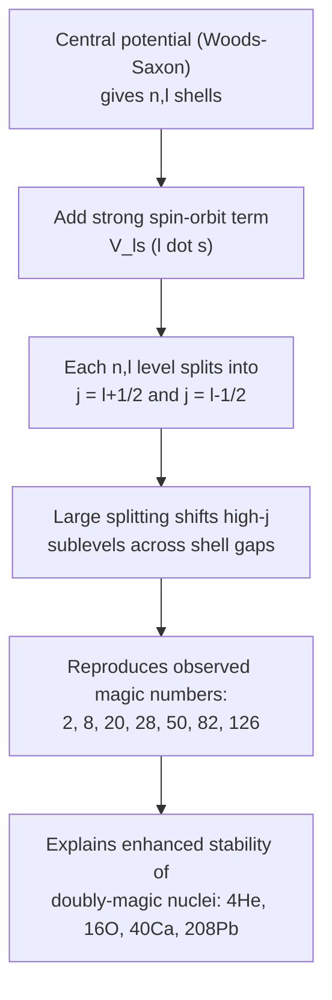

## Nuclear Models: Liquid Drop and Shell Model

### Overview

No single closed-form solution exists for the nuclear many-body problem, so nuclear structure is understood through complementary phenomenological models, each capturing different aspects of nuclear behavior. The **liquid drop model** treats the nucleus as a classical, incompressible charged fluid and successfully reproduces bulk binding energy trends, while the **shell model** treats nucleons as independent particles moving in a mean-field potential and explains fine structure — particularly the anomalous stability of "magic number" nuclei. Together they form the two foundational pillars of nuclear structure theory.

**Key Points**

- The liquid drop model is a **macroscopic**, collective approach emphasizing bulk nuclear properties (binding energy, fission, deformation)
- The shell model is a **microscopic**, single-particle approach emphasizing quantum shell structure (magic numbers, spins, parities)
- Neither model alone is complete; each explains phenomena the other cannot
- Modern nuclear structure theory often combines both frameworks (e.g., the collective model, macroscopic-microscopic methods)

---

### The Liquid Drop Model

**Physical basis**: nucleons interact via the short-range, saturating strong force, causing the nucleus to behave analogously to an incompressible liquid drop — nearly constant density, with binding energy dominated by "bulk" and "surface" contributions similar to cohesive and surface-tension effects in a classical fluid.

**Semi-Empirical Mass Formula (Weizsäcker formula):**

$$B(A,Z) = a_V A - a_S A^{2/3} - a_C\frac{Z(Z-1)}{A^{1/3}} - a_A\frac{(A-2Z)^2}{A} + \delta(A,Z)$$

| Term | Physical Analogy | Effect |
| --- | --- | --- |
| Volume ($a_V A$) | Bulk cohesive energy of liquid | Increases binding proportional to $A$ |
| Surface ($-a_S A^{2/3}$) | Surface tension | Reduces binding (surface nucleons under-bound) |
| Coulomb ($-a_C Z(Z-1)/A^{1/3}$) | Electrostatic self-energy of charged sphere | Reduces binding, grows with $Z^2$ |
| Asymmetry ($-a_A(A-2Z)^2/A$) | Quantum (Pauli) penalty, no classical liquid analog | Reduces binding for $N\neq Z$ |
| Pairing ($\delta$) | Nucleon pairing, no classical liquid analog | Extra binding for even-even nuclei |

**Key Points**

- The volume and surface terms are directly analogous to bulk and surface energy in a classical liquid drop — this is the origin of the model's name
- The asymmetry and pairing terms are purely quantum mechanical additions with no classical liquid counterpart, required to fit real nuclear data
- The model successfully predicts the overall trend of $B/A$ versus $A$ (rising steeply for light nuclei, peaking near iron, declining gradually for heavy nuclei) and underlies the mechanism of nuclear fission

---

### Liquid Drop Model and Nuclear Fission

The liquid drop model provides the classic qualitative (and semi-quantitative) picture of **nuclear fission** as a deformation instability, first developed by Bohr and Wheeler.

**Key Points**

- As a heavy nucleus deforms (elongates from spherical toward an ellipsoidal or dumbbell shape), the **surface energy term increases** (larger surface area) while the **Coulomb energy term decreases** (charge is spread over a greater average separation)
- Whether a given deformation is energetically favorable depends on the competition between these two effects, captured in the **fissility parameter**:

  $$x = \frac{Z^2/A}{(Z^2/A)_{\text{critical}}} \approx \frac{Z^2/A}{47.8}$$
- For sufficiently large $Z^2/A$ (heavy, proton-rich nuclei), small deformations lower the total energy, driving the nucleus toward scission (fission) — this liquid-drop-based instability criterion correctly identifies which nuclei are fissile and explains the characteristic "saddle point" (fission barrier) in the deformation energy landscape

---

### Fission Barrier via Liquid Drop Deformation (svg_diagram)

<svg xmlns="http://www.w3.org/2000/svg" viewBox="0 0 640 340" font-family="Helvetica, Arial, sans-serif">
<text x="320" y="22" font-size="15" text-anchor="middle" font-weight="bold">Liquid Drop Fission Barrier (svg_diagram)</text>
<line x1="70" y1="290" x2="600" y2="290" stroke="black" stroke-width="1.5" />
<line x1="70" y1="290" x2="70" y2="50" stroke="black" stroke-width="1.5" />
<text x="330" y="320" font-size="12" text-anchor="middle">Deformation parameter</text>
<text x="35" y="170" font-size="12" text-anchor="middle" transform="rotate(-90 35 170)">Potential Energy</text>

<path d="M 100,260 Q 200,120 300,110 Q 400,100 470,230 Q 520,290 580,290" fill="none" stroke="#c0392b" stroke-width="2.5" />

<text x="100" y="280" font-size="11" text-anchor="middle">Spherical nucleus</text>

<circle cx="100" cy="260" r="12" fill="`#2980b9`" opacity="0.6" />

<text x="300" y="95" font-size="11" text-anchor="middle">Saddle point (fission barrier)</text>

<ellipse cx="300" cy="110" rx="18" ry="9" fill="`#2980b9`" opacity="0.6" />

<text x="560" y="270" font-size="11" text-anchor="middle">Scission → fragments</text>

<circle cx="545" cy="285" r="8" fill="`#2980b9`" opacity="0.6" />

<circle cx="575" cy="285" r="8" fill="`#2980b9`" opacity="0.6" />

</svg>

---

### Limitations of the Liquid Drop Model

**Key Points**

- Predicts a smooth, monotonic trend for binding energy that fails to capture sharp anomalies — most notably the exceptionally enhanced stability of nuclei with specific "magic numbers" of protons or neutrons (2, 8, 20, 28, 50, 82, 126)
- Cannot predict nuclear spin, parity, or magnetic moment — quantities that depend on the detailed quantum arrangement of individual nucleons, not just bulk properties
- Cannot explain excited-state spectra of individual nuclei, which show patterns strongly dependent on proximity to closed shells

---

### The Nuclear Shell Model

**Physical basis**: analogous to the atomic central-field approximation, the shell model treats each nucleon as moving independently in an average (mean-field) potential generated by all other nucleons, ignoring residual nucleon-nucleon correlations to leading order.

**Mean-field potential**: commonly modeled as a **Woods-Saxon potential**:

$$V(r) = \frac{-V_0}{1+\exp\left(\frac{r-R}{a}\right)}$$

which smoothly interpolates between a flat interior and a diffuse surface, more realistic than the idealized infinite square well or pure harmonic oscillator potentials sometimes used as simpler starting approximations.

**Key Points**

- Solving the Schrödinger equation in this potential yields discrete energy levels, each labeled by quantum numbers analogous to the atomic case ($n$, $\ell$)
- A pure harmonic oscillator or square-well potential alone reproduces some shell closures but **fails** to reproduce the full observed sequence of magic numbers

---

### The Spin-Orbit Coupling Breakthrough

The critical missing ingredient, identified independently by Maria Goeppert Mayer and Otto Haxel/Hans Jensen/Hans Suess in 1949, is a strong **spin-orbit coupling** term added to the mean-field potential:

$$V(r) = V_{\text{central}}(r) + V_{ls}(r)\,\mathbf{l}\cdot\mathbf{s}$$

**Key Points**

- Unlike the atomic case (where spin-orbit coupling is a relatively small relativistic correction), the **nuclear spin-orbit interaction is large** — comparable in magnitude to the level spacings themselves — and is attractive (lowers energy) for the $j = \ell+1/2$ state relative to $j=\ell-1/2$
- This splits each $(n,\ell)$ level into two $j$-sublevels, with the splitting large enough to shift entire sub-shells across major shell gaps, reproducing precisely the observed sequence of magic numbers: 2, 8, 20, 28, 50, 82, 126
- This was a landmark achievement: correctly explaining *why* these specific numbers (rather than the harmonic-oscillator-only sequence 2, 8, 20, 40, 70, 112) appear as nuclear magic numbers, earning Mayer and Jensen the 1963 Nobel Prize in Physics

---

### Shell Model Level Filling and Magic Numbers (svg_diagram)

---

### Shell Model Predictions: Spins and Parities

For odd-$A$ nuclei, the shell model provides a simple and often successful rule: the nuclear ground-state spin and parity are determined by the **single unpaired nucleon** occupying the highest-energy filled level (the "last odd nucleon"), since paired nucleons couple their angular momenta to zero.

**Example**

$^{17}_8\text{O}_9$ has 8 protons (closed shell, magic number) and 9 neutrons — one neutron beyond the $N=8$ closed shell, occupying the $1d_{5/2}$ level. The shell model correctly predicts the ground-state spin-parity $J^\pi = 5/2^+$, matching experimental observation.

**Key Points**

- This single-particle picture works best for nuclei with one nucleon (or one hole) outside a closed shell; it becomes progressively less reliable for nuclei far from closed shells, where residual nucleon-nucleon interactions and collective effects become important
- Even-even nuclei universally show ground-state $J^\pi = 0^+$ (all nucleons paired), a robust and essentially universal experimental observation directly explained by the pairing mechanism

---

### Comparison: Liquid Drop vs. Shell Model

| Property | Liquid Drop Model | Shell Model |
| --- | --- | --- |
| Conceptual basis | Classical, collective fluid drop | Quantum, independent-particle mean field |
| Explains | Bulk binding energy trend, fission | Magic numbers, ground-state spin/parity |
| Fails to explain | Magic number anomalies, individual spins | Bulk binding energy trend alone (without empirical fitting) |
| Mathematical tools | Semi-empirical mass formula | Schrödinger equation in mean-field potential + spin-orbit term |
| Best suited for | Heavy, deformable nuclei; fission dynamics | Nuclei near closed shells; single-particle spectroscopy |

---

### Toward Unification: The Collective Model

Real nuclei — particularly those far from closed shells — often exhibit **collective** behavior (rotation, vibration) that neither pure model captures well individually. The **collective model** (Bohr-Mottelson) combines shell-model single-particle states with liquid-drop-like collective deformation and vibration, successfully describing:

- **Rotational bands** in deformed (non-spherical) nuclei, with characteristic $E \propto J(J+1)$ level spacing analogous to molecular rotational spectra
- **Vibrational excitations** around a spherical or near-spherical equilibrium shape, analogous to molecular vibrational modes
- The transition between near-spherical (shell-model-like) and strongly deformed (liquid-drop/collective-like) behavior as a function of proton and neutron number, correlating closely with proximity to magic numbers

[Inference] The degree to which a given nucleus is better described as "single-particle-like" versus "collective-like" is a matter of relative emphasis rather than a sharp categorical distinction, and modern theoretical treatments (including ab initio and energy-density-functional approaches) increasingly aim to unify these pictures within a single consistent framework rather than treating them as separate models.

---

### Related Topics

- Nuclear Structure and Composition
- Binding Energy and the Mass Defect
- Nuclear Fission Mechanisms and Chain Reactions
- Collective Nuclear Models: Rotation and Vibration
- Nuclear Spin, Parity, and Magnetic Moments
- The Strong Nuclear Force and Isospin Symmetry
- Woods-Saxon and Mean-Field Potentials
- Radioactive Decay Systematics Near Closed Shells