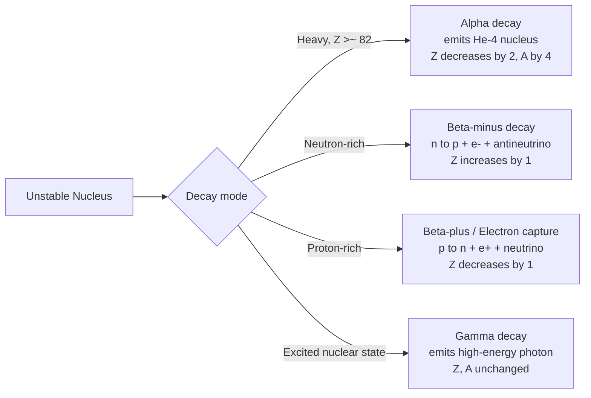

## Radioactive Decay and Half-Life

### Overview

Radioactive decay is the spontaneous transformation of an unstable nucleus into a different nuclear configuration, accompanied by emission of particles and/or radiation. The process is fundamentally statistical — governed by quantum mechanics at the level of individual nuclei — yet produces highly predictable, exponential decay behavior for large ensembles, characterized by the half-life. This statistical framework underlies applications from radiometric dating to nuclear medicine to reactor physics.

**Key Points**

- Radioactive decay is a **random, memoryless process**: each unstable nucleus has a fixed, constant probability per unit time of decaying, independent of its age or history
- The decay law is exponential: $N(t) = N_0 e^{-\lambda t}$
- **Half-life** $t_{1/2}$ and **mean lifetime** $\tau$ are related but distinct measures of decay timescale
- Principal decay modes are **alpha**, **beta** (and its variants), and **gamma** decay, each governed by different underlying physics

---

### The Exponential Decay Law

**Statistical foundation**: For a sample of $N(t)$ undecayed nuclei, the number decaying per unit time is proportional to the number present, since each nucleus decays independently with the same constant probability per unit time (the **decay constant** $\lambda$):

$$\frac{dN}{dt} = -\lambda N$$

Solving this first-order differential equation:

$$N(t) = N_0\,e^{-\lambda t}$$

where $N_0$ is the initial number of undecayed nuclei.

**Key Points**

- The decay constant $\lambda$ (units of inverse time) is a fixed, characteristic property of each unstable nuclide, essentially independent of external conditions (temperature, pressure, chemical environment) for the vast majority of decay processes — [Inference] a small number of exceptions exist, such as electron-capture decay rates, which can show minor sensitivity to chemical environment through the local electron density at the nucleus, though this effect is typically very small
- This memoryless (Markovian) property is a direct consequence of quantum mechanical tunneling and transition-rate physics (Fermi's Golden Rule), not a classical aging process — an old undecayed nucleus is statistically indistinguishable from a freshly formed one of the same species

---

### Half-Life and Mean Lifetime

**Half-life** $t_{1/2}$: the time required for half of an initial sample to decay:

$$N(t_{1/2}) = \frac{N_0}{2} = N_0 e^{-\lambda t_{1/2}} \quad\Rightarrow\quad t_{1/2} = \frac{\ln 2}{\lambda}$$

**Mean lifetime** $\tau$: the average time a nucleus survives before decaying, computed as the expectation value of decay time:

$$\tau = \frac{1}{N_0}\int_0^\infty t\left(-\frac{dN}{dt}\right)dt = \frac{1}{\lambda}$$

**Key Points**

- The relationship between the two: $t_{1/2} = \tau\ln 2 \approx 0.693\,\tau$
- After $n$ half-lives, the remaining fraction is $(1/2)^n$ — a simple, widely used rule of thumb for estimating remaining activity
- Half-lives span an enormous range across known nuclides — from small fractions of a microsecond (some highly unstable nuclei near the neutron/proton drip lines) to over $10^{19}$ years (some naturally occurring "stable-in-practice" nuclides with extremely weak decay channels)

---

### Exponential Decay Curve (svg_diagram)

<svg xmlns="http://www.w3.org/2000/svg" viewBox="0 0 640 360" font-family="Helvetica, Arial, sans-serif">
<text x="320" y="22" font-size="15" text-anchor="middle" font-weight="bold">Radioactive Decay Curve (svg_diagram)</text>
<line x1="70" y1="310" x2="600" y2="310" stroke="black" stroke-width="1.5" />
<line x1="70" y1="310" x2="70" y2="50" stroke="black" stroke-width="1.5" />
<text x="330" y="340" font-size="12" text-anchor="middle">Time (in units of t₁/₂)</text>
<text x="30" y="180" font-size="12" text-anchor="middle" transform="rotate(-90 30 180)">N(t) / N₀</text>

<path d="M 100,60 C 160,110 180,150 220,175 C 260,200 280,215 320,232 C 360,248 390,258 430,268 C 470,276 510,282 560,290" fill="none" stroke="`#c0392b`" stroke-width="2.5" />

<line x1="100" y1="310" x2="100" y2="60" stroke="gray" stroke-dasharray="3,3" stroke-width="1" />
<text x="100" y="325" font-size="10" text-anchor="middle">0</text>
<line x1="220" y1="310" x2="220" y2="175" stroke="gray" stroke-dasharray="3,3" stroke-width="1" />
<text x="220" y="325" font-size="10" text-anchor="middle">1 t₁/₂</text>
<line x1="70" y1="175" x2="220" y2="175" stroke="gray" stroke-dasharray="3,3" stroke-width="1" />
<text x="55" y="180" font-size="10" text-anchor="end">1/2</text>
<line x1="320" y1="310" x2="320" y2="232" stroke="gray" stroke-dasharray="3,3" stroke-width="1" />
<text x="320" y="325" font-size="10" text-anchor="middle">2 t₁/₂</text>
<line x1="70" y1="232" x2="320" y2="232" stroke="gray" stroke-dasharray="3,3" stroke-width="1" />
<text x="55" y="237" font-size="10" text-anchor="end">1/4</text>
<line x1="430" y1="310" x2="430" y2="268" stroke="gray" stroke-dasharray="3,3" stroke-width="1" />
<text x="430" y="325" font-size="10" text-anchor="middle">3 t₁/₂</text>
</svg>

---

### Activity

The **activity** $A(t)$ of a radioactive sample is the decay rate — the number of decays per unit time:

$$A(t) = -\frac{dN}{dt} = \lambda N(t) = A_0 e^{-\lambda t}$$

Activity is measured in **becquerels** (Bq, 1 decay/second, SI unit) or the older unit **curie** (Ci, $3.7\times10^{10}$ Bq, originally defined as the activity of 1 gram of radium-226).

**Key Points**

- Activity, like $N(t)$, decays exponentially with the same decay constant $\lambda$
- For a given mass of material, activity is inversely related to half-life: shorter-lived isotopes exhibit much higher activity per unit mass than longer-lived isotopes with the same number of atoms, since $A = \lambda N$ and $\lambda = \ln2/t_{1/2}$

---

### Principal Decay Modes

**Alpha decay**: emission of a $^4_2\text{He}$ nucleus (2 protons + 2 neutrons)

$$^A_Z X \to {^{A-4}_{Z-2}Y} + {^4_2\text{He}}$$

- Occurs predominantly in heavy nuclei ($Z\gtrsim 82$), where Coulomb repulsion favors ejecting a tightly-bound (doubly-magic) alpha particle
- Explained quantum mechanically as **quantum tunneling** through the Coulomb barrier — the Geiger-Nuttall law relates decay half-life to alpha particle energy, with higher-energy alphas corresponding to dramatically shorter half-lives due to the exponential sensitivity of tunneling probability to barrier height/width

**Beta decay**: three related processes involving the weak nuclear force, interconverting neutrons and protons

$$\beta^-:\quad n \to p + e^- + \bar\nu_e \qquad (^A_Z X \to {^A_{Z+1}Y} + e^- + \bar\nu_e)$$

$$\beta^+:\quad p \to n + e^+ + \nu_e \qquad (^A_Z X \to {^A_{Z-1}Y} + e^+ + \nu_e)$$

$$\text{EC (electron capture)}:\quad p + e^- \to n + \nu_e \qquad (^A_Z X + e^- \to {^A_{Z-1}Y} + \nu_e)$$

- Mediated by the weak nuclear force; the emitted electron/positron energy spectrum is **continuous** (not discrete), a puzzle historically resolved by Pauli's postulation of the neutrino to conserve energy and momentum in the three-body final state
- $\beta^-$ decay occurs in neutron-rich nuclei (moves toward the valley of stability by converting a neutron to a proton); $\beta^+$/EC occur in proton-rich nuclei

**Gamma decay**: emission of a high-energy photon as an excited nucleus relaxes to a lower energy state (often following alpha or beta decay, which frequently populate excited daughter states)

$$^A_Z X^* \to {^A_Z X} + \gamma$$

- Does not change $Z$ or $N$ — purely an electromagnetic transition between nuclear energy levels, analogous to atomic photon emission but at much higher (MeV-scale) energies
- Competing process: **internal conversion**, where the excitation energy is transferred directly to an atomic electron (ejected instead of a gamma photon being emitted)

---

### Decay Mode Overview (svg_diagram)

---

### Radioactive Decay Series and Secular Equilibrium

Many heavy radioactive nuclides do not decay directly to a stable product but pass through a chain of successive radioactive daughters (a **decay series**), such as the uranium-238, uranium-235, and thorium-232 natural decay series, ending in stable lead isotopes.

For a parent-daughter pair where the parent has much longer half-life than the daughter ($\lambda_1 \ll \lambda_2$), **secular equilibrium** is reached after several daughter half-lives, in which:

$$\lambda_1 N_1 = \lambda_2 N_2 \quad \text{(equal activities)}$$

**Key Points**

- In secular equilibrium, the daughter's activity equals the (nearly constant, slowly changing) parent's activity, even though the absolute number of daughter atoms is far smaller (since $N_2/N_1 = \lambda_1/\lambda_2$)
- This principle underlies practical techniques such as generator systems for medical radioisotope production (e.g., the technetium-99m generator, where longer-lived molybdenum-99 continuously replenishes shorter-lived Tc-99m for clinical imaging use)

---

### Radiometric Dating

**Example**

Radiocarbon dating relies on the known half-life of $^{14}$C ($t_{1/2}\approx5730$ years). Living organisms maintain a roughly constant $^{14}\text{C}/^{12}\text{C}$ ratio through continuous exchange with the atmosphere; after death, this ratio decreases exponentially as $^{14}$C decays without replenishment:

$$\frac{N(t)}{N_0} = e^{-\lambda t} \quad\Rightarrow\quad t = \frac{\ln(N_0/N(t))}{\lambda} = t_{1/2}\frac{\ln(N_0/N(t))}{\ln 2}$$

If a sample shows 25% of the original $^{14}$C activity remaining, this corresponds to two half-lives elapsed: $t = 2\times5730 \approx 11{,}460$ years. Other long-lived isotope systems (uranium-lead, potassium-argon, rubidium-strontium) extend radiometric dating to geological timescales of billions of years, each suited to different age ranges and material types.

---

### Decay Chain Kinetics: Bateman Equations

For a chain of sequential decays $A \to B \to C \to \ldots$, the time evolution of each species' population is governed by coupled differential equations, with the general solution given by the **Bateman equations**. For a simple two-member chain:

$$\frac{dN_1}{dt} = -\lambda_1 N_1$$

$$\frac{dN_2}{dt} = \lambda_1 N_1 - \lambda_2 N_2$$

with solution (starting from pure parent, $N_2(0)=0$):

$$N_2(t) = \frac{\lambda_1 N_1(0)}{\lambda_2-\lambda_1}\left(e^{-\lambda_1 t}-e^{-\lambda_2 t}\right)$$

**Key Points**

- This describes **transient equilibrium** (when $\lambda_2$ is somewhat, but not overwhelmingly, larger than $\lambda_1$) and secular equilibrium as the limiting case $\lambda_1\ll\lambda_2$
- Full decay-chain calculations for complex, multi-step series (as in the natural decay series) require the generalized Bateman equation formalism or numerical integration

---

### Applications

- **Nuclear medicine**: diagnostic imaging (e.g., $^{99m}$Tc, $^{18}$F in PET) and therapeutic applications (e.g., $^{131}$I for thyroid treatment) rely on precisely characterized half-lives and decay modes
- **Radiometric dating**: geological, archaeological, and cosmochronological age determination
- **Nuclear power and safety**: reactor fuel cycle management, spent fuel activity calculations, and radiological protection all depend on decay kinetics
- **Radiation dosimetry**: activity and decay-mode knowledge underlie calculations of absorbed dose and biological risk

---

### Related Topics

- Nuclear Structure and Composition
- Binding Energy and the Mass Defect
- Nuclear Models: Liquid Drop and Shell Model
- Alpha Decay and Quantum Tunneling
- Beta Decay and the Weak Interaction
- Nuclear Reactions and Cross-Sections
- Radiation Dosimetry and Biological Effects
- Nucleosynthesis and Decay Chains in Astrophysics