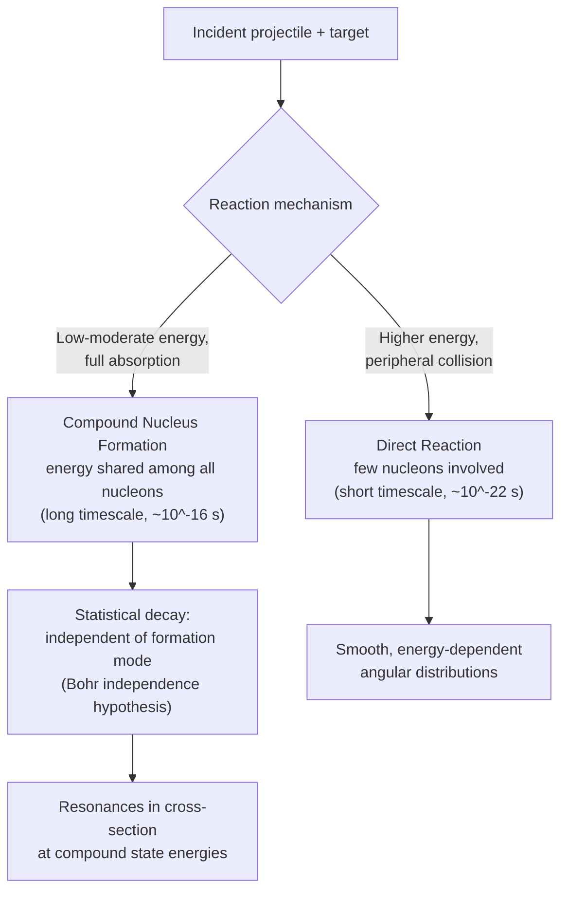

## Nuclear Reactions

### Overview

Nuclear reactions involve the transformation of nuclei through interaction with other nuclei, particles, or photons, distinct from radioactive decay in that they are typically induced by an external projectile rather than occurring spontaneously. Nuclear reactions are governed by strict conservation laws, characterized quantitatively by reaction cross-sections and Q-values, and underlie phenomena ranging from stellar nucleosynthesis to nuclear power generation to particle accelerator physics.

**Key Points**

- A nuclear reaction is generically written $a + X \to Y + b$ (or the compact notation $X(a,b)Y$), where $a$ is the projectile, $X$ the target, $b$ the ejectile, and $Y$ the residual nucleus
- Reactions conserve mass-energy, momentum, charge, and nucleon number (baryon number)
- The **Q-value** determines whether a reaction is exothermic or endothermic
- **Cross-section** $\sigma$ quantifies reaction probability and is central to reactor physics, astrophysics, and nuclear engineering

---

### General Reaction Notation and Conservation Laws

A nuclear reaction is compactly written as:

$$X(a,b)Y \quad \Leftrightarrow \quad a + X \to Y + b$$

**Conserved quantities:**

- **Total energy** (including rest-mass energy, per special relativity)
- **Total momentum**
- **Charge** $Z$ (total proton number conserved)
- **Nucleon number** $A$ (total baryon number conserved, sum of protons and neutrons)
- **Angular momentum** and **parity** (subject to the same selection-rule considerations as atomic/nuclear transitions)

**Key Points**

- Unlike radioactive decay (spontaneous, single initial nucleus), nuclear reactions require an incoming projectile — historically charged particles, neutrons, or (more recently) heavy ions — to overcome the Coulomb barrier (for charged projectiles) or simply to initiate the interaction
- Conservation of nucleon number and charge together constrain which product channels are kinematically accessible for a given reactant combination

---

### The Q-Value

The **Q-value** of a reaction is the net energy released (or absorbed):

$$Q = \left[(m_a+m_X) - (m_Y+m_b)\right]c^2$$

equivalently expressed via the total kinetic energy change:

$$Q = KE_{\text{products}} - KE_{\text{reactants}}$$

**Key Points**

- $Q > 0$: **exothermic (exoergic)** reaction — energy is released, and the reaction can proceed even at very low (in principle, zero) incident kinetic energy in the absence of a Coulomb or centrifugal barrier
- $Q < 0$: **endothermic (endoergic)** reaction — the projectile must supply a minimum **threshold kinetic energy** for the reaction to be energetically possible, since some kinetic energy must be converted into rest mass of the products
- The Q-value follows directly from the mass defect concept applied to the full reactant/product system, exactly as in binding energy calculations

---

### Threshold Energy for Endothermic Reactions

For an endothermic reaction with projectile $a$ striking a stationary target $X$, conservation of both energy and momentum (not just energy) gives a threshold kinetic energy **greater** than $|Q|$ alone:

$$KE_{\text{threshold}} = |Q|\left(1 + \frac{m_a}{m_X}\right)$$

**Key Points**

- This extra factor $(1+m_a/m_X)$ arises because some of the projectile's kinetic energy must go into the center-of-mass motion of the product system (to conserve momentum), and is therefore unavailable to supply the mass-energy deficit
- For a light projectile striking a much heavier target ($m_a \ll m_X$), the threshold energy approaches $|Q|$ itself; for comparable masses, the correction is substantial

---

### Types of Nuclear Reactions

| Reaction Type | Example | Description |
| --- | --- | --- |
| Elastic scattering | $n + {^{12}\text{C}} \to n + {^{12}\text{C}}$ | Projectile and target exchange kinetic energy only; internal states unchanged |
| Inelastic scattering | $n + {^{12}\text{C}} \to n + {^{12}\text{C}}^*$ | Target left in an excited state; some kinetic energy converted to internal excitation |
| Transfer reaction | $d + {^{12}\text{C}} \to p + {^{13}\text{C}}$ | One or more nucleons transferred between projectile and target |
| Capture reaction | $n + {^{235}\text{U}} \to {^{236}\text{U}}^*$ | Projectile fully absorbed, forming a compound (often excited) nucleus |
| Fission-inducing | $n + {^{235}\text{U}} \to \text{fission fragments} + \text{neutrons}$ | Absorption followed by nuclear splitting |
| Spallation | high-energy $p + $ heavy nucleus $\to$ many fragments | High-energy projectile disintegrates the target into multiple pieces |

---

### The Compound Nucleus Model

For many low-to-moderate energy reactions (particularly neutron-induced), Niels Bohr's **compound nucleus model** provides a highly successful conceptual framework: the projectile is absorbed, and its kinetic energy is rapidly shared statistically among all nucleons in the resulting compound system, which reaches a state of approximate thermal equilibrium before decaying.

**Key Points**

- The compound nucleus "forgets" the details of its formation — its subsequent decay (which particles/photons it emits, and in what directions) is governed by the statistical properties of the excited compound system itself, largely independent of how it was formed (**Bohr's independence hypothesis**)
- This picture successfully explains the appearance of sharp **resonances** in reaction cross-sections at specific incident energies, corresponding to excited states of the compound nucleus
- Contrasts with **direct reactions** (relevant at higher energies or for peripheral/grazing collisions), where the projectile interacts with only a few nucleons on a fast timescale without full energy equilibration — transfer reactions are a classic example of direct-reaction mechanisms

---

### Compound Nucleus vs. Direct Reaction Mechanisms (svg_diagram)

---

### Cross-Sections

The **cross-section** $\sigma$ quantifies the probability of a given reaction occurring, defined operationally via the reaction rate:

$$R = \Phi\, n\, \sigma$$

where $\Phi$ is the incident particle flux (particles per unit area per unit time), $n$ is the number of target nuclei, and $R$ is the resulting reaction rate. Cross-sections have units of area, conventionally measured in **barns** ($1\ \text{b} = 10^{-28}\ \text{m}^2$), reflecting the characteristic geometric scale of nuclear dimensions.

**Key Points**

- Cross-sections are strongly energy-dependent, often showing sharp **resonance peaks** at incident energies matching compound nucleus excited states, superimposed on smoother background behavior
- For neutron-induced reactions at low energy, cross-sections often follow approximately a $1/v$ dependence (inversely proportional to neutron velocity) away from resonances — a consequence of the longer interaction time available at lower velocities
- Total cross-section decomposes into partial cross-sections for each open reaction channel: $\sigma_{\text{total}} = \sigma_{\text{elastic}} + \sigma_{\text{inelastic}} + \sigma_{\text{capture}} + \ldots$

---

### Worked Example: Q-Value Calculation

**Example**

For the reaction $^{14}_7\text{N} + {^4_2\text{He}} \to {^{17}_8\text{O}} + {^1_1\text{H}}$ (the historic first artificially induced nuclear reaction, Rutherford 1919), using atomic mass values:

$$m(^{14}\text{N}) = 14.003074\ \text{u}, \quad m(^4\text{He}) = 4.002602\ \text{u}$$

$$m(^{17}\text{O}) = 16.999132\ \text{u}, \quad m(^1\text{H}) = 1.007825\ \text{u}$$

$$Q = \left[(14.003074+4.002602)-(16.999132+1.007825)\right]\times931.494\ \text{MeV}$$

$$Q = \left[18.005676 - 18.006957\right]\times931.494 \approx -1.19\ \text{MeV}$$

This is a mildly **endothermic** reaction, requiring the incident alpha particle to supply a minimum threshold kinetic energy (slightly greater than 1.19 MeV, per the threshold formula above) — consistent with why Rutherford's original experiment required energetic alpha particles from natural radioactive sources.

---

### Neutron-Induced Reactions and Nuclear Reactors

Neutron-induced reactions hold particular practical importance because neutrons, being uncharged, are not repelled by the Coulomb barrier and can readily penetrate and be captured by nuclei even at very low kinetic energies (unlike charged-particle reactions, which require sufficient energy to overcome Coulomb repulsion).

**Key Points**

- **Radiative capture** $(n,\gamma)$: neutron absorption followed by gamma emission, important both in reactor neutron economy and in astrophysical nucleosynthesis (the s-process and r-process)
- **Fission-inducing capture**: for fissile nuclides like $^{235}$U and $^{239}$Pu, neutron capture frequently leads to fission, releasing multiple additional neutrons and enabling self-sustaining chain reactions
- **$(n,p)$ and $(n,\alpha)$ reactions**: neutron-induced particle emission, relevant to activation analysis and certain reactor material considerations
- Neutron cross-sections are tabulated extensively (e.g., in evaluated nuclear data libraries) as functions of energy, forming the essential input data for reactor design and criticality calculations

---

### Reaction Kinematics and the Center-of-Mass Frame

Nuclear reaction analysis is typically simplified by transforming from the laboratory frame (fixed target) to the **center-of-mass (CM) frame**, in which the total momentum is zero by construction.

**Key Points**

- The available energy for reaction products in the CM frame is reduced relative to the lab-frame projectile energy, since a portion of the lab-frame kinetic energy is tied up in overall center-of-mass motion (this is precisely the origin of the threshold energy correction factor discussed above)
- Angular distributions of reaction products are most naturally computed and interpreted in the CM frame, then transformed back to the lab frame for comparison with detector measurements
- [Inference] The specific transformation details depend on the relative masses and energies involved; for reactions with light projectiles on heavy targets, lab and CM frames are numerically close, while for comparable-mass reactants the distinction becomes significant

---

### Applications

- **Nuclear astrophysics**: stellar nucleosynthesis proceeds through sequences of nuclear reactions (fusion in stellar cores, neutron capture in the s- and r-processes), with reaction cross-sections and Q-values determining reaction rates and nucleosynthetic pathways
- **Nuclear reactor physics**: neutron-induced fission and capture cross-sections are the essential input for reactor design, fuel cycle analysis, and criticality calculations
- **Nuclear medicine and isotope production**: many medically useful radioisotopes are produced via specific nuclear reactions in reactors or accelerators (e.g., $(n,\gamma)$ reactions, or charged-particle reactions in cyclotrons)
- **Nuclear structure spectroscopy**: transfer reactions and other direct-reaction probes are widely used experimental tools for determining nuclear energy levels, spins, and parities

---

### Related Topics

- Binding Energy and the Mass Defect
- Radioactive Decay and Half-Life
- Nuclear Models: Liquid Drop and Shell Model
- Nuclear Fission Mechanisms and Chain Reactions
- Stellar Nucleosynthesis: s-process and r-process
- Neutron Cross-Sections and Reactor Physics
- The Compound Nucleus Model
- Particle Accelerators and Nuclear Spectroscopy