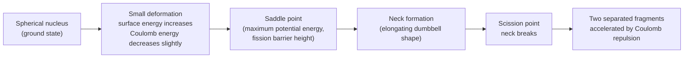

## Nuclear Fission

### Overview

Nuclear fission is the splitting of a heavy atomic nucleus into two (occasionally more) lighter fragments, releasing substantial energy along with additional neutrons and radiation. First observed by Hahn and Strassmann in 1938 and explained theoretically by Meitner and Frisch using the liquid drop model, fission is both a fundamental nuclear physics process and the operating principle behind nuclear reactors and weapons. Its self-sustaining potential arises from the emission of multiple neutrons per fission event, enabling chain reactions.

**Key Points**

- Fission releases energy because fission fragments have **higher binding energy per nucleon** than the parent heavy nucleus (per the $B/A$ curve, which peaks near $A\approx56$)
- Occurs either **spontaneously** (rare, for very heavy/unstable nuclei) or **induced** (typically by neutron capture)
- Each fission event releases approximately 200 MeV, along with 2–3 additional free neutrons on average
- The **liquid drop model** provides the classic qualitative explanation via the deformation-driven competition between surface tension and Coulomb repulsion

---

### Energetics of Fission

The energy release follows directly from binding energy systematics. For a representative fission of $^{235}$U:

$$^{235}_{92}\text{U} + n \to {^{236}_{92}\text{U}}^* \to X_1 + X_2 + k\,n$$

where $X_1, X_2$ are fission fragments (typically with mass numbers in the range 90–145, following an asymmetric distribution) and $k$ is the number of prompt neutrons released (averaging $\bar{\nu}\approx2.4$ for thermal-neutron-induced $^{235}$U fission).

**Key Points**

- Since $B/A\approx7.6$ MeV/nucleon for $^{236}$U while typical fission fragments have $B/A\approx8.5$ MeV/nucleon, the mass difference releases roughly $(8.5-7.6)\times236\approx200$ MeV per fission event
- This energy is distributed among: kinetic energy of fission fragments (~165 MeV, the dominant share, due to Coulomb repulsion between the two positively charged fragments as they separate), prompt neutron kinetic energy (~5 MeV), prompt gamma rays (~7 MeV), and delayed energy from fragment beta decay and associated gamma/neutrino emission (~20 MeV)
- The per-event energy release (~200 MeV, or $\sim3.2\times10^{-11}$ J) is roughly a million times larger than typical chemical reaction energies (a few eV per reaction), explaining nuclear fission's enormous energy density advantage

---

### Liquid Drop Model Picture of Fission

The liquid drop model treats the nucleus as a charged, incompressible fluid drop; fission is understood as a shape instability driven by the competition between two energy terms as the nucleus deforms:

$$\Delta E_{\text{surface}} \propto +A^{2/3} \quad \text{(increases with deformation, opposing fission)}$$

$$\Delta E_{\text{Coulomb}} \propto -\frac{Z^2}{A^{1/3}} \quad \text{(decreases with deformation, favoring fission)}$$

The **fissility parameter** determines whether small deformations are energetically favorable:

$$x = \frac{Z^2/A}{(Z^2/A)_{\text{critical}}} \approx \frac{Z^2/A}{47.8}$$

**Key Points**

- For $x > 1$, the nucleus is unstable against arbitrarily small deformations and undergoes essentially instantaneous fission (no barrier)
- For $x < 1$ but not too small, a **fission barrier** exists: the nucleus is stable against small deformations but can still fission if it acquires sufficient excitation energy to surmount the barrier (via neutron absorption, for instance) — this is the regime relevant to practically important fissile/fissionable nuclei like $^{235}$U and $^{239}$Pu
- Heavier, more proton-rich nuclei (larger $Z^2/A$) have progressively lower fission barriers, consistent with the general trend of increasing fission probability with atomic number

---

### Fission Barrier and Deformation Pathway (svg_diagram)

---

### Fissile vs. Fissionable Nuclides

**Key Points**

- **Fissile** nuclides ($^{233}$U, $^{235}$U, $^{239}$Pu, $^{241}$Pu) can undergo fission when struck by neutrons of **any** energy, including very low-energy (thermal) neutrons — critical for sustaining chain reactions in conventional reactors
- **Fissionable** (but not fissile) nuclides ($^{238}$U, $^{232}$Th) require higher-energy ("fast") neutrons to fission, since their fission barrier exceeds the excitation energy provided by thermal-neutron capture alone
- This distinction directly reflects the **odd-even effect** in fission barriers: nuclei that become **odd-$A$ compound nuclei** upon neutron capture (i.e., even-$A$ targets like $^{235}$U, capturing a neutron to form even-odd $^{236}$U... more precisely, the pairing energy released upon capture) receive extra excitation energy from the pairing term in the semi-empirical mass formula, pushing the compound nucleus above the fission barrier even for slow neutrons

---

### Asymmetric Mass Distribution of Fission Fragments

Experimentally, fission of $^{235}$U (and most actinides) produces a strikingly **asymmetric** mass split — two fragments of unequal mass, typically in ratio roughly 2:3 (light fragment peak near $A\approx95$, heavy fragment peak near $A\approx140$) — rather than the naively expected symmetric 1:1 split.

**Key Points**

- This asymmetry is not well explained by the simple liquid drop model alone, which would favor symmetric fission on pure surface/Coulomb energy grounds; it requires incorporating **shell effects** in the fissioning nucleus and nascent fragments, particularly the influence of the $N=82$ and related shell closures on the heavy fragment
- At very high excitation energies (or for certain nuclei), shell effects wash out and fission becomes more symmetric — a signature of the transition from shell-influenced to purely liquid-drop-like fission behavior
- [Inference] The precise degree of asymmetry and its energy dependence varies by fissioning system, so specific mass-yield curves should be regarded as nuclide- and energy-dependent experimental data rather than derivable from a single universal formula

---

### Prompt and Delayed Neutrons

**Prompt neutrons**: emitted essentially instantaneously ($\sim10^{-14}$ s) from the excited fission fragments as they de-excite, accounting for the vast majority (~99.35%) of fission neutrons.

**Delayed neutrons**: emitted with a measurable time delay (fractions of a second to tens of seconds) following the beta decay of certain neutron-rich fission fragments ("delayed neutron precursors") to states above the neutron separation energy of the daughter, which then promptly emit a neutron.

**Key Points**

- Although delayed neutrons constitute only a small fraction (~0.65% for $^{235}$U) of total fission neutrons, they are of **critical practical importance** for reactor control: their comparatively long time delay slows the effective neutron generation time in a reactor, making it possible to control reactor power via mechanical control rod movements on human-manageable timescales
- Without delayed neutrons, reactor power changes would occur on the timescale of the prompt neutron lifetime alone (~$10^{-4}$–$10^{-5}$ s), far too fast for practical mechanical control — the existence of delayed neutrons is what makes controlled, sustained fission reactors technically feasible

---

### Chain Reactions and Criticality

A **chain reaction** occurs when fission-produced neutrons induce further fission events in surrounding fissile material. The **multiplication factor** $k$ quantifies the average number of neutrons from one fission that go on to cause a subsequent fission:

| Condition | Behavior |
| --- | --- |
| $k < 1$ | Subcritical: reaction dies out |
| $k = 1$ | Critical: self-sustaining, steady-state chain reaction |
| $k > 1$ | Supercritical: exponentially growing reaction rate |

**Key Points**

- Achieving $k\geq1$ requires sufficient fissile material (**critical mass**), appropriate geometry (minimizing neutron leakage), and often a **moderator** (light material like water or graphite) to slow fast fission neutrons to thermal energies, where fission cross-sections for fissile nuclides are much larger
- Controlled reactors are operated at $k$ very close to 1.0, using control rods (neutron-absorbing materials) for fine adjustment, and rely on the delayed-neutron fraction to keep the effective response time manageable
- Uncontrolled supercritical configurations, sustained on prompt neutrons alone, characterize explosive fission devices — a regime deliberately avoided in all civilian reactor designs through multiple engineered safety margins

---

### Spontaneous Fission

Some very heavy nuclei (particularly transuranic elements) can undergo fission **without** any external trigger, via quantum tunneling through the fission barrier — directly analogous to alpha decay tunneling, but through a much broader, more complex multidimensional barrier.

**Key Points**

- Spontaneous fission half-lives generally decrease sharply with increasing $Z^2/A$ (increasing fissility), becoming a dominant decay mode for the heaviest known nuclides
- Competes with alpha decay as a decay channel for many heavy and superheavy nuclei; the branching ratio between the two depends sensitively on the specific nuclide's fission barrier height relative to its alpha-decay Q-value

---

### Applications

- **Nuclear power generation**: controlled fission chain reactions in reactors convert nuclear binding energy into thermal energy for electricity generation
- **Nuclear weapons**: uncontrolled supercritical fission chain reactions (historically the basis of early atomic weapons, and still a component of modern thermonuclear designs)
- **Isotope production**: fission product isotopes (e.g., $^{99}$Mo, precursor to medically important $^{99m}$Tc) are harvested from reactor-irradiated targets
- **Nuclear forensics and safeguards**: fission product signatures and isotopic ratios provide information for nuclear material identification and non-proliferation monitoring

---

### Related Topics

- Binding Energy and the Mass Defect
- Nuclear Models: Liquid Drop and Shell Model
- Radioactive Decay and Half-Life
- Nuclear Reactions
- Chain Reactions and Reactor Criticality
- Nuclear Fusion and Stellar Nucleosynthesis
- Neutron Moderation and Reactor Design
- Alpha Decay and Quantum Tunneling