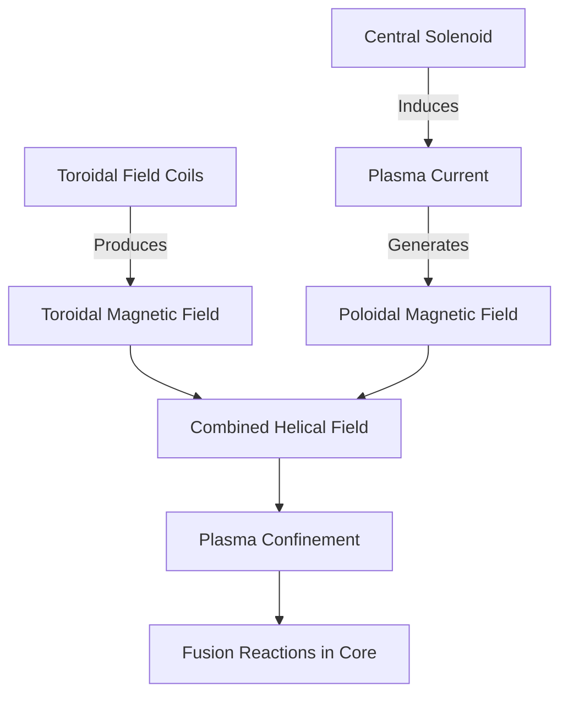

## Nuclear Fusion

### Definition and Fundamental Concept

Nuclear fusion is a nuclear reaction in which two or more atomic nuclei combine to form a single heavier nucleus, typically releasing energy in the process. This energy release occurs because the resulting nucleus has a slightly smaller mass than the sum of the initial nuclei, with the mass difference converted to energy according to Einstein's mass-energy equivalence relation:

$$E = \Delta m c^2$$

where $\Delta m$ is the mass defect and $c$ is the speed of light in vacuum ($2.998 \times 10^8 \text{ m/s}$).

Fusion powers stars, including the Sun, and is the subject of intense terrestrial research as a potential source of large-scale, low-carbon electricity generation.

### Nuclear Binding Energy and the Curve of Binding Energy

The feasibility and energy yield of fusion reactions are governed by nuclear binding energy per nucleon. The binding energy $B$ of a nucleus is the energy required to separate it into its constituent protons and neutrons:

$$B = \left[ Zm_p + Nm_n - M(Z,N) \right]c^2$$

where $Z$ is the atomic number, $N$ is the neutron number, $m_p$ and $m_n$ are the proton and neutron rest masses, and $M(Z,N)$ is the actual nuclear mass.

Plotting binding energy per nucleon ($B/A$) against mass number $A$ produces the well-known curve of binding energy. This curve rises steeply for light nuclei, peaks near iron-56 and nickel-62 (approximately 8.8 MeV/nucleon), and gradually decreases for heavier nuclei. Because light nuclei sit on the steep, rising portion of this curve, fusing them into medium-mass nuclei increases the average binding energy per nucleon, releasing the difference as kinetic energy of the products and as radiation.

**Key Points**

- Fusion releases energy only when combining nuclei lighter than iron/nickel.
- The steepness of the curve at low $A$ explains why light-element fusion (e.g., hydrogen isotopes) yields far more energy per unit mass than fission of heavy elements.
- Fusing beyond iron/nickel requires net energy input rather than releasing it — this is why stellar fusion halts (in terms of net energy production) at these elements.

### The Coulomb Barrier and Quantum Tunneling

For two positively charged nuclei to fuse, they must approach closely enough (on the order of $10^{-15}$ m, the range of the strong nuclear force) to allow the strong force to dominate over electrostatic repulsion. The electrostatic (Coulomb) potential energy between two nuclei of charges $Z_1e$ and $Z_2e$ separated by distance $r$ is:

$$V_C(r) = \frac{1}{4\pi\varepsilon_0}\frac{Z_1 Z_2 e^2}{r}$$

Classically, nuclei would need kinetic energies of several MeV to overcome this barrier directly. However, at the temperatures achievable in stellar cores and laboratory plasmas (keV-scale thermal energies), classical physics alone cannot account for observed fusion rates. Quantum mechanical tunneling allows a fraction of particles in the high-energy tail of a thermal (Maxwell-Boltzmann) distribution to penetrate the Coulomb barrier despite having insufficient classical energy to surmount it.

The Gamow factor quantifies this tunneling probability, and combined with the Maxwell-Boltzmann energy distribution, produces the Gamow peak — the narrow energy window in which fusion reactions predominantly occur. The reaction rate depends sensitively on temperature, typically scaling as a high power of $T$ for reactions relevant to stellar interiors.

### Major Fusion Reactions

**Deuterium-Tritium (D-T) Reaction**

The most accessible fusion reaction for terrestrial applications, due to its comparatively large cross-section at achievable temperatures:

$$^2_1\text{H} + \,^3_1\text{H} \rightarrow \,^4_2\text{He} \,(3.5\ \text{MeV}) + \,^1_0\text{n} \,(14.1\ \text{MeV})$$

Total energy released: approximately 17.6 MeV per reaction. The neutron carries roughly 80% of the energy, which is significant for both energy extraction (via neutron capture and heating of a blanket material) and for materials engineering challenges (neutron-induced activation and embrittlement).

**Deuterium-Deuterium (D-D) Reactions**

Two competing branches occur with roughly equal probability:

$$^2_1\text{H} + \,^2_1\text{H} \rightarrow \,^3_1\text{H} \,(1.01\ \text{MeV}) + \,^1_1\text{H} \,(3.02\ \text{MeV})$$

$$^2_1\text{H} + \,^2_1\text{H} \rightarrow \,^3_2\text{He} \,(0.82\ \text{MeV}) + \,^1_0\text{n} \,(2.45\ \text{MeV})$$

**Deuterium-Helium-3 (D-³He) Reaction**

$$^2_1\text{H} + \,^3_2\text{He} \rightarrow \,^4_2\text{He} \,(3.6\ \text{MeV}) + \,^1_1\text{H} \,(14.7\ \text{MeV})$$

This reaction is "aneutronic" (produces no neutrons in the primary reaction), which is attractive for reducing radiation damage and enabling direct energy conversion, though it requires higher ignition temperatures than D-T and helium-3 is scarce on Earth.

**Proton-Proton (p-p) Chain**

The dominant fusion pathway in stars like the Sun, proceeding through several steps:

$$p + p \rightarrow \,^2_1\text{H} + e^+ + \nu_e$$

$$^2_1\text{H} + p \rightarrow \,^3_2\text{He} + \gamma$$

$$^3_2\text{He} + \,^3_2\text{He} \rightarrow \,^4_2\text{He} + 2p$$

The initial step involves a weak-interaction process (a proton converting to a neutron, positron, and neutrino), making it extraordinarily slow — this is why the p-p chain, despite driving the Sun's enormous power output, proceeds at a low reaction rate per unit volume and requires the Sun's immense core density and multi-billion-year timescale.

**CNO Cycle**

In stars more massive than the Sun, carbon, nitrogen, and oxygen act as catalysts for hydrogen fusion into helium, becoming the dominant energy production mechanism at higher core temperatures (above roughly $1.7 \times 10^7$ K).

### Comparison of Principal Fusion Fuel Cycles

| Reaction | Products | Energy Released | Ignition Temperature (approx.) | Neutron Yield |
| --- | --- | --- | --- | --- |
| D-T | He-4 + n | 17.6 MeV | ~4-10 keV (lowest) | High (14.1 MeV n) |
| D-D | T + p / He-3 + n | 3.65-4.03 MeV | Higher than D-T | Moderate |
| D-³He | He-4 + p | 18.3 MeV | Higher still | Very low (aneutronic) |
| p-p chain | He-4 (net) | ~26.7 MeV (net, stellar) | Stellar core conditions | None directly |

*[Inference: Precise ignition temperature values depend on the specific confinement scheme, density, and confinement time assumed (per the Lawson criterion), so figures above should be treated as order-of-magnitude benchmarks rather than fixed constants.]*

### The Lawson Criterion

For a fusion reactor to achieve net energy gain, the plasma must satisfy a combined requirement on density, confinement time, and temperature. The Lawson criterion, in its triple-product form, is commonly expressed as:

$$n T \tau_E \gtrsim \text{constant}$$

where $n$ is the plasma particle density, $T$ is the plasma temperature, and $\tau_E$ is the energy confinement time. For D-T fusion, the required triple product is approximately:

$$n T \tau_E \gtrsim 3 \times 10^{21}\ \text{keV·s/m}^3$$

This criterion underlies the two principal confinement approaches pursued experimentally: magnetic confinement (maximizing $\tau_E$ at modest density) and inertial confinement (maximizing $n$ over very short $\tau_E$).

**Fusion Gain Factor Q**

The ratio of fusion power output to external heating power input:

$$Q = \frac{P_{fusion}}{P_{input}}$$

- $Q = 1$: "breakeven" (scientific breakeven varies in definition — target-plasma vs. total-input conventions differ across experiments)
- $Q \to \infty$: "ignition" (the plasma is self-sustaining via alpha-particle heating alone, external heating no longer required)

### Magnetic Confinement Fusion

Magnetic confinement uses strong magnetic fields to confine hot plasma, exploiting the fact that charged particles gyrate around field lines and can be trapped in closed magnetic geometries, avoiding contact with material walls.

**Tokamak**

The most developed magnetic confinement concept: a toroidal (donut-shaped) chamber in which a combination of external toroidal field coils and an internally induced poloidal field (driven by a plasma current) produces helical field lines that confine the plasma.

Notable examples include JET (Joint European Torus), the ITER project under construction in France, and numerous national experimental devices (e.g., DIII-D, ASDEX Upgrade, KSTAR, EAST). ITER is designed to demonstrate Q ≥ 10, producing significantly more fusion power than the external heating power supplied. *[Unverified: ITER's operational timeline and specific milestone dates are subject to periodic revision by the ITER Organization and should be checked against current project reports.]*

**Stellarator**

An alternative magnetic confinement geometry that uses a complex, non-axisymmetric arrangement of external coils to produce the twisted magnetic field without relying on a driven plasma current. This avoids current-driven instabilities (such as disruptions) inherent to tokamaks but at the cost of substantially more complex coil engineering. The Wendelstein 7-X in Germany is a leading example.

**Key Points**

- Tokamaks currently hold most performance records (e.g., JET's D-T experiments) but require careful disruption avoidance.
- Stellarators offer potentially steadier operation without disruption risk but face harder engineering and optimization challenges.

### Inertial Confinement Fusion (ICF)

Inertial confinement compresses and heats a small fuel pellet (typically a D-T mixture) so rapidly that fusion occurs before the fuel disassembles under its own thermal pressure — the plasma's own inertia provides confinement rather than external fields.

The dominant approach uses powerful laser arrays (or, in some designs, particle beams or X-rays) to ablate the outer surface of a spherical target, driving an inward-directed compression shock (rocket effect) that compresses the fuel to extremely high densities (hundreds of times solid density) and ignites a central hot spot.

The National Ignition Facility (NIF) at Lawrence Livermore National Laboratory achieved fusion ignition in December 2022, producing fusion energy output exceeding the laser energy delivered to the target (though not exceeding the total facility input power draw from the electrical grid, which includes substantial inefficiencies in laser generation). *[Unverified: Subsequent NIF shots and their exact yield figures continue to be reported and refined; specific numerical results should be checked against current National Nuclear Security Administration (NNSA)/LLNL releases.]*

### Stellar Nucleosynthesis Context

Fusion is the fundamental energy source of main-sequence stars and drives stellar nucleosynthesis, the process by which elements are formed within stellar interiors:

1. **Hydrogen burning** (p-p chain or CNO cycle) — dominant in main-sequence stars, producing helium.
2. **Helium burning** (triple-alpha process) — occurs in red giants, fusing helium into carbon via a resonant intermediate beryllium-8 state:

$$^4_2\text{He} + \,^4_2\text{He} \rightarrow \,^8_4\text{Be}$$

$$^8_4\text{Be} + \,^4_2\text{He} \rightarrow \,^{12}_6\text{C} + \gamma$$

3. **Advanced burning stages** (carbon, neon, oxygen, silicon burning) — occur sequentially in massive stars, building up to iron-group elements.
4. Elements heavier than iron are predominantly formed via neutron-capture processes (s-process and r-process) rather than direct fusion, since fusion beyond iron consumes rather than releases energy.

### Illustrative Diagram: Binding Energy Curve Concept (svg_diagram)

<svg xmlns="http://www.w3.org/2000/svg" viewBox="0 0 700 420">
<rect width="700" height="420" fill="#ffffff" />
<text x="350" y="25" font-family="Arial" font-size="16" font-weight="bold" text-anchor="middle" fill="#000000">Binding Energy per Nucleon vs. Mass Number (svg_diagram)</text>

<line x1="70" y1="370" x2="650" y2="370" stroke="#000000" stroke-width="2" />
<line x1="70" y1="370" x2="70" y2="50" stroke="#000000" stroke-width="2" />

<text x="360" y="400" font-family="Arial" font-size="13" text-anchor="middle" fill="`#000000`">Mass Number (A)</text>

<text x="30" y="210" font-family="Arial" font-size="13" text-anchor="middle" fill="`#000000`" transform="rotate(-90 30 210)">Binding Energy/Nucleon (MeV)</text>

<path d="M 80 360 Q 120 200 160 150 Q 220 90 280 75 Q 340 65 400 68 Q 480 75 550 100 Q 600 120 640 150" fill="none" stroke="`#1a5fb4`" stroke-width="3" />

<circle cx="340" cy="66" r="5" fill="#c01c28" />
<text x="340" y="50" font-family="Arial" font-size="12" text-anchor="middle" fill="#c01c28">Fe-56 / Ni-62 (peak)</text>

<text x="150" y="330" font-family="Arial" font-size="12" fill="`#26a269`">Fusion region</text>

<path d="M 100 320 L 200 200" stroke="`#26a269`" stroke-width="1.5" stroke-dasharray="4,3" marker-end="url(#arrowFusion)" />

<text x="480" y="180" font-family="Arial" font-size="12" fill="`#e5a50a`">Fission region</text>

<path d="M 520 190 L 460 120" stroke="`#e5a50a`" stroke-width="1.5" stroke-dasharray="4,3" marker-end="url(#arrowFission)" />

<text x="80" y="385" font-family="Arial" font-size="10" text-anchor="middle" fill="`#000000`">1</text>

<text x="340" y="385" font-family="Arial" font-size="10" text-anchor="middle" fill="`#000000`">56</text>

<text x="640" y="385" font-family="Arial" font-size="10" text-anchor="middle" fill="`#000000`">238</text>

</svg>

### Worked Example: Energy Release from D-T Fusion

**Example**

Calculate the energy released per D-T fusion reaction using mass defect, given the following approximate atomic mass excesses (in atomic mass units, u):

- $m(^2_1\text{H}) = 2.014102\ \text{u}$
- $m(^3_1\text{H}) = 3.016049\ \text{u}$
- $m(^4_2\text{He}) = 4.002602\ \text{u}$
- $m(^1_0\text{n}) = 1.008665\ \text{u}$

**Step 1** — Sum reactant masses:

$$m_{reactants} = 2.014102 + 3.016049 = 5.030151\ \text{u}$$

**Step 2** — Sum product masses:

$$m_{products} = 4.002602 + 1.008665 = 5.011267\ \text{u}$$

**Step 3** — Compute mass defect:

$$\Delta m = 5.030151 - 5.011267 = 0.018884\ \text{u}$$

**Step 4** — Convert to energy using $1\ \text{u} = 931.494\ \text{MeV}/c^2$:

$$E = 0.018884 \times 931.494\ \text{MeV} \approx 17.59\ \text{MeV}$$

**Output**

This closely matches the commonly cited value of approximately 17.6 MeV for the D-T reaction, consistent with the earlier stated energy partition between the alpha particle (3.5 MeV) and neutron (14.1 MeV).

### Engineering and Materials Challenges

- **Neutron activation**: High-energy 14.1 MeV neutrons from D-T reactions activate reactor structural materials, requiring careful material selection (e.g., low-activation steels) and generating some radioactive waste, though generally shorter-lived and less severe than fission waste.
- **Tritium breeding**: Tritium is not naturally abundant and must be bred in situ, typically via neutron capture on lithium in a surrounding "breeding blanket":

  $$^6_3\text{Li} + n \rightarrow \,^4_2\text{He} + \,^3_1\text{H}$$
- **Plasma-facing components**: Materials such as tungsten must withstand extreme heat flux and particle bombardment at the plasma-wall interface.
- **Superconducting magnets**: Modern tokamak designs (e.g., ITER, SPARC) rely on high-field superconducting magnets, including emerging high-temperature superconductor (HTS) tape technology, to achieve stronger confinement fields in more compact devices. *[Inference: The performance advantages of HTS-based compact tokamaks over conventional low-temperature superconductor designs are actively being validated experimentally and may evolve as more devices report results.]*

**Conclusion**

Nuclear fusion combines light atomic nuclei to release energy governed by the mass-energy relationship and the curve of binding energy, with quantum tunneling enabling reactions at thermal energies far below the classical Coulomb barrier. D-T fusion remains the most experimentally accessible reaction due to its lower ignition temperature, while alternative fuel cycles offer trade-offs in neutron production and required temperatures. Both magnetic confinement (tokamaks, stellarators) and inertial confinement (laser-driven ICF) approaches have demonstrated significant technical progress, with the Lawson criterion and fusion gain factor Q serving as the central benchmarks for reactor viability. Fusion also underlies stellar energy production and nucleosynthesis, connecting terrestrial energy research to fundamental astrophysical processes.

**Related Topics**

- Plasma physics and magnetohydrodynamics (MHD) instabilities
- Tokamak disruption physics and mitigation techniques
- Tritium fuel cycle and breeding blanket design
- Nuclear fission (for contrast in binding energy and mass-energy release)
- Stellar nucleosynthesis and the s-process/r-process
- Superconducting magnet technology (HTS tapes, REBCO conductors)
- ITER project design and international collaboration structure
- Laser-plasma interaction physics in inertial confinement fusion
- Neutron transport and radiation damage in reactor materials
- Alternative confinement concepts (field-reversed configurations, magnetized target fusion)