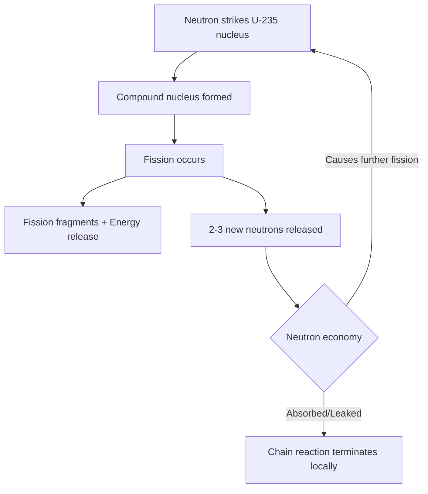

## Applications of Nuclear Physics

### Overview

Nuclear physics principles — radioactive decay, nuclear reactions, fission, fusion, and nuclear structure — underpin a wide range of technologies spanning energy production, medicine, industry, agriculture, security, and scientific research. This section surveys the major application domains, the underlying physical mechanisms, and representative technical implementations.

### Nuclear Power Generation

**Fission Reactors**

Commercial nuclear power plants exploit induced fission of heavy nuclei (primarily $^{235}_{92}\text{U}$ or $^{239}_{94}\text{Pu}$) to generate heat, which drives conventional steam turbine-generator systems.

$$^{235}_{92}\text{U} + \,^1_0\text{n} \rightarrow \text{fission fragments} + 2\text{-}3\,^1_0\text{n} + \sim 200\ \text{MeV}$$

Reactor designs vary by moderator and coolant choice:

| Reactor Type | Moderator | Coolant | Notable Feature |
| --- | --- | --- | --- |
| PWR (Pressurized Water Reactor) | Light water | Light water (pressurized) | Most widely deployed globally |
| BWR (Boiling Water Reactor) | Light water | Light water (boiling) | Steam generated directly in core |
| CANDU (Heavy Water Reactor) | Heavy water | Heavy water | Uses natural (unenriched) uranium |
| Fast Breeder Reactor | None (fast neutron spectrum) | Liquid sodium (typical) | Can breed fissile material from $^{238}\text{U}$ |
| Gas-Cooled Reactor (e.g., AGR) | Graphite | CO₂ gas | Higher thermal efficiency |

**Key Points**

- Control rods (containing neutron-absorbing materials such as boron or cadmium) regulate the chain reaction by adjusting neutron population.
- Criticality (k = 1) denotes a self-sustaining chain reaction; $k > 1$ is supercritical, $k < 1$ is subcritical.
- Delayed neutrons (a small fraction of fission neutrons emitted with a time delay from precursor decay) are essential for practical reactor control, since they slow the effective response time enough for mechanical control systems to act.

**Reactor Chain Reaction Diagram**

**Advanced and Next-Generation Reactor Concepts**

- **Small Modular Reactors (SMRs)**: Factory-fabricated, lower-power-output reactor designs (typically under 300 MWe) intended to reduce construction costs and enable modular deployment. *[Inference: Commercial deployment timelines and cost competitiveness of SMRs remain under active development and vary significantly by vendor and regulatory jurisdiction.]*
- **Generation IV reactor concepts**: Includes molten salt reactors, sodium-cooled fast reactors, and very-high-temperature gas reactors, targeting improved safety margins, fuel utilization, and waste characteristics.

### Nuclear Medicine

**Diagnostic Imaging**

- **Positron Emission Tomography (PET)**: Uses positron-emitting radionuclides (e.g., $^{18}\text{F}$ in fluorodeoxyglucose) that undergo $\beta^+$ decay. The emitted positron annihilates with an electron, producing two 511 keV gamma photons emitted at approximately 180° apart, detected in coincidence to reconstruct metabolic activity maps.

$$^{18}_9\text{F} \rightarrow \,^{18}_8\text{O} + \beta^+ + \nu_e$$

- **Single Photon Emission Computed Tomography (SPECT)**: Uses gamma-emitting radionuclides (commonly $^{99m}\text{Tc}$, a metastable isotope) detected directly via gamma cameras with collimation for spatial localization.
- **Technetium-99m generator**: Produced from the decay of $^{99}\text{Mo}$ (molybdenum-99), commonly supplied via a "moly cow" generator system in hospitals, exploiting the ~6-hour half-life of $^{99m}\text{Tc}$ for same-day clinical use.

**Therapeutic Applications**

- **External beam radiotherapy**: Uses high-energy photon or particle beams (linear accelerators producing MeV-range X-rays, or increasingly, proton and carbon-ion beams) to deliver ionizing radiation to tumor tissue while sparing surrounding healthy tissue.
- **Proton therapy**: Exploits the Bragg peak — the characteristic sharp rise in energy deposition near the end of a charged particle's range in matter — to concentrate dose at a controlled depth while minimizing exit dose beyond the target.
- **Brachytherapy**: Direct implantation of sealed radioactive sources (e.g., $^{192}\text{Ir}$, $^{125}\text{I}$) into or near tumor tissue for localized dose delivery.
- **Radioimmunotherapy and targeted radionuclide therapy**: Radioisotopes (e.g., $^{177}\text{Lu}$, $^{131}\text{I}$) attached to biologically targeting molecules for systemic delivery to specific tissue types (e.g., thyroid tissue for $^{131}\text{I}$).

**Bragg Peak Illustration (svg_diagram)**

<svg xmlns="http://www.w3.org/2000/svg" viewBox="0 0 650 350">
<rect width="650" height="350" fill="#ffffff" />
<text x="325" y="25" font-family="Arial" font-size="16" font-weight="bold" text-anchor="middle" fill="#000000">Dose Deposition vs. Depth: Photons vs. Protons (svg_diagram)</text>
<line x1="70" y1="300" x2="600" y2="300" stroke="#000000" stroke-width="2" />
<line x1="70" y1="300" x2="70" y2="50" stroke="#000000" stroke-width="2" />

<text x="335" y="330" font-family="Arial" font-size="13" text-anchor="middle" fill="`#000000`">Depth in Tissue</text>

<text x="30" y="175" font-family="Arial" font-size="13" text-anchor="middle" fill="`#000000`" transform="rotate(-90 30 175)">Relative Dose</text>

<path d="M 90 200 Q 150 140 200 150 Q 350 180 550 260" fill="none" stroke="#1a5fb4" stroke-width="3" />
<text x="480" y="240" font-family="Arial" font-size="12" fill="#1a5fb4">Photon beam</text>

<path d="M 90 280 Q 250 270 380 240 Q 420 100 440 90 Q 460 150 480 290" fill="none" stroke="#c01c28" stroke-width="3" />
<text x="440" y="75" font-family="Arial" font-size="12" fill="#c01c28" text-anchor="middle">Bragg Peak</text>
<text x="180" y="300" font-family="Arial" font-size="12" fill="#c01c28">Proton beam</text>
</svg>

### Industrial Applications

- **Radiography (Non-Destructive Testing)**: Gamma sources (e.g., $^{60}\text{Co}$, $^{192}\text{Ir}$) or X-ray generators used to inspect welds, castings, and structural components for internal defects without disassembly.
- **Thickness and density gauging**: Beta or gamma attenuation measurements provide real-time, non-contact monitoring of sheet material thickness (e.g., in steel and paper manufacturing) based on the Beer-Lambert-type attenuation law:

$$I = I_0 e^{-\mu x}$$

where $I_0$ is incident intensity, $\mu$ is the linear attenuation coefficient, and $x$ is material thickness.

- **Radiation sterilization**: Gamma irradiation (typically $^{60}\text{Co}$ sources) or electron beam processing is used to sterilize medical equipment, pharmaceuticals, and food products by damaging microbial DNA.
- **Well logging**: Nuclear tools (neutron and gamma-ray sources/detectors) lowered into boreholes assess rock porosity, density, and hydrocarbon content in oil and gas exploration.
- **Ion implantation**: Controlled introduction of dopant ions into semiconductor substrates for integrated circuit fabrication, relying on precise control of ion energy and nuclear stopping power in the target material.

### Radiometric Dating

**Radiocarbon Dating**

Exploits the known half-life of $^{14}\text{C}$ (approximately 5,730 years) formed continuously in the upper atmosphere via cosmic ray interactions with nitrogen, and incorporated into living organisms through the carbon cycle. After death, $^{14}\text{C}$ decays without replenishment, allowing age estimation via:

$$N(t) = N_0 e^{-\lambda t}, \quad \lambda = \frac{\ln 2}{t_{1/2}}$$

Effective for dating organic material up to roughly 50,000 years old, beyond which remaining $^{14}\text{C}$ becomes too sparse for reliable measurement.

**Other Geochronological Methods**

| Method | Parent Isotope | Half-Life | Typical Application |
| --- | --- | --- | --- |
| Potassium-Argon | $^{40}\text{K}$ | 1.25 billion years | Volcanic rock dating |
| Uranium-Lead | $^{238}\text{U}$ | 4.47 billion years | Oldest rocks, zircon crystals |
| Rubidium-Strontium | $^{87}\text{Rb}$ | 48.8 billion years | Ancient geological formations |

### Agricultural Applications

- **Food irradiation**: Similar mechanism to industrial sterilization, applied to extend shelf life and reduce pathogen load in food products, subject to regulatory dose limits.
- **Sterile Insect Technique (SIT)**: Mass-rearing and gamma or X-ray sterilization of male insects (e.g., for pest control of fruit flies, screwworms) released into wild populations to suppress reproduction without chemical pesticides.
- **Isotopic tracers in plant physiology**: Radioactive tracers (e.g., $^{32}\text{P}$, $^{15}\text{N}$) used to study nutrient uptake pathways and fertilizer efficiency.

### Security and Non-Proliferation Applications

- **Radiation portal monitors**: Deployed at border crossings and ports to detect illicit transport of radioactive or nuclear materials using gamma and neutron detection.
- **Nuclear forensics**: Isotopic analysis of intercepted nuclear materials to determine origin, production history, and intended use, supporting non-proliferation investigations.
- **Safeguards and verification**: International Atomic Energy Agency (IAEA) inspection regimes rely on nuclear measurement techniques (e.g., gamma spectroscopy, neutron coincidence counting) to verify declared nuclear material inventories.

### Scientific Research Applications

- **Particle accelerators**: Cyclotrons and linear accelerators used both for fundamental nuclear/particle physics research and for producing medical radioisotopes.
- **Neutron scattering facilities**: Research reactors and spallation neutron sources (e.g., using proton beams striking heavy-metal targets to produce neutrons) enable structural and dynamic studies of materials via neutron diffraction and inelastic scattering.
- **Nuclear astrophysics**: Laboratory measurement of nuclear reaction cross-sections at astrophysically relevant energies informs models of stellar nucleosynthesis and stellar evolution.

### Radiation Protection Considerations Across Applications

**Key Points**

- The ALARA principle (As Low As Reasonably Achievable) governs occupational and public radiation exposure management across all application domains.
- Dose quantities: absorbed dose (gray, Gy), equivalent dose (sievert, Sv, accounting for radiation weighting factor), and effective dose (Sv, accounting for tissue weighting factors) are used to assess biological risk.
- Shielding design depends on radiation type: alpha particles require minimal shielding (stopped by skin/paper), beta particles require moderate shielding (e.g., plastic, aluminum), while gamma rays and neutrons require dense/high-Z materials (lead, concrete) or hydrogenous materials (for neutron moderation and capture), respectively.

### Worked Example: Radioactive Decay in a Medical Isotope Context

**Example**

A hospital receives a $^{99m}\text{Tc}$ generator with an initial activity of 10 GBq (gigabecquerel). Given the half-life of $^{99m}\text{Tc}$ is 6.01 hours, calculate the remaining activity after 24 hours.

**Step 1** — Determine the decay constant:

$$\lambda = \frac{\ln 2}{t_{1/2}} = \frac{0.693}{6.01\ \text{h}} \approx 0.1153\ \text{h}^{-1}$$

**Step 2** — Apply the exponential decay law:

$$A(t) = A_0 e^{-\lambda t}$$

$$A(24) = 10 \times e^{-0.1153 \times 24}$$

$$A(24) = 10 \times e^{-2.767}$$

$$A(24) \approx 10 \times 0.0629$$

**Output**

$$A(24) \approx 0.63\ \text{GBq}$$

After 24 hours, the activity has decreased to approximately 6.3% of its initial value, illustrating why $^{99m}\text{Tc}$-based radiopharmaceuticals must be prepared and administered on a tight clinical schedule relative to generator delivery.

**Conclusion**

Nuclear physics applications extend far beyond power generation, encompassing diagnostic and therapeutic medicine, industrial quality control and processing, precise geochronology, agricultural pest management, international security verification, and fundamental scientific research. Each application exploits specific nuclear phenomena — controlled fission chain reactions, radioactive decay kinetics, particle-matter interactions, or nuclear reaction cross-sections — tailored to the practical requirements of the domain, while radiation protection principles provide a common safety framework across all of them.

**Related Topics**

- Nuclear reactor physics and reactor kinetics
- Radiation dosimetry and biological effects of ionizing radiation
- Radiopharmaceutical chemistry and production
- Particle accelerator design and beam physics
- Nuclear waste management and long-term storage
- IAEA safeguards and international non-proliferation frameworks
- Neutron activation analysis
- Health physics and occupational radiation safety standards