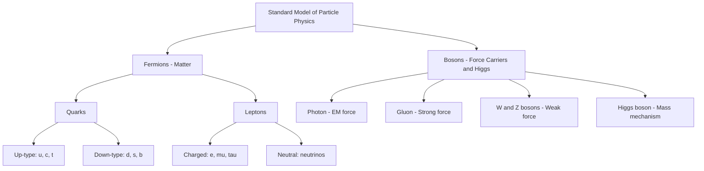

## Fundamental Particles and Forces

### Overview

The Standard Model of particle physics classifies all known fundamental (non-composite) particles into two broad categories — fermions (matter constituents) and bosons (force carriers and the Higgs field quantum) — and describes their interactions through three of the four known fundamental forces: electromagnetic, weak, and strong. Gravity is not incorporated into the Standard Model and remains described classically by general relativity at the scales currently accessible to experiment.

### Classification of Fundamental Particles

**Fermions (Spin-1/2 Matter Particles)**

Fermions obey the Pauli exclusion principle and are subdivided into quarks and leptons, each organized into three "generations" of increasing mass.

| Generation | Quarks | Leptons |
| --- | --- | --- |
| 1st | up (u), down (d) | electron (e⁻), electron neutrino ($\nu_e$) |
| 2nd | charm (c), strange (s) | muon (μ⁻), muon neutrino ($\nu_\mu$) |
| 3rd | top (t), bottom (b) | tau (τ⁻), tau neutrino ($\nu_\tau$) |

**Key Points**

- Ordinary matter (atoms) is built almost entirely from first-generation fermions: up and down quarks (forming protons and neutrons) and electrons.
- Second- and third-generation particles are unstable and decay rapidly into first-generation particles, appearing primarily in high-energy cosmic ray interactions or particle accelerator collisions.
- Each fermion has a corresponding antiparticle with identical mass but opposite charge and other quantum numbers (e.g., positron $e^+$ as the antiparticle of the electron).

**Quark Properties**

| Quark | Charge (e) | Approximate Mass |
| --- | --- | --- |
| up (u) | +2/3 | ~2.2 MeV/c² |
| down (d) | −1/3 | ~4.7 MeV/c² |
| charm (c) | +2/3 | ~1.27 GeV/c² |
| strange (s) | −1/3 | ~95 MeV/c² |
| top (t) | +2/3 | ~173 GeV/c² |
| bottom (b) | −1/3 | ~4.18 GeV/c² |

*[Inference: Quark mass values are scheme-dependent (e.g., $\overline{\text{MS}}$ vs. pole mass conventions) since quarks are never observed as free particles due to color confinement; cited figures represent commonly quoted Particle Data Group averages and carry associated theoretical/experimental uncertainties.]*

Quarks carry fractional electric charge and an additional quantum number called color charge (red, green, or blue), which is the source charge for the strong force. Quarks are never observed in isolation — a phenomenon known as color confinement — and instead combine into composite particles called hadrons:

- **Baryons**: three-quark combinations (e.g., proton = uud, neutron = udd)
- **Mesons**: quark-antiquark pairs (e.g., pion = $u\bar{d}$)

**Leptons**

Unlike quarks, charged leptons (electron, muon, tau) can exist as free particles and carry integer electric charge (−1 for the charged leptons). Neutrinos are electrically neutral, interact only via the weak force (and gravity), and were long assumed massless in the original Standard Model, though neutrino oscillation experiments have established that neutrinos possess small but nonzero masses — a phenomenon requiring physics beyond the minimal Standard Model framework.

### Bosons (Force Carriers and the Higgs)

Bosons have integer spin and do not obey the Pauli exclusion principle. In the Standard Model, force carriers are gauge bosons, each associated with a specific fundamental interaction, plus the Higgs boson, which is not a force carrier but the quantum excitation of the Higgs field responsible for the mechanism by which fundamental particles acquire mass.

| Boson | Force Mediated | Spin | Mass | Electric Charge |
| --- | --- | --- | --- | --- |
| Photon (γ) | Electromagnetic | 1 | 0 | 0 |
| W⁺, W⁻ | Weak | 1 | ~80.4 GeV/c² | ±1 |
| Z⁰ | Weak | 1 | ~91.2 GeV/c² | 0 |
| Gluon (g) | Strong | 1 | 0 | 0 |
| Higgs boson (H) | — (mass mechanism) | 0 | ~125.25 GeV/c² | 0 |

*[Unverified: The precise current world-average Higgs boson mass value is periodically refined through combined ATLAS/CMS analyses; the figure above reflects commonly cited post-discovery measurements and should be checked against current Particle Data Group listings for the latest precision value.]*

### The Four Fundamental Forces

**Comparative Overview**

| Force | Relative Strength (approx.) | Range | Carrier | Acts On |
| --- | --- | --- | --- | --- |
| Strong | 1 | ~$10^{-15}$ m (nuclear scale) | Gluon | Quarks, gluons |
| Electromagnetic | $10^{-2}$ | Infinite | Photon | Electrically charged particles |
| Weak | $10^{-6}$ | ~$10^{-18}$ m | W⁺, W⁻, Z⁰ | All fermions |
| Gravitational | $10^{-38}$ | Infinite | Graviton (hypothesized, unobserved) | All particles with mass-energy |

**Key Points**

- Relative strength comparisons are typically quoted at a reference energy/distance scale (e.g., nucleon separation), and the coupling strengths of each force actually vary with energy scale due to renormalization group running.
- Gravity is dramatically weaker than the other three forces at particle physics scales, which is why it is negligible in particle interactions despite dominating at macroscopic/astronomical scales.

**Strong Force and Quantum Chromodynamics (QCD)**

The strong force is described by Quantum Chromodynamics, a non-Abelian gauge theory based on SU(3) color symmetry. Unlike the electromagnetic force, the strong force exhibits:

- **Color confinement**: Isolated quarks and gluons cannot be observed; only color-neutral (colorless) combinations exist as free particles.
- **Asymptotic freedom**: The strong coupling constant decreases at short distances/high energies, meaning quarks behave nearly as free particles inside hadrons at very high momentum transfer, but the effective force grows stronger as quarks are pulled apart — analogous to a stretching elastic band.

**Weak Force and Electroweak Unification**

The weak force is responsible for processes such as beta decay and is mediated by the massive W and Z bosons — their large mass (relative to the massless photon) accounts for the weak force's short range, following from the Yukawa-type relationship between mediator mass and interaction range:

$$r \sim \frac{\hbar}{m_W c}$$

The electroweak theory (developed by Glashow, Weinberg, and Salam) unifies the electromagnetic and weak forces into a single SU(2)×U(1) gauge framework, which spontaneously breaks into the separate electromagnetic and weak forces observed at low energies via the Higgs mechanism.

**Electromagnetic Force**

Described by Quantum Electrodynamics (QED), mediated by the massless photon, and responsible for interactions between all electrically charged particles. QED is the most precisely tested theory in physics, with predictions (e.g., the electron's anomalous magnetic moment) verified to extraordinary precision.

**Gravitational Force**

Not incorporated into the Standard Model. Described classically by Einstein's general relativity as the curvature of spacetime induced by mass-energy. A quantum theory of gravity (potentially involving a hypothesized massless, spin-2 graviton) remains an open area of theoretical research, with candidate frameworks including string theory and loop quantum gravity.

### The Higgs Mechanism

The Higgs field permeates all of space with a nonzero vacuum expectation value. Fundamental particles acquire mass through their interaction (Yukawa coupling) with this field — particles that couple more strongly to the Higgs field acquire greater mass. The Higgs boson itself is the quantized excitation of fluctuations in this field, discovered experimentally at CERN's Large Hadron Collider in 2012 through observation of its decay products (e.g., $H \rightarrow \gamma\gamma$ and $H \rightarrow ZZ^* \rightarrow 4\ell$).

**Key Points**

- The Higgs mechanism explains why W and Z bosons are massive while the photon remains massless, via spontaneous electroweak symmetry breaking.
- The Higgs mechanism does not explain neutrino mass generation within the minimal Standard Model, since right-handed neutrinos (needed for the standard Yukawa coupling mechanism) were not originally included — this is one of several open questions motivating extensions to the Standard Model.

### Standard Model Structure Diagram

### Gauge Symmetry Structure

The Standard Model is a gauge theory built on the symmetry group:

$$SU(3)_C \times SU(2)_L \times U(1)_Y$$

where $SU(3)_C$ governs the strong interaction (color), and $SU(2)_L \times U(1)_Y$ governs the unified electroweak interaction before spontaneous symmetry breaking reduces it to the observed $U(1)_{EM}$ (electromagnetism) at low energies, with the weak interaction becoming short-ranged due to the Higgs mechanism.

### Composite Particles: Hadrons

**Baryons** (three-quark states, half-integer spin, fermions):

- Proton (uud): stable, charge +1
- Neutron (udd): unstable when free (mean lifetime ~880 s), charge 0

**Mesons** (quark-antiquark states, integer spin, bosons):

- Pion ($\pi^+ = u\bar{d}$, $\pi^- = d\bar{u}$, $\pi^0$): lightest mesons, mediate the residual strong force between nucleons in earlier models
- Kaon, D meson, B meson: heavier mesons containing strange, charm, or bottom quarks respectively

### Conservation Laws in Particle Interactions

**Key Points**

- **Electric charge**: Always conserved in all known interactions.
- **Baryon number**: Conserved in the Standard Model (proton stability is a direct consequence); no confirmed observation of proton decay has been made despite extensive experimental searches.
- **Lepton number**: Conserved separately for each generation in the minimal Standard Model, though neutrino oscillations demonstrate that individual lepton flavor is not strictly conserved (total lepton number conservation remains intact in standard oscillation phenomenology).
- **Color charge**: Always conserved; free particles must be color-neutral.
- **Parity, charge conjugation, and time reversal (P, C, T)**: Individually conserved by the strong and electromagnetic interactions but violated by the weak interaction (a landmark discovery via the Wu experiment on cobalt-60 beta decay, and subsequently in kaon and B-meson systems for CP violation).

### Worked Example: Beta Decay as a Weak Interaction Process

**Example**

Analyze neutron beta decay in terms of the underlying weak interaction at the quark level.

**Step 1** — Write the nucleon-level reaction:

$$n \rightarrow p + e^- + \bar{\nu}_e$$

**Step 2** — Express in terms of constituent quarks (neutron = udd, proton = uud):

$$d \rightarrow u + e^- + \bar{\nu}_e$$

**Step 3** — Identify the underlying process: a down quark converts to an up quark via emission of a virtual $W^-$ boson, which subsequently decays:

$$d \rightarrow u + W^-, \quad W^- \rightarrow e^- + \bar{\nu}_e$$

**Output**

This illustrates that beta decay is fundamentally a quark-flavor-changing weak process mediated by the massive W boson, rather than a "direct" four-particle contact interaction — the W boson's large mass (~80.4 GeV/c²) relative to the ~1.29 MeV energy release in free neutron decay means the W is produced highly virtually (off-shell), which is precisely why the weak interaction is so much slower/weaker at low energies than its intrinsic coupling strength alone would suggest.

### Open Questions Beyond the Standard Model

**Key Points**

- **Neutrino mass origin**: The mechanism generating small but nonzero neutrino masses (e.g., seesaw mechanisms involving heavy right-handed neutrinos) is not fully established experimentally.
- **Dark matter**: No Standard Model particle is confirmed to account for the astrophysically inferred dark matter abundance.
- **Matter-antimatter asymmetry**: The observed dominance of matter over antimatter in the universe requires CP violation beyond what is quantified in the Standard Model's CKM matrix, per most current theoretical assessments. *[Inference: The precise quantitative shortfall and its resolution remain active research topics, so this should be understood as a widely-held theoretical view rather than a settled experimental conclusion.]*
- **Gravity unification**: No experimentally verified quantum theory unifies gravity with the other three forces.
- **Hierarchy problem**: The large discrepancy between the electroweak scale and the Planck scale lacks a confirmed theoretical explanation, motivating proposals such as supersymmetry, though no supersymmetric particles have been experimentally observed to date.

**Conclusion**

The Standard Model organizes all known fundamental matter particles (quarks and leptons across three generations) and describes three of the four fundamental forces (strong, weak, electromagnetic) through gauge boson exchange, with the Higgs mechanism explaining the origin of particle mass via electroweak symmetry breaking. While extraordinarily successful and precisely verified experimentally — most notably through the 2012 discovery of the Higgs boson — the model leaves several fundamental questions unresolved, including neutrino mass generation, dark matter, and the exclusion of gravity, motivating ongoing theoretical and experimental research into physics beyond the Standard Model.

**Related Topics**

- Quantum Chromodynamics and color confinement in detail
- Electroweak symmetry breaking and the Higgs mechanism (mathematical treatment)
- Neutrino oscillations and the PMNS matrix
- CP violation and the CKM matrix
- Supersymmetry and other Beyond-Standard-Model theories
- Particle accelerator detector technology (calorimetry, tracking, particle identification)
- Dark matter candidates and detection experiments
- Grand Unified Theories (GUTs) and force unification at high energy scales