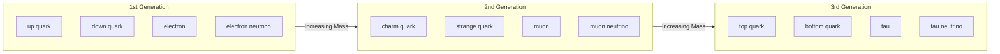

## Quarks and Leptons

### Overview

Quarks and leptons together constitute the fermionic matter content of the Standard Model — the fundamental, spin-1/2 particles from which all observed matter is built (directly, in the case of leptons, or via composite bound states, in the case of quarks). Both are organized into three generations (or "families") of increasing mass, with each generation mirroring the structure of the first but at higher energy scales.

### Quarks

**Fundamental Properties**

Quarks are spin-1/2 fermions carrying fractional electric charge, color charge (the source of the strong interaction), and weak isospin. They are never observed as isolated free particles due to color confinement, appearing instead only within color-neutral composite hadrons.

| Generation | Quark | Symbol | Charge (e) | Approximate Mass | Baryon Number |
| --- | --- | --- | --- | --- | --- |
| 1st | Up | u | +2/3 | ~2.2 MeV/c² | +1/3 |
| 1st | Down | d | −1/3 | ~4.7 MeV/c² | +1/3 |
| 2nd | Charm | c | +2/3 | ~1.27 GeV/c² | +1/3 |
| 2nd | Strange | s | −1/3 | ~95 MeV/c² | +1/3 |
| 3rd | Top | t | +2/3 | ~173 GeV/c² | +1/3 |
| 3rd | Bottom | b | −1/3 | ~4.18 GeV/c² | +1/3 |

*[Inference: Quark masses are inherently scheme-dependent quantities (commonly quoted in either the $\overline{\text{MS}}$ renormalization scheme or as constituent/pole masses) since free quarks cannot be isolated for direct mass measurement; values above reflect commonly cited current-quark mass conventions and carry non-trivial theoretical uncertainty, particularly for the lighter quarks.]*

**Key Points**

- Up-type quarks (u, c, t) carry charge +2/3; down-type quarks (d, s, b) carry charge −1/3.
- Each quark flavor has a corresponding antiquark with opposite charge, color (anticolor), and baryon number.
- The top quark is exceptionally massive — comparable to a gold atom — and decays before it can hadronize (form bound states), making it the only quark studied experimentally as a quasi-free particle via its decay products.

**Color Charge**

Each quark flavor carries one of three color charges (conventionally labeled red, green, blue), analogous to but distinct from electric charge, serving as the source charge for the strong force described by Quantum Chromodynamics (QCD). Antiquarks carry corresponding anticolors. Only color-singlet (colorless) combinations exist as observable free particles:

- **Baryons**: one quark of each color (red + green + blue = colorless)
- **Mesons**: a color paired with its corresponding anticolor

**Quark Mixing and the CKM Matrix**

Quark mass eigenstates (the states with definite mass) are not identical to the weak interaction eigenstates (the states that participate in charged-current weak decays). The relationship between them is described by the Cabibbo-Kobayashi-Maskawa (CKM) matrix:

$$\begin{pmatrix} d' \\ s' \\ b' \end{pmatrix} = \begin{pmatrix} V_{ud} & V_{us} & V_{ub} \\ V_{cd} & V_{cs} & V_{cb} \\ V_{td} & V_{ts} & V_{tb} \end{pmatrix} \begin{pmatrix} d \\ s \\ b \end{pmatrix}$$

This mixing allows weak decays to change quark flavor across generations (e.g., $b \rightarrow c$ transitions in B-meson decays) and is the source of CP violation within the Standard Model, since the CKM matrix contains an irreducible complex phase when three or more generations are present.

### Leptons

**Fundamental Properties**

Leptons are spin-1/2 fermions that do not carry color charge and therefore do not participate in the strong interaction. They are divided into charged leptons (which interact electromagnetically and weakly) and neutrinos (which interact only weakly, and gravitationally).

| Generation | Charged Lepton | Charge (e) | Mass | Neutrino | Neutrino Mass |
| --- | --- | --- | --- | --- | --- |
| 1st | Electron (e⁻) | −1 | 0.511 MeV/c² | Electron neutrino ($\nu_e$) | < ~1 eV/c² (upper bound) |
| 2nd | Muon (μ⁻) | −1 | 105.7 MeV/c² | Muon neutrino ($\nu_\mu$) | Small, nonzero |
| 3rd | Tau (τ⁻) | −1 | 1777 MeV/c² | Tau neutrino ($\nu_\tau$) | Small, nonzero |

*[Inference: Absolute neutrino mass values remain unmeasured directly; oscillation experiments constrain mass-squared differences between flavors, while direct kinematic measurements (e.g., beta decay endpoint experiments) and cosmological observations provide separate upper bounds. The exact absolute mass scale and whether neutrinos follow normal or inverted mass ordering remain open experimental questions.]*

**Key Points**

- Unlike quarks, charged leptons can exist as free, stable (electron) or metastable (muon, tau) particles without confinement.
- Only the electron is stable; the muon (mean lifetime ~2.2 μs) and tau (mean lifetime ~2.9 × 10⁻¹³ s) decay via the weak interaction.
- Lepton flavor is conserved in charged-current weak interactions in the minimal Standard Model, though neutrino oscillations demonstrate that individual neutrino flavor states are not mass eigenstates, allowing flavor to change over propagation distance.

**Neutrino Oscillations**

Neutrinos are produced and detected in definite flavor states ($\nu_e$, $\nu_\mu$, $\nu_\tau$), but propagate as superpositions of mass eigenstates ($\nu_1$, $\nu_2$, $\nu_3$). This mismatch, analogous to CKM quark mixing, is described by the Pontecorvo-Maki-Nakagawa-Sakata (PMNS) matrix and leads to oscillation probabilities that depend on propagation distance $L$ and neutrino energy $E$:

$$P(\nu_\alpha \rightarrow \nu_\beta) \propto \sin^2\left(1.27\, \Delta m^2_{ij}\, \frac{L\,[\text{km}]}{E\,[\text{GeV}]}\right)$$

where $\Delta m^2_{ij}$ is the mass-squared difference between mass eigenstates $i$ and $j$ (in eV²). The experimental observation of neutrino oscillations (e.g., Super-Kamiokande, SNO) definitively established that neutrinos have nonzero mass, a result recognized by the 2015 Nobel Prize in Physics.

### Quark and Lepton Generation Structure Diagram

### Composite States Formed from Quarks

Since quarks cannot exist freely, they combine into hadrons, classified by quark content:

**Baryons (qqq)**

$$p = uud, \quad n = udd$$

**Mesons (q$\bar{q}$)**

$$\pi^+ = u\bar{d}, \quad \pi^- = d\bar{u}, \quad K^+ = u\bar{s}$$

**Exotic hadrons**: More recently confirmed states including tetraquarks (qq$\bar{q}\bar{q}$) and pentaquarks (qqqq$\bar{q}$) have been observed experimentally, notably by the LHCb collaboration, expanding the classification of allowed color-singlet combinations beyond the traditional baryon/meson picture. *[Unverified: The precise internal structure of these exotic states — whether they are genuinely compact multiquark bound states or hadronic molecules (loosely bound combinations of conventional hadrons) — remains an active area of theoretical and experimental investigation.]*

### Worked Example: Verifying Baryon Charge from Quark Content

**Example**

Verify that the proton's electric charge follows correctly from its quark composition (uud).

**Step 1** — Identify individual quark charges:

$$Q(u) = +\frac{2}{3}e, \quad Q(d) = -\frac{1}{3}e$$

**Step 2** — Sum the charges for composition uud:

$$Q(p) = Q(u) + Q(u) + Q(d) = \frac{2}{3}e + \frac{2}{3}e - \frac{1}{3}e$$

**Step 3** — Compute the total:

$$Q(p) = \frac{2+2-1}{3}e = \frac{3}{3}e = 1e$$

**Output**

$$Q(p) = +1e$$

This confirms the well-established proton charge of $+1e$ and illustrates why baryon charge conservation follows directly from the quark model — a useful cross-check technique applicable to any hadron given its quark content.

**Example (Neutron)**

For the neutron (udd):

$$Q(n) = \frac{2}{3}e - \frac{1}{3}e - \frac{1}{3}e = \frac{2-1-1}{3}e = 0$$

$$Q(n) = 0$$

This matches the neutron's observed electrical neutrality, consistent with its role in nuclear structure alongside protons.

### Distinguishing Quarks from Leptons: Summary Comparison

| Property | Quarks | Leptons |
| --- | --- | --- |
| Color charge | Yes | No |
| Strong interaction | Yes | No |
| Electric charge | Fractional (±1/3, ±2/3) | Integer (0 or ±1) |
| Free-particle existence | No (confined) | Yes (charged leptons); neutrinos interact only weakly |
| Number of flavors | 6 | 6 (3 charged + 3 neutrino) |
| Antiparticles | Yes (antiquarks) | Yes (antileptons) |

**Conclusion**

Quarks and leptons form the complete set of matter fermions in the Standard Model, organized into three mass-hierarchical generations. Quarks, distinguished by fractional charge and color confinement, combine into the hadrons (baryons and mesons, and more exotic multiquark states) that constitute nuclear matter, with their flavor-changing weak transitions governed by the CKM mixing matrix. Leptons, lacking color charge, include the electron and its heavier counterparts alongside three flavors of nearly massless but non-zero-mass neutrinos, whose flavor oscillations — governed by the analogous PMNS matrix — provided definitive evidence that the Standard Model's original massless-neutrino assumption requires extension.

**Related Topics**

- Quantum Chromodynamics and quark confinement mechanisms
- CKM matrix and CP violation in quark mixing
- PMNS matrix and neutrino mass ordering (normal vs. inverted hierarchy)
- Neutrinoless double beta decay and the Majorana vs. Dirac neutrino question
- Exotic hadron spectroscopy (tetraquarks, pentaquarks)
- Deep inelastic scattering and experimental probes of quark structure
- Lepton universality tests in weak decays
- Seesaw mechanisms for neutrino mass generation