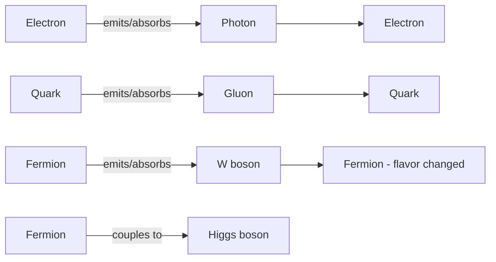

## The Standard Model of Particle Physics

### Overview

The Standard Model (SM) is the quantum field theory that describes three of the four known fundamental forces — electromagnetic, weak, and strong — and classifies all known elementary particles. Developed through the mid-to-late 20th century and culminating experimentally in the 2012 discovery of the Higgs boson, it remains the most rigorously tested theoretical framework in physics, though it is understood to be incomplete, since it excludes gravity and does not account for dark matter, dark energy, or the observed neutrino mass mechanism.

### Theoretical Foundation: Quantum Field Theory and Gauge Symmetry

The Standard Model is formulated as a relativistic quantum field theory in which particles are excitations of underlying quantum fields, and interactions arise from local gauge symmetries. Its full symmetry group is:

$$SU(3)_C \times SU(2)_L \times U(1)_Y$$

- $SU(3)_C$: the color gauge symmetry underlying Quantum Chromodynamics (QCD), governing the strong interaction.
- $SU(2)_L \times U(1)_Y$: the electroweak gauge symmetry, which spontaneously breaks to $U(1)_{EM}$ (ordinary electromagnetism) at low energies via the Higgs mechanism.

**Key Points**

- "Gauge symmetry" means the theory's equations remain invariant under local (spacetime-dependent) transformations of the relevant symmetry group, and this invariance requirement mathematically necessitates the existence of force-carrying gauge boson fields.
- The subscript $L$ on $SU(2)_L$ indicates that the weak interaction only couples to left-handed chirality states of fermions (and right-handed antifermions), a manifestation of parity violation in the weak sector.

### Particle Content Summary

**Fermions (Matter, spin-1/2)**

| Type | Generation 1 | Generation 2 | Generation 3 |
| --- | --- | --- | --- |
| Up-type quarks | up (u) | charm (c) | top (t) |
| Down-type quarks | down (d) | strange (s) | bottom (b) |
| Charged leptons | electron (e) | muon (μ) | tau (τ) |
| Neutrinos | $\nu_e$ | $\nu_\mu$ | $\nu_\tau$ |

**Bosons (Interactions and Mass Mechanism)**

| Boson | Spin | Mass | Role |
| --- | --- | --- | --- |
| Photon (γ) | 1 | 0 | Mediates electromagnetism |
| Gluon (g), 8 types | 1 | 0 | Mediates strong force |
| W⁺, W⁻ | 1 | ~80.4 GeV/c² | Mediate charged-current weak interaction |
| Z⁰ | 1 | ~91.2 GeV/c² | Mediates neutral-current weak interaction |
| Higgs (H) | 0 | ~125.25 GeV/c² | Field responsible for particle mass generation |

*[Unverified: Precision values for boson masses (particularly the Higgs and W boson masses) are subject to ongoing refinement via combined experimental analyses; cited figures represent commonly referenced post-discovery precision measurements and should be checked against current Particle Data Group averages for the latest values.]*

### The Standard Model Lagrangian: Conceptual Structure

The complete dynamics of the Standard Model are encoded in a single (though highly complex) Lagrangian density, conventionally decomposed into conceptual sectors:

$$\mathcal{L}_{SM} = \mathcal{L}_{gauge} + \mathcal{L}_{fermion} + \mathcal{L}_{Higgs} + \mathcal{L}_{Yukawa}$$

- $\mathcal{L}_{gauge}$: kinetic terms for the gauge boson fields, encoding gluon self-interactions and W/Z/photon dynamics.
- $\mathcal{L}_{fermion}$: kinetic and gauge-interaction terms for quarks and leptons.
- $\mathcal{L}_{Higgs}$: the Higgs field's kinetic term and self-interaction potential, responsible for spontaneous symmetry breaking.
- $\mathcal{L}_{Yukawa}$: coupling terms between fermions and the Higgs field, which generate fermion masses after symmetry breaking.

*[Inference: While this decomposition is standard pedagogically, the full Lagrangian is a single gauge-invariant expression, and the split into "sectors" is a conceptual/organizational convention rather than a physically separable structure.]*

### Electroweak Symmetry Breaking and the Higgs Mechanism

Before symmetry breaking, the electroweak gauge bosons and fermions are massless in the theory (mass terms would violate the gauge symmetry directly). The Higgs field, described by a complex scalar doublet, possesses a potential of the form:

$$V(\phi) = \mu^2 |\phi|^2 + \lambda |\phi|^4$$

For $\mu^2 < 0$, this potential (the characteristic "Mexican hat" or "wine bottle" shape) has a continuum of degenerate minima rather than a single minimum at zero. The field settles into one of these minima, acquiring a nonzero vacuum expectation value (VEV):

$$\langle \phi \rangle = \frac{v}{\sqrt{2}}, \quad v \approx 246\ \text{GeV}$$

This spontaneous symmetry breaking mixes the original $SU(2)_L \times U(1)_Y$ gauge fields into the physical W, Z, and photon states, with the W and Z acquiring mass proportional to $v$ and the gauge coupling constants, while the photon remains massless — reflecting the unbroken $U(1)_{EM}$ subgroup. Fermion masses arise separately through Yukawa couplings to the same Higgs field.

**Higgs Potential Illustration (svg_diagram)**

<svg xmlns="http://www.w3.org/2000/svg" viewBox="0 0 600 400">
<rect width="600" height="400" fill="#ffffff" />
<text x="300" y="25" font-family="Arial" font-size="16" font-weight="bold" text-anchor="middle" fill="#000000">Higgs Potential — "Mexican Hat" Cross-Section (svg_diagram)</text>
<line x1="50" y1="350" x2="550" y2="350" stroke="#000000" stroke-width="2" />
<line x1="300" y1="350" x2="300" y2="50" stroke="#000000" stroke-width="1" stroke-dasharray="3,3" />

<text x="300" y="380" font-family="Arial" font-size="13" text-anchor="middle" fill="`#000000`">Field value (phi)</text>

<text x="30" y="200" font-family="Arial" font-size="13" text-anchor="middle" fill="`#000000`" transform="rotate(-90 30 200)">V(phi)</text>

<path d="M 80 100 Q 150 300 220 310 Q 260 315 300 315 Q 340 315 380 310 Q 450 300 520 100" fill="none" stroke="`#1a5fb4`" stroke-width="3" />

<circle cx="220" cy="310" r="5" fill="#c01c28" />
<circle cx="380" cy="310" r="5" fill="#c01c28" />
<text x="220" y="335" font-family="Arial" font-size="11" text-anchor="middle" fill="#c01c28">-v</text>
<text x="380" y="335" font-family="Arial" font-size="11" text-anchor="middle" fill="#c01c28">+v</text>
<text x="300" y="120" font-family="Arial" font-size="12" text-anchor="middle" fill="#000000">Unstable symmetric point</text>
</svg>

### Interaction Vertices and Feynman Diagram Conventions

The Standard Model's interactions can be represented through Feynman diagrams, graphical representations of terms in the perturbative expansion of scattering amplitudes. Fundamental interaction vertices include:

**Key Points**

- QED vertices always conserve electric charge and involve one photon line meeting two matching fermion lines.
- Weak charged-current vertices (involving W bosons) can change fermion flavor (e.g., converting a down quark to an up quark), which is why the W boson mediates processes like beta decay.
- QCD vertices involve gluon self-coupling terms not present in QED, since gluons themselves carry color charge (unlike the electrically neutral photon) — this self-interaction underlies asymptotic freedom and confinement.

### Renormalization and Running Couplings

The Standard Model is a renormalizable quantum field theory, meaning that ultraviolet divergences arising in loop-level (higher-order) calculations can be systematically absorbed into a finite set of redefined physical parameters (masses, couplings), yielding finite, testable predictions at any order of perturbation theory. A key consequence is that coupling "constants" are not truly constant but run (vary) with the energy scale $Q$ at which they are probed, described by renormalization group equations:

$$\frac{d\alpha_s}{d\ln Q^2} = \beta(\alpha_s)$$

For QCD, the strong coupling $\alpha_s$ decreases at high energy (asymptotic freedom), while for QED, the electromagnetic coupling $\alpha$ increases slightly at higher energy scales due to vacuum polarization screening effects.

### Experimental Validation Milestones

| Discovery | Year | Experiment/Facility |
| --- | --- | --- |
| W and Z bosons | 1983 | UA1/UA2, CERN SPS |
| Top quark | 1995 | CDF/D0, Fermilab Tevatron |
| Tau neutrino (direct observation) | 2000 | DONUT, Fermilab |
| Higgs boson | 2012 | ATLAS/CMS, CERN LHC |

*[Inference: This table lists commonly cited landmark discovery years associated with major collaborating experiments; exact attribution nuances (e.g., simultaneous announcements, precursor evidence) are documented in the original discovery publications.]*

### Precision Tests of the Standard Model

The Standard Model has been validated to remarkable precision through numerous independent measurements:

- **Electron anomalous magnetic moment** ($g-2$): QED predictions match experimental measurements to better than one part in a trillion, representing one of the most precisely verified predictions in the history of science.
- **Electroweak precision observables**: Measurements of the W boson mass, Z boson properties (width, couplings), and related quantities at LEP and the Tevatron/LHC show strong overall consistency with Standard Model predictions, though some individual measurements (e.g., certain W mass determinations) have shown periodic tension requiring ongoing reconciliation. *[Unverified: The current status of any specific tension (such as recent W boson mass measurement discrepancies) evolves as new data and reanalyses are published, so current literature should be consulted for the latest experimental status.]*
- **Muon anomalous magnetic moment**: A long-standing area of comparison between theory and experiment (Fermilab Muon g-2 experiment), where some analyses have indicated tension with certain theoretical predictions. *[Unverified: The interpretation of this tension is sensitive to the theoretical method used to compute the Standard Model prediction (e.g., data-driven dispersive methods vs. lattice QCD calculations), and the field has not reached full consensus on the discrepancy's significance or origin.]*

### Worked Example: Estimating Interaction Range from Mediator Mass

**Example**

Estimate the effective range of the weak force given the Z boson mass of approximately 91.2 GeV/c².

**Step 1** — Apply the Yukawa-type range relation:

$$r \approx \frac{\hbar c}{m_Z c^2}$$

**Step 2** — Insert values, using $\hbar c \approx 197.3\ \text{MeV·fm}$:

$$r \approx \frac{197.3\ \text{MeV·fm}}{91,200\ \text{MeV}}$$

**Step 3** — Compute:

$$r \approx 0.00216\ \text{fm} = 2.16 \times 10^{-3}\ \text{fm}$$

**Output**

$$r \approx 2 \times 10^{-18}\ \text{m}$$

This matches the commonly cited order-of-magnitude range for the weak interaction ($\sim 10^{-18}$ m), confirming why the weak force — despite having an intrinsic coupling strength not vastly different from electromagnetism at very short distances — appears enormously weaker than electromagnetism in most low-energy processes: the large mediator mass suppresses the interaction's effective range and low-energy strength.

### Limitations and Open Problems

**Key Points**

- **Gravity is excluded**: The Standard Model has no consistent quantum description of gravitational interactions.
- **Neutrino masses**: The minimal SM does not include a natural mechanism for the small nonzero neutrino masses established by oscillation experiments.
- **Dark matter and dark energy**: No SM particle serves as a viable dark matter candidate matching cosmological observations, and dark energy (driving cosmic acceleration) has no SM explanation.
- **Matter-antimatter asymmetry**: The magnitude of CP violation present in the SM's CKM matrix is generally considered insufficient to account for the observed cosmic baryon asymmetry. *[Inference: This is a widely held theoretical assessment based on baryogenesis calculations, not a directly measured deficiency, and remains an active research question.]*
- **Hierarchy problem**: The Higgs boson mass is theoretically sensitive to quantum corrections from very high energy scales, and the absence of an experimentally confirmed mechanism (e.g., supersymmetry) stabilizing this mass at the observed value remains an open theoretical puzzle.
- **Free parameters**: The SM contains approximately 19 free parameters (particle masses, coupling constants, mixing angles) whose values must be measured experimentally rather than predicted from first principles within the theory itself.

**Conclusion**

The Standard Model represents the culmination of decades of theoretical development and experimental verification, unifying the description of the strong, weak, and electromagnetic forces within a single renormalizable gauge quantum field theory built on $SU(3)_C \times SU(2)_L \times U(1)_Y$ symmetry. Its predictive successes — from precision QED tests to the discovery of the Higgs boson — establish it as one of the most successful physical theories ever developed, while its known limitations regarding gravity, neutrino mass, dark matter, and the matter-antimatter asymmetry of the universe continue to motivate the search for physics beyond the Standard Model.

**Related Topics**

- Quantum Electrodynamics (QED) formalism and Feynman diagram calculus
- Quantum Chromodynamics (QCD) and asymptotic freedom
- Electroweak unification and spontaneous symmetry breaking (detailed derivation)
- Higgs boson discovery analysis and decay channel measurements
- Beyond-Standard-Model theories: supersymmetry, extra dimensions, grand unification
- Neutrino mass mechanisms and seesaw models
- Baryogenesis and leptogenesis theories for matter-antimatter asymmetry
- Precision electroweak measurements at LEP, Tevatron, and LHC