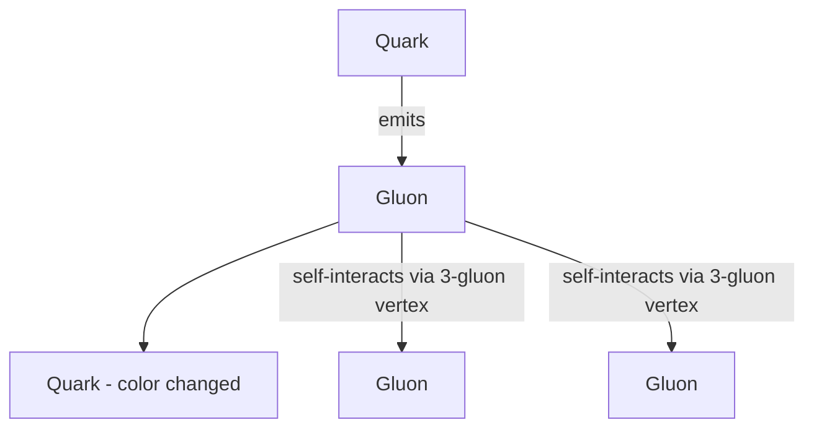
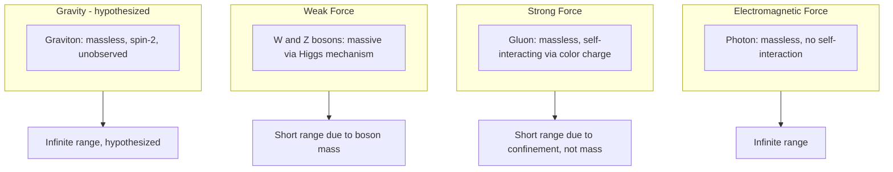

## Gauge Bosons and Force Carriers

### Overview

Gauge bosons are the spin-1 fundamental particles that mediate three of the four known fundamental forces within the Standard Model: the photon (electromagnetism), the gluons (strong force), and the W and Z bosons (weak force). Their existence and properties are a direct mathematical consequence of requiring the Standard Model's Lagrangian to remain invariant under local gauge transformations — a requirement that necessitates introducing vector fields whose quanta are precisely these force-carrying particles.

### Conceptual Basis: Gauge Invariance Requires Force Carriers

In gauge field theory, physical laws are required to remain unchanged (invariant) under transformations of an internal symmetry that can vary independently at each point in spacetime (a "local" gauge transformation), as opposed to a "global" transformation applied uniformly everywhere. Enforcing this local invariance mathematically requires introducing a compensating vector field — the gauge field — whose quantized excitations are the gauge bosons, and whose coupling to matter fields generates the corresponding force.

**Key Points**

- The photon arises from requiring invariance under local $U(1)$ phase transformations of the electron field (and other charged fields), formalized in Quantum Electrodynamics (QED).
- The eight gluons arise from requiring invariance under local $SU(3)$ color transformations, formalized in Quantum Chromodynamics (QCD).
- The W and Z bosons arise from requiring invariance under local $SU(2)_L \times U(1)_Y$ electroweak transformations, prior to spontaneous symmetry breaking.

### Summary Table of Gauge Bosons

| Boson | Force | Spin | Electric Charge | Mass | Number of Types |
| --- | --- | --- | --- | --- | --- |
| Photon (γ) | Electromagnetic | 1 | 0 | 0 (exactly, per current theory and experimental limits) | 1 |
| Gluon (g) | Strong | 1 | 0 | 0 | 8 |
| W⁺ | Weak (charged current) | 1 | +1 | ~80.4 GeV/c² | 1 |
| W⁻ | Weak (charged current) | 1 | −1 | ~80.4 GeV/c² | 1 |
| Z⁰ | Weak (neutral current) | 1 | 0 | ~91.2 GeV/c² | 1 |

*[Unverified: Precision values for W and Z boson masses continue to be refined by ongoing collider measurements; figures cited reflect commonly referenced precision determinations and should be checked against current Particle Data Group averages.]*

### The Photon: Mediator of Electromagnetism

The photon is the massless, chargeless gauge boson of Quantum Electrodynamics, mediating all electromagnetic interactions between charged particles. Because the photon is massless, the electromagnetic force has infinite range, following the familiar inverse-square force law at the classical level:

$$F \propto \frac{q_1 q_2}{r^2}$$

**Key Points**

- The photon does not carry electric charge and therefore does not self-interact — QED is an "Abelian" gauge theory (based on the commutative group $U(1)$), meaning field configurations combine linearly without gauge-boson self-coupling vertices.
- Virtual photon exchange is the mechanism by which QED describes phenomena from atomic binding to Coulomb scattering to the fine structure of atomic spectra.
- QED predictions (e.g., the electron's anomalous magnetic moment $g-2$) have been experimentally verified to extraordinary precision, making QED one of the most stringently tested theories in physics.

### Gluons: Mediators of the Strong Force

Gluons are the eight massless gauge bosons of QCD, mediating the strong interaction between color-charged particles (quarks and gluons themselves). Unlike the photon, gluons carry color charge (specifically, a color-anticolor combination), which allows them to interact with one another directly — a defining feature of QCD as a "non-Abelian" gauge theory (based on the non-commutative group $SU(3)$).

**Key Points**

- Gluon self-interaction (three-gluon and four-gluon vertices) is responsible for asymptotic freedom (weaker effective coupling at short distances/high energy) and color confinement (stronger effective coupling at long distances, preventing isolated color charges).
- The eight gluon color states correspond to the eight generators of the $SU(3)$ group (conventionally represented via combinations of color-anticolor pairs, excluding one particular colorless combination for group-theoretic reasons).
- Because gluons themselves carry color charge, they cannot exist as isolated free particles any more than quarks can — gluons are likewise confined within color-neutral bound states (e.g., hypothesized "glueballs," composed purely of gluons).

**Gluon Self-Interaction Diagram**

### W and Z Bosons: Mediators of the Weak Force

The W⁺, W⁻, and Z⁰ bosons mediate the weak interaction, responsible for processes such as beta decay, and are distinguished from the other gauge bosons by their large mass — a consequence of electroweak symmetry breaking via the Higgs mechanism.

**Charged-Current Interactions (W bosons)**

The W⁺ and W⁻ bosons carry electric charge and mediate interactions that change the flavor or type of the interacting fermion — for example, converting a down quark into an up quark (as in neutron beta decay) or converting an electron into an electron neutrino.

$$d \rightarrow u + W^-, \quad W^- \rightarrow e^- + \bar{\nu}_e$$

**Neutral-Current Interactions (Z boson)**

The electrically neutral Z boson mediates interactions that do not change fermion flavor, but still couple to essentially all Standard Model fermions (both charged particles and neutrinos), enabling processes such as neutrino scattering off electrons without charge exchange.

**Key Points**

- The large masses of the W (~80.4 GeV/c²) and Z (~91.2 GeV/c²) bosons directly explain the short range of the weak force (~$10^{-18}$ m) via the Yukawa-type relation $r \sim \hbar/(mc)$.
- Before electroweak symmetry breaking, the underlying $SU(2)_L \times U(1)_Y$ gauge bosons (denoted $W^1, W^2, W^3, B$) are massless; the physical W⁺, W⁻, Z⁰, and photon states emerge as specific mixtures of these fields after the Higgs field acquires its vacuum expectation value.
- The mixing angle relating the original gauge fields to the physical W/Z/photon states is the weak mixing angle (Weinberg angle), $\theta_W$, defined by:

$$\sin^2\theta_W = 1 - \frac{m_W^2}{m_Z^2}$$

### Electroweak Boson Mixing

The physical Z boson and photon arise as orthogonal mixtures of the original $SU(2)_L$ neutral field ($W^3$) and the $U(1)_Y$ field ($B$):

$$\begin{pmatrix} \gamma \\ Z^0 \end{pmatrix} = \begin{pmatrix} \cos\theta_W & \sin\theta_W \\ -\sin\theta_W & \cos\theta_W \end{pmatrix} \begin{pmatrix} B \\ W^3 \end{pmatrix}$$

This mixing is a direct consequence of the Higgs mechanism's spontaneous symmetry breaking pattern, and explains why the photon (a mixture involving the originally massless $U(1)_Y$ field) remains exactly massless while the Z boson (the orthogonal combination) acquires mass.

### The Graviton: A Hypothesized, Unobserved Force Carrier

If gravity is eventually described by an analogous quantum gauge field theory, its force carrier would be the graviton — a hypothesized massless, spin-2 boson. Unlike the other gauge bosons, the graviton has never been experimentally observed, and no confirmed quantum theory of gravity currently exists.

**Key Points**

- The graviton's hypothesized spin-2 nature (as opposed to the spin-1 nature of the other gauge bosons) arises from the requirement that it couple universally to the stress-energy tensor (mass-energy and momentum), rather than to a simpler charge as in the other forces.
- Direct detection of individual gravitons is considered extraordinarily difficult given gravity's intrinsic weakness relative to the other forces, and remains firmly in the realm of theoretical prediction rather than experimental confirmation. *[Speculation: Any specific graviton properties beyond spin and masslessness are model-dependent theoretical proposals rather than established physics, since no complete, experimentally verified quantum theory of gravity yet exists.]*

### Comparative Force-Carrier Behavior Diagram

### Worked Example: Deriving the Weinberg Angle from Boson Masses

**Example**

Given $m_W \approx 80.4\ \text{GeV}/c^2$ and $m_Z \approx 91.2\ \text{GeV}/c^2$, calculate the weak mixing angle $\theta_W$.

**Step 1** — Apply the defining relation:

$$\sin^2\theta_W = 1 - \frac{m_W^2}{m_Z^2}$$

**Step 2** — Compute the mass ratio squared:

$$\frac{m_W^2}{m_Z^2} = \left(\frac{80.4}{91.2}\right)^2 = (0.8816)^2 \approx 0.7772$$

**Step 3** — Compute $\sin^2\theta_W$:

$$\sin^2\theta_W = 1 - 0.7772 = 0.2228$$

**Step 4** — Solve for $\theta_W$:

$$\theta_W = \arcsin\left(\sqrt{0.2228}\right) = \arcsin(0.4720) \approx 28.2°$$

**Output**

$$\sin^2\theta_W \approx 0.223, \quad \theta_W \approx 28.2°$$

This is consistent with commonly cited experimental determinations of the weak mixing angle (typically quoted around $\sin^2\theta_W \approx 0.231$ in the $\overline{\text{MS}}$ renormalization scheme at the Z-pole scale), with the small discrepancy attributable to this tree-level mass-ratio estimate not incorporating higher-order radiative corrections. *[Inference: Precise values of $\sin^2\theta_W$ depend on the specific renormalization scheme and energy scale at which it is defined/measured, so this worked example should be understood as an illustrative tree-level approximation rather than the full precision electroweak result.]*

### Boson Discovery and Experimental Confirmation

| Boson | Discovery Year | Facility/Experiment |
| --- | --- | --- |
| Photon (concept established) | Early 20th century | Theoretical (Planck, Einstein) + experimental (photoelectric effect) |
| Gluon (indirect evidence) | 1979 | PETRA collider, DESY (three-jet events) |
| W and Z bosons | 1983 | UA1/UA2 collaborations, CERN SPS |

*[Inference: The gluon's discovery is typically attributed to indirect evidence via three-jet event topologies in electron-positron collisions rather than direct particle detection, since gluons — like quarks — are confined and never observed as isolated particles.]*

**Conclusion**

Gauge bosons are the mathematically necessitated consequence of requiring the Standard Model's fields to respect local gauge symmetry, with each force's carrier reflecting the specific symmetry group underlying that interaction: the photon from $U(1)$ electromagnetism, gluons from $SU(3)$ color symmetry, and the W/Z bosons from the broken $SU(2)_L \times U(1)_Y$ electroweak symmetry. Their properties — masslessness versus mass, self-interaction versus non-self-interaction — directly explain observed force behavior, from the infinite range of electromagnetism to the confinement-driven short range of the strong force to the mass-driven short range of the weak force, while the hypothesized graviton remains an unconfirmed extension of this framework to gravity.

**Related Topics**

- Quantum Electrodynamics (QED) and photon-mediated interactions in detail
- Quantum Chromodynamics (QCD), gluon self-coupling, and confinement mechanisms
- Electroweak symmetry breaking and the Higgs mechanism (full derivation)
- Weak mixing angle and precision electroweak measurements
- Non-Abelian gauge theory formalism (Yang-Mills theories)
- Graviton hypotheses within string theory and loop quantum gravity
- W and Z boson discovery experiments (UA1/UA2 at CERN)
- Feynman diagram techniques for gauge boson interaction vertices