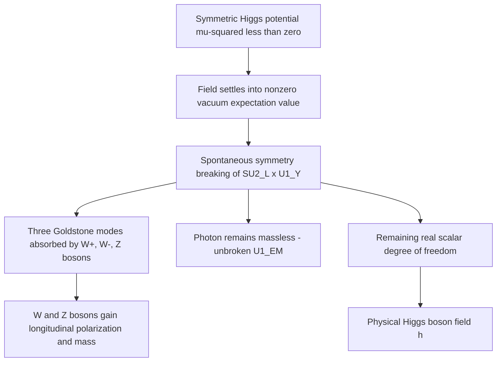

## The Higgs Mechanism

### Overview

The Higgs mechanism is the theoretical process by which gauge bosons and fermions in the Standard Model acquire mass through spontaneous breaking of electroweak gauge symmetry. Without this mechanism, gauge invariance would strictly forbid explicit mass terms for the W and Z bosons and for fermions in the Standard Model Lagrangian, yet these particles are experimentally observed to be massive. The mechanism's central experimental confirmation — the discovery of the Higgs boson at CERN's Large Hadron Collider in 2012 — represented a major milestone validating decades of theoretical prediction.

### The Problem: Gauge Invariance Forbids Explicit Mass Terms

In the unbroken $SU(2)_L \times U(1)_Y$ electroweak gauge theory, a naive mass term for a gauge boson field $A_\mu$, of the form:

$$\mathcal{L}_{mass} = \frac{1}{2}m^2 A_\mu A^\mu$$

is not invariant under local gauge transformations, and therefore cannot simply be inserted into the Lagrangian without breaking the theory's mathematical consistency (specifically, its renormalizability). Similarly, a naive Dirac mass term for a fermion,

$$\mathcal{L}_{mass} = -m\bar{\psi}\psi = -m(\bar{\psi}_L\psi_R + \bar{\psi}_R\psi_L)$$

is forbidden because left-handed and right-handed fermion fields transform differently under $SU(2)_L$ (only left-handed fields carry weak isospin), making the combination $\bar{\psi}_L\psi_R$ gauge non-invariant. This creates an apparent contradiction: the theory requires masslessness for consistency, yet experiment clearly shows the W, Z, and most fermions to be massive.

### The Solution: Spontaneous Symmetry Breaking

The Higgs mechanism resolves this by introducing an additional scalar field — the Higgs field — whose potential energy is structured such that the symmetric configuration (zero field value) is not the lowest-energy (vacuum) state. The field instead settles into an asymmetric, nonzero vacuum expectation value, and it is this asymmetric vacuum state — not the underlying Lagrangian itself — that breaks the symmetry.

**Key Points**

- The full Lagrangian remains exactly gauge-invariant at all times; what breaks is the symmetry of the vacuum state that the universe actually occupies, a distinction that is central to correctly understanding "spontaneous" symmetry breaking.
- This is a quantum field theory generalization of a broader phenomenon found in condensed matter physics (e.g., ferromagnetism, where a material's underlying rotationally symmetric interactions nonetheless produce a magnetized state with a specific, non-symmetric direction below the Curie temperature).

### The Higgs Field and Potential

The Higgs field is introduced as a complex $SU(2)_L$ doublet of scalar fields:

$$\phi = \begin{pmatrix} \phi^+ \\ \phi^0 \end{pmatrix}$$

with a potential energy density (the "Higgs potential") of the form:

$$V(\phi) = \mu^2 (\phi^\dagger \phi) + \lambda (\phi^\dagger \phi)^2$$

For the mechanism to produce symmetry breaking, the parameter $\mu^2$ must be negative (despite $\mu^2$ conventionally resembling a mass-squared term, its negative value here does not correspond to a physical tachyonic particle — it is simply the parameter choice that reshapes the potential). With $\mu^2 < 0$ and $\lambda > 0$ (required for the potential to be bounded from below), the potential takes on the characteristic "Mexican hat" shape: an unstable local maximum at $\phi = 0$ surrounded by a continuous circle of degenerate global minima.

$$|\phi|_{min} = \sqrt{\frac{-\mu^2}{2\lambda}} = \frac{v}{\sqrt{2}}$$

where $v \approx 246\ \text{GeV}$ is the Higgs vacuum expectation value (VEV), determined experimentally from the measured strength of the weak interaction (specifically, from the Fermi coupling constant $G_F$ governing muon decay).

### Choosing a Vacuum and the Emergence of Mass Terms

Because the minima form a continuous circle, the field must "choose" a specific point on this circle to settle into — conventionally chosen, for calculational convenience, along the neutral component:

$$\langle \phi \rangle = \frac{1}{\sqrt{2}}\begin{pmatrix} 0 \\ v \end{pmatrix}$$

Expanding the field around this vacuum value in terms of a real fluctuation field $h(x)$ (the physical Higgs boson field):

$$\phi(x) = \frac{1}{\sqrt{2}}\begin{pmatrix} 0 \\ v + h(x) \end{pmatrix}$$

Substituting this expansion into the gauge-covariant kinetic term of the Higgs Lagrangian, $|D_\mu \phi|^2$, generates cross-terms proportional to $v^2$ multiplying the gauge boson fields — these are precisely the mass terms for the W and Z bosons that were forbidden in the unbroken theory, now appearing legitimately because they originate from the gauge-invariant kinetic term evaluated at the specific (symmetry-breaking) vacuum value, not from an explicitly inserted non-invariant mass term.

### Resulting Gauge Boson Masses

$$m_W = \frac{1}{2}g v, \qquad m_Z = \frac{1}{2}v\sqrt{g^2 + g'^2}$$

where $g$ and $g'$ are the $SU(2)_L$ and $U(1)_Y$ gauge coupling constants, respectively. The photon remains exactly massless because the specific combination of gauge fields corresponding to the unbroken $U(1)_{EM}$ subgroup does not couple to the chosen vacuum direction — a structural feature guaranteed by the way the Higgs doublet's hypercharge and isospin are assigned.

**Key Points**

- The ratio $m_W/m_Z = \cos\theta_W$ (where $\theta_W$ is the weak mixing angle) is a direct, testable prediction of this mechanism, and its experimental confirmation across independent measurements is one of the strongest validations of the electroweak theory.
- Only three of the original four real scalar degrees of freedom in the complex Higgs doublet are "eaten" (absorbed) by the W⁺, W⁻, and Z bosons to become their longitudinal polarization states; the fourth remaining degree of freedom manifests as the physical Higgs boson.

### Higgs Mechanism Process Diagram

### Fermion Mass Generation via Yukawa Coupling

Unlike gauge boson masses, which arise from the Higgs field's coupling to gauge fields in the kinetic term, fermion masses arise from explicit Yukawa coupling terms between fermions and the Higgs field, of the general form:

$$\mathcal{L}_{Yukawa} = -y_f (\bar{\psi}_L \phi \psi_R + \text{h.c.})$$

After substituting the vacuum expectation value, this generates a fermion mass term:

$$m_f = \frac{y_f v}{\sqrt{2}}$$

where $y_f$ is the Yukawa coupling constant specific to each fermion species. Because $y_f$ is a free parameter for each fermion, the Standard Model does not predict the specific mass values of quarks and leptons — it only provides the mechanism by which they acquire mass, with the actual mass hierarchy (from the tiny electron mass to the very large top quark mass) requiring the Yukawa couplings themselves to span many orders of magnitude, a feature not explained within the Standard Model itself.

**Key Points**

- The top quark's unusually large Yukawa coupling (close to 1) is often noted as numerically suggestive of a possible deeper connection to electroweak symmetry breaking, though this remains a topic of ongoing theoretical speculation rather than an established result. *[Speculation: Any specific theoretical significance attributed to the top-quark Yukawa coupling's proximity to unity is a model-dependent interpretation, not a confirmed feature of the Standard Model.]*
- The minimal Standard Model does not include right-handed neutrino fields, so the standard Yukawa mechanism described here does not, by itself, generate neutrino masses — this is why neutrino mass generation typically requires model extensions (e.g., seesaw mechanisms) beyond the minimal Higgs mechanism.

### The Physical Higgs Boson

The surviving real scalar degree of freedom, $h(x)$, is the physical Higgs boson — a massive, spin-0, electrically neutral particle. Its mass arises from the curvature of the Higgs potential around the chosen vacuum minimum:

$$m_H = \sqrt{-2\mu^2} = v\sqrt{2\lambda}$$

Unlike the gauge boson and fermion masses (which depend on the VEV $v$ combined with gauge couplings or Yukawa couplings respectively), the Higgs boson's own mass depends on the Higgs self-coupling parameter $\lambda$, which was not independently predicted by the Standard Model prior to experimental Higgs boson discovery.

### Experimental Discovery

The Higgs boson was discovered in July 2012 by the ATLAS and CMS collaborations at CERN's Large Hadron Collider, primarily through observation of its decay into two photons ($H \rightarrow \gamma\gamma$) and its decay into four leptons via intermediate Z bosons ($H \rightarrow ZZ^* \rightarrow 4\ell$), with a measured mass of approximately 125 GeV/c². This discovery completed the experimental verification of all Standard Model particles predicted by the theory and was recognized by the 2013 Nobel Prize in Physics, awarded to François Englert and Peter Higgs.

**Key Points**

- The theoretical mechanism is sometimes attributed collectively to multiple independent 1964 papers (Englert and Brout; Higgs; Guralnik, Hagen, and Kibble), and is occasionally referred to in the literature as the "Brout-Englert-Higgs mechanism" to reflect this broader attribution, though "Higgs mechanism" remains the most common shorthand.
- Post-discovery measurements of the Higgs boson's spin (confirmed as 0), parity (confirmed as even/scalar), and coupling strengths to various particles (photons, gluons, W/Z bosons, top quarks, bottom quarks, tau leptons) have been broadly consistent with Standard Model predictions across subsequent LHC data-taking runs. *[Unverified: Precision coupling measurements continue to be refined with increasing LHC luminosity, and specific numerical coupling strength results should be checked against current ATLAS/CMS combined analyses for the latest precision.]*

### Worked Example: Estimating the Higgs Self-Coupling from Known Parameters

**Example**

Given the measured Higgs boson mass $m_H \approx 125\ \text{GeV}/c^2$ and the electroweak VEV $v \approx 246\ \text{GeV}$, estimate the Higgs self-coupling parameter $\lambda$.

**Step 1** — Start from the relation between Higgs mass and self-coupling:

$$m_H = v\sqrt{2\lambda}$$

**Step 2** — Rearrange to solve for $\lambda$:

$$\lambda = \frac{m_H^2}{2v^2}$$

**Step 3** — Substitute values:

$$\lambda = \frac{(125)^2}{2 \times (246)^2} = \frac{15625}{2 \times 60516} = \frac{15625}{121032}$$

**Step 4** — Compute:

$$\lambda \approx 0.129$$

**Output**

$$\lambda \approx 0.13$$

This value is consistent with commonly cited Standard Model estimates of the Higgs self-coupling derived from the measured Higgs mass, and represents a benchmark actively being tested through measurements of Higgs pair production (di-Higgs production) at the LHC, which directly probes this self-coupling. *[Inference: Current experimental sensitivity to di-Higgs production remains statistically limited, so direct experimental confirmation of this self-coupling value (as opposed to its indirect inference from the single-Higgs mass) is an ongoing experimental program rather than a fully settled measurement.]*

**Conclusion**

The Higgs mechanism resolves the apparent contradiction between gauge symmetry (which forbids explicit mass terms) and experimental observation (which requires massive W, Z, and fermion particles) through spontaneous electroweak symmetry breaking: the Higgs field's nonzero vacuum expectation value generates gauge boson masses via the gauge-covariant kinetic term and fermion masses via explicit Yukawa couplings, while leaving the photon massless and the surviving scalar degree of freedom observable as the physical Higgs boson. Its experimental confirmation in 2012 stands as one of the most significant achievements in the history of particle physics, though open questions remain regarding the theoretical origin of the specific Yukawa coupling values and the mechanism's inability, in its minimal form, to account for neutrino masses.

**Related Topics**

- Electroweak unification and the $SU(2)_L \times U(1)_Y$ gauge structure
- Goldstone's theorem and the Goldstone boson equivalence theorem
- Yukawa coupling hierarchy and the flavor puzzle
- Higgs boson decay channels and branching ratio measurements
- Di-Higgs production and self-coupling measurements at the LHC
- Neutrino mass mechanisms beyond the minimal Higgs mechanism (seesaw models)
- Vacuum stability and the shape of the Higgs potential at high energy scales
- Spontaneous symmetry breaking analogues in condensed matter physics