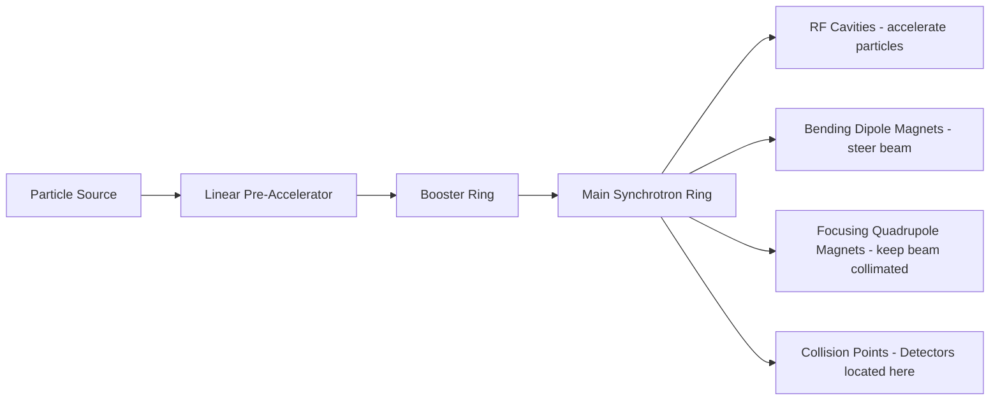
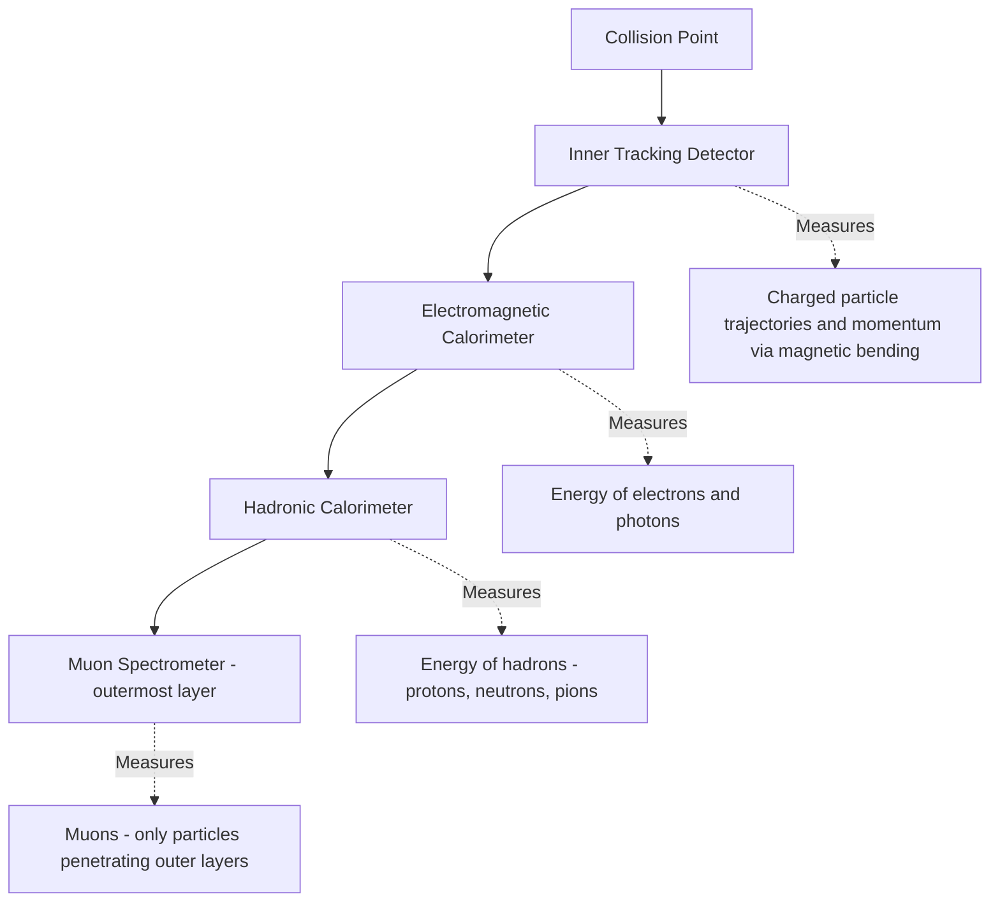

## Particle Accelerators and Detectors

### Overview

Particle accelerators and detectors form the essential experimental infrastructure of particle physics, enabling the production of high-energy particle collisions and the precise measurement of their resulting products. Accelerators increase particle energies to probe increasingly small distance scales (per the de Broglie relationship, higher momentum corresponds to shorter probing wavelength), while detectors reconstruct the trajectories, energies, and identities of particles produced in these collisions.

### Fundamental Accelerator Physics Concepts

**Key Points**

- Charged particles are accelerated using electric fields (which do work on the particle, increasing kinetic energy) and steered/focused using magnetic fields (which provide centripetal force without doing work, per the Lorentz force law).
- The Lorentz force governing charged particle motion in combined electric and magnetic fields:

$$\vec{F} = q\vec{E} + q\vec{v} \times \vec{B}$$

- Collision energy, not just individual particle energy, determines the mass scale of particles that can be produced, per the relativistic relation $E^2 = (pc)^2 + (mc^2)^2$, and the accessible center-of-mass energy depends critically on whether colliding beams travel in opposite directions (collider mode) or strike a fixed target.

**Center-of-Mass Energy: Colliders vs. Fixed-Target**

For two beams of energy $E$ colliding head-on, the center-of-mass energy scales linearly with beam energy:

$$\sqrt{s}_{collider} \approx 2E$$

For a fixed-target configuration (beam of energy $E$ striking a stationary target of mass $m$), the center-of-mass energy scales only with the square root of beam energy:

$$\sqrt{s}_{fixed-target} \approx \sqrt{2Emc^2}$$

This scaling difference is the primary reason modern high-energy physics facilities (e.g., the LHC) use colliding-beam configurations rather than fixed-target setups for reaching the highest possible collision energies.

### Types of Particle Accelerators

**Linear Accelerators (Linacs)**

Particles are accelerated in a straight line through a sequence of oscillating electric field cavities (radiofrequency cavities), timed so the particle always experiences an accelerating field as it crosses each gap.

- **Advantages**: No synchrotron radiation losses (a significant concern for circular electron accelerators), simpler beam dynamics for very high-energy electron/positron acceleration.
- **Disadvantages**: Requires substantial physical length to reach high energies, since each accelerating stage provides only a limited energy gain.
- **Example**: The SLAC Linear Accelerator (historically 2 miles/3.2 km long) and the proposed International Linear Collider (ILC) concept for future electron-positron collisions.

**Cyclotrons**

Charged particles spiral outward in a constant magnetic field, gaining energy from an alternating electric field each time they cross a gap between two "D"-shaped electrodes (dees). Limited to non-relativistic energies because the technique relies on a constant particle revolution frequency (cyclotron frequency), which becomes invalid once relativistic mass increase becomes significant.

$$f_c = \frac{qB}{2\pi m}$$

Widely used for medical isotope production and proton therapy, where extreme energies are unnecessary.

**Synchrotrons**

Particles travel in a fixed circular path, with both the accelerating radiofrequency field and the bending magnetic field strength synchronized to increase together as particle energy increases, maintaining a constant orbital radius. This design allows synchrotrons to reach far higher energies than cyclotrons.

**Key Points**

- Circular electron accelerators suffer substantial energy loss to synchrotron radiation (radiation emitted by charged particles undergoing centripetal acceleration), which scales inversely with the fourth power of particle mass at fixed radius and energy — this is why the highest-energy lepton colliders under consideration for the future tend toward linear rather than circular designs, while circular designs remain favored for heavier particles like protons.
- The Large Hadron Collider (LHC) at CERN, a synchrotron with a 27 km circumference, is the highest-energy particle accelerator currently in operation, designed to collide protons at center-of-mass energies up to 13-14 TeV.

### Comparison of Major Accelerator Types

| Type | Beam Path | Energy Limitation | Primary Use Case |
| --- | --- | --- | --- |
| Linac | Straight line | Physical length | High-energy electron/positron acceleration, medical/industrial use |
| Cyclotron | Outward spiral | Relativistic effects at high energy | Medical isotope production, low-energy nuclear physics |
| Synchrotron | Fixed circular ring | Synchrotron radiation (electrons); magnet field strength (protons) | High-energy physics research (LHC, Tevatron, RHIC) |
| Synchrotron light source | Fixed circular ring | N/A (radiation is the product, not a loss) | Materials science via synchrotron X-ray radiation |

### Particle Detector Fundamentals

Detectors are typically arranged in concentric cylindrical layers around a collision point, with each layer designed to measure a specific particle property, collectively enabling reconstruction of the full collision event.

**General Detector Architecture**

**Tracking Detectors**

Measure the trajectories of charged particles as they pass through, typically embedded in a strong magnetic field so that particle momentum can be determined from the curvature radius of the resulting track:

$$p = qBr$$

where $p$ is momentum, $q$ is charge, $B$ is magnetic field strength, and $r$ is the radius of curvature. Modern tracking detectors commonly use silicon pixel and strip detectors positioned very close to the collision point for high spatial resolution.

**Calorimeters**

Measure particle energy by fully absorbing the particle and measuring the resulting shower of secondary particles:

- **Electromagnetic calorimeters (ECAL)**: Absorb and measure the energy of electrons and photons via electromagnetic showers (alternating bremsstrahlung and pair production processes), typically using dense materials such as lead tungstate crystals or lead-liquid argon sampling designs.
- **Hadronic calorimeters (HCAL)**: Absorb and measure the energy of hadrons (protons, neutrons, pions, kaons) via nuclear interaction showers, typically using dense absorber materials (steel, brass) interspersed with active sampling layers (scintillator, liquid argon).

**Muon Detectors**

Positioned as the outermost detector layer, since muons are the only charged particles (besides neutrinos, which escape detection entirely) capable of penetrating through the calorimeter layers due to their relatively weak interaction with matter for their mass and lack of strong-force interaction.

**Key Points**

- Neutrinos escape all detector layers without direct detection; their presence and momentum in an event are instead inferred indirectly from an apparent imbalance in total transverse momentum ("missing transverse energy," $E_T^{miss}$), based on momentum conservation.
- Particle identification often relies on combining information across multiple detector subsystems (e.g., distinguishing electrons from pions using the ratio of energy deposited in ECAL vs. HCAL, combined with tracking information).

### Detector Technologies in Detail

**Silicon Pixel and Strip Detectors**

Provide high-precision spatial measurements (micrometer-scale resolution) very close to the interaction point, essential for identifying displaced vertices from short-lived particle decays (e.g., B-meson or tau lepton decays), a technique known as "vertexing."

**Scintillation Detectors**

Materials that emit light (scintillate) when charged particles pass through, with the light collected by photomultiplier tubes or silicon photomultipliers and converted to an electronic signal proportional to deposited energy.

**Gaseous Detectors**

Include wire chambers and drift chambers, which detect ionization produced as charged particles pass through a gas volume, with the resulting ionization electrons drifting toward sense wires under an applied electric field, providing both tracking and, in some configurations, particle identification via ionization energy loss measurements ($dE/dx$).

**Cherenkov Detectors**

Detect Cherenkov radiation — light emitted when a charged particle travels through a medium faster than the local speed of light in that medium — used for particle identification, since the emission angle depends on particle velocity:

$$\cos\theta_C = \frac{1}{n\beta}$$

where $n$ is the medium's refractive index and $\beta = v/c$. Combined with independently measured momentum, this allows particle mass (and hence identity) to be inferred.

### Major Experimental Facilities

| Facility | Location | Type | Key Contributions |
| --- | --- | --- | --- |
| Large Hadron Collider (LHC) | CERN, Switzerland/France | Proton-proton synchrotron collider | Higgs boson discovery (2012) |
| Tevatron (decommissioned) | Fermilab, USA | Proton-antiproton synchrotron collider | Top quark discovery (1995) |
| RHIC | Brookhaven National Laboratory, USA | Heavy-ion collider | Quark-gluon plasma studies |
| Belle II / SuperKEKB | KEK, Japan | Electron-positron collider | B-meson physics, CP violation studies |
| Fermilab accelerator complex | Fermilab, USA | Multiple (including neutrino beamlines) | Neutrino oscillation experiments (e.g., NOvA, DUNE) |

*[Unverified: Current operational status, ongoing upgrade programs, and specific performance parameters (luminosity, beam energy) for these facilities are periodically updated; current status should be verified against official facility publications for time-sensitive planning purposes.]*

### Worked Example: Momentum from Track Curvature

**Example**

A charged particle track in a detector with magnetic field strength $B = 2\ \text{T}$ has a measured radius of curvature $r = 1.5\ \text{m}$. Assuming the particle carries a single unit of elementary charge, calculate its momentum in GeV/c.

**Step 1** — Apply the momentum-curvature relation in SI units:

$$p = qBr$$

$$p = (1.602 \times 10^{-19}\ \text{C})(2\ \text{T})(1.5\ \text{m})$$

**Step 2** — Compute the momentum in SI units (kg·m/s):

$$p = 4.806 \times 10^{-19}\ \text{kg·m/s}$$

**Step 3** — Convert to natural units (GeV/c) using the conversion $1\ \text{GeV/c} = 5.344 \times 10^{-19}\ \text{kg·m/s}$:

$$p = \frac{4.806 \times 10^{-19}}{5.344 \times 10^{-19}}\ \text{GeV/c}$$

**Step 4** — Compute the result:

$$p \approx 0.899\ \text{GeV/c}$$

**Output**

$$p \approx 0.90\ \text{GeV/c}$$

This illustrates the practical technique by which tracking detector data (curvature radius under known magnetic field) is directly converted into particle momentum — a foundational measurement combined with calorimeter energy data and detector geometry to reconstruct full collision kinematics.

### Trigger and Data Acquisition Systems

**Key Points**

- Modern collider experiments (e.g., at the LHC) generate collision events at rates far exceeding what can be permanently recorded (on the order of hundreds of millions of collisions per second), necessitating a multi-level trigger system that makes rapid, automated decisions about which events are likely to be physically interesting and worth retaining for full analysis.
- Trigger systems typically operate in stages: a fast hardware-level trigger makes coarse decisions within microseconds, followed by software-level triggers that apply more sophisticated (though still time-constrained) selection algorithms before final data storage.

**Conclusion**

Particle accelerators — linacs, cyclotrons, and synchrotrons — provide the high-energy collisions necessary to probe fundamental physics at increasingly small distance scales, with collider configurations offering substantially greater accessible center-of-mass energy than fixed-target setups. Detectors, arranged in concentric layers of tracking, calorimetry, and muon detection systems, reconstruct the resulting particle products through complementary measurement techniques, with sophisticated trigger and data acquisition systems managing the enormous data rates generated by modern high-luminosity facilities. Together, these technologies have enabled landmark discoveries including the top quark, the Higgs boson, and ongoing precision studies of neutrino oscillations and quark-gluon plasma.

**Related Topics**

- Synchrotron radiation physics and its implications for accelerator design
- Detector calibration and particle identification algorithms
- Trigger system design and real-time data selection strategies
- Future collider proposals (Future Circular Collider, International Linear Collider, muon colliders)
- Luminosity and collision rate optimization in collider physics
- Silicon detector technology and vertex reconstruction techniques
- Quark-gluon plasma studies via heavy-ion collisions
- Neutrino detector technologies (water Cherenkov, liquid argon time projection chambers)