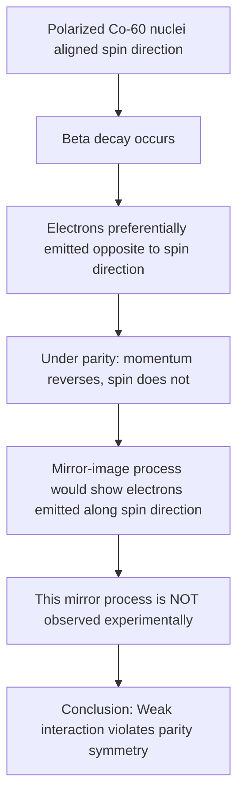
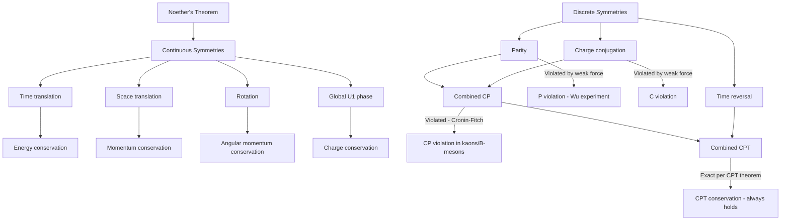

## Conservation Laws and Symmetries in Particle Physics

### Overview

Conservation laws in particle physics are fundamentally connected to underlying symmetries of nature through Noether's theorem, which establishes that every continuous symmetry of a physical system's action corresponds to a conserved quantity. Beyond continuous symmetries, discrete symmetries (parity, charge conjugation, time reversal) and internal quantum number conservation laws (baryon number, lepton number, quark flavor numbers) further constrain which particle interactions and decays are physically allowed, providing essential tools for predicting and classifying particle behavior.

### Noether's Theorem and Continuous Symmetries

Noether's theorem states that for every continuous symmetry of a system's Lagrangian, there exists a corresponding conserved quantity (a quantity whose total value does not change over time).

| Continuous Symmetry | Conserved Quantity |
| --- | --- |
| Time translation invariance | Energy |
| Spatial translation invariance | Linear momentum |
| Rotational invariance | Angular momentum |
| Global phase (gauge) invariance | Electric charge |

**Key Points**

- These conservation laws are not independently postulated in fundamental theory but are mathematical consequences of the underlying symmetries assumed in the theory's construction — a foundational link between geometry/symmetry and observable physical law.
- Local gauge symmetries (as opposed to global ones) additionally require the existence of gauge boson fields, as discussed in the context of the Standard Model's force carriers.

### Discrete Symmetries: P, C, and T

Beyond continuous symmetries, three discrete symmetry operations play a central role in particle physics:

**Parity (P)**: Spatial inversion, reflecting all three spatial coordinates through the origin: $\vec{r} \rightarrow -\vec{r}$.

**Charge Conjugation (C)**: Replaces every particle with its corresponding antiparticle, reversing all internal quantum numbers (charge, baryon number, lepton number) while leaving mass, energy, and momentum unchanged.

**Time Reversal (T)**: Reverses the direction of time, $t \rightarrow -t$, effectively reversing all momenta and angular momenta while leaving positions unchanged.

**Key Points**

- The strong and electromagnetic interactions conserve P, C, and T individually (as well as all their combinations).
- The weak interaction violates P and C individually, and in most cases the combined symmetry CP, though it is observed to conserve the combined CPT symmetry, consistent with the CPT theorem.

### Parity Violation in the Weak Interaction

The discovery that the weak interaction violates parity was one of the most significant surprises in 20th-century particle physics, established experimentally by the Wu experiment (1956), which studied the beta decay of polarized cobalt-60 nuclei.

$$^{60}_{27}\text{Co} \rightarrow \,^{60}_{28}\text{Ni} + e^- + \bar{\nu}_e$$

The experiment observed that emitted electrons were preferentially emitted opposite to the direction of the cobalt-60 nuclear spin. Under a parity transformation, this angular correlation would need to reverse (since momentum reverses under $P$ while angular momentum/spin does not), yet no such symmetric behavior was observed — directly demonstrating that the weak interaction distinguishes between a physical process and its mirror-image counterpart.

**Key Points**

- Parity violation is directly linked to the chiral (handedness-dependent) structure of the weak interaction: the weak interaction couples only to left-handed particle states (and right-handed antiparticle states), a structural feature built into the $SU(2)_L$ gauge symmetry itself.
- Neutrinos, in the idealized massless limit, would exist only in a left-handed helicity state (and antineutrinos only right-handed), an extreme manifestation of parity violation, though the discovery of nonzero neutrino mass introduces subtleties to this idealized picture.

### CP Violation

Since individual C and P symmetries are violated by the weak interaction, physicists initially hoped the combined CP symmetry (simultaneously reflecting space and replacing particles with antiparticles) might remain exactly conserved. However, CP violation was discovered experimentally in 1964 by Cronin and Fitch, studying neutral kaon decays.

**Key Points**

- CP violation in the quark sector is incorporated into the Standard Model through a single irreducible complex phase in the CKM (Cabibbo-Kobayashi-Maskawa) mixing matrix, which becomes possible only with three or more quark generations — providing a structural explanation for why nature contains (at least) three fermion generations.
- CP violation has also been observed in the B-meson system (studied extensively at experiments such as BaBar, Belle, and LHCb) and, more recently, evidence has emerged in the charm quark system as well. *[Unverified: The precise current experimental status and statistical significance of CP violation observations in specific meson systems continues to be refined with ongoing data collection; current literature should be consulted for the latest precision measurements.]*
- The magnitude of CP violation predicted by the Standard Model's CKM mechanism is generally considered too small to account for the observed matter-antimatter asymmetry of the universe, motivating searches for additional CP-violating sources beyond the Standard Model. *[Inference: This assessment is based on theoretical baryogenesis calculations comparing predicted vs. required CP violation magnitudes, representing a widely held view rather than a directly measured discrepancy.]*

### The CPT Theorem

The CPT theorem, a rigorous mathematical result derived from the combination of Lorentz invariance, locality, and unitarity in quantum field theory, states that the combined operation of charge conjugation, parity, and time reversal (applied together, in any order) must be an exact symmetry of any local, Lorentz-invariant quantum field theory — including the Standard Model.

**Key Points**

- CPT invariance implies that particles and antiparticles must have exactly equal mass, exactly equal (but opposite-sign) charge, and exactly equal lifetimes, predictions that have been tested to extremely high precision (e.g., comparisons of the electron/positron mass and charge, and the neutral kaon-antikaon mass difference).
- Since CP violation is experimentally observed, and CPT is believed to be exactly conserved, this implies that time-reversal symmetry (T) must also be violated in weak interactions — a conclusion independently confirmed through direct measurements of T violation in neutral kaon oscillations (e.g., by the CPLEAR experiment).

### Internal Quantum Number Conservation Laws

Beyond spacetime symmetries, several internal quantum numbers are conserved in particle interactions, providing additional selection rules governing which processes are physically allowed.

| Quantum Number | Conserved In | Notes |
| --- | --- | --- |
| Baryon number (B) | All known interactions | No confirmed proton decay observed to date |
| Lepton number (L) | All known interactions (total) | Individual lepton flavor violated by neutrino oscillations |
| Electric charge (Q) | All known interactions | Exactly conserved, tied to unbroken $U(1)_{EM}$ gauge symmetry |
| Color charge | All known interactions | Free particles must be color-neutral |
| Strangeness (S) | Strong and electromagnetic interactions only | Violated in weak interactions (e.g., in kaon decays) |
| Isospin | Strong interaction only | Approximate symmetry, broken by electromagnetic and mass differences between up/down quarks |

**Key Points**

- Baryon number conservation directly explains proton stability (as the lightest baryon, the proton has no lighter baryon to decay into while conserving baryon number), making proton decay searches (e.g., at Super-Kamiokande) a key test of physics beyond the Standard Model, since many Grand Unified Theories predict baryon number violation at some level.
- Strangeness violation in weak decays (e.g., $K^0 \rightarrow \pi^+ \pi^-$) provided early historical evidence distinguishing weak interaction processes from strong and electromagnetic ones, since strangeness-changing processes could only proceed via the comparatively slow weak interaction.

### Worked Example: Applying Conservation Laws to Test an Allowed Process

**Example**

Determine whether the following proposed decay is allowed by fundamental conservation laws:

$$\mu^- \rightarrow e^- + \gamma$$

**Step 1** — Check electric charge conservation:

$$Q(\mu^-) = -1, \quad Q(e^- + \gamma) = -1 + 0 = -1$$

Charge is conserved. ✓

**Step 2** — Check total lepton number conservation:

$$L_{total}(\mu^-) = +1, \quad L_{total}(e^- + \gamma) = +1 + 0 = +1$$

Total lepton number is conserved. ✓

**Step 3** — Check individual lepton flavor conservation (muon number $L_\mu$ and electron number $L_e$):

$$L_\mu(\mu^-) = +1, \quad L_\mu(e^- + \gamma) = 0$$

$$L_e(\mu^-) = 0, \quad L_e(e^- + \gamma) = +1$$

**Output**

Individual lepton flavor is **not conserved** in this proposed process ($L_\mu$ changes from +1 to 0, and $L_e$ changes from 0 to +1), even though total lepton number and electric charge are conserved. In the strict minimal Standard Model (with exactly massless neutrinos and no flavor-mixing mechanism for charged leptons), this decay is therefore forbidden, and extensive experimental searches (e.g., the MEG experiment) have placed extremely stringent upper limits on its branching ratio without detecting a confirmed signal. *[Inference: Because neutrino oscillations demonstrate that individual lepton flavor is not perfectly conserved at the neutrino level, this process is technically allowed at an extraordinarily suppressed rate through loop-level neutrino mixing effects in extended theoretical frameworks, but any such rate remains far below current or near-future experimental sensitivity — its continued non-observation remains an active constraint on physics beyond the Standard Model.]*

### Approximate and Broken Symmetries

Not all symmetries in particle physics are exact; several are approximate, providing useful organizing principles despite being broken at some level by specific interactions.

**Key Points**

- **Isospin symmetry**: An approximate symmetry treating the up and down quarks as nearly interchangeable under the strong interaction (since their mass difference and electric charges are small perturbations relative to the strong interaction's energy scale), historically useful for organizing hadron classification before the quark model was fully developed.
- **Flavor SU(3) symmetry**: An extension of isospin to include the strange quark, providing the basis for the historical "eightfold way" classification of hadrons (Gell-Mann and Ne'eman), which successfully predicted the existence of the omega-minus baryon prior to its experimental discovery.
- **Chiral symmetry**: An approximate symmetry of QCD in the limit of vanishing quark mass, spontaneously broken by the strong interaction's dynamics, with the resulting (approximate) Goldstone bosons identified with the pions — explaining why pions are anomalously light compared to other hadrons.

### Summary Diagram: Symmetry-Conservation Law Relationships

**Conclusion**

Conservation laws in particle physics arise from a deep interplay between continuous spacetime symmetries (governed by Noether's theorem, yielding energy, momentum, and charge conservation), discrete symmetries (parity, charge conjugation, and time reversal, of which only the combined CPT symmetry is believed to be exactly conserved), and internal quantum number conservation rules (baryon number, lepton number, color charge) that constrain allowed particle interactions and decays. The historical discoveries of parity violation (1956) and CP violation (1964) fundamentally reshaped theoretical understanding of the weak interaction and remain central to explaining the observed matter-antimatter asymmetry of the universe, while approximate symmetries such as isospin and flavor SU(3) continue to provide valuable organizing frameworks for hadron classification despite being broken at some level by the underlying dynamics.

**Related Topics**

- Noether's theorem: mathematical derivation and field-theoretic generalization
- The Wu experiment and historical discovery of parity violation
- CKM matrix structure and quantitative CP violation predictions
- CPT theorem: formal derivation and experimental tests
- Neutrino oscillations and lepton flavor violation searches
- Grand Unified Theories and predicted baryon number violation
- Chiral symmetry breaking and pions as pseudo-Goldstone bosons
- The eightfold way and historical hadron classification schemes