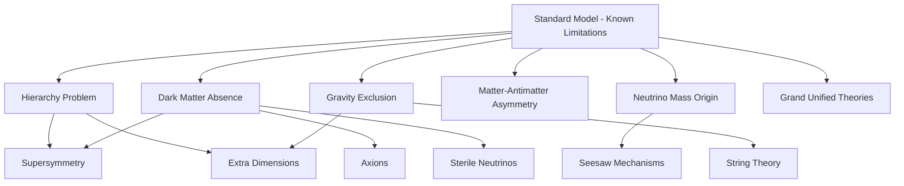

## Physics Beyond the Standard Model

### Overview

Physics Beyond the Standard Model (BSM) encompasses theoretical frameworks and experimental programs aimed at resolving the known limitations and unanswered questions of the Standard Model. While the Standard Model has been extraordinarily successful in describing observed particle phenomena, it does not incorporate gravity, fails to explain the observed neutrino masses through its minimal formulation, provides no candidate for dark matter or dark energy, and does not account for the universe's matter-antimatter asymmetry. BSM physics comprises both speculative theoretical extensions and the experimental searches designed to test them.

### Motivating Open Problems

**Key Points**

- **The hierarchy problem**: The Higgs boson mass receives large quantum corrections from virtual particle loops at very high energy scales; without a mechanism to stabilize it, the Higgs mass would naturally be driven toward the Planck scale ($\sim 10^{19}$ GeV) rather than its observed value (~125 GeV), requiring extreme fine-tuning in the minimal Standard Model.
- **Dark matter**: Astrophysical and cosmological observations (galactic rotation curves, gravitational lensing, cosmic microwave background structure) indicate that roughly 27% of the universe's energy density consists of non-luminous matter with no confirmed particle-physics explanation within the Standard Model.
- **Dark energy**: Observations of cosmic acceleration indicate a further ~68% of the universe's energy content is attributable to a poorly understood component (commonly modeled as a cosmological constant), entirely unexplained by particle physics.
- **Neutrino masses**: Neutrino oscillation experiments confirm nonzero neutrino masses, but the minimal Standard Model's Higgs Yukawa mechanism does not naturally generate them without additional model extensions.
- **Matter-antimatter asymmetry**: The Standard Model's CKM-matrix CP violation is generally considered insufficient to account for the observed cosmic dominance of matter over antimatter. *[Inference: This conclusion rests on baryogenesis calculations comparing the magnitude of CP violation required against that predicted by the Standard Model, representing a widely-held theoretical assessment rather than a direct experimental measurement.]*
- **Force unification**: The three Standard Model gauge couplings (strong, weak, electromagnetic) do not precisely converge to a single value at any energy scale under minimal Standard Model running, unlike the more precise convergence achieved in some supersymmetric extensions. *[Inference: The degree and significance of this near-convergence is a matter of ongoing theoretical interpretation and depends sensitively on the specific extension considered.]*
- **Gravity's exclusion**: No experimentally verified quantum field theory description of gravity exists within or alongside the Standard Model framework.

### Supersymmetry (SUSY)

Supersymmetry proposes a symmetry relating fermions and bosons, postulating that every Standard Model particle has a corresponding "superpartner" differing by half a unit of spin.

| Standard Model Particle | Spin | Hypothesized Superpartner | Spin |
| --- | --- | --- | --- |
| Electron | 1/2 | Selectron | 0 |
| Quark | 1/2 | Squark | 0 |
| Photon | 1 | Photino | 1/2 |
| Gluon | 1 | Gluino | 1/2 |
| Higgs boson(s) | 0 | Higgsino(s) | 1/2 |

**Key Points**

- SUSY naturally addresses the hierarchy problem: quantum corrections to the Higgs mass from Standard Model particles and their superpartners have opposite-sign contributions that cancel to a significant degree, stabilizing the Higgs mass without extreme fine-tuning — provided superpartner masses are not too far above the electroweak scale.
- In many SUSY models, the lightest supersymmetric particle (LSP) is stable (protected by a conservation law called R-parity) and electrically neutral, making it a natural dark matter candidate.
- Extensive searches at the LHC have not found direct evidence of supersymmetric particles at the energy scales explored to date, pushing experimental mass limits for many superpartners well above initial theoretical expectations and somewhat straining the "naturalness" motivation that originally made SUSY an especially compelling hierarchy-problem solution. *[Unverified: The precise current experimental mass exclusion limits for various superpartners are periodically updated with new LHC data and depend heavily on the specific SUSY model variant assumed; current ATLAS/CMS publications should be consulted for the latest constraints.]*

### Grand Unified Theories (GUTs)

GUTs propose that the strong, weak, and electromagnetic forces are all manifestations of a single unified force at extremely high energy scales (typically around $10^{15}$–$10^{16}$ GeV), with the observed distinct forces emerging as the unified symmetry spontaneously breaks at lower energies — analogous to how electroweak symmetry breaking separates the unified electroweak force into the distinct electromagnetic and weak forces observed today.

**Key Points**

- Common candidate unifying gauge groups include $SU(5)$ and $SO(10)$, both of which embed the Standard Model's $SU(3)_C \times SU(2)_L \times U(1)_Y$ symmetry as a subgroup.
- A generic prediction of many GUT models is proton decay, since unifying quarks and leptons into common multiplets typically allows baryon-number-violating interactions at some (highly suppressed) rate.
- Extensive proton decay searches (notably at Super-Kamiokande) have not observed any confirmed proton decay events, placing lower bounds on the proton's lifetime that have ruled out the simplest GUT models (such as minimal $SU(5)$) while more elaborate variants remain viable. *[Unverified: Current proton lifetime lower limits are periodically updated with continued exposure at large detector facilities; specific numerical limits should be checked against current experimental publications.]*

### Extra Dimensions

Several theoretical frameworks propose that spacetime possesses more than the four observed dimensions (three spatial plus time), with additional dimensions either compactified (curled up at extremely small, currently undetectable scales) or accessible only to gravity while Standard Model particles remain confined to a four-dimensional "brane."

**Key Points**

- Large extra dimension models (e.g., the Arkani-Hamed–Dimopoulos–Dvali, or ADD, model) propose that gravity appears weak in our observed four dimensions because it "leaks" into additional large compact dimensions, potentially resolving the hierarchy problem by lowering the true fundamental gravity scale much closer to the electroweak scale.
- Warped extra dimension models (e.g., the Randall-Sundrum model) propose a specific warped (non-flat) geometry that can naturally generate the large hierarchy between the electroweak and Planck scales through an exponential warping factor.
- Direct experimental searches for extra-dimensional signatures (e.g., missing energy from gravitons escaping into extra dimensions, or modifications to gravity at sub-millimeter scales) have not yielded confirmed evidence to date, and viable model parameter space has been substantially constrained by LHC data. *[Unverified: Current experimental constraints on extra-dimensional model parameters continue to evolve with ongoing collider and precision gravity experiments.]*

### String Theory

String theory proposes that fundamental particles are not point-like but instead tiny vibrating one-dimensional strings, with different vibrational modes corresponding to different observed particles. String theory naturally incorporates a massless spin-2 excitation identified with the graviton, offering a potential path toward a consistent quantum theory of gravity unified with the other forces.

**Key Points**

- String theory requires additional spatial dimensions (typically ten total spacetime dimensions in superstring theory, or eleven in M-theory) for mathematical consistency, with the extra dimensions assumed to be compactified at scales far below current experimental reach.
- String theory currently lacks direct experimental verification and, due to the extremely high energy scales typically associated with stringy effects (often near the Planck scale), faces significant challenges in producing testable, falsifiable predictions accessible to current or near-future experiments. *[Speculation: The degree to which string theory can eventually yield uniquely testable low-energy predictions remains a subject of active theoretical debate within the physics community, rather than an established consensus.]*

### Neutrino Mass Mechanisms: The Seesaw Model

Since the minimal Standard Model's Higgs Yukawa mechanism does not naturally generate the small nonzero neutrino masses observed experimentally, several extended mechanisms have been proposed, most prominently seesaw models.

**Type I Seesaw Mechanism**

Introduces heavy right-handed neutrino fields (singlets under the Standard Model gauge group) with a very large Majorana mass scale $M$. The resulting light neutrino mass is suppressed relative to typical Yukawa-generated fermion masses:

$$m_\nu \sim \frac{(y_\nu v)^2}{M}$$

**Key Points**

- The "seesaw" naming reflects the inverse relationship between the heavy right-handed neutrino mass scale and the resulting light neutrino mass — a very large $M$ naturally produces a very small $m_\nu$, potentially explaining why neutrino masses are so much smaller than other fermion masses without requiring an implausibly small Yukawa coupling.
- This mechanism also naturally raises the question of whether neutrinos are Majorana particles (their own antiparticles) rather than Dirac particles (as all other Standard Model fermions are), a distinction experimentally testable via neutrinoless double beta decay searches, which have not yet yielded confirmed observation. *[Unverified: Current experimental sensitivity and specific exclusion limits for neutrinoless double beta decay searches are periodically updated with ongoing experiments (e.g., KamLAND-Zen, GERDA/LEGEND); current publications should be consulted for the latest constraints.]*

### Dark Matter Candidates

**Key Points**

- **WIMPs (Weakly Interacting Massive Particles)**: Historically the most extensively searched dark matter candidate class, hypothesized to interact via the weak force at a mass scale naturally arising in many BSM extensions (including SUSY's LSP). Direct detection experiments (e.g., XENON, LUX-ZEPLIN) have progressively constrained the viable WIMP parameter space without confirmed detection to date. *[Unverified: The current experimental exclusion limits for WIMP-nucleon cross-sections continue to be refined; current experimental collaboration publications should be consulted for the latest constraints.]*
- **Axions**: Hypothetical light pseudoscalar particles originally proposed to resolve the "strong CP problem" (the unexplained absence of observed CP violation in the strong interaction, despite it being theoretically permitted), which incidentally also serve as a viable dark matter candidate if sufficiently abundant.
- **Sterile neutrinos**: Hypothesized additional neutrino states that do not interact via the weak force at all (only through mixing with ordinary neutrinos and/or gravity), proposed both as potential dark matter candidates and as a component of some neutrino mass-generation mechanisms.

### Comparative Summary of Major BSM Frameworks

| Framework | Primary Motivation | Key Prediction | Current Experimental Status |
| --- | --- | --- | --- |
| Supersymmetry | Hierarchy problem, dark matter | Superpartners for all SM particles | No confirmed detection; mass limits pushed higher |
| Grand Unified Theories | Force unification | Proton decay | No confirmed observation; simplest models excluded |
| Extra Dimensions | Hierarchy problem, gravity unification | Missing energy signatures, modified gravity at short range | No confirmed evidence; parameter space constrained |
| String Theory | Quantum gravity unification | Graviton, extra dimensions (typically 10-11 total) | No direct experimental test currently accessible |
| Seesaw Mechanisms | Neutrino mass generation | Heavy right-handed neutrinos, possible Majorana nature | Indirect support from oscillation data; direct tests ongoing |

### BSM Theoretical Landscape Diagram

### Worked Example: Estimating Neutrino Mass from the Seesaw Relation

**Example**

Using the Type I seesaw formula, estimate the light neutrino mass $m_\nu$ given a Yukawa coupling $y_\nu \sim 1$ (comparable to the top quark's Yukawa coupling), the electroweak VEV $v \approx 246\ \text{GeV}$, and a hypothesized heavy right-handed neutrino mass scale $M \sim 10^{14}\ \text{GeV}$.

**Step 1** — Write the seesaw relation:

$$m_\nu \sim \frac{(y_\nu v)^2}{M}$$

**Step 2** — Substitute values:

$$m_\nu \sim \frac{(1 \times 246\ \text{GeV})^2}{10^{14}\ \text{GeV}}$$

**Step 3** — Compute the numerator:

$$(246\ \text{GeV})^2 = 60,516\ \text{GeV}^2$$

**Step 4** — Divide by the heavy mass scale:

$$m_\nu \sim \frac{60,516\ \text{GeV}^2}{10^{14}\ \text{GeV}} = 6.05 \times 10^{-10}\ \text{GeV}$$

**Step 5** — Convert to eV ($1\ \text{GeV} = 10^9\ \text{eV}$):

$$m_\nu \sim 6.05 \times 10^{-10} \times 10^9\ \text{eV} \approx 0.6\ \text{eV}$$

**Output**

$$m_\nu \sim 0.6\ \text{eV}$$

This order-of-magnitude estimate falls within the general range considered plausible for neutrino masses given current oscillation and cosmological constraints, illustrating how an extremely large heavy mass scale ($M \sim 10^{14}$ GeV, well beyond direct experimental reach) can naturally suppress an otherwise "large" Yukawa-scale mass down to the tiny observed neutrino mass range — the essential appeal of the seesaw mechanism. *[Inference: This calculation is illustrative and highly sensitive to the assumed values of $y_\nu$ and $M$, both of which are free theoretical parameters not fixed by any first-principles prediction within seesaw models; actual neutrino mass values and the true heavy mass scale remain experimentally unconstrained beyond broad plausibility ranges.]*

### Current and Planned Experimental Programs

**Key Points**

- **Direct dark matter detection**: Underground detectors (e.g., XENON, LUX-ZEPLIN, PandaX) seek nuclear recoil signals from hypothesized dark matter particle interactions.
- **Indirect dark matter detection**: Telescopes and satellite observatories (e.g., Fermi-LAT) search for gamma-ray or cosmic-ray signatures potentially arising from dark matter annihilation or decay.
- **Collider searches**: The LHC continues extensive searches for supersymmetric particles, extra-dimensional signatures, and other BSM phenomena through missing energy signatures and exotic particle decay searches.
- **Proton decay and neutrino experiments**: Large-volume detectors (e.g., Super-Kamiokande, the planned Hyper-Kamiokande, DUNE) search for proton decay and study neutrino properties in detail.
- **Precision measurements**: Experiments measuring the muon anomalous magnetic moment, electric dipole moments of fundamental particles, and rare decay processes provide indirect sensitivity to BSM physics through quantum loop effects, potentially revealing new physics before it becomes directly accessible at collider energies. *[Unverified: The interpretation of any specific current tension between precision measurements and Standard Model predictions (such as ongoing muon g-2 discussions) depends on the theoretical calculation method used and has not reached full scientific consensus; current literature should be consulted for the latest status.]*

**Conclusion**

Physics Beyond the Standard Model encompasses a broad landscape of theoretical proposals — supersymmetry, grand unified theories, extra dimensions, string theory, and neutrino mass mechanisms such as seesaw models — each motivated by specific unresolved limitations of the Standard Model, including the hierarchy problem, dark matter, neutrino mass origin, matter-antimatter asymmetry, and the absence of a quantum gravity description. While extensive experimental programs across colliders, underground detectors, and precision measurement facilities have not yet yielded confirmed direct evidence for any specific BSM framework, these searches have substantially constrained the viable theoretical parameter space and continue to guide the ongoing search for a more complete theory of fundamental physics.

**Related Topics**

- Supersymmetric particle spectra and R-parity conservation
- Proton decay experimental searches and GUT model constraints
- String theory compactification and the string landscape problem
- Dark matter direct and indirect detection experimental techniques
- Neutrinoless double beta decay and the Majorana neutrino question
- Muon and electron anomalous magnetic moment precision measurements
- Baryogenesis and leptogenesis theoretical mechanisms
- Future collider proposals for BSM discovery reach (FCC, muon collider)