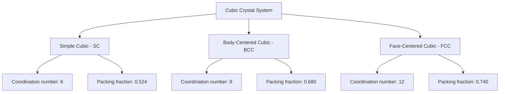
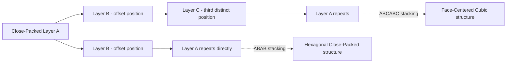

## Crystal Structure and Bravais Lattices

### Overview

Crystal structure describes the ordered, periodic arrangement of atoms, ions, or molecules in a solid, extending infinitely (in idealized models) in three-dimensional space through translational symmetry. The mathematical framework for classifying all possible periodic arrangements is provided by the Bravais lattice system, which establishes that exactly 14 distinct lattice types exist in three dimensions, each characterized by a unique combination of symmetry and unit cell geometry.

### Fundamental Definitions

**Lattice**: An infinite, periodic array of mathematical points in space, each point having identical surroundings, generated by translation vectors.

**Basis**: The atom or group of atoms associated with each lattice point. The complete crystal structure is formed by placing an identical basis at every lattice point:

$$\text{Crystal Structure} = \text{Lattice} + \text{Basis}$$

**Unit Cell**: The smallest repeating volumetric unit that, through translation alone, generates the entire crystal lattice.

**Primitive Unit Cell**: A unit cell containing exactly one lattice point (accounting for shared points at cell boundaries/corners), representing the minimum-volume repeating unit.

**Key Points**

- Two crystals with the same underlying lattice type but different basis atoms/arrangements are geometrically classified under the same Bravais lattice, despite having entirely different physical/chemical structures — the distinction between lattice and basis is essential to avoid confusing geometric classification with material identity.
- A conventional (non-primitive) unit cell is often chosen instead of the primitive cell because it more clearly displays the full symmetry of the lattice, even though it may contain more than one lattice point.

### Translation Vectors and Lattice Points

Any lattice point $\vec{R}$ in a three-dimensional Bravais lattice can be expressed as an integer linear combination of three primitive translation vectors $\vec{a}_1$, $\vec{a}_2$, $\vec{a}_3$:

$$\vec{R} = n_1\vec{a}_1 + n_2\vec{a}_2 + n_3\vec{a}_3, \quad n_1, n_2, n_3 \in \mathbb{Z}$$

**Key Points**

- The formal definition of a Bravais lattice requires that every lattice point have an environment identical (in orientation as well as arrangement) to every other lattice point — a stricter requirement than simple periodicity, which excludes certain periodic arrangements (such as the honeycomb lattice in 2D) from being classified as true Bravais lattices, since honeycomb lattice points come in two orientationally distinct sets.

### The Seven Crystal Systems

Before classifying the 14 Bravais lattices, crystals are first grouped into seven crystal systems based on the relative lengths of unit cell edges ($a$, $b$, $c$) and the angles between them ($\alpha$, $\beta$, $\gamma$):

| Crystal System | Edge Lengths | Angles | Example Minerals/Materials |
| --- | --- | --- | --- |
| Cubic | $a = b = c$ | $\alpha = \beta = \gamma = 90°$ | Diamond, NaCl, copper |
| Tetragonal | $a = b \neq c$ | $\alpha = \beta = \gamma = 90°$ | Rutile ($\text{TiO}_2$), white tin |
| Orthorhombic | $a \neq b \neq c$ | $\alpha = \beta = \gamma = 90°$ | Sulfur, aragonite |
| Rhombohedral (Trigonal) | $a = b = c$ | $\alpha = \beta = \gamma \neq 90°$ | Calcite, quartz |
| Hexagonal | $a = b \neq c$ | $\alpha = \beta = 90°, \gamma = 120°$ | Graphite, magnesium, ice |
| Monoclinic | $a \neq b \neq c$ | $\alpha = \gamma = 90° \neq \beta$ | Gypsum, orthoclase feldspar |
| Triclinic | $a \neq b \neq c$ | $\alpha \neq \beta \neq \gamma \neq 90°$ | Microcline, wollastonite |

### The 14 Bravais Lattices

Within the seven crystal systems, only 14 distinct lattice types are geometrically possible when accounting for additional lattice centering (primitive, body-centered, face-centered, and base-centered variants) — a mathematical result first rigorously proven by Auguste Bravais in 1848.

| Crystal System | Bravais Lattices Present | Centering Types |
| --- | --- | --- |
| Cubic | 3 | Simple (P), Body-centered (I), Face-centered (F) |
| Tetragonal | 2 | Simple (P), Body-centered (I) |
| Orthorhombic | 4 | Simple (P), Body-centered (I), Face-centered (F), Base-centered (C) |
| Rhombohedral | 1 | Simple (R) |
| Hexagonal | 1 | Simple (P) |
| Monoclinic | 2 | Simple (P), Base-centered (C) |
| Triclinic | 1 | Simple (P) |

**Key Points**

- The total across all systems sums to 14, a number that is not arbitrary but follows from a rigorous group-theoretic classification of which centering additions produce genuinely new, symmetry-distinct lattices versus which reduce to a smaller unit cell of an already-counted type.
- For example, a face-centered tetragonal lattice is mathematically equivalent to a smaller body-centered tetragonal lattice under an appropriate choice of unit cell, which is why "face-centered tetragonal" does not appear as a separate, 15th entry.

### Cubic Bravais Lattices in Detail

The cubic system, being the highest-symmetry crystal system, is particularly important in solid-state physics and contains three distinct Bravais lattices:

**Simple Cubic (SC)**: Lattice points located only at the eight corners of the cube.

**Body-Centered Cubic (BCC)**: Lattice points at the eight corners plus one additional point at the cube's center.

**Face-Centered Cubic (FCC)**: Lattice points at the eight corners plus one additional point at the center of each of the six faces.

### Cubic Lattice Cross-Section Illustration (svg_diagram)

<svg xmlns="http://www.w3.org/2000/svg" viewBox="0 0 700 300">
<rect width="700" height="300" fill="#ffffff" />
<text x="350" y="25" font-family="Arial" font-size="16" font-weight="bold" text-anchor="middle" fill="#000000">Simple, Body-Centered, and Face-Centered Cubic Cells (svg_diagram)</text>

<g transform="translate(50,60)">
<text x="60" y="-10" font-family="Arial" font-size="12" text-anchor="middle" fill="#000000">Simple Cubic</text>
<polygon points="20,150 20,50 100,20 180,50 180,150 100,180" fill="none" stroke="#000000" stroke-width="1.5" />
<line x1="20" y1="50" x2="100" y2="20" stroke="#000000" stroke-width="1.5" />
<line x1="180" y1="50" x2="100" y2="20" stroke="#000000" stroke-width="1.5" />
<line x1="20" y1="150" x2="100" y2="120" stroke="#000000" stroke-width="1" />
<line x1="180" y1="150" x2="100" y2="120" stroke="#000000" stroke-width="1" />
<line x1="100" y1="180" x2="100" y2="120" stroke="#000000" stroke-width="1" />
<line x1="100" y1="120" x2="100" y2="20" stroke="#000000" stroke-width="1" stroke-dasharray="2,2" />
<circle cx="20" cy="150" r="6" fill="#1a5fb4" />
<circle cx="20" cy="50" r="6" fill="#1a5fb4" />
<circle cx="180" cy="50" r="6" fill="#1a5fb4" />
<circle cx="180" cy="150" r="6" fill="#1a5fb4" />
<circle cx="100" cy="20" r="6" fill="#1a5fb4" />
<circle cx="100" cy="120" r="6" fill="#1a5fb4" />
</g>

<g transform="translate(280,60)">
<text x="60" y="-10" font-family="Arial" font-size="12" text-anchor="middle" fill="#000000">Body-Centered Cubic</text>
<polygon points="20,150 20,50 100,20 180,50 180,150 100,180" fill="none" stroke="#000000" stroke-width="1.5" />
<line x1="20" y1="50" x2="100" y2="20" stroke="#000000" stroke-width="1.5" />
<line x1="180" y1="50" x2="100" y2="20" stroke="#000000" stroke-width="1.5" />
<circle cx="20" cy="150" r="6" fill="#1a5fb4" />
<circle cx="20" cy="50" r="6" fill="#1a5fb4" />
<circle cx="180" cy="50" r="6" fill="#1a5fb4" />
<circle cx="180" cy="150" r="6" fill="#1a5fb4" />
<circle cx="100" cy="20" r="6" fill="#1a5fb4" />
<circle cx="100" cy="120" r="6" fill="#1a5fb4" />
<circle cx="100" cy="100" r="7" fill="#c01c28" />
</g>

<g transform="translate(510,60)">
<text x="60" y="-10" font-family="Arial" font-size="12" text-anchor="middle" fill="#000000">Face-Centered Cubic</text>
<polygon points="20,150 20,50 100,20 180,50 180,150 100,180" fill="none" stroke="#000000" stroke-width="1.5" />
<line x1="20" y1="50" x2="100" y2="20" stroke="#000000" stroke-width="1.5" />
<line x1="180" y1="50" x2="100" y2="20" stroke="#000000" stroke-width="1.5" />
<circle cx="20" cy="150" r="6" fill="#1a5fb4" />
<circle cx="20" cy="50" r="6" fill="#1a5fb4" />
<circle cx="180" cy="50" r="6" fill="#1a5fb4" />
<circle cx="180" cy="150" r="6" fill="#1a5fb4" />
<circle cx="100" cy="20" r="6" fill="#1a5fb4" />
<circle cx="100" cy="120" r="6" fill="#1a5fb4" />
<circle cx="100" cy="85" r="6" fill="#26a269" />
<circle cx="60" cy="100" r="6" fill="#26a269" />
<circle cx="140" cy="100" r="6" fill="#26a269" />
</g>
</svg>

### Coordination Number and Atomic Packing Fraction

**Coordination number** is the number of nearest-neighbor atoms surrounding any given atom in the structure.

**Atomic Packing Fraction (APF)** is the fraction of unit cell volume occupied by atoms, modeled as hard, touching spheres:

$$\text{APF} = \frac{\text{Volume of atoms in unit cell}}{\text{Total unit cell volume}}$$

| Structure | Coordination Number | Atoms per Conventional Cell | Packing Fraction |
| --- | --- | --- | --- |
| Simple Cubic (SC) | 6 | 1 | 0.524 |
| Body-Centered Cubic (BCC) | 8 | 2 | 0.680 |
| Face-Centered Cubic (FCC) | 12 | 4 | 0.740 |
| Hexagonal Close-Packed (HCP) | 12 | 2 (primitive cell) | 0.740 |
| Diamond Cubic | 4 | 8 | 0.340 |

**Key Points**

- FCC and HCP share the identical maximum packing fraction of 0.740 (the theoretical maximum for equal-sized spheres, per Kepler's conjecture, proven rigorously by Thomas Hales), differing only in the specific stacking sequence of close-packed atomic layers (ABCABC... for FCC versus ABAB... for HCP).
- The diamond cubic structure, despite being based on an FCC Bravais lattice, has a comparatively low packing fraction because its two-atom basis (positioned to satisfy tetrahedral covalent bonding geometry) does not correspond to simple close-packing of spheres.

### Miller Indices

Miller indices $(hkl)$ provide a standardized notation for describing crystallographic planes and directions within a lattice.

**Procedure for Determining Miller Indices**

1. Determine the intercepts of the plane with the crystallographic axes, in units of the lattice constants.
2. Take the reciprocals of these intercept values.
3. Clear any fractions by multiplying through by the smallest common integer, yielding three integers $(hkl)$.

**Key Points**

- A plane parallel to a given axis is assigned an intercept at infinity, yielding a Miller index of 0 for that axis (since $1/\infty = 0$).
- Negative intercepts are denoted with an overbar, e.g., $(\bar{1}00)$ for a plane intercepting the negative x-axis.
- Equivalent sets of planes related by the crystal's symmetry are denoted with curly braces, e.g., $\{100\}$ represents all six faces of a cubic unit cell.

### Worked Example: Determining Miller Indices

**Example**

A crystallographic plane intercepts the x, y, and z axes at $2a$, $3a$, and $1a$ respectively, where $a$ is the cubic lattice constant. Determine the Miller indices of this plane.

**Step 1** — Express intercepts in units of the lattice constant:

$$\text{Intercepts} = (2, 3, 1)$$

**Step 2** — Take the reciprocals:

$$\left(\frac{1}{2}, \frac{1}{3}, \frac{1}{1}\right)$$

**Step 3** — Clear fractions by multiplying through by the least common denominator (6):

$$\left(\frac{6}{2}, \frac{6}{3}, \frac{6}{1}\right) = (3, 2, 6)$$

**Output**

The Miller indices of this plane are $(326)$.

This procedure directly generalizes to any set of rational intercepts, and the resulting integers $(hkl)$ uniquely specify the plane's orientation relative to the unit cell axes, independent of the specific intercept distances chosen (since parallel planes share identical Miller indices).

### Interplanar Spacing for Cubic Systems

For the cubic crystal system, the spacing $d$ between adjacent parallel lattice planes with Miller indices $(hkl)$ is given by:

$$d_{hkl} = \frac{a}{\sqrt{h^2 + k^2 + l^2}}$$

where $a$ is the cubic lattice constant. This relation is foundational to interpreting X-ray diffraction data via Bragg's law, since diffraction peak positions directly encode interplanar spacings.

### Close-Packed Structures: FCC and HCP Stacking

Both FCC and HCP structures can be understood as different stacking sequences of identical close-packed two-dimensional atomic layers:

**Key Points**

- Both stacking sequences achieve identical local coordination (12 nearest neighbors) and identical packing fraction (0.740), differing only in longer-range stacking order, which is why FCC and HCP metals often show comparable densities but different mechanical and electronic properties (e.g., differing slip system availability affecting ductility).
- Common FCC metals include aluminum, copper, gold, silver, and nickel; common HCP metals include magnesium, zinc, titanium, and cobalt.

### Reciprocal Lattice

For every Bravais lattice defined in real space, a corresponding reciprocal lattice can be constructed, playing a central role in diffraction theory and solid-state band structure analysis. The reciprocal lattice vectors $\vec{b}_1, \vec{b}_2, \vec{b}_3$ are defined in terms of the real-space primitive vectors by:

$$\vec{b}_1 = 2\pi \frac{\vec{a}_2 \times \vec{a}_3}{\vec{a}_1 \cdot (\vec{a}_2 \times \vec{a}_3)}$$

(with cyclic permutations for $\vec{b}_2$ and $\vec{b}_3$).

**Key Points**

- The reciprocal lattice of an FCC lattice is a BCC lattice, and vice versa — a notable duality relationship that simplifies many calculations in solid-state physics, particularly in constructing Brillouin zones for band structure analysis.
- X-ray and neutron diffraction patterns are most naturally interpreted as direct probes of the reciprocal lattice, since diffraction peaks occur precisely at reciprocal lattice points (per the Laue diffraction condition).

**Conclusion**

Crystal structure classification rests on the rigorous mathematical framework of the 14 Bravais lattices, distributed across the seven crystal systems, which together exhaust all geometrically distinct ways three-dimensional translational periodicity can be realized while maintaining identical local environments at every lattice point. The cubic system's three variants (simple, body-centered, and face-centered) are of particular practical importance in materials science, with packing fraction and coordination number providing quantitative measures of atomic arrangement efficiency. Miller indices provide the standard notation for specifying crystallographic planes and directions, forming the essential language connecting real-space crystal structure to diffraction experiments and the reciprocal lattice framework used throughout solid-state physics.

**Related Topics**

- X-ray diffraction and Bragg's law
- Reciprocal lattice construction and Brillouin zones
- Crystal defects: point defects, dislocations, and grain boundaries
- Symmetry operations and space groups
- Close-packing theory and stacking fault energy
- Diamond cubic and zincblende structures in semiconductor materials
- Quasicrystals and aperiodic tiling structures
- Neutron diffraction techniques for crystal structure determination