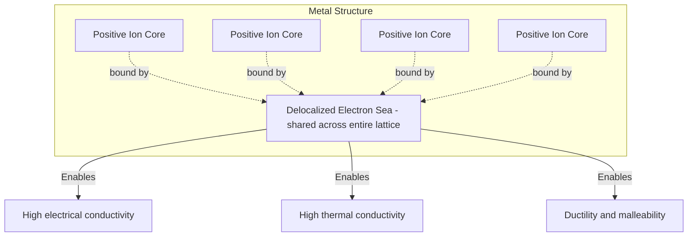

## Bonding in Solids

### Overview

Bonding in solids describes the interatomic and intermolecular forces that hold atoms, ions, or molecules together in a condensed, ordered (or disordered) state. The nature of bonding fundamentally determines a solid's mechanical, electrical, thermal, and optical properties, and solids are conventionally classified into four primary bonding categories — ionic, covalent, metallic, and van der Waals (molecular) — along with hydrogen bonding as a distinct, particularly important special case.

### General Classification of Bonding Types

| Bonding Type | Bonding Mechanism | Typical Bond Energy | Representative Materials |
| --- | --- | --- | --- |
| Ionic | Electrostatic attraction between oppositely charged ions | 3-8 eV/atom pair | NaCl, MgO, CaF₂ |
| Covalent | Shared electron pairs between atoms | 3-10 eV/bond | Diamond, silicon, quartz |
| Metallic | Delocalized "electron sea" among positive ion cores | 1-5 eV/atom | Copper, aluminum, iron |
| Van der Waals (molecular) | Weak dipole-induced dipole attractions | 0.01-0.2 eV/molecule | Solid argon, dry ice ($\text{CO}_2$) |
| Hydrogen bonding | Electrostatic attraction involving H atom bridging electronegative atoms | 0.1-0.4 eV/bond | Ice, DNA base pairing |

*[Inference: These bond energy ranges are commonly cited order-of-magnitude figures for illustrative comparison; precise bond energies vary substantially depending on the specific compound, and many real materials exhibit mixed or intermediate bonding character rather than falling cleanly into a single category.]*

### Ionic Bonding

Ionic bonding arises from the electrostatic (Coulomb) attraction between oppositely charged ions, typically formed through electron transfer from an electropositive atom (forming a cation) to an electronegative atom (forming an anion), driven by the tendency of both resulting ions to achieve stable closed-shell electron configurations.

**Cohesive Energy in Ionic Crystals**

The total cohesive energy of an ionic crystal combines an attractive Coulomb term (summed over all ion pairs, expressed via the Madelung constant $\alpha$) and a short-range repulsive term (arising from Pauli exclusion as electron clouds overlap):

$$U(r) = -\frac{\alpha N e^2}{4\pi\varepsilon_0 r} + \frac{NB}{r^n}$$

where $\alpha$ is the Madelung constant (a geometry-dependent sum accounting for the specific crystal structure), $N$ is the number of ion pairs, $e$ is the elementary charge, $r$ is the nearest-neighbor ion separation, and $B$ and $n$ are empirical constants describing the short-range repulsive interaction (the Born exponent $n$ is typically in the range 6-12).

**Key Points**

- The Madelung constant depends on the specific crystal structure (e.g., $\alpha \approx 1.748$ for the rock-salt NaCl structure), reflecting the geometric arrangement of alternating positive and negative ions and their cumulative long-range electrostatic interactions.
- Ionic crystals are typically characterized by high melting points, brittleness (due to the disruption of alternating charge arrangements under shear stress, causing like-charge ions to repel and fracture the crystal), and electrical insulation in the solid state (since ions are not free to move), while often becoming ionic conductors when molten or dissolved.

### Covalent Bonding

Covalent bonding arises from the sharing of electron pairs between atoms, typically occurring between atoms of similar electronegativity where electron transfer is energetically unfavorable, instead achieving stable electron configurations through orbital overlap and shared electron density.

**Key Points**

- Covalent bonds are highly directional, reflecting the specific geometric requirements of atomic orbital overlap (e.g., the tetrahedral $sp^3$ hybridization in diamond, producing the characteristic diamond cubic crystal structure with four-fold coordination).
- Covalently bonded solids (e.g., diamond, silicon, silicon carbide) are typically characterized by high hardness, high melting points, and, depending on the specific bonding and electronic band structure, may range from electrical insulators (diamond) to semiconductors (silicon, germanium).
- The strength and directionality of covalent bonds directly explains why covalently bonded materials are generally brittle rather than ductile — deforming the crystal requires breaking specific directional bonds rather than allowing atoms to slide past one another as in metallic bonding.

**Hybridization in Carbon-Based Materials**

Carbon's bonding versatility, arising from different hybridization states of its valence orbitals, produces dramatically different material properties:

| Hybridization | Geometry | Coordination | Example Material | Key Properties |
| --- | --- | --- | --- | --- |
| $sp^3$ | Tetrahedral | 4 | Diamond | Extremely hard, wide-bandgap insulator |
| $sp^2$ | Trigonal planar | 3 | Graphite, graphene | Soft (graphite, due to weak interlayer bonding), excellent in-plane conductor |
| $sp$ | Linear | 2 | Carbyne (theoretical/experimental chain form) | High theoretical strength, limited stability |

### Metallic Bonding

Metallic bonding arises when valence electrons become delocalized across the entire crystal, forming a shared "electron sea" or "electron gas" that surrounds and binds together the resulting positively charged ion cores.

**Key Points**

- Delocalized electrons are free to move throughout the crystal under an applied electric field, directly explaining metals' characteristic high electrical and thermal conductivity.
- Metallic bonding is non-directional (unlike covalent bonding), allowing planes of ion cores to slide past one another relatively easily when subjected to stress, explaining metals' characteristic ductility and malleability, since the delocalized electron sea continues to provide cohesive bonding even as atomic layers shift position.
- The free electron gas model (Drude model, and its quantum mechanical refinement, the Sommerfeld free electron model) treats delocalized electrons as a quasi-free particle gas confined within the metal, providing a foundational (though simplified) framework for understanding metallic electrical and thermal transport properties.

**Simplified Metallic Bonding Diagram**

### Van der Waals (Molecular) Bonding

Van der Waals bonding arises from weak, fluctuating electrostatic attractions between induced or permanent dipoles, becoming the dominant (or only) bonding mechanism in solids composed of already-saturated (electronically stable) atoms or molecules, such as noble gas solids or molecular crystals.

**London Dispersion Forces**

Even in atoms/molecules with no permanent dipole moment, instantaneous fluctuations in electron distribution create transient dipoles, which induce corresponding dipoles in neighboring atoms, producing a net attractive force. This attraction, described approximately by a potential proportional to $1/r^6$ at intermediate range, forms the basis of the widely used Lennard-Jones potential model:

$$U(r) = 4\varepsilon\left[\left(\frac{\sigma}{r}\right)^{12} - \left(\frac{\sigma}{r}\right)^6\right]$$

where $\varepsilon$ is the depth of the potential well (characteristic bond energy scale) and $\sigma$ is the finite distance at which the interparticle potential is zero, with the repulsive $r^{-12}$ term modeling short-range Pauli repulsion.

**Key Points**

- Van der Waals bonded solids (e.g., solid argon, solid nitrogen, molecular crystals) are characterized by low melting points, high volatility, and typically poor electrical conductivity, reflecting the comparatively weak binding energy relative to ionic, covalent, or metallic bonding.
- Graphite exemplifies a mixed-bonding material: strong covalent $sp^2$ bonding within each two-dimensional carbon layer, combined with weak van der Waals bonding between layers, directly explaining graphite's characteristic easy interlayer cleavage (useful as a lubricant and in pencil "lead") despite its individual layers being extremely strong.

### Hydrogen Bonding

Hydrogen bonding is a special, intermediate-strength bonding type arising when a hydrogen atom, covalently bonded to a highly electronegative atom (commonly O, N, or F), develops a significant partial positive charge, allowing electrostatic attraction to a lone pair on a nearby electronegative atom.

**Key Points**

- Hydrogen bonding is significantly stronger than typical van der Waals interactions but weaker than covalent or ionic bonds, occupying a distinct intermediate position in the bonding energy hierarchy.
- The anomalously high melting and boiling points of water, along with ice's unusual property of being less dense than liquid water (due to the open hexagonal hydrogen-bonded network structure in ice), are direct consequences of extensive hydrogen bonding.
- Hydrogen bonding plays a structurally essential role in biological macromolecules, including the double-helix stability of DNA (base-pairing) and the secondary structure (alpha helices, beta sheets) of proteins.

### Cohesive Energy Curve: General Form

Regardless of bonding type, the total interatomic potential energy as a function of separation distance $r$ generally exhibits a characteristic shape: strongly repulsive at very short distances (electron cloud overlap, Pauli exclusion), attractive at intermediate distances (the specific bonding mechanism), and approaching zero at large separation.

**Interatomic Potential Energy Curve (svg_diagram)**

<svg xmlns="http://www.w3.org/2000/svg" viewBox="0 0 650 380">
<rect width="650" height="380" fill="#ffffff" />
<text x="325" y="25" font-family="Arial" font-size="16" font-weight="bold" text-anchor="middle" fill="#000000">General Interatomic Potential Energy Curve (svg_diagram)</text>
<line x1="60" y1="200" x2="600" y2="200" stroke="#888888" stroke-width="1" />
<line x1="60" y1="330" x2="60" y2="60" stroke="#000000" stroke-width="2" />
<line x1="60" y1="200" x2="600" y2="200" stroke="#000000" stroke-width="2" />

<text x="580" y="220" font-family="Arial" font-size="13" text-anchor="middle" fill="`#000000`">r (separation)</text>

<text x="30" y="195" font-family="Arial" font-size="13" text-anchor="middle" fill="`#000000`" transform="rotate(-90 30 195)">U(r)</text>

<path d="M 100 60 Q 150 150 200 220 Q 250 300 320 310 Q 400 305 470 260 Q 540 220 590 205" fill="none" stroke="`#1a5fb4`" stroke-width="3" />

<circle cx="320" cy="310" r="5" fill="#c01c28" />
<line x1="320" y1="200" x2="320" y2="310" stroke="#c01c28" stroke-width="1" stroke-dasharray="3,3" />
<text x="320" y="335" font-family="Arial" font-size="11" text-anchor="middle" fill="#c01c28">r0 - equilibrium spacing</text>
<text x="380" y="290" font-family="Arial" font-size="11" fill="#26a269">Bond energy = depth of well</text>
<text x="130" y="100" font-family="Arial" font-size="11" fill="#000000">Repulsive region</text>
<text x="480" y="180" font-family="Arial" font-size="11" fill="#000000">Attractive region</text>
</svg>

**Key Points**

- The equilibrium bond distance $r_0$ occurs where the net force is zero (the minimum of the potential energy curve), and the bond (cohesive) energy corresponds to the depth of this potential well relative to the separated, non-interacting state.
- The curvature (second derivative) of the potential well at $r_0$ directly relates to the material's elastic stiffness, since it determines the restoring force per unit displacement — steeper, narrower wells correspond to stiffer materials with higher elastic moduli.

### Worked Example: Calculating Cohesive Energy from the Madelung Constant

**Example**

Estimate the cohesive energy per ion pair of a hypothetical ionic crystal with the NaCl structure ($\alpha = 1.748$), a nearest-neighbor separation $r_0 = 2.8\ \text{Å}$, singly charged ions ($z = 1$), and a Born repulsive exponent $n = 9$.

**Step 1** — Write the equilibrium cohesive energy expression (derived by minimizing the total potential energy with respect to $r$, which eliminates the empirical constant $B$):

$$U(r_0) = -\frac{\alpha N z^2 e^2}{4\pi\varepsilon_0 r_0}\left(1 - \frac{1}{n}\right)$$

**Step 2** — Compute the base Coulomb term (per ion pair, $N=1$), using $\frac{e^2}{4\pi\varepsilon_0} = 14.4\ \text{eV·Å}$ (a commonly used unit conversion constant):

$$\frac{\alpha z^2 e^2}{4\pi\varepsilon_0 r_0} = \frac{1.748 \times 1 \times 14.4\ \text{eV·Å}}{2.8\ \text{Å}}$$

**Step 3** — Compute the numerator:

$$1.748 \times 14.4 = 25.17\ \text{eV·Å}$$

**Step 4** — Divide by $r_0$:

$$\frac{25.17\ \text{eV·Å}}{2.8\ \text{Å}} = 8.99\ \text{eV}$$

**Step 5** — Apply the Born repulsion correction factor $\left(1 - \frac{1}{n}\right) = \left(1 - \frac{1}{9}\right) = 0.889$:

$$U(r_0) = -8.99\ \text{eV} \times 0.889$$

**Output**

$$U(r_0) \approx -7.99\ \text{eV per ion pair}$$

This result (approximately −8.0 eV) is broadly consistent with the general order of magnitude expected for alkali halide cohesive energies, illustrating how the Madelung constant, ion separation, and Born repulsion exponent combine to determine the overall strength of ionic bonding — with the negative sign indicating a bound (energetically favorable) configuration relative to isolated, infinitely separated ions.

### Comparative Property Summary by Bonding Type

| Property | Ionic | Covalent | Metallic | Van der Waals |
| --- | --- | --- | --- | --- |
| Melting point | High | Very high | Moderate to high | Low |
| Hardness | Hard but brittle | Very hard, brittle | Variable, ductile | Soft |
| Electrical conductivity (solid) | Insulator | Insulator/semiconductor | Good conductor | Insulator |
| Electrical conductivity (molten/dissolved) | Conductor (ionic) | N/A (typically) | Conductor | N/A |
| Optical transparency | Often transparent | Variable | Opaque (reflective) | Often transparent |

### Mixed and Intermediate Bonding Character

**Key Points**

- Real materials frequently exhibit bonding character intermediate between the idealized categories described above — for example, many semiconductor compounds (e.g., gallium arsenide) exhibit a mixture of covalent and ionic character, quantifiable through electronegativity difference and often described using Pauling's ionicity scale.
- Layered materials such as graphite and transition metal dichalcogenides (e.g., $\text{MoS}_2$) exhibit strongly anisotropic bonding — strong in-plane covalent bonding combined with weak out-of-plane van der Waals bonding — a structural feature increasingly relevant to modern two-dimensional materials research (e.g., graphene, exfoliated 2D semiconductor devices).

**Conclusion**

Bonding in solids arises from four principal mechanisms — ionic, covalent, metallic, and van der Waals — along with the special intermediate case of hydrogen bonding, each characterized by distinct force origins, bond energies, and resulting material properties. Ionic bonding produces hard, brittle, high-melting insulators; covalent bonding produces strong, directional, often extremely hard materials; metallic bonding, via its delocalized electron sea, uniquely combines strength with ductility and excellent conductivity; and van der Waals bonding produces comparatively weak, low-melting solids. Understanding which bonding mechanism (or combination thereof) governs a given material provides the essential foundation for predicting and engineering its mechanical, electrical, thermal, and optical behavior.

**Related Topics**

- Crystal structure and Bravais lattices (geometric framework for bonded solids)
- Free electron theory and band structure in metals
- Semiconductor bonding and band gap engineering
- Elastic constants and the relationship to interatomic potential curvature
- Two-dimensional materials and van der Waals heterostructures
- Ionic conductivity and solid electrolytes
- Polymer bonding and intermolecular forces in molecular solids
- Electronegativity scales and bond ionicity quantification