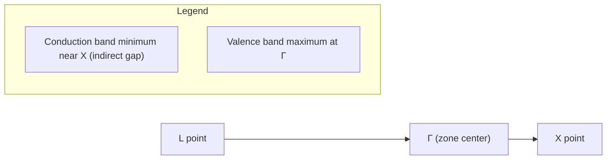

## Band Theory of Solids

### Overview

Band theory explains how electrons behave in crystalline solids by describing how the discrete energy levels of isolated atoms broaden into continuous **bands** of allowed energy when atoms are brought together into a periodic lattice. It underlies the classification of materials as conductors, semiconductors, and insulators, and forms the theoretical basis for semiconductor devices, optoelectronics, and much of solid-state physics.

### Origin: From Discrete Levels to Bands

In an isolated atom, electrons occupy discrete, sharply defined energy levels. When $N$ atoms are brought together to form a solid:

- Each atomic energy level splits into $N$ closely spaced sublevels due to the Pauli exclusion principle (no two electrons in the combined system can occupy the exact same quantum state).
- For a macroscopic crystal, $N \sim 10^{23}$, so these sublevels merge into a quasi-continuous **band** of allowed energies.
- Bands are separated by **band gaps** — energy ranges where no electron states exist, corresponding to the original gaps between atomic energy levels.

The width of a band depends on the degree of orbital overlap between neighboring atoms: tightly bound inner-shell electrons produce narrow bands, while outer valence electrons, with greater wavefunction overlap, produce wider bands.

### Bloch's Theorem

The foundation of band theory is **Bloch's theorem**, which describes electron behavior in a periodic potential $U(\mathbf{r})$ satisfying $U(\mathbf{r} + \mathbf{R}) = U(\mathbf{r})$ for lattice vectors $\mathbf{R}$.

Bloch's theorem states that solutions to the Schrödinger equation in such a potential take the form:

$$\psi_{\mathbf{k}}(\mathbf{r}) = e^{i\mathbf{k}\cdot\mathbf{r}} u_{\mathbf{k}}(\mathbf{r})$$

where $u_{\mathbf{k}}(\mathbf{r})$ has the same periodicity as the lattice: $u_{\mathbf{k}}(\mathbf{r} + \mathbf{R}) = u_{\mathbf{k}}(\mathbf{r})$.

These solutions, called **Bloch functions** or **Bloch states**, are plane waves modulated by a lattice-periodic function. The quantity $\mathbf{k}$ is the **crystal momentum**, a quantum number that behaves analogously to but is distinct from true momentum — it is only defined modulo a reciprocal lattice vector $\mathbf{G}$.

For each $\mathbf{k}$, the Schrödinger equation yields a discrete set of energy eigenvalues $E_n(\mathbf{k})$, where $n$ is the **band index**. The functions $E_n(\mathbf{k})$ define the **band structure** of the solid.

### Models Used to Derive Band Structure

#### Nearly Free Electron Model

Starts from free electrons ($E = \hbar^2 k^2 / 2m$) and treats the periodic lattice potential as a weak perturbation.

- Away from the Brillouin zone boundaries, the dispersion is nearly free-electron-like.
- At zone boundaries ($k = \pm n\pi/a$ for lattice constant $a$), Bragg reflection of electron waves causes standing waves to form, splitting the energy into two values and opening a **band gap**.
- The gap magnitude is approximately twice the relevant Fourier component of the periodic potential.

#### Tight-Binding Model (LCAO)

Starts from isolated atomic orbitals and treats inter-atomic overlap as a perturbation.

- Atomic orbitals combine into Bloch sums; overlap integrals ("hopping" terms) determine bandwidth.
- For a simple 1D chain with lattice constant $a$ and nearest-neighbor hopping energy $t$:

$$E(k) = E_0 - 2t\cos(ka)$$

- Produces good qualitative agreement for narrow bands (e.g., $d$-bands in transition metals) and is the conceptual basis for modern computational methods (e.g., Wannier functions, DFT+U).

Both models are limiting cases of the same underlying physics and typically agree well in the interior of bands while differing in emphasis near band edges and gaps.

### Brillouin Zones and k-space

The **first Brillouin zone (BZ)** is the Wigner-Seitz cell of the reciprocal lattice — the set of $\mathbf{k}$-points closer to the origin than to any other reciprocal lattice point. Because $E_n(\mathbf{k})$ is periodic in reciprocal space, all distinct electronic states can be represented within the first BZ (the **reduced zone scheme**).

Band structures are commonly plotted along high-symmetry paths connecting special points in the BZ (e.g., Γ, X, L, K for an FCC lattice), since these paths capture the essential features of $E_n(\mathbf{k})$ with minimal redundancy.

### Density of States (DOS)

The **density of states** $g(E)$ gives the number of electron states per unit energy per unit volume:

$$g(E) = \frac{1}{V}\sum_n \int_{BZ} \delta(E - E_n(\mathbf{k})) \, \frac{d^3k}{(2\pi)^3}$$

- For a 3D free-electron-like band, $g(E) \propto \sqrt{E}$.
- **Van Hove singularities** — sharp features (kinks, divergences) in $g(E)$ — occur where $\nabla_{\mathbf{k}} E_n(\mathbf{k}) = 0$ (band extrema and saddle points).
- DOS determines thermodynamic and transport quantities: electronic specific heat, Pauli susceptibility, and (via the Fermi-Dirac distribution) carrier concentration.

### Filling Bands: Metals, Semiconductors, Insulators

At $T = 0\ \text{K}$, electrons fill available states from the lowest energy upward, up to the **Fermi energy** $E_F$, following the Pauli exclusion principle. Each band, considering spin degeneracy, can hold $2N$ electrons for $N$ primitive cells.

Whether a material conducts depends on how bands are filled relative to gaps:

**Metals**

- The Fermi level lies within a band (partially filled band), or a filled band overlaps in energy with an empty band.
- Electrons near $E_F$ can be excited into adjacent unoccupied states by an arbitrarily small electric field or thermal energy, enabling conduction even as $T \to 0$.

**Insulators**

- The **valence band** (highest filled band) is completely full, and the **conduction band** (lowest empty band) is separated by a large band gap $E_g$ (typically $> 4\ \text{eV}$, e.g., diamond: $E_g \approx 5.5\ \text{eV}$).
- Thermal energy at room temperature ($k_BT \approx 0.025\ \text{eV}$) is far too small to promote a significant number of electrons across the gap.

**Semiconductors**

- Same band structure as insulators, but with a smaller gap (typically $0.1$–$3\ \text{eV}$; silicon: $E_g \approx 1.12\ \text{eV}$; germanium: $E_g \approx 0.67\ \text{eV}$).
- Thermal excitation, doping, or photon absorption promotes a non-negligible number of electrons into the conduction band, leaving **holes** (missing electrons, treated as positive charge carriers) in the valence band.
- Conductivity increases sharply with temperature, in contrast to metals.

**(svg_diagram) Band Filling: Metal vs. Semiconductor vs. Insulator**

<svg xmlns="http://www.w3.org/2000/svg" viewBox="0 0 720 300" font-family="sans-serif">
<text x="360" y="20" text-anchor="middle" font-size="16" font-weight="bold">Band Filling: Metal vs. Semiconductor vs. Insulator (svg_diagram)</text>

<g>
<text x="110" y="45" text-anchor="middle" font-size="13" font-weight="bold">Metal</text>
<rect x="60" y="150" width="100" height="90" fill="#7fb3d5" stroke="black" />
<text x="110" y="200" text-anchor="middle" font-size="11">Partially filled</text>
<line x1="60" y1="150" x2="160" y2="150" stroke="red" stroke-width="2" stroke-dasharray="4,2" />
<text x="165" y="153" font-size="10" fill="red">E_F</text>
</g>

<g>
<text x="360" y="45" text-anchor="middle" font-size="13" font-weight="bold">Semiconductor</text>
<rect x="310" y="60" width="100" height="60" fill="white" stroke="black" />
<text x="360" y="95" text-anchor="middle" font-size="11">Conduction band (empty)</text>
<rect x="310" y="130" width="100" height="10" fill="#f4d03f" stroke="black" />
<text x="415" y="105" font-size="10">small E_g</text>
<rect x="310" y="140" width="100" height="100" fill="#7fb3d5" stroke="black" />
<text x="360" y="195" text-anchor="middle" font-size="11">Valence band (full)</text>
</g>

<g>
<text x="610" y="45" text-anchor="middle" font-size="13" font-weight="bold">Insulator</text>
<rect x="560" y="60" width="100" height="60" fill="white" stroke="black" />
<text x="610" y="95" text-anchor="middle" font-size="11">Conduction band (empty)</text>
<rect x="560" y="130" width="100" height="10" fill="#e74c3c" stroke="black" />
<text x="665" y="105" font-size="10">large E_g</text>
<rect x="560" y="140" width="100" height="100" fill="#7fb3d5" stroke="black" />
<text x="610" y="195" text-anchor="middle" font-size="11">Valence band (full)</text>
</g>
<line x1="10" y1="260" x2="700" y2="260" stroke="black" stroke-width="1" />
<text x="10" y="280" font-size="11">Energy increases upward within each column</text>
</svg>

### Effective Mass

Near a band extremum, $E_n(\mathbf{k})$ can be approximated by a parabola, allowing electrons to be treated as quasi-free particles with an **effective mass** $m^*$:

$$m^* = \hbar^2 \left(\frac{d^2E}{dk^2}\right)^{-1}$$

- Large curvature (flat bands have small curvature, dispersive bands have large curvature) $\Rightarrow$ small $m^*$ $\Rightarrow$ high electron mobility.
- Near the top of a band, curvature is negative, giving a negative effective mass — consistent with treating the absence of an electron there as a positively charged **hole** with positive effective mass.
- Effective mass absorbs the effect of the periodic lattice potential, allowing semiclassical transport equations (e.g., $\mathbf{F} = m^* \mathbf{a}$) to be applied directly.

### Direct vs. Indirect Band Gaps

- **Direct gap**: The valence band maximum and conduction band minimum occur at the same $\mathbf{k}$-point (e.g., GaAs). Optical transitions across the gap require only a photon (negligible momentum) and are efficient — important for LEDs and laser diodes.
- **Indirect gap**: The extrema occur at different $\mathbf{k}$-points (e.g., silicon, germanium). Transitions require a phonon to supply/absorb the crystal momentum difference, making optical absorption/emission much weaker — a key reason silicon is a poor light emitter.

### Doping and Impurity Bands (Applied Context)

Although central to Solid State Electronics rather than pure Band Theory, doping is a direct application:

- **Donor** impurities (e.g., phosphorus in silicon) introduce energy levels just below the conduction band, easily ionized to supply free electrons (**n-type**).
- **Acceptor** impurities (e.g., boron in silicon) introduce levels just above the valence band, easily ionized to accept electrons and create holes (**n-type** vs **p-type** distinction: **p-type**).
- These impurity levels lie within the "forbidden" gap of the pure crystal and shift the Fermi level toward the respective band.

### Limitations of Single-Electron Band Theory

Standard band theory relies on the independent-electron (mean-field) approximation and does not capture:

- **Strong electron correlation effects**, such as in Mott insulators (e.g., NiO), which band theory incorrectly predicts to be metallic due to a partially filled $d$-band; the actual insulating behavior arises from strong on-site Coulomb repulsion.
- **Excitonic effects**, where electron-hole Coulomb attraction creates bound states below the conduction band edge, relevant for optical spectra.
- [Inference] Quantitative accuracy of computed band gaps depends strongly on the theoretical method used; standard DFT with local/semi-local exchange-correlation functionals is well documented to systematically underestimate band gaps, often requiring hybrid functionals or many-body perturbation theory (e.g., GW approximation) for closer agreement with experiment.

### Example: Silicon Band Structure Path

A representative computational band structure plot for silicon is generated along the high-symmetry path L–Γ–X in the FCC Brillouin zone:

**Key Points**

- Band gap of Si ($\approx 1.12\ \text{eV}$) is indirect: VBM at Γ, CBM near X.
- This indirectness is why silicon-based LEDs/lasers are inefficient compared to direct-gap III-V materials like GaAs.

### Related Topics

- Free Electron (Sommerfeld) Model
- Fermi-Dirac Statistics and the Fermi Surface
- Semiconductor Physics: p-n Junctions
- Density Functional Theory (DFT) and the GW Approximation
- Phonons and Electron-Phonon Coupling
- Superconductivity (BCS Theory)
- Topological Insulators and Band Topology (Berry Phase, Chern Numbers)