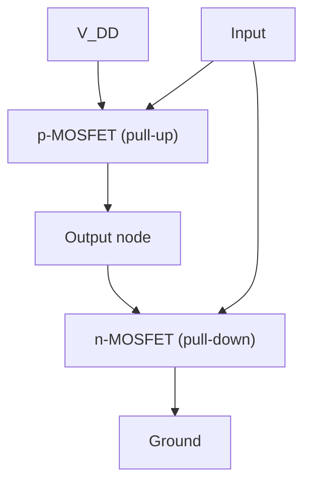

## Semiconductor Devices

### Overview

Semiconductor devices exploit controlled non-uniformities in doping, geometry, and applied fields within semiconductor crystals to achieve rectification, amplification, switching, and light interaction. Nearly all modern devices are built from a small set of foundational structures — the p-n junction, the bipolar junction transistor, and the field-effect transistor — combined with optoelectronic variants. This section develops each from the band-theory and carrier-transport concepts of intrinsic/extrinsic semiconductors.

### The p-n Junction

**Formation**: A p-n junction is formed at the interface between p-type (acceptor-doped, hole-majority) and n-type (donor-doped, electron-majority) regions of the same semiconductor crystal (a **homojunction**).

**Depletion region formation**:

- At the moment of contact, large carrier concentration gradients drive diffusion: holes diffuse from p to n, electrons diffuse from n to p.
- As mobile carriers leave the vicinity of the junction, they uncover fixed, ionized dopant charges — negative acceptor ions on the p-side, positive donor ions on the n-side — creating a region depleted of mobile carriers, the **depletion region** (or space-charge region).
- This fixed charge sets up an internal electric field pointing from n to p, which opposes further diffusion. Equilibrium is reached when the diffusion current is exactly balanced by the drift current driven by this **built-in field**.

**Built-in potential**:

$$V_{bi} = \frac{k_BT}{q}\ln\!\left(\frac{N_a N_d}{n_i^2}\right)$$

**Depletion width** (step-junction approximation):

$$W = \sqrt{\frac{2\varepsilon_s}{q}\left(\frac{1}{N_a}+\frac{1}{N_d}\right)(V_{bi}-V)}$$

where $\varepsilon_s$ is the semiconductor permittivity and $V$ is the applied bias (positive for forward bias).

**Band diagram at equilibrium**: The Fermi level $E_F$ is flat (constant) throughout the structure at equilibrium (no net current), which forces the conduction and valence bands to bend across the depletion region — this band bending is the physical origin of $V_{bi}$.

**(svg_diagram) p-n Junction Band Diagram at Equilibrium**

<svg xmlns="http://www.w3.org/2000/svg" viewBox="0 0 640 240" font-family="sans-serif">
<text x="320" y="18" text-anchor="middle" font-size="15" font-weight="bold">p-n Junction Band Diagram at Equilibrium (svg_diagram)</text>
<path d="M40,90 L260,90 L380,50 L600,50" stroke="black" fill="none" stroke-width="2" />
<text x="40" y="80" font-size="11">E_c (p)</text>
<text x="605" y="45" font-size="11">E_c (n)</text>
<path d="M40,170 L260,170 L380,130 L600,130" stroke="black" fill="none" stroke-width="2" />
<text x="40" y="185" font-size="11">E_v (p)</text>
<text x="605" y="125" font-size="11">E_v (n)</text>
<line x1="20" y1="110" x2="620" y2="110" stroke="red" stroke-width="1.5" stroke-dasharray="5,3" />
<text x="20" y="105" font-size="11" fill="red">E_F (flat)</text>
<rect x="260" y="30" width="120" height="160" fill="#f4d03f" opacity="0.25" />
<text x="320" y="215" text-anchor="middle" font-size="11">Depletion region (width W)</text>
<text x="90" y="120" font-size="11">p-type</text>
<text x="530" y="120" font-size="11">n-type</text>
</svg>

**Biasing behavior**:

| Bias condition | Effect on depletion width | Effect on barrier | Current behavior |
| --- | --- | --- | --- |
| Forward ($V>0$, p side +) | Narrows | Lowered by $qV$ | Exponential increase in diffusion current |
| Reverse ($V<0$) | Widens | Raised | Small, roughly constant saturation current $I_0$ |

**Ideal diode equation** (Shockley equation):

$$I = I_0\left(\exp\!\left(\frac{qV}{k_BT}\right) - 1\right)$$

- $I_0$ is the reverse saturation current, arising from minority carrier diffusion into the depletion region and set by minority carrier diffusion lengths, lifetimes, and doping concentrations.
- [Inference] Real diodes deviate from this ideal form at high current (series resistance effects) and via recombination-generation current in the depletion region (captured empirically by an ideality factor $n$ in the exponent, $qV/nk_BT$), so quoted $I$–$V$ curves from real devices should be expected to diverge from the ideal equation at the extremes.

**Reverse breakdown mechanisms**:

- **Zener breakdown**: In heavily doped junctions with narrow depletion width, high electric field directly tunnels valence electrons into the conduction band.
- **Avalanche breakdown**: In lightly doped, wider junctions, carriers accelerated by the field gain enough energy to impact-ionize lattice atoms, triggering a multiplicative avalanche of carrier generation.

### Bipolar Junction Transistor (BJT)

A BJT consists of three alternately doped regions — **emitter**, **base**, **collector** — forming two back-to-back junctions (npn or pnp). The base is thin and lightly doped relative to the emitter.

**Operating principle (npn, active mode)**:

1. Emitter-base junction is forward biased: electrons are injected from the (heavily doped) emitter into the (thin, lightly doped) base.
2. Because the base is thin, most injected electrons diffuse across it before recombining, reaching the base-collector depletion region.
3. Base-collector junction is reverse biased: the field there sweeps these electrons into the collector, constituting the collector current $I_C$.
4. Only a small fraction of injected carriers recombine in the base, constituting the base current $I_B$.

**Current gain**:

$$\beta = \frac{I_C}{I_B} \quad (\text{typically } 50\text{–}200)$$

$$I_E = I_B + I_C$$

**Operating regions** (npn, defined by junction bias states):

| Region | EB junction | BC junction | Behavior |
| --- | --- | --- | --- |
| Active | Forward | Reverse | Amplification ($I_C \approx \beta I_B$) |
| Saturation | Forward | Forward | "On" switch state, $V_{CE}$ small |
| Cutoff | Reverse | Reverse | "Off" switch state, negligible current |
| Reverse-active | Reverse | Forward | Rarely used, low gain |

### Field-Effect Transistors (FETs)

Unlike BJTs (current-controlled, bipolar carrier transport), FETs are voltage-controlled devices relying on a single carrier type (unipolar).

#### MOSFET (Metal-Oxide-Semiconductor FET)

**Structure**: A gate electrode (historically metal, now often polysilicon) separated from the semiconductor body by a thin insulating oxide (typically $\text{SiO}_2$ or high-$\kappa$ dielectric), with heavily doped source and drain regions of opposite doping type to the body.

**n-channel MOSFET operation**:

1. With zero or low gate voltage, source and drain (n+ regions) are separated by the p-type body — effectively back-to-back diodes, so no conduction path exists.
2. Applying a sufficiently positive gate voltage $V_{GS} > V_{th}$ (threshold voltage) attracts electrons to the oxide-semiconductor interface, forming a thin **inversion layer** (n-type channel) connecting source and drain.
3. Current flow through this channel is then modulated by both $V_{GS}$ (channel conductivity) and $V_{DS}$ (drain-source voltage).

**Operating regions**:

| Region | Condition | Behavior |
| --- | --- | --- |
| Cutoff | $V_{GS} < V_{th}$ | No channel, $I_D \approx 0$ |
| Triode/Linear | $V_{GS} > V_{th}$, $V_{DS} < V_{GS}-V_{th}$ | $I_D$ depends on both $V_{GS}$ and $V_{DS}$, resistor-like |
| Saturation | $V_{GS} > V_{th}$, $V_{DS} \geq V_{GS}-V_{th}$ | $I_D$ nearly independent of $V_{DS}$, used for amplification |

Simplified long-channel saturation current:

$$I_D = \frac{1}{2}\mu_n C_{ox}\frac{W}{L}(V_{GS}-V_{th})^2$$

where $\mu_n$ is channel electron mobility, $C_{ox}$ is oxide capacitance per unit area, and $W/L$ is the channel width-to-length ratio.

[Inference] This square-law model is a long-channel approximation; modern sub-100 nm MOSFETs exhibit substantial deviations (velocity saturation, short-channel effects, mobility degradation), requiring more elaborate compact models (e.g., BSIM) for accurate circuit simulation.

#### JFET (Junction FET)

Uses a reverse-biased p-n junction (rather than an oxide) to control channel conductivity: increasing reverse bias on the gate widens the depletion region into the channel, pinching it off (reducing conductive cross-section) and reducing drain current. JFETs are normally-on (depletion-mode) devices, in contrast to standard enhancement-mode MOSFETs.

### CMOS Logic (Applied Context)

Complementary MOS (CMOS) technology pairs an n-channel and p-channel MOSFET to implement logic gates with very low static power dissipation (current flows only during switching transitions), forming the basis of virtually all modern digital integrated circuits.

### Optoelectronic Devices

**Light-Emitting Diodes (LEDs)**:

- Forward-biased p-n junction; injected electrons and holes recombine radiatively across the band gap, emitting a photon of energy $h\nu \approx E_g$.
- Efficient LEDs require **direct-bandgap** materials (e.g., GaAs, GaN, InGaN) since radiative recombination does not require phonon-assisted momentum conservation.

**Photodiodes / Solar Cells**:

- Reverse operation of the LED mechanism: absorbed photons with $h\nu > E_g$ generate electron-hole pairs; the junction's built-in field separates them before recombination, producing photocurrent.
- Solar cell efficiency is fundamentally bounded by the trade-off between absorbing a broad solar spectrum (favoring smaller $E_g$) and maximizing voltage output per absorbed photon (favoring larger $E_g$), formalized in the **Shockley-Queisser limit**.

**Laser Diodes**: Require a direct-bandgap active region, population inversion (achieved via heavy carrier injection), and optical feedback (typically cleaved-facet or distributed-feedback cavities) to achieve stimulated emission and coherent light output.

### Related Topics

- Band Theory of Solids
- Conductors, Insulators, and Semiconductors
- Carrier Transport: Drift, Diffusion, and Mobility
- Heterojunctions and Quantum Wells
- Integrated Circuit Fabrication (Photolithography, Doping Processes)
- Semiconductor Noise and Reliability Physics
- Shockley-Queisser Limit and Photovoltaic Physics