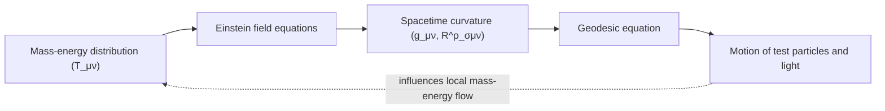

## Curved Spacetime and Riemannian Geometry

### Overview

General relativity reinterprets gravity not as a force but as a geometric property of spacetime: massive objects curve the four-dimensional fabric of spacetime, and this curvature dictates the motion of matter and light. The mathematical language required to make this precise is **Riemannian (more precisely, pseudo-Riemannian or Lorentzian) geometry** — a framework generalizing familiar Euclidean geometry to curved manifolds. This section develops the geometric machinery — manifolds, metrics, curvature tensors — needed to state and interpret the Einstein field equations.

### Manifolds: Generalizing Flat Space

A **manifold** is a space that, while possibly globally curved, looks locally like flat Euclidean (or Minkowski) space. The surface of a sphere is the standard illustrative example: it is not flat globally (parallel lines drawn on it can converge, and the sum of triangle angles exceeds 180°), yet a sufficiently small patch of it looks and behaves like a flat 2D plane.

Spacetime in general relativity is modeled as a 4-dimensional **Lorentzian manifold**: locally it resembles flat Minkowski spacetime (of special relativity), but globally it may be curved by the presence of mass-energy. Coordinates $x^\mu$ (for $\mu = 0,1,2,3$, with $x^0 = ct$) label points (**events**) on this manifold, but coordinates themselves carry no intrinsic physical meaning — only geometric invariants (constructed from the metric and its derivatives) are physically meaningful, a principle known as **general covariance**.

### The Metric Tensor

The **metric tensor** $g_{\mu\nu}$ is the central mathematical object of Riemannian/Lorentzian geometry. It generalizes the Pythagorean theorem, defining the infinitesimal spacetime interval (proper distance/time) between neighboring events:

$$ds^2 = g_{\mu\nu}\,dx^\mu dx^\nu$$

(using the Einstein summation convention, where repeated upper/lower indices are summed over $0$–$3$).

**Flat spacetime (Minkowski metric)**: In special relativity, using signature convention $(-,+,+,+)$:

$$ds^2 = -c^2dt^2 + dx^2 + dy^2 + dz^2, \qquad \eta_{\mu\nu} = \text{diag}(-1,1,1,1)$$

**Curved spacetime**: $g_{\mu\nu}$ becomes a function of position, encoding both the curvature of spacetime and the choice of coordinate system. $g_{\mu\nu}$ is symmetric ($g_{\mu\nu}=g_{\nu\mu}$), so it has 10 independent components in 4 dimensions.

**Properties**:

- The metric determines distances, angles, volumes, and — crucially — the causal structure of spacetime (which events can influence which others), via the sign of $ds^2$: timelike ($ds^2<0$), spacelike ($ds^2>0$), or null/lightlike ($ds^2=0$) intervals.
- The metric's **signature** (the pattern of $+$ and $-$ signs among its eigenvalues) remains fixed at $(-,+,+,+)$ (or the equivalent $(+,-,-,-)$ convention) everywhere on a physically valid spacetime manifold, distinguishing Lorentzian geometry from purely spatial (Riemannian, all-positive signature) geometry.
- The inverse metric $g^{\mu\nu}$ satisfies $g^{\mu\alpha}g_{\alpha\nu} = \delta^\mu_\nu$ and is used to "raise" indices, just as $g_{\mu\nu}$ "lowers" them.

**(svg_diagram) Curved vs. Flat Geometry: Triangle Angle Sum**

<svg xmlns="http://www.w3.org/2000/svg" viewBox="0 0 620 300" font-family="sans-serif">
<text x="310" y="20" text-anchor="middle" font-size="15" font-weight="bold">Curved vs. Flat Geometry: Triangle Angle Sum (svg_diagram)</text>
<g>
<text x="150" y="45" text-anchor="middle" font-size="12" font-weight="bold">Flat (Euclidean)</text>
<polygon points="80,220 220,220 150,90" fill="none" stroke="black" stroke-width="2" />
<text x="150" y="240" text-anchor="middle" font-size="11">Angle sum = 180°</text>
</g>
<g>
<text x="460" y="45" text-anchor="middle" font-size="12" font-weight="bold">Curved (spherical, positive curvature)</text>
<ellipse cx="460" cy="150" rx="110" ry="110" fill="none" stroke="#aaa" stroke-width="1" />
<path d="M 460,50 A 110,110 0 0,1 560,190" stroke="black" fill="none" stroke-width="2" />
<path d="M 460,50 A 160,160 0 0,0 360,190" stroke="black" fill="none" stroke-width="2" />
<path d="M 360,190 A 220,50 0 0,0 560,190" stroke="black" fill="none" stroke-width="2" />
<text x="460" y="260" text-anchor="middle" font-size="11">Angle sum &gt; 180°</text>
</g>
</svg>

### Coordinate Transformations and Tensors

Because coordinates carry no intrinsic meaning, physical laws in general relativity must be expressible as **tensor equations**, which transform consistently between coordinate systems. Under a coordinate transformation $x^\mu \to x'^\mu$:

- A **contravariant vector** (upper index) transforms as $V'^\mu = \frac{\partial x'^\mu}{\partial x^\nu}V^\nu$.
- A **covariant vector** (lower index, e.g., a gradient) transforms as $\omega'_\mu = \frac{\partial x^\nu}{\partial x'^\mu}\omega_\nu$.
- General tensors transform with one such factor per index.

This formalism ensures that if a tensor equation holds in one coordinate system, it holds in all coordinate systems — the mathematical embodiment of the **principle of general covariance**, which requires that the laws of physics take the same form regardless of the coordinate system (or, physically, the reference frame/observer) used to describe them.

### Covariant Derivatives and Christoffel Symbols

Ordinary partial derivatives of tensor components do not generally transform as tensors on a curved manifold (because the basis vectors themselves change from point to point). The **covariant derivative** $\nabla_\mu$ corrects for this, incorporating **Christoffel symbols** $\Gamma^\lambda_{\mu\nu}$ (also called the **connection**), which quantify how basis vectors change across the manifold:

$$\nabla_\mu V^\lambda = \partial_\mu V^\lambda + \Gamma^\lambda_{\mu\nu}V^\nu$$

The Christoffel symbols are derived directly from the metric (assuming the standard **Levi-Civita connection**, which is metric-compatible and torsion-free — the connection used throughout standard general relativity):

$$\Gamma^\lambda_{\mu\nu} = \frac{1}{2}g^{\lambda\sigma}\left(\partial_\mu g_{\sigma\nu} + \partial_\nu g_{\sigma\mu} - \partial_\sigma g_{\mu\nu}\right)$$

Christoffel symbols are **not tensors** themselves (they vanish in locally flat/inertial coordinates at a point, by the equivalence principle, but not globally) — they represent the effect of coordinate curvature/choice combined with genuine spacetime curvature.

### Geodesics: Straightest Possible Paths

A **geodesic** generalizes the concept of a "straight line" to curved spacetime: it is the path that extremizes (locally, typically maximizes for timelike paths) the proper time or proper length between two points, or equivalently, the path along which a vector is "parallel transported" without any covariant change in direction. Free-falling particles (subject to gravity alone) follow timelike geodesics; light follows null geodesics.

**Geodesic equation**:

$$\frac{d^2x^\mu}{d\tau^2} + \Gamma^\mu_{\alpha\beta}\frac{dx^\alpha}{d\tau}\frac{dx^\beta}{d\tau} = 0$$

where $\tau$ is proper time (for timelike paths) or an affine parameter (for null paths). This equation directly encodes the equivalence principle: in locally flat coordinates at a point (where $\Gamma^\mu_{\alpha\beta}=0$), it reduces to $d^2x^\mu/d\tau^2 = 0$ — motion in a straight line at constant velocity, exactly as expected for a freely falling (i.e., locally inertial) observer with no forces acting.

### Curvature: The Riemann Tensor

Curvature is quantified by examining how a vector changes when **parallel transported** around a small closed loop. On a flat manifold, the vector returns to its original orientation; on a curved manifold, it generally does not — the mismatch defines curvature.

**Riemann curvature tensor**:

$$R^\rho_{\ \sigma\mu\nu} = \partial_\mu\Gamma^\rho_{\nu\sigma} - \partial_\nu\Gamma^\rho_{\mu\sigma} + \Gamma^\rho_{\mu\lambda}\Gamma^\lambda_{\nu\sigma} - \Gamma^\rho_{\nu\lambda}\Gamma^\lambda_{\mu\sigma}$$

- This is the fundamental, unambiguous measure of intrinsic curvature: $R^\rho_{\ \sigma\mu\nu} = 0$ everywhere if and only if the manifold is flat (equivalent, via a coordinate transformation, to ordinary Minkowski or Euclidean space) — it cannot be made to vanish merely by a coordinate choice, unlike the Christoffel symbols.
- In 4D spacetime, the Riemann tensor has 20 independent components (after accounting for its symmetries), encoding the full **tidal** structure of the gravitational field: it governs the relative acceleration between nearby freely falling geodesics (the **geodesic deviation equation**), directly explaining physical tidal forces (e.g., stretching of an object falling into a black hole).

**Contractions of the Riemann tensor**:

**Ricci tensor** (contraction over one index pair):

$$R_{\mu\nu} = R^\lambda_{\ \mu\lambda\nu}$$

**Ricci scalar** (further contraction, a single number at each point summarizing overall curvature):

$$R = g^{\mu\nu}R_{\mu\nu}$$

**Einstein tensor** (a specific combination used directly in the field equations, constructed to automatically satisfy a conservation law):

$$G_{\mu\nu} = R_{\mu\nu} - \frac{1}{2}g_{\mu\nu}R$$

- The Ricci tensor describes how a small volume of freely falling test particles changes in *volume* under curvature (related to the local presence of mass-energy at that point), while the full Riemann tensor additionally captures *shape*-distorting (tidal) curvature that can be nonzero even in vacuum (e.g., outside a spherical mass, or in gravitational waves), where $R_{\mu\nu}=0$ but $R^\rho_{\ \sigma\mu\nu} \neq 0$.

### Connection to the Einstein Field Equations

The geometric apparatus developed above culminates in the **Einstein field equations**, which relate spacetime curvature to the distribution of mass-energy:

$$G_{\mu\nu} + \Lambda g_{\mu\nu} = \frac{8\pi G}{c^4}T_{\mu\nu}$$

where $T_{\mu\nu}$ is the stress-energy tensor (describing the density and flux of energy and momentum) and $\Lambda$ is the cosmological constant. This is a set of 10 coupled, generally nonlinear partial differential equations for the metric components $g_{\mu\nu}$, given a specified matter/energy distribution — famously summarized by physicist John Wheeler's aphorism: matter tells spacetime how to curve, and curved spacetime tells matter how to move (the latter via the geodesic equation).

### Local Flatness and the Equivalence Principle Revisited

A key mathematical fact underlying the equivalence principle is that at any single point $P$ on a smooth manifold, coordinates can always be chosen (**Riemann normal coordinates** or **locally inertial coordinates**) such that:

$$g_{\mu\nu}(P) = \eta_{\mu\nu}, \qquad \partial_\lambda g_{\mu\nu}(P) = 0 \ \ (\text{hence } \Gamma^\lambda_{\mu\nu}(P) = 0)$$

but generally $\partial_\lambda \partial_\sigma g_{\mu\nu}(P) \neq 0$ (the Riemann tensor, built from second derivatives of the metric, need not vanish). This formalizes the equivalence principle mathematically: gravity (the Christoffel symbols) can always be locally transformed away at a single point by an appropriate choice of freely falling coordinates, but genuine curvature (tidal effects, encoded in the Riemann tensor) cannot be removed by any coordinate choice — it is an intrinsic, coordinate-independent property of the manifold.

### Related Topics

- The Equivalence Principle (WEP, EEP, SEP)
- The Einstein Field Equations and Their Solutions
- The Schwarzschild Solution and Black Holes
- Geodesic Deviation and Tidal Forces
- Gravitational Waves as Ripples in Spacetime Curvature
- Cosmological Models: FLRW Metric and the Friedmann Equations
- Tensor Calculus and Differential Geometry (Manifolds, Killing Vectors)