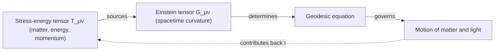

## The Einstein Field Equations

### Overview

The Einstein field equations (EFE) are the central equations of general relativity, relating the geometry of spacetime — encoded in the metric tensor $g_{\mu\nu}$ and its curvature — to the distribution of mass, energy, and momentum within it. Published by Einstein in November 1915, they replace Newton's law of universal gravitation with a geometric theory in which gravity is not a force but a manifestation of spacetime curvature sourced by matter and energy.

### Statement of the Field Equations

$$G_{\mu\nu} + \Lambda g_{\mu\nu} = \frac{8\pi G}{c^4}T_{\mu\nu}$$

where:

- $G_{\mu\nu} = R_{\mu\nu} - \frac{1}{2}g_{\mu\nu}R$ is the **Einstein tensor**, built from the Ricci tensor $R_{\mu\nu}$ and Ricci scalar $R$ (both derived from the metric and its first and second derivatives).
- $\Lambda$ is the **cosmological constant**.
- $g_{\mu\nu}$ is the metric tensor.
- $G$ is Newton's gravitational constant and $c$ is the speed of light.
- $T_{\mu\nu}$ is the **stress-energy tensor**, describing the density and flux of energy and momentum from all matter and non-gravitational fields present.

Because $G_{\mu\nu}$, $g_{\mu\nu}$, and $T_{\mu\nu}$ are each symmetric $4\times 4$ tensors, the EFE constitute **10 independent, coupled, generally nonlinear, second-order partial differential equations** for the 10 independent metric components $g_{\mu\nu}(x)$, given a specified $T_{\mu\nu}$.

### Physical Content and Wheeler's Summary

The EFE express a two-way relationship famously condensed by physicist John Wheeler: *matter tells spacetime how to curve, and curved spacetime tells matter how to move.*

- **Right-hand side** ($T_{\mu\nu}$): Specifies the source — the local distribution of mass-energy, momentum, and stress (pressure, shear stress) from all matter/fields present (dust, fluids, electromagnetic fields, etc.), except gravity itself.
- **Left-hand side** ($G_{\mu\nu}+\Lambda g_{\mu\nu}$): Encodes the resulting spacetime curvature, which then determines geodesic motion for all test particles and light via the geodesic equation, closing the causal loop between matter and geometry.

### Constructing the Left-Hand Side: Why $G_{\mu\nu}$?

The specific combination $G_{\mu\nu} = R_{\mu\nu} - \frac{1}{2}g_{\mu\nu}R$ is not arbitrary — it is essentially uniquely determined by physical requirements:

**Bianchi identities**: A geometric identity satisfied automatically by the Riemann tensor (the second Bianchi identity) implies that the Einstein tensor has vanishing covariant divergence identically:

$$\nabla^\mu G_{\mu\nu} \equiv 0$$

This is essential because local conservation of energy-momentum (a well-established, foundational physical requirement) demands:

$$\nabla^\mu T_{\mu\nu} = 0$$

Since the field equations set $G_{\mu\nu}$ (up to the $\Lambda g_{\mu\nu}$ term, which also has vanishing covariant divergence since $\nabla^\mu g_{\mu\nu}=0$) proportional to $T_{\mu\nu}$, consistency requires the left-hand side to automatically satisfy the same divergence-free condition — which $G_{\mu\nu}$ does, essentially by construction from the Bianchi identities. This is a strong theoretical justification (via **Lovelock's theorem**) for why $G_{\mu\nu}$, rather than $R_{\mu\nu}$ alone, appears in the field equations: in four spacetime dimensions, $G_{\mu\nu}$ (plus the cosmological constant term) is essentially the *unique* rank-2, divergence-free tensor constructible from the metric and up to its second derivatives, linear in those second derivatives.

### The Coupling Constant $8\pi G/c^4$

The specific numerical prefactor is fixed by requiring that the EFE reduce to Newtonian gravity in the appropriate limit.

**Newtonian limit**: For weak gravitational fields ($g_{\mu\nu} \approx \eta_{\mu\nu} + h_{\mu\nu}$, with $|h_{\mu\nu}| \ll 1$) and slow-moving sources (velocities $\ll c$), the time-time component of the EFE reduces (after suitable approximation) to the Newtonian **Poisson equation** for the gravitational potential $\Phi$:

$$\nabla^2\Phi = 4\pi G\rho$$

where $\rho$ is mass density. Matching this known, experimentally verified limit fixes the coupling constant in the EFE to be exactly $8\pi G/c^4$ — this is not an independently adjustable free parameter but a consequence of requiring agreement with Newtonian gravity at low field strength and low velocity.

### The Cosmological Constant $\Lambda$

Einstein originally introduced $\Lambda$ in 1917 to permit a static (non-expanding, non-contracting) cosmological solution, consistent with the prevailing (pre-Hubble) belief in a static universe.

- After Edwin Hubble's 1929 observation of cosmic expansion, the static-universe motivation for $\Lambda$ was removed, and Einstein reportedly considered introducing $\Lambda$ his "greatest blunder" [Unverified] (though the direct attribution of this specific phrase to Einstein himself, as opposed to a later secondhand account by George Gamow, has been debated by historians of science).
- Modern cosmological observations (Type Ia supernova surveys beginning in the late 1990s, cosmic microwave background measurements, and large-scale structure surveys) indicate the universe's expansion is **accelerating**, which is well-fit within the standard $\Lambda\text{CDM}$ cosmological model by reintroducing a small, positive $\Lambda$, interpreted physically as the energy density of a cosmological "dark energy" component.
- $\Lambda$ can be equivalently moved to the right-hand side of the EFE and interpreted as a perfect-fluid contribution to $T_{\mu\nu}$ with equation of state $w = p/\rho c^2 = -1$ (negative pressure equal in magnitude to energy density), rather than as a purely geometric term — the two formulations are mathematically equivalent.

### Vacuum Field Equations

In regions devoid of matter/energy ($T_{\mu\nu}=0$), setting $\Lambda=0$ for simplicity, the field equations simplify considerably. Taking the trace of $G_{\mu\nu}=0$ shows $R=0$, which then implies:

$$R_{\mu\nu} = 0 \qquad (\text{vacuum field equations})$$

Crucially, $R_{\mu\nu}=0$ does **not** imply the full Riemann tensor $R^\rho_{\ \sigma\mu\nu}$ vanishes — spacetime can still be curved in vacuum (e.g., outside a massive body, or in a gravitational wave), since the Ricci tensor captures only the "volume-changing" part of curvature, while the Riemann tensor's remaining, trace-free part (the **Weyl tensor**) captures tidal, shape-distorting curvature that persists even where $R_{\mu\nu}=0$.

### Exact Solutions

The EFE's nonlinearity makes closed-form (exact) solutions difficult to find in general; known exact solutions typically rely on high degrees of symmetry.

**Schwarzschild solution** (1916): The unique, static, spherically symmetric vacuum solution, describing spacetime outside a non-rotating, uncharged spherical mass $M$:

$$ds^2 = -\left(1-\frac{2GM}{rc^2}\right)c^2dt^2 + \left(1-\frac{2GM}{rc^2}\right)^{-1}dr^2 + r^2 d\Omega^2$$

Predicts the existence of a coordinate singularity at the **Schwarzschild radius** $r_s = 2GM/c^2$ (the event horizon of a non-rotating black hole, if the mass is sufficiently compact) and a genuine (curvature) singularity at $r=0$.

**Other notable exact solutions**:

- **Reissner-Nordström**: Charged, non-rotating black hole.
- **Kerr solution** (1963): Uncharged, rotating black hole — of central importance since essentially all astrophysical black holes are expected to possess significant angular momentum.
- **Kerr-Newman**: The most general stationary, axisymmetric black hole solution (charged and rotating).
- **Friedmann-Lemaître-Robertson-Walker (FLRW) metric**: Describes a homogeneous, isotropic expanding (or contracting) universe, forming the basis of standard cosmology; substituting the FLRW metric into the EFE yields the **Friedmann equations** governing cosmic expansion.

### Linearized Gravity and Gravitational Waves

For weak fields, writing $g_{\mu\nu} = \eta_{\mu\nu}+h_{\mu\nu}$ and linearizing the EFE (retaining only terms linear in $h_{\mu\nu}$), and working in a convenient gauge (the Lorenz/harmonic gauge, analogous to gauge choices in electromagnetism), the vacuum field equations reduce to a wave equation:

$$\Box \bar{h}_{\mu\nu} = 0, \qquad \Box \equiv -\frac{1}{c^2}\frac{\partial^2}{\partial t^2}+\nabla^2$$

This predicts **gravitational waves** — ripples in spacetime curvature propagating at the speed of light — directly analogous to electromagnetic waves emerging from Maxwell's equations. This prediction was confirmed experimentally by the LIGO/Virgo collaborations' first direct detection of gravitational waves from a binary black hole merger, announced in February 2016 (event GW150914, which occurred in September 2015).

### Numerical Relativity

For strong-field, dynamical, low-symmetry situations (e.g., merging black holes or neutron stars) where exact analytic solutions do not exist, the EFE must be solved numerically. This requires recasting the equations as a well-posed initial value problem (e.g., via the **ADM (Arnowitt-Deser-Misner) 3+1 formalism**, which splits 4D spacetime into a foliation of 3D spatial slices evolving in time) and evolving the resulting equations on a computer.

- [Inference] Numerical relativity simulations of binary black hole mergers were essential to producing the theoretical waveform templates against which LIGO/Virgo detections are matched via matched filtering, though specific algorithmic and computational details continue to evolve as an active area of computational physics research.

### Experimental and Observational Tests

The EFE (and their solutions) have passed numerous precision tests:

- **Perihelion precession of Mercury**: GR correctly accounts for the previously anomalous 43 arcseconds per century of Mercury's orbital precession not explained by Newtonian perturbations from other planets.
- **Deflection of starlight**: Confirmed by Eddington's 1919 eclipse expedition, matching the full GR prediction (double the naive Newtonian estimate).
- **Gravitational redshift**: Confirmed by Pound-Rebka and satellite-based tests (see Equivalence Principle).
- **Gravitational time delay (Shapiro delay)**: Radar signals passing near the Sun are measurably delayed, as predicted by GR.
- **Binary pulsar orbital decay**: The Hulse-Taylor binary pulsar (PSR B1913+16) exhibits orbital period decay matching GR's prediction for gravitational wave emission with high precision, and was recognized with the 1993 Nobel Prize in Physics.
- **Direct gravitational wave detection**: LIGO/Virgo observations beginning in 2015, and subsequent black hole/neutron star merger detections.
- **Black hole imaging**: The Event Horizon Telescope's 2019 image of the M87* black hole shadow, and its 2022 image of Sagittarius A* at the Milky Way's center, are broadly consistent with GR predictions for the appearance of a black hole shadow.

### Related Topics

- The Equivalence Principle
- Curved Spacetime and Riemannian Geometry
- The Schwarzschild Solution and Black Holes
- Gravitational Waves: Generation, Propagation, and Detection
- Cosmology: The FLRW Metric and Friedmann Equations
- Numerical Relativity and the ADM Formalism
- Classical Tests of General Relativity