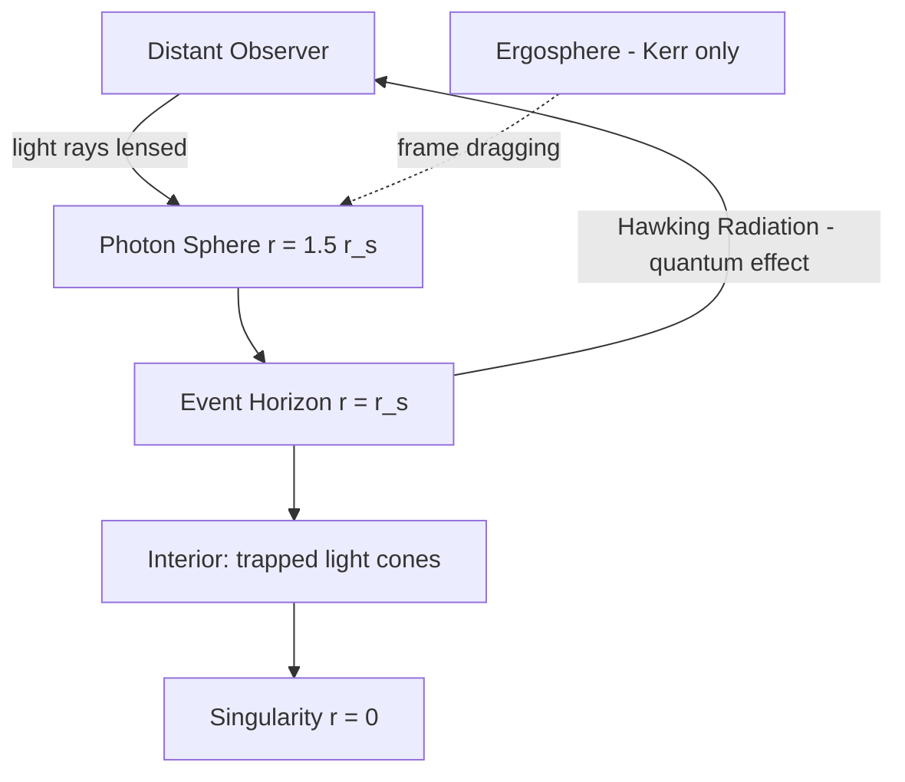

## Black Holes and Event Horizons

### Overview

A black hole is a region of spacetime where gravitational curvature becomes so extreme that no future-directed causal path — not even light — can escape to infinity. The boundary of this region is the **event horizon**, a null hypersurface that acts as a one-way causal membrane. Black holes are exact solutions (or limits of dynamical solutions) to the Einstein field equations:

$$G_{\mu\nu} = 8\pi G T_{\mu\nu}$$

In vacuum ($T_{\mu\nu}=0$ outside the source), this reduces to $R_{\mu\nu}=0$, and the black hole solutions discussed below are vacuum (or electrovacuum) solutions to this equation.

### Historical Development

- **Karl Schwarzschild (1916)** found the first exact solution to Einstein's field equations, describing spacetime outside a spherically symmetric, non-rotating mass, within weeks of Einstein publishing general relativity.
- **David Finkelstein (1958)** clarified the event horizon as a genuine one-way causal boundary using ingoing Eddington–Finkelstein coordinates, resolving the earlier confusion that the horizon was a physical singularity.
- **Roy Kerr (1963)** solved the vacuum field equations for a rotating mass, giving the astrophysically realistic black hole solution.
- **Roger Penrose and Stephen Hawking (mid-to-late 1960s)** proved the singularity theorems, showing that singularities are a generic consequence of gravitational collapse under reasonable energy conditions, not an artifact of idealized symmetry.
- **Stephen Hawking (1974–1975)** showed black holes emit thermal radiation (Hawking radiation), connecting general relativity to quantum field theory and thermodynamics.
- **Event Horizon Telescope Collaboration (2019, 2022)** produced the first direct images of the shadows of M87* and Sagittarius A*.

### The Schwarzschild Solution

For a static, spherically symmetric, uncharged mass $M$, the metric in Schwarzschild coordinates $(t, r, \theta, \phi)$ is:

$$ds^2 = -\left(1 - \frac{2GM}{c^2 r}\right)c^2\,dt^2 + \left(1 - \frac{2GM}{c^2 r}\right)^{-1}dr^2 + r^2\,d\Omega^2$$

where $d\Omega^2 = d\theta^2 + \sin^2\theta\, d\phi^2$.

**Key Points**

- The **Schwarzschild radius** is $r_s = \dfrac{2GM}{c^2}$, marking the location of the event horizon for a non-rotating, uncharged black hole.
- At $r = r_s$, the $g_{tt}$ component vanishes and $g_{rr}$ diverges — this is a **coordinate singularity**, removable by a change of coordinates (e.g., Eddington–Finkelstein or Kruskal–Szekeres), not a physical singularity.
- At $r=0$, curvature invariants such as the Kretschmann scalar $R_{\mu\nu\rho\sigma}R^{\mu\nu\rho\sigma} \propto \dfrac{48 G^2M^2}{c^4 r^6}$ diverge — this is the genuine **physical singularity**.
- Birkhoff's theorem states the Schwarzschild solution is the unique spherically symmetric vacuum solution, meaning any spherically symmetric mass distribution produces this exterior geometry regardless of internal dynamics (e.g., radial pulsation).

**Example**

For the Sun's mass ($M_\odot \approx 1.989\times10^{30}\text{ kg}$), $r_s \approx 2.95\ \text{km}$. Since the Sun's actual radius (~696,000 km) vastly exceeds $r_s$, the Sun is not a black hole — the vacuum solution only applies outside the stellar surface, and inside a star, the interior (Schwarzschild-interior or numerical) solution takes over.

### The Event Horizon

**Key Points**

- The event horizon is a **null surface** — a three-dimensional hypersurface in four-dimensional spacetime generated by light rays that neither escape to infinity nor fall inward.
- It is a **global, teleological** feature: for a dynamically forming black hole, the true event horizon's location at any given time depends on all future infall, meaning distant observers cannot locally verify they have crossed it using only local measurements — light cones tip over gradually.
- Locally, an infalling observer crossing the horizon of a sufficiently massive black hole feels nothing special: tidal forces at the horizon scale as $\sim GM/r_s^3$, which is small for supermassive black holes and large for stellar-mass ones.
- The horizon is distinct from the **apparent horizon** (a quasi-local, foliation-dependent surface defined by outward null rays having zero expansion), which is more directly computable in numerical relativity and coincides with the event horizon in stationary spacetimes.

**Coordinate Systems That Remove the Horizon Singularity**

*Eddington–Finkelstein coordinates* use the ingoing null coordinate $v = t + r_*$, where $r_* = r + r_s\ln\left|\dfrac{r}{r_s}-1\right|$ is the tortoise coordinate, giving:

$$ds^2 = -\left(1-\frac{r_s}{r}\right)dv^2 + 2\,dv\,dr + r^2 d\Omega^2$$

This metric is regular at $r=r_s$, showing explicitly that infalling light cones tip inward past the horizon so that even outgoing light rays are dragged toward $r=0$.

*Kruskal–Szekeres coordinates* extend the manifold maximally, revealing the full causal structure including a white hole region and a second asymptotically flat universe (the latter is a mathematical feature of the maximally extended vacuum solution, not physically realized in gravitational collapse).

### Diagram: Causal Structure (Penrose Diagram, svg_diagram)

<svg xmlns="http://www.w3.org/2000/svg" viewBox="0 0 420 420" font-family="sans-serif" font-size="11">
<text x="210" y="20" text-anchor="middle" font-size="13" font-weight="bold">Schwarzschild Black Hole Penrose Diagram (svg_diagram)</text>
<line x1="60" y1="360" x2="360" y2="60" stroke="black" stroke-width="1.5" />
<line x1="60" y1="60" x2="360" y2="360" stroke="black" stroke-width="1.5" />
<line x1="60" y1="360" x2="360" y2="360" stroke="black" stroke-width="2" />
<path d="M 210 60 Q 260 110 210 210 Q 160 310 210 360" fill="none" stroke="red" stroke-width="2" />
<text x="230" y="130" fill="red">Singularity r=0</text>
<line x1="90" y1="330" x2="330" y2="90" stroke="blue" stroke-width="2" stroke-dasharray="5,3" />
<text x="250" y="180" fill="blue">Event Horizon (r = r_s)</text>
<text x="100" y="350" font-size="10">i⁻ (past timelike infinity)</text>
<text x="270" y="80" font-size="10">i⁺ (future timelike infinity)</text>
<text x="30" y="215" font-size="10" transform="rotate(-90 30 215)">i⁰</text>
<text x="130" y="220" font-size="10">Exterior region</text>
<text x="230" y="260" font-size="10" fill="darkred">Interior (r &lt; r_s)</text>
</svg>

### The Kerr Solution (Rotating Black Holes)

Astrophysical black holes are expected to possess angular momentum. The Kerr metric, in Boyer–Lindquist coordinates, describes a rotating, uncharged black hole with mass $M$ and spin angular momentum $J = Mac$ (defining $a = J/(Mc)$):

$$ds^2 = -\left(1-\frac{r_s r}{\Sigma}\right)c^2dt^2 - \frac{2 r_s r a \sin^2\theta}{\Sigma}c\,dt\,d\phi + \frac{\Sigma}{\Delta}dr^2 + \Sigma\,d\theta^2 + \left(r^2+a^2+\frac{r_s r a^2\sin^2\theta}{\Sigma}\right)\sin^2\theta\,d\phi^2$$

where $\Sigma = r^2 + a^2\cos^2\theta$ and $\Delta = r^2 - r_s r + a^2$.

**Key Points**

- The **outer event horizon** is at $r_+ = \dfrac{r_s}{2} + \sqrt{\left(\dfrac{r_s}{2}\right)^2 - a^2}$, requiring $a \le GM/c^2$ for a horizon to exist (the extremal bound).
- The **ergosphere** is a region outside the horizon, bounded by the static limit surface $r_E = \dfrac{r_s}{2} + \sqrt{\left(\dfrac{r_s}{2}\right)^2 - a^2\cos^2\theta}$, where spacetime is dragged so strongly (**frame dragging**, or Lense–Thirring effect) that no observer can remain static relative to infinity, though escape is still possible.
- The **Penrose process** allows energy extraction from the ergosphere: a particle splitting into two within the ergosphere can send one fragment into the black hole with negative energy (as measured at infinity), while the other escapes with more energy than the original particle.
- Kerr black holes possess two horizons ($r_+$ and inner Cauchy horizon $r_-$); the inner horizon is believed to be unstable to perturbations (mass inflation instability), an [Inference] extrapolated from linear perturbation studies rather than fully confirmed in generic dynamical collapse.

### No-Hair Theorem

**Key Points**

- Stationary, asymptotically flat black hole solutions in Einstein–Maxwell theory are uniquely characterized by only three externally observable parameters: mass $M$, angular momentum $J$, and electric charge $Q$ (Kerr–Newman family).
- This is often summarized as "black holes have no hair" — all other information about the collapsing matter (composition, multipole moments, baryon number) is not encoded in the final stationary state's external field.
- The theorem is proven under specific assumptions (electrovacuum, stationarity, appropriate energy conditions); [Inference] extensions to more exotic matter fields or modified gravity theories may permit "hairy" black holes, an active research area.

### Black Hole Thermodynamics

**Key Points**

- The four laws of black hole mechanics (Bardeen, Carter, Hawking 1973) are formally analogous to the laws of thermodynamics:

| Law | Thermodynamics | Black Hole Mechanics |
| --- | --- | --- |
| Zeroth | Uniform $T$ in equilibrium | Uniform surface gravity $\kappa$ on horizon |
| First | $dU = T\,dS + \text{work terms}$ | $dM = \dfrac{\kappa}{8\pi G}dA + \Omega_H dJ + \Phi_H dQ$ |
| Second | $dS \ge 0$ | $dA \ge 0$ (Hawking's area theorem) |
| Third | $T\to 0$ unreachable in finite steps | $\kappa \to 0$ (extremality) unreachable in finite steps |

- **Bekenstein–Hawking entropy**: $S_{BH} = \dfrac{k_B c^3 A}{4 G\hbar}$, where $A$ is the horizon area — entropy scales with area, not volume, a foundational clue for the holographic principle.
- **Hawking temperature**: $T_H = \dfrac{\hbar c^3}{8\pi G M k_B}$, derived from quantum field theory in curved spacetime (particle production near the horizon). For a solar-mass black hole, $T_H \approx 6\times10^{-8}$ K — far colder than the cosmic microwave background, so such black holes currently absorb more than they emit. [Inference: net evaporation only dominates once the ambient CMB temperature drops further, or for sufficiently low-mass primordial black holes.]
- Hawking radiation implies black holes evaporate over time, raising the **black hole information paradox**: whether information about infalling matter is preserved (unitarity) or genuinely lost. This remains unresolved as an open theoretical problem; proposed resolutions include black hole complementarity, the holographic principle (AdS/CFT), and the "island" prescriptions for the Page curve — these are active research directions, not settled physics. [Speculation on which resolution is correct.]

### Formation Mechanisms

**Key Points**

- **Stellar-mass black holes** ($\sim 3$–100 $M_\odot$) form from the core collapse of massive stars ($\gtrsim 20\text{-}25\ M_\odot$ initial mass, composition-dependent) after their nuclear fuel is exhausted and electron/neutron degeneracy pressure cannot support the core against gravity (exceeding the Tolman–Oppenheimer–Volkoff limit, roughly 2–3 $M_\odot$ for the remnant).
- **Supermassive black holes** ($10^6$–$10^{10} M_\odot$) reside in galactic centers; formation pathways (direct collapse of primordial gas clouds, mergers of intermediate black holes, or rapid accretion onto seed black holes) remain an active research question. [Unverified: no consensus formation channel is established for the earliest, most massive quasars observed at high redshift.]
- **Intermediate-mass black holes** ($10^2$–$10^5\ M_\odot$) are less commonly confirmed observationally; candidates include some globular cluster cores and ultraluminous X-ray sources.
- **Primordial black holes** are a hypothesized class formed from density fluctuations in the early universe rather than stellar collapse; their existence is [Speculation] and constrained but not ruled out by observation as a dark matter candidate.

### Observational Evidence

**Key Points**

- **X-ray binaries**: Accretion disks around stellar-mass black holes in binary systems heat to millions of kelvin, emitting X-rays; mass measurements from orbital dynamics (e.g., Cygnus X-1) provided early strong evidence.
- **Gravitational waves**: LIGO/Virgo's first detection (GW150914, 2015) observed the merger of two black holes (~36 and ~29 $M_\odot$), confirming binary black hole mergers and providing direct tests of strong-field general relativity via the ringdown phase matching quasi-normal mode predictions.
- **Event Horizon Telescope (EHT)**: Produced images of the "shadow" — a dark region roughly 2.6 times the Schwarzschild radius in angular diameter, cast by photon capture — of M87* (2019) and Sagittarius A* (2022), consistent with GR predictions for the photon sphere and horizon size.
- **Stellar orbits at the Galactic Center**: Decades of astrometric tracking of stars (notably S2) orbiting Sagittarius A* by the GRAVITY collaboration and others provided precision mass and distance measurements, awarded the 2020 Nobel Prize in Physics (shared with Penrose for singularity theorems).

### The Photon Sphere and Black Hole Shadow

For Schwarzschild black holes, unstable circular photon orbits exist at $r_{ph} = \dfrac{3}{2}r_s$. Photons at this radius orbit indefinitely in principle but are unstable to perturbation.

**Key Points**

- The **critical impact parameter** determining the shadow boundary is $b_{crit} = 3\sqrt{3}\,GM/c^2$.
- The observed shadow diameter is larger than the horizon itself due to gravitational lensing of photon trajectories passing near the photon sphere.
- For Kerr black holes, the shadow becomes asymmetric (flattened on one side) depending on spin and observer inclination — a signature EHT has used to place [Inference]-level constraints on spin, since shadow-shape-to-spin inference depends on modeling assumptions about the emitting plasma.

### Diagram: Black Hole Structure (Mermaid)

### Tidal Forces and Spaghettification

**Key Points**

- The tidal acceleration difference across an extended body of length $\Delta r$ falling radially scales as:

$$\Delta a \sim \frac{2GM}{r^3}\Delta r$$

- For stellar-mass black holes, this becomes disruptive (**spaghettification**) well outside the horizon, destroying infalling matter before it crosses.
- For supermassive black holes, tidal forces at the horizon can be gentle enough that an infalling observer would not be immediately torn apart, since $\Delta a \propto M/r_s^3 \propto 1/M^2$ decreases with increasing mass.

### Related Topics

- Gravitational wave astronomy and LIGO/Virgo/KAGRA detector physics
- Singularity theorems (Penrose–Hawking) and geodesic incompleteness
- Hawking radiation derivation via Bogoliubov transformations
- The black hole information paradox and the Page curve
- AdS/CFT correspondence and the holographic principle
- Tidal disruption events (TDEs) and accretion disk physics (Shakura–Sunyaev model)
- Numerical relativity and binary black hole merger simulations
- Wormholes and the Einstein–Rosen bridge (maximal Schwarzschild extension)
- Cosmic censorship conjecture (weak and strong forms)