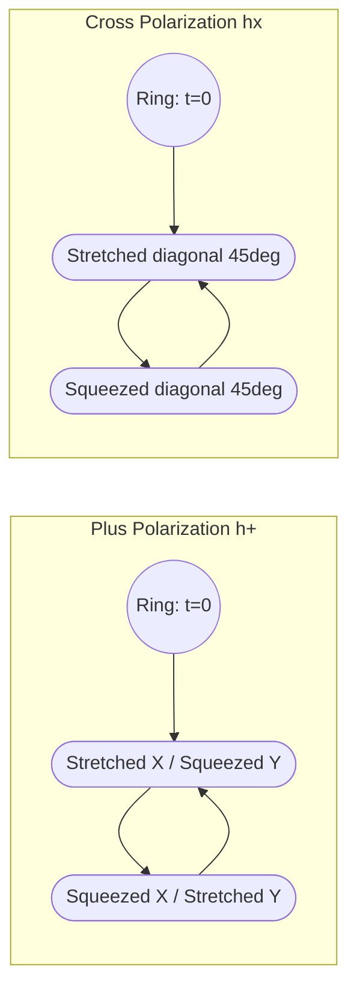

## Gravitational Waves

### Overview

Gravitational waves are propagating ripples in the curvature of spacetime itself, generated by accelerating mass-energy distributions with a time-varying quadrupole (or higher) moment, and traveling at the speed of light $c$. They are a direct consequence of linearizing the Einstein field equations around flat spacetime and represent one of general relativity's most distinctive predictions: gravity itself has dynamical, wave-like degrees of freedom independent of the matter that sourced them.

### Historical Development

- **Albert Einstein (1916, 1918)** first predicted gravitational waves as a consequence of general relativity, though he later vacillated on whether they were physically real or a coordinate artifact.
- **Arthur Eddington (1922)** noted that some proposed wave solutions propagated "at the speed of thought," highlighting early confusion between physical and coordinate (gauge) effects.
- **Richard Feynman's "sticky bead argument" (1957)** demonstrated physically that gravitational waves carry energy and can do work, settling the reality debate.
- **Hulse and Taylor (1974)** discovered the binary pulsar PSR B1913+16 and, over subsequent years, measured its orbital decay rate to match GR's gravitational-wave-emission prediction to high precision, earning the 1993 Nobel Prize — the first indirect confirmation.
- **LIGO Scientific Collaboration and Virgo (September 14, 2015)** made the first direct detection, GW150914, from a binary black hole merger, announced in February 2016.
- **GW170817 (2017)** was the first detection of a binary neutron star merger, observed simultaneously in gravitational waves and across the electromagnetic spectrum (multi-messenger astronomy), constraining the equation of state of nuclear matter and the speed of gravity to match $c$ to roughly one part in $10^{15}$.
- **2017 Nobel Prize in Physics** awarded to Weiss, Barish, and Thorne for decisive contributions to LIGO and the observation of gravitational waves.

### Linearized Theory and Wave Equation

Writing the metric as a small perturbation on flat (Minkowski) spacetime, $g_{\mu\nu} = \eta_{\mu\nu} + h_{\mu\nu}$ with $|h_{\mu\nu}| \ll 1$, and imposing the Lorenz (harmonic) gauge condition $\partial^\mu \bar{h}_{\mu\nu} = 0$ (where $\bar{h}_{\mu\nu} = h_{\mu\nu} - \tfrac{1}{2}\eta_{\mu\nu}h$ is the trace-reversed perturbation), the linearized vacuum field equations reduce to a wave equation:

$$\Box \bar{h}_{\mu\nu} = \left(-\frac{1}{c^2}\frac{\partial^2}{\partial t^2} + \nabla^2\right)\bar{h}_{\mu\nu} = 0$$

**Key Points**

- Solutions are transverse waves propagating at speed $c$.
- In the **transverse-traceless (TT) gauge**, the physical, gauge-invariant content reduces to two independent polarization states.
- For a wave traveling in the $z$-direction, the metric perturbation takes the form:

$$h_{\mu\nu}^{TT} = \begin{pmatrix} 0&0&0&0\\0&h_+&h_\times&0\\0&h_\times&-h_+&0\\0&0&0&0\end{pmatrix}\cos[\omega(t-z/c)]$$

- $h_+$ and $h_\times$ are the **plus** and **cross** polarizations, rotated $45°$ relative to one another — a direct consequence of the graviton being a massless spin-2 field (in contrast to spin-1 electromagnetic waves, which have polarizations rotated $90°$ apart).

### Quadrupole Formula

**Key Points**

- Gravitational radiation has no monopole or dipole term: monopole radiation is forbidden by mass-energy conservation, and mass dipole radiation is forbidden by conservation of momentum (the analog of charge conservation forbidding electromagnetic monopole radiation, and center-of-mass motion forbidding EM dipole-like mass radiation).
- The leading-order radiation is **quadrupole radiation**, given by the Einstein quadrupole formula:

$$h_{ij}^{TT} \approx \frac{2G}{c^4 r}\ddot{Q}_{ij}^{TT}(t - r/c)$$

where $Q_{ij} = \int \rho(x)\left(x_i x_j - \tfrac{1}{3}\delta_{ij}r^2\right)d^3x$ is the mass quadrupole moment.

- The power radiated (luminosity) is given by:

$$P = \frac{dE}{dt} = \frac{G}{5c^5}\left\langle \dddot{Q}_{ij}\dddot{Q}^{ij}\right\rangle$$

- The prefactor $G/c^5$ is extraordinarily small ($\approx 2.6\times10^{-53}\ \text{W}^{-1}\cdot\text{s}$ in appropriate units), meaning only extremely massive, compact, and rapidly accelerating systems (neutron stars, black holes) produce detectable radiation.

### Binary Systems as Sources

For a binary system of masses $m_1, m_2$ (total mass $M = m_1+m_2$, reduced mass $\mu = m_1m_2/M$, chirp mass $\mathcal{M} = \mu^{3/5}M^{2/5}$) in circular orbit at separation $a$:

**Key Points**

- Gravitational-wave emission carries away orbital energy, causing the orbital separation to shrink and orbital frequency to increase — an **inspiral**.
- The rate of frequency increase (the **chirp**) is governed almost entirely by the chirp mass:

$$\dot{f}_{GW} = \frac{96}{5}\pi^{8/3}\left(\frac{G\mathcal{M}}{c^3}\right)^{5/3}f_{GW}^{11/3}$$

- The gravitational-wave frequency is twice the orbital frequency ($f_{GW} = 2f_{orb}$) for the dominant quadrupole mode, since the mass quadrupole moment of a symmetric binary repeats twice per orbit.
- Inspiral proceeds through three phases: **inspiral** (slow, adiabatic frequency increase, modeled analytically via post-Newtonian expansion), **merger** (strong-field, highly dynamical, requires numerical relativity), and **ringdown** (the remnant black hole relaxes to a Kerr solution by emitting quasi-normal modes, characterized by exponentially damped sinusoids).

### Diagram: Compact Binary Coalescence Waveform (svg_diagram)

<svg xmlns="http://www.w3.org/2000/svg" viewBox="0 0 500 260" font-family="sans-serif" font-size="11">
<text x="250" y="18" text-anchor="middle" font-size="13" font-weight="bold">Binary Merger Strain Waveform (svg_diagram)</text>
<line x1="30" y1="140" x2="470" y2="140" stroke="black" stroke-width="1" />
<path d="M 30,140 Q 45,120 60,140 T 90,140 T 120,140 T 150,140" fill="none" stroke="blue" stroke-width="1.5" />
<path d="M 150,140 Q 162,110 174,140 T 198,140 T 222,140" fill="none" stroke="blue" stroke-width="1.5" />
<path d="M 222,140 Q 232,95 242,140 T 262,140" fill="none" stroke="blue" stroke-width="1.5" />
<path d="M 262,140 L 270,40 L 278,220 L 286,140" fill="none" stroke="red" stroke-width="2" />
<path d="M 286,140 Q 300,180 314,140 T 342,140 T 370,140 T 400,140" fill="none" stroke="green" stroke-width="1.5" stroke-dasharray="4,2" />
<text x="80" y="160" font-size="10" fill="blue">Inspiral</text>
<text x="255" y="30" font-size="10" fill="red">Merger</text>
<text x="340" y="165" font-size="10" fill="green">Ringdown</text>
<text x="240" y="250" text-anchor="middle" font-size="10">Time →</text>
<text x="15" y="140" font-size="10" transform="rotate(-90 15 140)">Strain h(t)</text>
</svg>

### Effect on Test Particles (Ring of Free Masses)

**Key Points**

- A passing gravitational wave produces a **tidal, quadrupolar** distortion of proper distances between free-falling test particles, alternately stretching and squeezing along perpendicular axes.
- For the "plus" polarization, a ring of particles is stretched along $x$ while compressed along $y$, then the reverse, oscillating at the wave frequency.
- For the "cross" polarization, the same pattern is rotated $45°$.
- The dimensionless **strain** $h = \Delta L/L$ measures fractional length change; for detected astrophysical sources at Earth, $h \sim 10^{-21}$ to $10^{-22}$ — comparable to a change in the Earth-Sun distance smaller than the width of a human hair, illustrating why detection was so technologically demanding.

### Diagram: Ring Distortion Under Polarizations (Mermaid)

### Detection: Laser Interferometry

**Key Points**

- Ground-based detectors (LIGO, Virgo, KAGRA) use **Michelson interferometers** with kilometers-long perpendicular arms (LIGO: 4 km; Virgo: 3 km; KAGRA: 3 km, underground and cryogenic).
- A passing wave changes the relative arm lengths, shifting the interference pattern of recombined laser light at the beamsplitter.
- **Fabry–Pérot cavities** in each arm cause light to bounce back and forth (hundreds of round trips), effectively multiplying the path length and thus the phase sensitivity.
- **Power recycling** and **signal recycling** mirrors reuse laser light to boost circulating power (hundreds of kW) and shape the detector's frequency response.
- **Squeezed light injection** reduces quantum shot noise below the standard limit, a technique implemented in Advanced LIGO's post-2019 upgrades.
- Sensitivity is limited at low frequencies by seismic noise and Newtonian (gravity-gradient) noise, at mid frequencies by thermal noise in mirror coatings and suspensions, and at high frequencies by photon shot noise.
- The characteristic strain sensitivity of Advanced LIGO at design sensitivity is $\sim 10^{-23}/\sqrt{\text{Hz}}$ near its most sensitive band (~100 Hz).

### Pulsar Timing Arrays and Space-Based Detection

**Key Points**

- **Pulsar timing arrays** (NANOGrav, EPTA, PPTA, and the combined International Pulsar Timing Array) monitor the highly regular arrival times of radio pulses from millisecond pulsars across the galaxy; a passing nanohertz-frequency gravitational wave (from supermassive black hole binaries) perturbs these arrival times in a characteristic angular correlation pattern (the Hellings–Downs curve).
- In 2023, multiple pulsar timing array collaborations reported evidence consistent with a **stochastic gravitational wave background**, [Inference] most plausibly attributed to a population of supermassive black hole binaries, though the precise source interpretation remains under active investigation.
- **LISA** (Laser Interferometer Space Antenna), a planned ESA-led space mission (with NASA contribution), will use three spacecraft in a triangular formation with million-kilometer arm lengths to detect millihertz-frequency waves from sources like supermassive black hole mergers and galactic compact binaries; [Unverified: exact launch date subject to mission schedule changes] as of recent planning, launch is targeted for the mid-2030s.

### The Gravitational-Wave Spectrum

| Frequency Band | Approx. Range | Sources | Detection Method |
| --- | --- | --- | --- |
| Extremely low (nHz) | $10^{-9}$–$10^{-7}$ Hz | Supermassive black hole binaries, cosmic strings | Pulsar timing arrays |
| Low (mHz) | $10^{-4}$–$10^{-1}$ Hz | Galactic binaries, supermassive BH mergers | Space-based (LISA) |
| High (Hz–kHz) | $1$–$10^4$ Hz | Stellar-mass compact binary mergers, supernovae | Ground-based (LIGO/Virgo/KAGRA) |
| Ultra-high | $> 10^5$ Hz | Speculative early-universe processes | [Speculation] proposed resonant/EM converters |

### Data Analysis: Matched Filtering

**Key Points**

- Because signals are typically buried beneath detector noise, detection relies on **matched filtering**: cross-correlating the data stream against a bank of theoretical template waveforms generated from general relativity (post-Newtonian, effective-one-body, and numerical-relativity-calibrated models).
- The **signal-to-noise ratio (SNR)** is computed as:

$$\rho = \frac{\langle s|h\rangle}{\sqrt{\langle h|h\rangle}}$$

where the inner product $\langle a|b\rangle$ is weighted by the inverse of the detector's noise power spectral density.

- Multiple detectors (a global network) enable **triangulation** of the source's sky position via light-travel-time differences, and comparison of amplitudes across detectors constrains the wave's polarization and the source's inclination/distance.

### Multi-Messenger Astronomy: GW170817

**Key Points**

- GW170817 was detected by LIGO/Virgo from a neutron star merger; 1.7 seconds later, the Fermi and INTEGRAL satellites detected a short gamma-ray burst (GRB 170817A) from the same sky region.
- Follow-up electromagnetic observations across the spectrum identified a **kilonova** — optical/infrared emission powered by radioactive decay of $r$-process nuclei synthesized in the merger ejecta — providing direct evidence that neutron star mergers are a significant site of heavy-element (gold, platinum, etc.) nucleosynthesis.
- The near-simultaneous arrival of gravitational and electromagnetic signals over a ~130 million light-year journey constrained any difference between the speed of gravity and the speed of light to be less than about one part in $10^{15}$, ruling out several alternative gravity theories.

### Energy and Amplitude Scaling

**Key Points**

- The energy radiated in a binary black hole merger can be substantial: GW150914 radiated approximately $3\ M_\odot c^2$ of energy in gravitational waves within a fraction of a second, briefly outshining the electromagnetic luminosity of the entire observable universe in gravitational-wave power. [Well-established from LIGO's published parameter estimation for this event.]
- Strain amplitude falls off as $h \propto 1/r$ (not $1/r^2$ as with radiated power/flux for EM waves), since gravitational-wave detectors are sensitive to amplitude rather than intensity directly — this means doubling the distance to a source only halves the detectable strain, extending detector range considerably compared to naive intensity-based scaling.

### Related Topics

- Post-Newtonian approximation and the effective-one-body formalism
- Numerical relativity simulations of binary mergers
- LIGO/Virgo/KAGRA detector design and noise budgets
- Pulsar timing arrays and the stochastic gravitational-wave background
- LISA mission architecture and space-based interferometry
- Kilonovae and $r$-process nucleosynthesis
- Tests of general relativity using ringdown quasi-normal modes
- Gravitational lensing of gravitational waves
- Cosmic strings and early-universe gravitational-wave sources