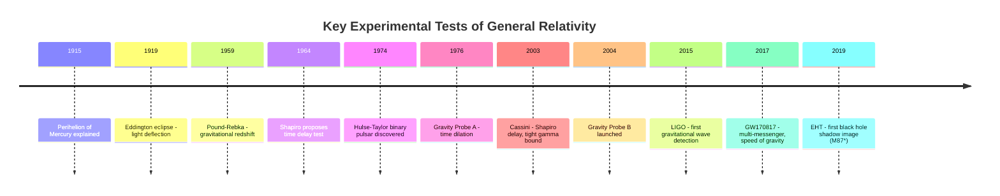

## Experimental Tests of General Relativity

### Overview

General relativity (GR) makes precise, quantitative predictions that diverge from Newtonian gravity, and it has been subjected to over a century of increasingly stringent empirical tests spanning solar-system scales, binary pulsar systems, cosmological observations, and strong-field regimes near black holes. GR has passed every experimental test performed to date within measurement uncertainty, making it the most thoroughly verified framework for gravity currently available.

### The Parameterized Post-Newtonian (PPN) Framework

**Key Points**

- Most solar-system tests are framed using the **PPN formalism**, which parameterizes deviations from GR in the weak-field, slow-motion limit using a set of parameters (commonly denoted $\gamma, \beta$, among others).
- $\gamma$ measures how much spatial curvature is produced by unit rest mass; GR predicts $\gamma = 1$.
- $\beta$ measures the degree of nonlinearity in the superposition law for gravity; GR predicts $\beta = 1$.
- Deviations from these values would indicate alternative theories of gravity (e.g., scalar-tensor theories like Brans–Dicke); current bounds constrain $\gamma - 1$ and $\beta - 1$ to be smaller than a few parts in $10^5$.

### Classical Tests

#### Perihelion Precession of Mercury

**Key Points**

- Mercury's orbit precesses (its perihelion shifts) at a rate of about 5,600 arcseconds per century relative to a fixed background, of which Newtonian perturbations from other planets account for approximately 5,557 arcseconds per century.
- The residual **43 arcseconds per century** was historically unexplained until Einstein showed GR predicts exactly this excess from spacetime curvature effects on the orbit.
- The GR prediction for perihelion advance per orbit is:

$$\Delta\phi = \frac{6\pi GM}{c^2 a(1-e^2)}$$

where $a$ is the semi-major axis and $e$ is the orbital eccentricity.

- This was one of the three classical tests Einstein proposed in 1915 and remains a textbook confirmation, now refined using radar ranging and spacecraft tracking (e.g., MESSENGER) to sub-percent precision.

#### Deflection of Light by the Sun

**Key Points**

- GR predicts that light passing near a massive body is deflected by twice the amount predicted by a naive Newtonian corpuscular treatment:

$$\delta\phi = \frac{4GM}{c^2 b}$$

where $b$ is the impact parameter (closest approach distance).

- For light grazing the Sun's limb, this predicts a deflection of **1.75 arcseconds**.
- **Arthur Eddington's 1919 solar eclipse expeditions** (to Príncipe and Sobral) measured stellar positions near the eclipsed Sun and found deflection values consistent with GR's prediction rather than the Newtonian value of 0.875 arcseconds, making Einstein internationally famous overnight.
- Modern very-long-baseline interferometry (VLBI) measurements of radio source positions near the Sun have confirmed the GR value of $\gamma$ (via the light-bending coefficient) to a precision of better than 1 part in 10,000.

#### Gravitational Redshift

**Key Points**

- GR predicts that light climbing out of a gravitational potential well loses energy, redshifting by:

$$\frac{\Delta\nu}{\nu} \approx \frac{\Delta\Phi}{c^2} = \frac{gh}{c^2}$$

for a height $h$ in a local gravitational field $g$ (weak-field approximation).

- The **Pound–Rebka experiment (1959)**, using the Mössbauer effect to measure gamma-ray frequency shifts over a 22.5-meter tower at Harvard, confirmed this prediction to about 10% precision, later improved to 1%.
- **Gravity Probe A (1976)** flew a hydrogen maser clock on a suborbital rocket to ~10,000 km altitude, confirming gravitational time dilation to a precision of about 70 parts per million — one of the most precise confirmations of this effect.

### Frame Dragging and Geodetic Precession

**Key Points**

- **Geodetic precession** (de Sitter precession) is the precession of a gyroscope's spin axis due to spacetime curvature from a central mass, distinct from frame dragging.
- **Frame dragging** (Lense–Thirring effect) is the dragging of local inertial frames by a rotating mass.
- **Gravity Probe B (2004–2005 data, results published 2011)** used four ultra-precise gyroscopes in Earth orbit to measure both effects, confirming geodetic precession to about 0.3% and frame dragging to about 19% precision, consistent with GR.
- **LAGEOS satellites** (laser-ranged geodynamics satellites) provided independent frame-dragging measurements via orbital precession analysis, with claimed precision of order 10%, though systematic uncertainties from Earth's gravitational multipole moments are a significant source of debate in the precision claimed. [Inference: precision estimates for LAGEOS-based frame-dragging tests vary across analyses due to differing treatments of these systematics.]

### Shapiro Time Delay

**Key Points**

- GR predicts that radar signals passing near a massive body experience an additional time delay due to spacetime curvature, beyond the extra geometric path length:

$$\Delta t = \frac{4GM}{c^3}\ln\left(\frac{4r_1 r_2}{b^2}\right)$$

- **Irwin Shapiro (1964)** proposed this "fourth test" and it was confirmed via radar ranging to Venus and Mercury, and later via tracking of the Viking Mars landers.
- The **Cassini spacecraft experiment (2003)**, using radio signals during a solar conjunction, confirmed the Shapiro delay and constrained $\gamma = 1 + (2.1 \pm 2.3)\times10^{-5}$, one of the tightest solar-system bounds on any PPN parameter to date.

### Binary Pulsar Tests

**Key Points**

- The **Hulse–Taylor binary pulsar (PSR B1913+16)**, discovered in 1974, exhibits orbital decay matching the GR prediction for energy loss via gravitational-wave emission to within about 0.2% precision after decades of timing.
- The **double pulsar system PSR J0737−3039**, where both neutron stars are detectable pulsars, provides multiple independent, simultaneously measurable relativistic effects (Shapiro delay, periastron advance, gravitational redshift, orbital decay, geodetic precession), overconstraining the system and testing GR to better than 0.05% precision on orbital decay as of recent analyses. [Inference: precision figures continue to improve with additional years of timing data; cite the specific publication for current best values.]
- These systems test the **strong-field, dynamical** regime of gravity (compact, relativistic objects) rather than the weak-field solar-system regime.

### Diagram: Timeline of Key Experimental Tests (Mermaid)

### Strong-Field and Gravitational-Wave Tests

**Key Points**

- **LIGO/Virgo detections** (beginning with GW150914 in 2015) test GR in the highly dynamical, strong-field merger regime, comparing observed waveforms against numerical-relativity predictions across inspiral, merger, and ringdown phases.
- **Ringdown tests** check the "no-hair" prediction by verifying that the remnant's quasi-normal mode frequencies and damping times match those predicted for a Kerr black hole of the inferred mass and spin — consistency checks performed on GW150914 and subsequent events found no statistically significant deviation from GR.
- **Parameterized tests** (e.g., allowing post-Newtonian coefficients in the waveform phase to deviate from GR values) have placed bounds on hypothetical deviations, consistent with zero deviation in all cases tested to date. [Inference: as detector sensitivity improves, tighter or potentially deviating bounds may emerge; current results represent the state of published LIGO/Virgo/KAGRA collaboration analyses.]
- **GW170817** constrained the speed of gravitational waves to match the speed of light to about 1 part in $10^{15}$, ruling out a wide class of modified gravity theories that predicted a different propagation speed.

### Event Horizon Telescope Imaging

**Key Points**

- The **EHT images of M87*** (2019) and **Sagittarius A*** (2022) tested GR predictions for the size and shape of a black hole's photon-capture shadow.
- The measured shadow diameters were consistent with GR predictions for a Kerr black hole of the independently estimated mass, within measurement uncertainty, providing a novel strong-field, static (non-dynamical) test complementary to gravitational-wave measurements.

### Cosmological Tests

**Key Points**

- **Gravitational lensing** of distant galaxies and quasars by foreground mass distributions (galaxy clusters, dark matter halos) matches GR predictions, including strong lensing (multiple images, Einstein rings) and weak lensing (statistical shape distortions).
- **Big Bang Nucleosynthesis** and the **Cosmic Microwave Background** power spectrum are consistent with GR-based cosmological models (ΛCDM), though this tests GR embedded within a broader cosmological framework involving additional assumptions (dark matter, dark energy, inflation) rather than testing GR in isolation. [Inference: some tensions in cosmological parameter measurements, such as the Hubble tension, are actively debated as possible hints of new physics versus systematic effects, and do not currently constitute a confirmed departure from GR itself.]

### Equivalence Principle Tests

**Key Points**

- The **weak equivalence principle** (universality of free fall) underlies GR's geometric interpretation of gravity and is tested via torsion-balance experiments (Eöt-Wash group) and space-based tests.
- The **MICROSCOPE satellite mission** (CNES, 2016–2018) tested the equivalence principle for test masses of different composition (titanium and platinum alloys) in free fall, constraining any violation (parameterized by the Eötvös parameter $\eta$) to $\eta < 1.5\times10^{-15}$, the tightest bound achieved to date as of its published results.
- Lunar Laser Ranging (tracking retroreflectors placed on the Moon by Apollo missions) tests the **strong equivalence principle** (whether gravitational self-energy also falls universally) and constrains the Nordtvedt parameter to be consistent with zero (GR's prediction) to high precision.

### Summary Table of Key Tests

| Test | Effect Measured | Key Experiment(s) | Approx. Precision |
| --- | --- | --- | --- |
| Perihelion precession | Orbital advance | Mercury (radar/spacecraft) | Sub-percent |
| Light deflection | $\gamma$ parameter | Eddington 1919; VLBI | ~1 part in $10^4$ |
| Gravitational redshift | Time dilation | Pound–Rebka; Gravity Probe A | ~70 ppm |
| Shapiro delay | $\gamma$ parameter | Cassini | ~$10^{-5}$ |
| Frame dragging | Lense–Thirring | Gravity Probe B; LAGEOS | ~19% (GPB) |
| Orbital decay | GW emission | Hulse–Taylor pulsar | ~0.2% |
| Waveform consistency | Strong-field dynamics | LIGO/Virgo events | Consistent, bounds vary by parameter |
| Shadow size | Kerr geometry | EHT (M87*, Sgr A*) | Consistent within uncertainty |
| Equivalence principle | Universality of free fall | MICROSCOPE | $\eta < 1.5\times10^{-15}$ |

### Related Topics

- Parameterized post-Newtonian formalism in detail
- Alternative theories of gravity (Brans–Dicke, $f(R)$ gravity, MOND)
- Binary pulsar timing techniques and relativistic orbital dynamics
- Gravitational wave parameter estimation and Bayesian inference
- The Hubble tension and possible connections to modified gravity
- Lunar laser ranging and strong equivalence principle tests
- Frame dragging and gyroscopic precession in orbit
- Cosmological tests of general relativity via large-scale structure