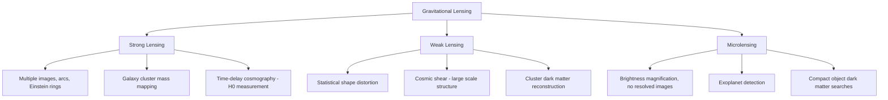

## Gravitational Lensing

### Overview

Gravitational lensing is the bending of light (and other electromagnetic radiation) as it passes through the curved spacetime around a massive object. Predicted quantitatively by general relativity, lensing turns massive foreground objects — stars, galaxies, galaxy clusters, or dark matter concentrations — into natural telescopes and probes of mass distribution, since the deflection depends on total mass (including non-luminous matter) rather than only on light-emitting material.

### Theoretical Basis

**Key Points**

- A photon traveling near a mass $M$ follows a null geodesic in the curved spacetime described by the (linearized) metric; to leading order in the weak-field limit, the deflection angle for a photon with impact parameter $b$ is:

$$\hat{\alpha} = \frac{4GM}{c^2 b}$$

- This is exactly twice the value obtained from a naive Newtonian corpuscular (light-as-particle) calculation, since GR's spatial curvature contributes an equal deflection to the time-dilation (Newtonian-like) contribution.
- For extended mass distributions, the deflection is obtained by integrating the contributions of all mass elements along the line of sight, often treated in the **thin-lens approximation**, valid when the lens's physical extent along the line of sight is much smaller than the distances to source and observer.

### The Lens Equation

**Key Points**

- Define angular diameter distances: $D_L$ (observer to lens), $D_S$ (observer to source), $D_{LS}$ (lens to source).
- The **lens equation** relates the true (unlensed) angular source position $\boldsymbol{\beta}$ to the observed image position $\boldsymbol{\theta}$:

$$\boldsymbol{\beta} = \boldsymbol{\theta} - \frac{D_{LS}}{D_S}\hat{\alpha}(\boldsymbol{\theta})$$

- This is generally a nonlinear mapping, so a single source position $\boldsymbol{\beta}$ can correspond to multiple image positions $\boldsymbol{\theta}$ (multiple imaging), depending on the mass distribution's compactness (convergence).

### Diagram: Lensing Geometry (svg_diagram)

<svg xmlns="http://www.w3.org/2000/svg" viewBox="0 0 480 260" font-family="sans-serif" font-size="11">
<text x="240" y="18" text-anchor="middle" font-size="13" font-weight="bold">Gravitational Lens Geometry (svg_diagram)</text>
<circle cx="60" cy="130" r="6" fill="black" />
<text x="30" y="150" font-size="10">Observer</text>
<circle cx="240" cy="130" r="10" fill="orange" />
<text x="220" y="155" font-size="10">Lens (mass M)</text>
<circle cx="420" cy="60" r="5" fill="blue" />
<text x="400" y="45" font-size="10">True source position β</text>
<line x1="60" y1="130" x2="240" y2="130" stroke="gray" stroke-dasharray="3,2" />
<line x1="240" y1="130" x2="420" y2="60" stroke="gray" stroke-dasharray="3,2" />
<path d="M 60,130 Q 150,90 240,130" stroke="red" fill="none" stroke-width="1.5" />
<path d="M 240,130 Q 320,90 420,60" stroke="red" fill="none" stroke-width="1.5" />
<text x="120" y="85" fill="red" font-size="10">bent light path</text>
<line x1="60" y1="130" x2="420" y2="90" stroke="green" stroke-dasharray="2,2" />
<circle cx="420" cy="90" r="4" fill="green" />
<text x="380" y="105" fill="green" font-size="10">apparent image θ</text>
</svg>

### Regimes of Gravitational Lensing

#### Strong Lensing

**Key Points**

- Occurs when the lens is sufficiently massive/compact that the source lies close to the optical axis, producing **multiple images**, **arcs**, or complete **Einstein rings**.
- The **Einstein radius** — the angular radius of the ring formed when source, lens, and observer are perfectly aligned — is:

$$\theta_E = \sqrt{\frac{4GM}{c^2}\frac{D_{LS}}{D_L D_S}}$$

- Strong lensing by galaxy clusters produces spectacular giant arcs from background galaxies, used to map cluster mass distributions (including dark matter) via detailed modeling of multiple lensed image systems.
- **Time-delay lensing**: when a variable source (e.g., a quasar) is multiply imaged, light along different paths arrives at different times due to both differing geometric path lengths and Shapiro delay through the varying gravitational potential; measuring these time delays (e.g., in systems monitored for supernova or quasar variability) provides an independent method to measure the **Hubble constant** ($H_0$).

#### Weak Lensing

**Key Points**

- In the weak regime, distortions are small (a few percent shape distortion) and undetectable in individual sources; instead, weak lensing is measured **statistically** by correlating the coherent shape distortions of large numbers of background galaxies.
- **Cosmic shear** — the weak lensing effect of large-scale structure on background galaxy shapes — is a major cosmological probe, constraining the matter power spectrum, $\sigma_8$ (the amplitude of matter fluctuations), and dark energy parameters.
- Weak lensing mass maps have been used to reconstruct dark matter distributions in and around galaxy clusters (e.g., the Bullet Cluster), providing some of the most direct observational evidence that dark matter is largely collisionless and spatially offset from the hot, collisional intracluster gas traced by X-rays.

#### Microlensing

**Key Points**

- Occurs when a compact foreground object (a star, planet, or compact remnant) passes very close to the line of sight to a background star, temporarily magnifying its brightness without resolvable multiple images (image separations are too small to resolve, typically microarcseconds).
- The characteristic light curve is a smooth, symmetric brightening and dimming over a timescale set by the relative proper motion and Einstein radius crossing time.
- Used to detect **exoplanets** (via short-duration perturbations superimposed on the main microlensing light curve), search for **massive compact halo objects (MACHOs)** as a dark matter candidate (largely ruled out as the dominant dark matter component by surveys such as EROS and OGLE for certain mass ranges), and probe free-floating planets and compact remnants like isolated black holes.
- Major surveys: **OGLE** (Optical Gravitational Lensing Experiment), **MOA**, **KMTNet**, with the upcoming **Nancy Grace Roman Space Telescope** planned to conduct a dedicated microlensing survey for exoplanet demographics.

### Diagram: Lensing Regimes Comparison (Mermaid)

### Convergence, Shear, and Magnification

**Key Points**

- The lens mapping is characterized locally by the Jacobian $A = \partial\boldsymbol{\beta}/\partial\boldsymbol{\theta}$, decomposed into **convergence** $\kappa$ (isotropic focusing/defocusing, related to the local surface mass density relative to a critical density $\Sigma_{cr}$) and **shear** $\gamma$ (anisotropic stretching).
- The **magnification** of a lensed image is:

$$\mu = \frac{1}{\det A} = \frac{1}{(1-\kappa)^2 - |\gamma|^2}$$

- Magnification can be significant even without multiple imaging, and gravitational lensing conserves surface brightness (Liouville's theorem for photons) — magnification arises purely from the change in solid angle subtended by the source, not from added flux.
- **Critical curves** (where $\mu \to \infty$ formally, regularized by finite source size in practice) in the image plane map to **caustics** in the source plane; sources crossing a caustic undergo dramatic magnification and image multiplicity changes.

### Gravitational Lensing of Gravitational Waves

**Key Points**

- Just as electromagnetic radiation is lensed, gravitational waves themselves can be gravitationally lensed by intervening mass concentrations, an effect predicted by GR and actively searched for in LIGO/Virgo/KAGRA data.
- Because gravitational-wave wavelengths (kilometers) are vastly larger than optical wavelengths, wave-optics effects (diffraction) become relevant for lensing by compact objects (e.g., stellar-mass to intermediate-mass lenses) at frequencies detectable by ground-based detectors, in a regime distinct from the geometric-optics limit typically adequate for astronomical light lensing. [Inference: no confirmed detection of a lensed gravitational-wave event has been robustly established as of current published analyses; several candidate events have been proposed and debated.]

### Notable Observational Milestones

**Key Points**

- **1919 solar eclipse expeditions** provided the first observational test of light deflection by the Sun (see also: Experimental Tests of General Relativity).
- **1979: first strong-lensing system discovered**, the "Twin Quasar" QSO 0957+561, showing two images of a single background quasar lensed by a foreground galaxy.
- **Bullet Cluster (1E 0657-56)**: weak-lensing mass reconstruction showing the bulk of mass offset from the X-ray-emitting intracluster gas, widely cited as strong evidence for particle dark matter over modified-gravity alternatives, though debate over edge cases in modified-gravity fits continues in the literature. [Inference: characterizing the Bullet Cluster as fully decisive against all modified-gravity theories is contested by some researchers; it is broadly regarded as strong, though not universally considered conclusive, evidence.]
- **Hubble Frontier Fields and JWST cluster lensing surveys** use strong cluster lensing as "natural telescopes" to magnify and study extremely distant, intrinsically faint high-redshift galaxies otherwise beyond direct observational reach.

### Related Topics

- Time-delay cosmography and independent $H_0$ measurements
- Dark matter mapping via weak lensing surveys (e.g., DES, Euclid, LSST)
- Exoplanet detection via microlensing surveys
- Strong lens modeling techniques (parametric and free-form)
- Gravitational lensing of gravitational waves and wave-optics effects
- The Bullet Cluster and observational tests of dark matter vs. modified gravity
- Cosmic shear and large-scale structure cosmology