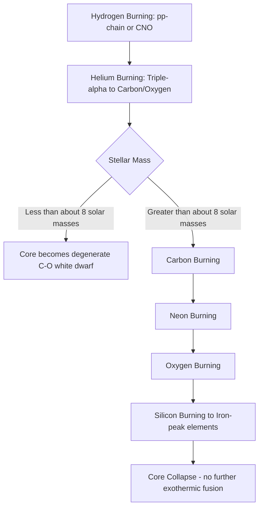

## Stellar Structure and Nuclear Fusion in Stars

### Overview

Stars are self-gravitating spheres of plasma whose structure at every radius is determined by a balance between inward gravitational collapse and outward pressure generated primarily by thermonuclear fusion in the core. Stellar structure theory combines hydrostatic equilibrium, energy transport, mass conservation, and nuclear energy generation into a coupled system of differential equations whose solutions predict a star's temperature, density, luminosity, and composition profiles as functions of radius and time.

### The Equations of Stellar Structure

For a spherically symmetric, non-rotating star in quasi-static equilibrium, four coupled first-order differential equations (as functions of enclosed mass $m$ or radius $r$) govern the structure:

**1. Hydrostatic Equilibrium**

$$\frac{dP}{dr} = -\frac{G m(r)\rho(r)}{r^2}$$

Pressure gradient balances gravitational weight at every layer.

**2. Mass Continuity**

$$\frac{dm}{dr} = 4\pi r^2 \rho(r)$$

**3. Energy Generation**

$$\frac{dL}{dr} = 4\pi r^2 \rho(r)\left[\varepsilon_{nuc}(r) - \varepsilon_\nu(r)\right]$$

where $\varepsilon_{nuc}$ is the nuclear energy generation rate per unit mass and $\varepsilon_\nu$ accounts for energy losses via neutrinos that escape without thermalizing.

**4. Energy Transport**

For radiative transport:

$$\frac{dT}{dr} = -\frac{3\kappa\rho L}{4ac T^3 \cdot 4\pi r^2}$$

or, where convection dominates, the temperature gradient instead follows the (nearly) adiabatic gradient, determined by the **Schwarzschild criterion** for convective instability.

**Key Points**

- These equations require closure relations: an **equation of state** $P(\rho, T, \text{composition})$, an **opacity law** $\kappa(\rho, T, \text{composition})$, and a **nuclear reaction network** giving $\varepsilon_{nuc}$.
- Boundary conditions are applied at the center ($m=0, r=0, L=0$) and surface (matching to a stellar atmosphere model at the photosphere).
- Solving this system (numerically, via stellar evolution codes) for a given initial mass and composition yields the star's structure at each evolutionary stage.

### Energy Transport Mechanisms

**Key Points**

- **Radiative transport** dominates where opacity is low enough that photons can diffuse outward without excessive scattering/absorption; the local temperature gradient in this regime depends on opacity and the local flux.
- **Convective transport** dominates where the radiative temperature gradient would be too steep for stability — physically, where rising hot parcels are less dense than their surroundings and continue to rise (Schwarzschild criterion: $\nabla_{rad} > \nabla_{ad}$).
- **Conductive transport** (via degenerate electrons) becomes important in dense stellar interiors such as white dwarf interiors and evolved stellar cores, where electron degeneracy provides very high thermal conductivity.
- The Sun has a **radiative interior** (up to about 0.7 solar radii) and a **convective envelope** in the outer layers; more massive stars ($\gtrsim 1.3\ M_\odot$) tend to have convective cores and radiative envelopes, an inversion driven by the temperature sensitivity of the dominant fusion process (CNO cycle vs. proton-proton chain).

### Diagram: Solar Internal Structure (svg_diagram)

<svg xmlns="http://www.w3.org/2000/svg" viewBox="0 0 400 400" font-family="sans-serif" font-size="11">
<text x="200" y="20" text-anchor="middle" font-size="13" font-weight="bold">Solar Internal Structure (svg_diagram)</text>
<circle cx="200" cy="210" r="180" fill="#fff3cc" stroke="black" />
<circle cx="200" cy="210" r="130" fill="#ffd966" stroke="black" />
<circle cx="200" cy="210" r="70" fill="#ff9900" stroke="black" />
<circle cx="200" cy="210" r="25" fill="#cc3300" stroke="black" />
<text x="200" y="215" text-anchor="middle" fill="white" font-size="9">Core</text>
<text x="200" y="160" text-anchor="middle" font-size="9">Radiative Zone</text>
<text x="200" y="95" text-anchor="middle" font-size="9">Convective Zone</text>
<text x="200" y="40" text-anchor="middle" font-size="9">Photosphere</text>
</svg>

### Nuclear Fusion Processes

#### The Proton-Proton (pp) Chain

**Key Points**

- Dominant hydrogen-burning mechanism in stars with core temperatures below approximately $1.7\times10^7$ K (roughly $M \lesssim 1.3\ M_\odot$, including the Sun).
- The pp-I branch net reaction converts four protons into one helium-4 nucleus:

$$4\,^1\text{H} \rightarrow\ ^4\text{He} + 2e^+ + 2\nu_e + \gamma$$

releasing approximately 26.7 MeV per reaction (accounting for subsequent positron annihilation), most as gamma rays and a smaller fraction (~2%) as neutrino energy that escapes directly.

- Reaction rate scales approximately as $\varepsilon_{pp} \propto \rho\, T^4$ near solar core temperatures — a relatively weak temperature dependence.
- Branches pp-II and pp-III involve $^7\text{Be}$ and $^8\text{B}$ intermediates respectively; pp-III, though rare, produces high-energy neutrinos historically important in the solar neutrino problem.

#### The CNO Cycle

**Key Points**

- Uses carbon, nitrogen, and oxygen isotopes as catalysts (regenerated at the cycle's end) to convert hydrogen to helium, dominant in stars with core temperatures above roughly $1.7\times10^7$ K (more massive than the Sun, $\gtrsim 1.3\ M_\odot$).
- Net reaction is the same as the pp chain ($4\,^1\text{H}\to\,^4\text{He}$) but proceeds via a cycle of proton captures and beta decays on $^{12}\text{C}, ^{13}\text{N}, ^{13}\text{C}, ^{14}\text{N}, ^{15}\text{O}, ^{15}\text{N}$.
- Reaction rate is extremely temperature-sensitive, scaling approximately as $\varepsilon_{CNO} \propto \rho\,T^{16-20}$ near relevant temperatures, which is why it dominates energy generation in hotter, more massive stars and produces strongly centrally concentrated energy generation (favoring convective cores).
- Solar CNO neutrinos were directly detected by the Borexino experiment (results published 2020), confirming the cycle operates in the Sun (at a subdominant ~1% level relative to the pp chain), consistent with standard solar model predictions.

#### The Triple-Alpha Process

**Key Points**

- Converts helium to carbon in stellar cores after hydrogen exhaustion, once core temperatures reach roughly $10^8$ K (post-main-sequence, red giant/horizontal branch phase):

$$3\,^4\text{He} \rightarrow\ ^{12}\text{C} + \gamma$$

- Proceeds via an unstable $^8\text{Be}$ intermediate with an extremely short lifetime ($\sim10^{-16}$ s); the process is only efficient due to a nuclear resonance in $^{12}\text{C}$ (the **Hoyle state**) at just the right energy, predicted by Fred Hoyle in 1954 on anthropic/existence grounds and subsequently confirmed experimentally — a landmark case of nuclear astrophysics theory guiding and being validated by laboratory measurement.
- Extremely temperature-sensitive ($\varepsilon_{3\alpha}\propto \rho^2 T^{40}$ or steeper near relevant temperatures), leading to the characteristic thermal runaway of the **helium flash** in low-mass stars with degenerate cores.

#### Advanced Burning Stages (Massive Stars)

**Key Points**

- Stars above roughly $8\ M_\odot$ proceed through successive core-burning stages after helium exhaustion: **carbon burning** ($\sim6\times10^8$ K), **neon burning** ($\sim1.2\times10^9$ K), **oxygen burning** ($\sim1.5\times10^9$ K), and **silicon burning** ($\sim2.7\times10^9$ K), each stage progressively shorter-lived as neutrino losses accelerate energy drain.
- **Silicon burning** proceeds via a complex quasi-equilibrium network culminating in nuclear statistical equilibrium, building up iron-group elements (particularly $^{56}\text{Ni}$, which decays to $^{56}\text{Co}$ then $^{56}\text{Fe}$).
- Fusion beyond iron (Fe-56) is **not** energetically favorable — iron has the highest binding energy per nucleon among common reaction products (with nickel-62 the true theoretical maximum by some binding-energy measures), so fusing iron consumes energy rather than releasing it, precipitating **core collapse** in massive stars once the iron core exceeds its effective Chandrasekhar-like stability limit.

### Diagram: Fusion Stages by Stellar Mass (Mermaid)

### Binding Energy and Fusion Energetics

**Key Points**

- The energy released in fusion derives from the increase in nuclear binding energy per nucleon as light nuclei combine into heavier ones (up to the iron peak), following approximately the shape of the binding-energy-per-nucleon curve, which rises steeply for light elements and peaks near iron/nickel.
- Mass-energy equivalence, $E=mc^2$, converts the small mass deficit between reactants and products into the enormous energies released; for hydrogen-to-helium fusion, about 0.7% of the rest mass is converted to energy.
- The **Coulomb barrier** between positively charged nuclei must be overcome for fusion to proceed; at stellar core temperatures, classical thermal energies are typically insufficient, and fusion instead proceeds via **quantum tunneling**, with the **Gamow peak** describing the energy window where the product of the Maxwell-Boltzmann distribution and tunneling probability is maximized.

### Equations of State and Degeneracy

**Key Points**

- In typical main-sequence stellar interiors, the **ideal gas law** (with radiation pressure as a supplementary term in massive stars) adequately describes the equation of state.
- In evolved, dense stellar remnants and cores (white dwarfs, and the cores of red giants prior to helium ignition), **electron degeneracy pressure** dominates — a quantum mechanical effect arising from the Pauli exclusion principle, largely independent of temperature.
- Degenerate cores can produce thermal runaways (e.g., the helium flash) because degeneracy pressure does not respond to temperature increases the way ideal-gas pressure does, so the core cannot expand and cool to self-regulate the reaction rate until degeneracy is lifted.

### The Hertzsprung-Russell Diagram and Stellar Structure Connection

**Key Points**

- The **Hertzsprung-Russell (H-R) diagram**, plotting luminosity against surface temperature (or equivalently, color/spectral type), organizes stars by evolutionary stage and mass.
- The **main sequence** represents the locus of stars in stable core hydrogen-burning equilibrium; a star's main-sequence position and lifetime are set primarily by its initial mass, following approximately $L \propto M^{3.5}$ (mass-luminosity relation) and main-sequence lifetime $\tau \propto M/L \propto M^{-2.5}$.
- Post-main-sequence evolutionary tracks (subgiant branch, red giant branch, horizontal branch, asymptotic giant branch) correspond to successive changes in the dominant energy-generation mechanism and internal structure (shell burning, degenerate cores, etc.), covered in detail under stellar evolution.

### Numerical Stellar Evolution Modeling

**Key Points**

- Modern stellar structure and evolution calculations use numerical codes (e.g., MESA — Modules for Experiments in Stellar Astrophysics) that solve the structure equations on a discretized mass grid, coupled to detailed nuclear reaction networks, opacity tables (e.g., OPAL), and equation-of-state tables, evolving the model through successive timesteps as composition changes via nuclear burning.
- These codes must handle numerically stiff systems (nuclear reaction timescales can be vastly shorter than structural evolution timescales) and resolve convective boundaries, mixing processes (convective overshoot, semiconvection, rotationally induced mixing), and mass loss — several of these mixing processes remain calibrated semi-empirically. [Inference: the precise efficiency of convective overshoot and related mixing processes is model-dependent and constrained by fitting to observations such as star cluster isochrones, rather than derived from first principles in standard 1D stellar evolution codes.]

### Related Topics

- Stellar evolutionary tracks and the Hertzsprung-Russell diagram
- White dwarfs, neutron stars, and stellar remnants
- Supernova mechanisms (core-collapse and thermonuclear)
- Solar neutrino physics and neutrino oscillations
- Nucleosynthesis beyond iron (s-process and r-process)
- Convection and mixing-length theory in stellar interiors
- Asteroseismology as a probe of stellar interior structure
- Mass-luminosity and mass-radius relations across the main sequence