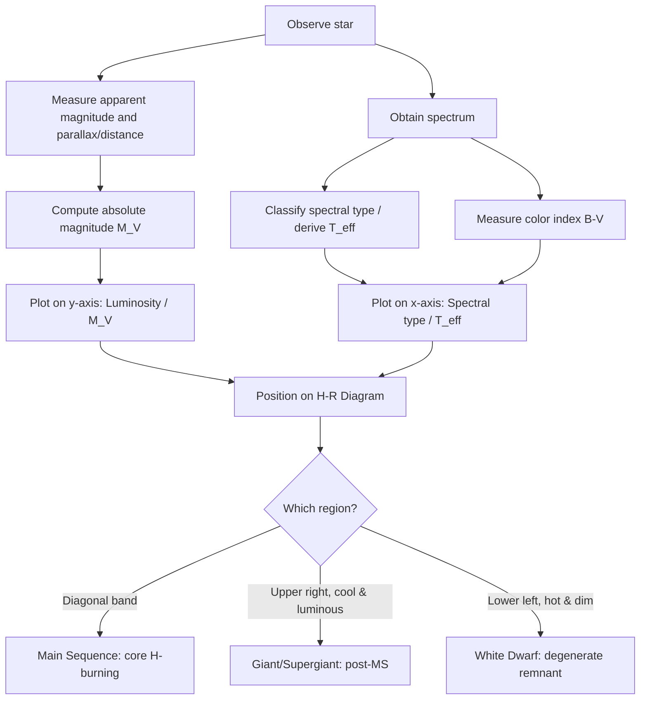
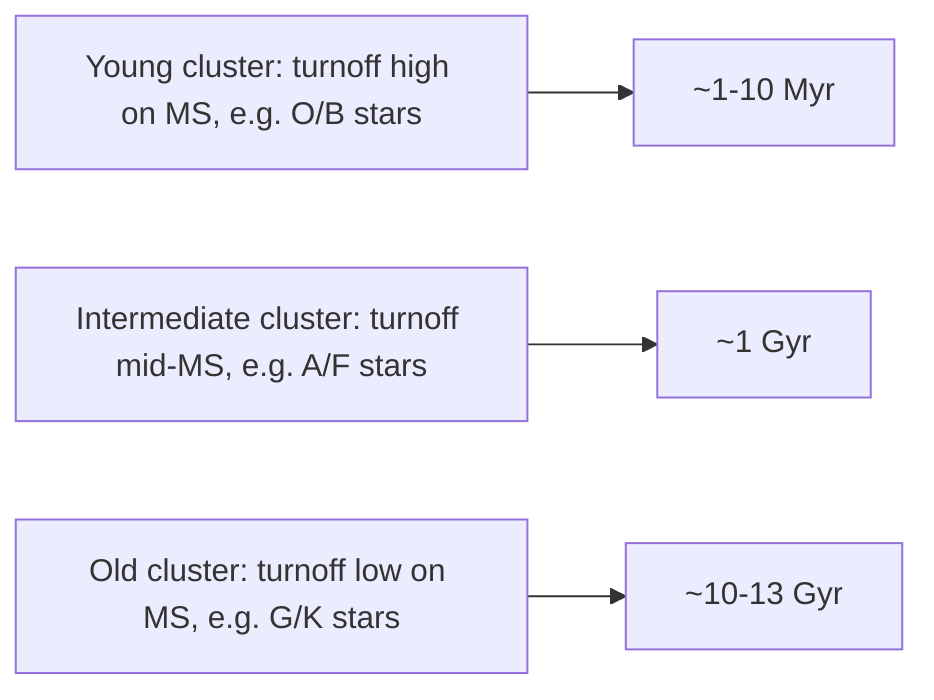

## The Hertzsprung-Russell Diagram

### Overview

The Hertzsprung–Russell (H-R) diagram is a scatter plot relating stellar luminosity (or absolute magnitude) to surface temperature (or spectral class/color index) for a population of stars. Independently developed by Ejnar Hertzsprung (c. 1911, using color-luminosity plots) and Henry Norris Russell (1913, using spectral type-luminosity plots), it remains the single most important diagnostic diagram in stellar astrophysics. It reveals that stars are not randomly distributed in temperature-luminosity space but cluster into distinct sequences corresponding to different evolutionary stages and physical structures.

### Axes and Conventions

**Key Points**

- Horizontal axis (x): surface temperature $T_{\text{eff}}$, spectral type (O, B, A, F, G, K, M), or color index (e.g., $B-V$)
  - Temperature/spectral type is plotted **decreasing left to right** (hot on the left, cool on the right) — a historical convention preserved from early spectroscopic classification
  - Color index increases left to right (blue/negative $B-V$ on left, red/positive $B-V$ on right), which is consistent with temperature decreasing rightward since blue stars are hotter
- Vertical axis (y): luminosity $L$ (often in solar units $L_\odot$, plotted logarithmically) or absolute magnitude $M_V$
  - Luminosity increases upward; absolute magnitude therefore **decreases** upward (brighter stars have more negative/smaller magnitude numbers)
- Two principal variants:
  - **Spectroscopic H-R diagram**: spectral type vs. absolute magnitude (Russell's original approach; requires knowing distance to get absolute magnitude)
  - **Color-Magnitude Diagram (CMD)**: color index vs. apparent or absolute magnitude (Hertzsprung's approach; easier observationally, standard for cluster studies)

The underlying physical relationship connecting the axes is the Stefan-Boltzmann law:

$$L = 4\pi R^2 \sigma T_{\text{eff}}^4$$

where $R$ is stellar radius and $\sigma$ is the Stefan-Boltzmann constant. This means position on the diagram simultaneously encodes information about radius — lines of constant radius run diagonally across the diagram.

### Major Regions of the Diagram

#### The Main Sequence

**Key Points**

- A diagonal band running from upper-left (hot, luminous) to lower-right (cool, dim), containing roughly 90% of all stars in a typical sample
- Represents stars in the core hydrogen-burning phase, where the star is in both hydrostatic and thermal equilibrium
- Position along the main sequence is determined almost entirely by **initial mass**: mass-luminosity relation approximately $L \propto M^{3.5}$ for intermediate-mass stars (exponent ranges from ~2.3 for high-mass to ~4 for low-mass stars) [Inference: exact exponent is mass-and-model-dependent]
- The Sun ($T_{\text{eff}} \approx 5772\text{ K}$, $L = 1\, L_\odot$, spectral type G2V) sits near the middle of the main sequence

#### The Giant Branches

- **Red Giant Branch (RGB)**: cool ($T_{\text{eff}} \sim 3000$–$5000\text{ K}$), luminous ($10$–$1000\, L_\odot$) stars extending upward and to the right of the main sequence. These are post-main-sequence stars with an inert helium core surrounded by a hydrogen-burning shell, with a greatly expanded, cool envelope
- **Horizontal Branch**: a roughly horizontal clump of stars at moderate luminosity, representing core helium burning (triple-alpha process) following the helium flash in low-mass stars
- **Asymptotic Giant Branch (AGB)**: even more luminous and cool than the RGB, representing stars with a degenerate carbon-oxygen core surrounded by alternating hydrogen- and helium-burning shells; site of thermal pulses and significant mass loss

#### Supergiants

- Occupy the topmost region of the diagram across nearly all temperatures (both blue and red supergiants), with luminosities $10^4$–$10^6\, L_\odot$
- Correspond to the most massive stars ($\gtrsim 10\, M_\odot$) undergoing advanced nuclear burning stages (helium, carbon, and beyond)
- Examples: Betelgeuse (red supergiant, $\alpha$ Orionis), Rigel (blue supergiant, $\beta$ Orionis)

#### White Dwarfs

- A distinct, sparsely populated band in the lower-left: hot ($T_{\text{eff}} > 8000\text{ K}$ typically) but faint ($L \sim 10^{-3}$–$10^{-4}\, L_\odot$)
- Low luminosity despite high temperature implies (via Stefan-Boltzmann) a very small radius — roughly Earth-sized
- Represent the electron-degenerate remnant cores of low- to intermediate-mass stars ($\lesssim 8\, M_\odot$) after envelope ejection (planetary nebula phase)
- Example: Sirius B, $T_{\text{eff}} \approx 25{,}000\text{ K}$, $R \approx 0.008\, R_\odot$

### Luminosity Classes

The Morgan-Keenan (MK) spectral classification system appends Roman numerals to spectral type to denote luminosity class, effectively encoding position on the H-R diagram directly into the star's spectral designation:

| Class | Designation | H-R Diagram Region |
| --- | --- | --- |
| Ia | Luminous supergiants | Top of diagram |
| Ib | Supergiants | Top of diagram |
| II | Bright giants | Between giants and supergiants |
| III | Normal giants | Giant branch |
| IV | Subgiants | Between main sequence and giants |
| V | Main-sequence (dwarfs) | Main sequence |
| VI/sd | Subdwarfs | Below main sequence |
| D | White dwarfs | Lower left |

The Sun's full classification, G2V, thus specifies both temperature (G2) and evolutionary/luminosity state (V, main sequence).

### Diagram Structure (SVG)

<svg xmlns="http://www.w3.org/2000/svg" viewBox="0 0 780 560" font-family="Helvetica, Arial, sans-serif">
<text x="390" y="24" text-anchor="middle" font-size="17" font-weight="bold" fill="#1a1a1a">The Hertzsprung-Russell Diagram (svg_diagram)</text>

<line x1="90" y1="480" x2="720" y2="480" stroke="#333" stroke-width="2" />
<line x1="90" y1="480" x2="90" y2="60" stroke="#333" stroke-width="2" />

<text x="405" y="515" text-anchor="middle" font-size="14" fill="#222">Surface Temperature (K) — decreasing →</text>

<text x="120" y="498" text-anchor="middle" font-size="12" fill="#444">30,000</text>

<text x="240" y="498" text-anchor="middle" font-size="12" fill="#444">10,000</text>

<text x="360" y="498" text-anchor="middle" font-size="12" fill="#444">7,500</text>

<text x="480" y="498" text-anchor="middle" font-size="12" fill="#444">6,000</text>

<text x="600" y="498" text-anchor="middle" font-size="12" fill="#444">5,000</text>

<text x="690" y="498" text-anchor="middle" font-size="12" fill="#444">3,000</text>

<text x="115" y="505" text-anchor="middle" font-size="11" fill="#666">O</text>

<text x="200" y="505" text-anchor="middle" font-size="11" fill="#666">B</text>

<text x="290" y="505" text-anchor="middle" font-size="11" fill="#666">A</text>

<text x="380" y="505" text-anchor="middle" font-size="11" fill="#666">F</text>

<text x="470" y="505" text-anchor="middle" font-size="11" fill="#666">G</text>

<text x="560" y="505" text-anchor="middle" font-size="11" fill="#666">K</text>

<text x="660" y="505" text-anchor="middle" font-size="11" fill="#666">M</text>

<text x="35" y="290" text-anchor="middle" font-size="14" fill="#222" transform="rotate(-90 35 290)">Luminosity (L / L_sun, log scale)</text>

<text x="80" y="90" text-anchor="end" font-size="12" fill="#444">10^6</text>

<text x="80" y="160" text-anchor="end" font-size="12" fill="#444">10^4</text>

<text x="80" y="230" text-anchor="end" font-size="12" fill="#444">10^2</text>

<text x="80" y="300" text-anchor="end" font-size="12" fill="#444">1</text>

<text x="80" y="370" text-anchor="end" font-size="12" fill="#444">10^-2</text>

<text x="80" y="440" text-anchor="end" font-size="12" fill="#444">10^-4</text>

<path d="M 130,90 C 250,180 400,300 620,460" stroke="#d4a017" stroke-width="18" fill="none" stroke-linecap="round" opacity="0.55" />
<text x="220" y="150" font-size="12" fill="#6b4c00" font-weight="bold">Main Sequence</text>

<path d="M 480,300 C 550,270 610,230 660,190" stroke="#c0392b" stroke-width="16" fill="none" stroke-linecap="round" opacity="0.55" />
<text x="500" y="255" font-size="12" fill="#7a1f11" font-weight="bold">Red Giants</text>

<path d="M 150,95 C 300,105 480,100 660,115" stroke="#8e44ad" stroke-width="16" fill="none" stroke-linecap="round" opacity="0.5" />
<text x="280" y="90" font-size="12" fill="#4a235a" font-weight="bold">Supergiants</text>

<path d="M 200,420 C 280,410 350,400 420,395" stroke="#2980b9" stroke-width="12" fill="none" stroke-linecap="round" opacity="0.55" />
<text x="230" y="450" font-size="12" fill="#1b4f72" font-weight="bold">White Dwarfs</text>

<circle cx="470" cy="300" r="5" fill="#ff9800" stroke="#333" stroke-width="1" />
<text x="480" y="298" font-size="11" fill="#333">Sun</text>

<rect x="600" y="440" width="14" height="14" fill="#d4a017" opacity="0.6" />
<text x="620" y="451" font-size="11" fill="#333">Main Seq.</text>
</svg>

### Diagram Construction Logic (Mermaid)

### Physical Basis: Why the Main Sequence Forms a Band

**Key Points**

- For a star in hydrostatic and thermal equilibrium burning hydrogen via the p-p chain or CNO cycle, stellar structure equations (mass conservation, hydrostatic equilibrium, energy transport, energy generation) uniquely determine $L$, $R$, and $T_{\text{eff}}$ once mass $M$ and composition are fixed — this is the **Vogt-Russell theorem** [Inference: strictly an idealization; holds well for single-composition, non-rotating, non-magnetic models but can fail in degenerate or multiple-solution cases]
- This is why main-sequence stars fall along a nearly one-dimensional curve in a two-dimensional diagram rather than filling the plane
- Higher-mass stars have higher core temperatures and pressures, burn hydrogen faster (steep mass-luminosity dependence), and therefore occupy the hot, luminous upper-left end of the main sequence
- Lower-mass stars burn slowly, are cooler and dimmer, and sit at the lower-right end (red dwarfs, spectral type M)

### Evolutionary Tracks

**Example**

Tracing a $1\, M_\odot$ star (like the Sun):

1. Pre-main-sequence: descends the Hayashi track (nearly vertical, roughly constant $T_{\text{eff}}$) as it contracts gravitationally
2. Zero-Age Main Sequence (ZAMS): settles onto the main sequence once core hydrogen fusion ignites
3. Main-sequence evolution: slowly brightens and moves slightly rightward/upward over ~10 Gyr as core hydrogen depletes and mean molecular weight increases
4. Subgiant branch: crosses the "Hertzsprung gap" rapidly as the core contracts and the envelope expands after hydrogen exhaustion
5. Red Giant Branch: ascends nearly vertically as a hydrogen-shell-burning source drives envelope expansion
6. Helium flash and Horizontal Branch: after core helium ignition (degenerate, explosive for low-mass stars), settles onto the horizontal branch
7. Asymptotic Giant Branch: ascends again as the star develops a degenerate C-O core with double-shell burning
8. Post-AGB / Planetary Nebula: rapid blueward evolution at roughly constant luminosity as the envelope is ejected
9. White Dwarf cooling track: descends and cools at nearly constant radius, moving down and to the right over billions of years

Massive stars ($\gtrsim 8\, M_\odot$) instead evolve largely horizontally at high luminosity, burning successive fuels (He, C, Ne, O, Si) until iron core collapse triggers a core-collapse supernova, never forming a white dwarf.

### Use in Determining Stellar Ages: Main-Sequence Turnoff

**Key Points**

- In a star cluster, all stars formed at approximately the same time from the same initial composition, so mass is the only free parameter among cluster members
- More massive stars evolve off the main sequence faster (main-sequence lifetime $\tau \propto M/L \propto M^{-2.5}$ approximately) [Inference: exponent depends on adopted mass-luminosity relation]
- The **main-sequence turnoff point** — where stars begin departing the main sequence onto the subgiant/giant branch — directly indicates cluster age: older clusters have turnoffs at lower mass/luminosity
- This technique is a primary method for dating globular clusters (ages ~10–13 Gyr) and open clusters (ages from ~Myr to several Gyr)

**Output**

Qualitative age ordering from H-R diagram turnoff position (schematic):

### Instability Strip

- A near-vertical region crossing the upper-middle H-R diagram (spanning from the upper main sequence through the giant/supergiant region) where stars undergo pulsational instability due to the **kappa mechanism** (opacity-driven pulsation, primarily from partial ionization zones of He II)
- Contains Cepheid variables, RR Lyrae variables, and Delta Scuti stars
- These pulsating stars obey period-luminosity relations (notably the Cepheid P-L relation, foundational to the cosmic distance ladder), making the instability strip astrophysically significant beyond stellar structure alone

### Historical and Modern Context

**Key Points**

- Hertzsprung's 1905/1911 work and Russell's 1913 presentation to the American Astronomical Society independently established the diagram; Russell's version, plotting spectral type against absolute magnitude for nearby stars, became the widely adopted form
- Modern large-scale surveys (Gaia mission astrometry providing precise parallaxes/distances, combined with photometric surveys such as 2MASS, SDSS, Pan-STARRS) have produced H-R diagrams (typically as Gaia color-magnitude diagrams) of unprecedented precision, resolving fine structure such as the main-sequence binary sequence (a parallel sequence ~0.75 mag above the single-star main sequence due to unresolved binaries) and substructure within the white dwarf sequence

**Conclusion**

The H-R diagram compresses the fundamental physics of stellar structure and evolution — mass, radius, temperature, luminosity, composition, and age — into a single empirically constructed plot. Its diagonal main sequence reflects the Vogt-Russell theorem's near-uniqueness of structure for a given mass, while departures from that sequence (giant branches, white dwarf sequence, supergiants) trace the full life cycle of stars from formation through terminal remnants. It remains the central organizing tool of observational and theoretical stellar astrophysics.

**Related Topics**

- Stellar structure equations and the Vogt-Russell theorem
- Mass-luminosity relation and stellar lifetimes
- Stellar nucleosynthesis (p-p chain, CNO cycle, triple-alpha process, s-process/r-process)
- Post-main-sequence evolution and the helium flash
- White dwarf degeneracy pressure and the Chandrasekhar limit
- Cepheid variables and the period-luminosity relation / cosmic distance ladder
- Globular cluster and open cluster age-dating via isochrone fitting
- Stellar spectral classification (Morgan-Keenan system)
- Core-collapse supernovae and compact remnant formation (neutron stars, black holes)
- Gaia mission astrometry and modern color-magnitude diagrams