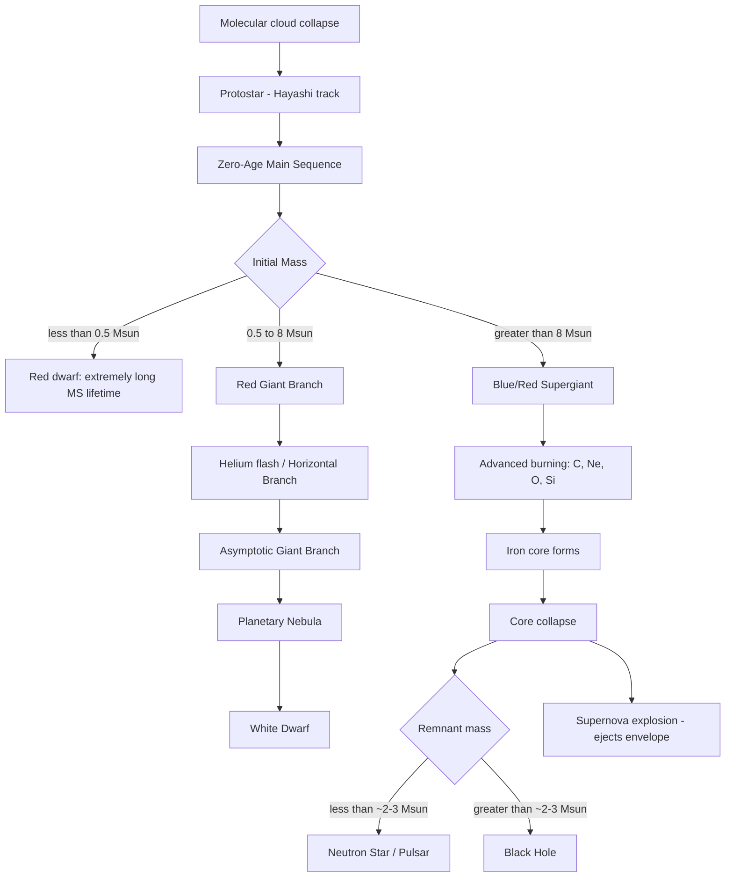

## Stellar Life Cycles

### Overview

Stellar life cycles describe the sequence of physical states a star passes through from its birth in a molecular cloud to its terminal state as a compact remnant (white dwarf, neutron star, or black hole) or complete disruption. The path a star follows, its lifetime, and its ultimate fate are determined overwhelmingly by **initial mass**, with metallicity (heavy-element abundance) and, to a lesser extent, rotation and binarity as secondary factors. Stellar evolution is fundamentally a story of a star's ongoing struggle to balance gravitational collapse against internal pressure, generated in succession by different nuclear fuels as each prior fuel is exhausted.

### Governing Physical Principle: Hydrostatic Equilibrium

**Key Points**

- Throughout most of a star's life, gravity is balanced by internal pressure (thermal and radiation pressure from fusion, later replaced by degeneracy pressure):

$$\frac{dP}{dr} = -\frac{G M(r) \rho(r)}{r^2}$$

- When nuclear fuel in the core is exhausted, pressure support drops, gravity wins locally, the core contracts and heats, and — if temperature and density become sufficient — a new, heavier fuel ignites, restoring equilibrium at a smaller radius and higher core temperature
- This "onion-layer" progression of fuel exhaustion and re-ignition (or failure to re-ignite) is the mechanistic backbone of all post-main-sequence evolution
- Life ends when either no further fuel can be ignited before the core becomes degenerate (low/intermediate mass) or the sequence runs to iron, which cannot release energy via fusion (high mass)

### Stage 1: Star Formation

- Begins in a giant molecular cloud (GMC), where a region exceeds the **Jeans mass/length**, the critical threshold beyond which self-gravity overcomes thermal and turbulent pressure support:

$$M_J \approx \left( \frac{5 k_B T}{G \mu m_H} \right)^{3/2} \left( \frac{3}{4 \pi \rho} \right)^{1/2}$$

- Gravitational collapse fragments the cloud into a protostellar core, which continues to contract, conserving angular momentum and forming a rotating accretion disk
- The protostar descends the **Hayashi track** on the H-R diagram (near-vertical, roughly constant $T_{\text{eff}}$, decreasing luminosity) as it contracts via the **Kelvin-Helmholtz mechanism** (gravitational contraction releasing energy, per the virial theorem)
- Lower-mass protostars may transition onto the nearly horizontal **Henyey track** before reaching the main sequence
- Formation timescale scales inversely with mass: massive stars form in ~$10^5$ years; solar-mass stars take ~$10^7$ years to reach the main sequence [Inference: precise timescales are model- and metallicity-dependent]

### Stage 2: Main Sequence (Core Hydrogen Burning)

**Key Points**

- The longest-lived and most stable phase, during which the star fuses hydrogen into helium in the core, powered by:
  - **Proton-proton (p-p) chain**: dominant in stars $\lesssim 1.3\, M_\odot$, cooler cores
  - **CNO cycle**: dominant in stars $\gtrsim 1.3\, M_\odot$, using carbon, nitrogen, and oxygen as catalysts; highly temperature-sensitive ($\propto T^{15-20}$), producing a convective core in massive stars
- Main-sequence lifetime approximates:

$$\tau_{\text{MS}} \approx 10^{10} \left( \frac{M}{M_\odot} \right)^{-2.5} \text{ years}$$

(exponent is approximate, following from mass-luminosity relation $L \propto M^{3.5}$ combined with fuel supply $\propto M$)

- A star occupies ~90% of its total nuclear-burning lifetime on the main sequence
- Position on the main sequence (temperature/luminosity) is set by mass via the Vogt-Russell theorem

### Stage 3: Post-Main-Sequence Evolution — Mass-Dependent Bifurcation

Stellar fate bifurcates sharply based on initial mass. The table below summarizes canonical mass categories (boundaries are approximate and metallicity-dependent):

| Initial Mass | Category | Terminal Fate |
| --- | --- | --- |
| $< 0.08\, M_\odot$ | Brown dwarf | Never ignites sustained H fusion; degenerate object, slowly cools |
| $0.08$–$0.5\, M_\odot$ | Red dwarf | Extremely long-lived (> Hubble time); [Speculation: theoretically ends as a helium white dwarf, never observed since no red dwarf has yet left the main sequence] |
| $0.5$–$8\, M_\odot$ | Low/intermediate mass | Red giant → AGB → planetary nebula → white dwarf |
| $8$–$\sim 20$–$25\, M_\odot$ | Massive | Supergiant → core-collapse supernova → neutron star |
| $\gtrsim 20$–$25\, M_\odot$ | Very massive | Supergiant/Wolf-Rayet → core-collapse (or direct collapse) → black hole |

#### Low- and Intermediate-Mass Stars ($0.5$–$8\, M_\odot$)

1. **Subgiant branch**: core hydrogen exhausted; core contracts and heats, hydrogen shell burning ignites around an inert helium core; envelope expands and cools
2. **Red Giant Branch (RGB)**: shell-burning drives rapid luminosity increase; star ascends nearly vertically on the H-R diagram; core continues contracting and becomes electron-degenerate
3. **Helium flash** (for $\lesssim 2\, M_\odot$): degenerate core reaches ignition temperature ($\sim 10^8\text{ K}$) for the triple-alpha process; because the core is degenerate, pressure does not increase with temperature, causing a thermal runaway lasting seconds, releasing enormous energy internally (not observable externally, as it's absorbed in lifting degeneracy)
4. **Horizontal Branch**: stable core helium burning (triple-alpha: $3\,^4\text{He} \rightarrow {}^{12}\text{C}$) plus shell hydrogen burning
5. **Asymptotic Giant Branch (AGB)**: helium core exhausted, forms degenerate C-O core with alternating H- and He-shell burning; thermal pulses cause episodic luminosity spikes and heavy mass loss via stellar winds; site of **s-process** nucleosynthesis (slow neutron capture)
6. **Planetary nebula phase**: outer envelope is ejected via strong stellar winds, exposing the hot core; ejected material is ionized by the exposed core's UV radiation, producing a glowing nebula (a misnomer — unrelated to planets)
7. **White dwarf**: exposed C-O (or O-Ne-Mg for the upper mass range) core, supported by electron degeneracy pressure; no further fusion; cools passively over billions of years, obeying the **Chandrasekhar limit** ($\approx 1.4\, M_\odot$) as the maximum stable mass

#### Massive Stars ($\gtrsim 8\, M_\odot$)

**Key Points**

- Core temperatures and pressures are sufficient to ignite successive fusion stages beyond helium, proceeding through advanced burning phases with rapidly shortening timescales:

| Fuel | Product | Approximate Duration ($20\, M_\odot$ star) |
| --- | --- | --- |
| H | He | ~8 million years |
| He | C, O | ~1 million years |
| C | Ne, Mg | ~1000 years |
| Ne | O, Mg | ~few years |
| O | Si, S | ~months |
| Si | Fe (via alpha process) | ~days |

[Inference: exact timescales vary with mass, metallicity, rotation, and mass loss; figures above are order-of-magnitude illustrations]

- Each successive fuel yields far less energy per reaction (binding energy per nucleon approaches its peak at iron), explaining the dramatic timescale compression
- Iron-56 has the highest binding energy per nucleon among common isotopes; fusing iron consumes energy rather than releasing it, so the process cannot continue
- The star develops an **onion-shell structure**: iron core surrounded by concentric shells of progressively lighter unburned elements

**Core-Collapse Supernova**

- Once the iron core exceeds the effective Chandrasekhar-like stability limit (~1.4 $M_\odot$, modified by rotation, thermal pressure), electron degeneracy pressure can no longer support it
- Core collapses catastrophically in under a second; **photodisintegration** of iron nuclei and **electron capture** ($p^+ + e^- \rightarrow n + \nu_e$) accelerate collapse and drain pressure support
- Collapse halts abruptly when core density reaches nuclear density ($\sim 10^{17}\ \text{kg/m}^3$), producing a rebound (core bounce) and an outward shock wave
- The shock, reinvigorated by neutrino energy deposition (**neutrino-driven mechanism**), unbinds and ejects the outer layers as a **Type II (or Ib/Ic, depending on envelope stripping) supernova**
- Nucleosynthesis during and after collapse includes explosive burning and the **r-process** (rapid neutron capture), producing heavy elements beyond iron (gold, platinum, uranium, etc.) [Inference: neutron star mergers are now understood to be a major, possibly dominant, r-process site alongside core-collapse supernovae]

**Remnants**

- **Neutron star**: if the collapsed core remains below ~2–3 $M_\odot$ (Tolman-Oppenheimer-Volkoff limit, still under active research), collapse halts at **neutron degeneracy pressure**; ultra-dense object ($\sim 10$ km radius, $\sim 1.4\, M_\odot$), often observed as a pulsar
- **Black hole**: if remnant core mass exceeds the neutron star stability limit, no known pressure source halts collapse; forms a black hole with an event horizon at the Schwarzschild radius:

$$R_s = \frac{2GM}{c^2}$$

- Very massive, low-metallicity stars may undergo **direct collapse** to a black hole with little or no supernova display [Speculation: direct-collapse fraction and mass threshold remain active research areas]

### Life Cycle Flow (Mermaid)

### Nucleosynthesis Summary Across the Life Cycle

**Key Points**

- **Big Bang nucleosynthesis** (pre-stellar): H, He, trace Li
- **Main sequence**: H → He (p-p chain, CNO cycle)
- **Red giant / horizontal branch**: He → C, O (triple-alpha, and $\alpha$-capture producing O from C)
- **AGB**: s-process builds elements up to Bi via slow neutron capture on Fe-peak seed nuclei
- **Massive star advanced burning**: C, Ne, O, Si burning build up to the iron peak
- **Core-collapse supernova**: explosive nucleosynthesis and r-process build elements beyond iron
- **Neutron star mergers** (binary compact remnant endpoint): major r-process site, confirmed observationally by GW170817 and its kilonova counterpart
- This progressive enrichment of the interstellar medium across generations of stars is termed **galactic chemical evolution**, and is why later-generation ("Population I") stars have higher metallicity than early-generation ("Population II") stars

### Timescale Comparison (Illustrative)

**Example**

Approximate total lifetimes by mass (order-of-magnitude, solar metallicity):

| Mass ($M_\odot$) | Spectral Type (ZAMS) | Approx. Total Lifetime |
| --- | --- | --- |
| 0.1 | M8 | > $10^{13}$ yr (exceeds age of universe) |
| 1 | G2 | ~$10^{10}$ yr |
| 3 | A0 | ~$3 \times 10^{8}$ yr |
| 10 | B1 | ~$3 \times 10^{7}$ yr |
| 25 | O7 | ~$7 \times 10^{6}$ yr |

[Inference: values are approximate and model-dependent, particularly sensitive to mass-loss prescriptions and metallicity for the higher-mass entries]

### Role of Mass Loss and Binarity

**Key Points**

- Stellar winds progressively strip mass throughout evolution, most dramatically during the AGB and Wolf-Rayet phases for massive stars, which can significantly alter the final core mass and thus the final fate
- Mass loss rates scale strongly with metallicity (line-driven winds depend on opacity from metals), so low-metallicity massive stars retain more mass and are more likely to form black holes directly [Inference: this metallicity dependence is theoretically well-motivated and supported by population synthesis models, though quantitative rates carry systematic uncertainty]
- Binary interaction (mass transfer, common-envelope evolution, mergers) can substantially alter individual stellar life cycles relative to single-star evolutionary tracks, producing phenomena such as Type Ia supernovae (white dwarf accreting from or merging with a companion, exceeding the Chandrasekhar limit), blue stragglers, and X-ray binaries

**Conclusion**

Stellar life cycles trace a mass-ordered hierarchy: low-mass stars evolve slowly through giant phases to end as inert white dwarfs; massive stars burn through successive fuels rapidly, culminating in core collapse and leaving behind neutron stars or black holes. This process is the primary engine of chemical enrichment in the universe — nearly every element heavier than helium originated in a stellar interior or a stellar death event, making stellar evolution directly responsible for the elemental composition of planets and living organisms.

**Related Topics**

- The Hertzsprung-Russell diagram and evolutionary tracks
- Nuclear fusion processes (p-p chain, CNO cycle, triple-alpha, alpha-capture)
- The Chandrasekhar limit and electron/neutron degeneracy pressure
- Type Ia vs. core-collapse (Type II/Ib/Ic) supernova mechanisms
- Neutron stars, pulsars, and the Tolman-Oppenheimer-Volkoff limit
- Black hole formation and the Schwarzschild radius
- s-process and r-process nucleosynthesis
- Planetary nebulae and AGB mass loss
- Galactic chemical evolution and stellar populations (Pop I, II, III)
- Binary star evolution and compact object mergers (gravitational wave sources)