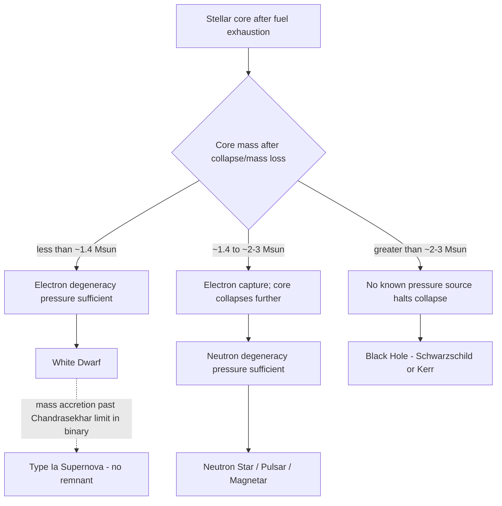

## White Dwarfs, Neutron Stars, and Black Holes

### Overview

White dwarfs, neutron stars, and black holes are the three classes of **compact stellar remnants** left behind after a star exhausts its nuclear fuel and can no longer sustain thermal pressure against gravity. They form a mass-ordered sequence in which the dominant force resisting gravitational collapse changes qualitatively: electron degeneracy pressure (white dwarfs), neutron degeneracy pressure plus strong nuclear force repulsion (neutron stars), and — beyond any known pressure source — total gravitational collapse to a spacetime singularity (black holes). Each represents a distinct regime of extreme physics: quantum degeneracy, nuclear/particle physics at supranuclear densities, and general relativity in the strong-field limit.

### Common Physical Framework: Degeneracy Pressure

**Key Points**

- When a gas is compressed to extremely high density, the Pauli exclusion principle forbids fermions (electrons or neutrons) from occupying identical quantum states, forcing particles into progressively higher momentum states regardless of temperature
- This produces **degeneracy pressure**, which — unlike thermal pressure — depends primarily on density, not temperature, allowing a compact object to remain in equilibrium even as it cools
- Non-relativistic degenerate electron pressure: $P \propto \rho^{5/3}$
- As density increases further, electrons become relativistic, softening the pressure-density relation to $P \propto \rho^{4/3}$ — this softer relation is what ultimately permits collapse past a mass limit, since pressure grows too slowly to counteract increasing gravity

### White Dwarfs

#### Formation and Structure

- End state of stars with initial mass $\lesssim 8\, M_\odot$ (the vast majority of stars, including the Sun), following the AGB and planetary nebula phases
- Composed primarily of carbon and oxygen (for typical progenitors) or oxygen-neon-magnesium (for the most massive AGB progenitors), supported entirely by **non-relativistic to mildly relativistic electron degeneracy pressure**
- No ongoing fusion; the object radiates away residual thermal energy and cools over billions of years
- Extremely dense: typical mass $\sim 0.6\, M_\odot$ packed into a radius comparable to Earth ($\sim 6000$–$10{,}000\ \text{km}$), giving densities of order $10^9\ \text{kg/m}^3$

#### Mass-Radius Relation and the Chandrasekhar Limit

**Key Points**

- Unusually, white dwarfs obey an **inverse mass-radius relation**: more massive white dwarfs are smaller, because greater gravity compresses the degenerate electron gas further:

$$R \propto M^{-1/3} \quad \text{(non-relativistic regime)}$$

- As mass approaches the **Chandrasekhar limit**, $M_{\text{Ch}} \approx 1.4\, M_\odot$, electrons become relativistic, the pressure-density relation softens to $P \propto \rho^{4/3}$, and radius approaches zero — no stable configuration exists above this mass
- The Chandrasekhar limit derives from balancing relativistic degeneracy pressure against gravity:

$$M_{\text{Ch}} \approx \frac{\omega_3^0 \sqrt{3\pi}}{2} \left( \frac{\hbar c}{G} \right)^{3/2} \frac{1}{(\mu_e m_H)^2}$$

where $\mu_e$ is the mean molecular weight per electron (dimensionless numerical prefactor $\omega_3^0 \approx 2.018$ from the Lane-Emden solution for polytropic index $n=3$) [Inference: exact numerical prefactor depends on the specific equation-of-state treatment used]

- A white dwarf that accretes mass from a binary companion and approaches $M_{\text{Ch}}$ can undergo runaway carbon fusion, producing a **Type Ia supernova** — a thermonuclear disruption leaving no remnant, distinct from core-collapse supernovae

#### Cooling and Observable Properties

- Lacking internal energy generation, white dwarfs cool via a well-understood sequence: initial neutrino-dominated cooling, then photon (radiative) cooling, with cooling rate slowing over time as $L \propto t^{-7/5}$ (approximate, for simple models) [Inference: real cooling curves are modified by crystallization, which releases latent heat and further slows late-stage cooling]
- Cooling ages of white dwarfs in stellar clusters provide an independent chronometer, complementary to main-sequence turnoff dating
- Example: Sirius B — $T_{\text{eff}} \approx 25{,}000\ \text{K}$, mass $\approx 1.0\, M_\odot$, radius $\approx 0.008\, R_\odot$

### Neutron Stars

#### Formation and Structure

- End state of core-collapse supernovae from progenitors of initial mass roughly $8$–$20$–$25\, M_\odot$, where the collapsing iron core's mass falls between the Chandrasekhar limit and the maximum neutron star mass
- During collapse, **electron capture** ($p^+ + e^- \rightarrow n + \nu_e$) converts protons to neutrons, and the core is supported primarily by **neutron degeneracy pressure**, reinforced at the highest densities by the repulsive component of the strong nuclear force
- Extraordinarily compact: mass $\sim 1.4$–$2\, M_\odot$ within a radius of only $\sim 10$–$12\ \text{km}$, giving densities approaching nuclear saturation density ($\sim 2.3 \times 10^{17}\ \text{kg/m}^3$), comparable to the density inside an atomic nucleus
- Internal structure (layered, from surface inward) [Inference: internal composition below the outer crust is theoretically modeled and only indirectly constrained by observation]:
  - Thin atmosphere and solid crystalline crust (ions in a lattice, degenerate electrons)
  - Inner crust: neutron-rich nuclei plus free (dripped) neutrons
  - Outer core: uniform neutron-proton-electron liquid, likely superfluid neutrons and superconducting protons
  - Inner core: composition highly uncertain — possibly hyperons, deconfined quark matter, or other exotic states at the highest densities

#### The Maximum Mass Limit

- Analogous to the Chandrasekhar limit but for neutron degeneracy: the **Tolman-Oppenheimer-Volkoff (TOV) limit**, generally estimated around $2$–$3\, M_\odot$, though the precise value depends sensitively on the poorly known **equation of state** of ultra-dense nuclear matter [Inference: this remains an active area of nuclear astrophysics research; the 2017 detection of a ~2.6 $M_\odot$ object in a merger (GW190814) sits in an ambiguous mass range that may represent either the heaviest known neutron star or the lightest known black hole]
- Above this limit, no known pressure source can prevent further collapse to a black hole

#### Pulsars and Observational Signatures

**Key Points**

- Neutron stars typically possess extremely strong magnetic fields ($10^8$–$10^{15}$ gauss) and rapid rotation (inherited via conservation of angular momentum from the much larger progenitor core)
- **Pulsars**: neutron stars whose beamed radio (or other) emission from the magnetic poles sweeps past Earth's line of sight each rotation, observed as extremely regular pulses (periods from milliseconds to seconds)
- **Magnetars**: neutron stars with exceptionally strong magnetic fields ($10^{14}$–$10^{15}$ gauss), powering giant flares and soft gamma repeater activity
- **Millisecond pulsars**: spun up via mass/angular momentum accretion from a binary companion ("recycled" pulsars), reaching rotation periods of a few milliseconds
- First observed by Jocelyn Bell Burnell and Antony Hewish in 1967 (initially nicknamed "LGM-1" for "Little Green Men" due to the signal's striking regularity)

### Black Holes

#### Formation

- End state of the most massive stellar progenitors ($\gtrsim 20$–$25\, M_\odot$, mass-loss- and metallicity-dependent) when the collapsing core exceeds the TOV limit
- May form via a "failed supernova" or **direct collapse**, with little or no explosive ejection of the envelope, particularly favored for very massive, low-metallicity progenitors [Speculation: the precise mass threshold and relative frequency of direct collapse versus explosion-then-fallback remains an open research question]
- Stellar-mass black holes typically range from a few to several tens of $M_\odot$; distinct from **supermassive black holes** ($10^6$–$10^{10}\, M_\odot$, found in galactic centers, formation mechanism still debated) and hypothesized **intermediate-mass black holes**

#### Defining Properties

**Key Points**

- A black hole is a region of spacetime from which nothing, including light, can escape once inside the **event horizon**
- For a non-rotating, uncharged black hole (Schwarzschild solution), the event horizon radius is the **Schwarzschild radius**:

$$R_s = \frac{2GM}{c^2}$$

For a solar-mass object, $R_s \approx 2.95\ \text{km}$ — meaning a black hole is not defined by any minimum size, but by how much mass is compressed within this radius

- Rotating black holes are described by the **Kerr metric**, characterized by mass $M$ and angular momentum $J$ (spin parameter $a = J/Mc$); the **no-hair theorem** states that an astrophysical black hole is fully characterized by only mass, spin, and (in principle, negligible astrophysically) electric charge
- **Singularity**: general relativity predicts a point (Schwarzschild) or ring (Kerr) of infinite density at the center, where classical GR breaks down and a full theory of quantum gravity would be required to describe the true physics [Speculation: no established quantum gravity theory currently resolves this]
- **Hawking radiation**: quantum field theory in curved spacetime predicts black holes slowly emit thermal radiation and evaporate over extraordinarily long timescales; for stellar-mass black holes this evaporation time vastly exceeds the current age of the universe, making it observationally negligible [Inference: Hawking radiation is well-established theoretically but has never been directly observed]

#### Observational Evidence

- Black holes cannot be observed directly (by definition) but are inferred via:
  - Orbital dynamics of visible companion stars in X-ray binaries (measuring the compact object's mass)
  - Accretion disk X-ray emission from infalling matter, heated to extreme temperatures
  - Gravitational wave signals from merging compact binaries (LIGO/Virgo/KAGRA), first directly detected in 2015 (GW150914, merger of two ~30 $M_\odot$ black holes)
  - Direct imaging of the event horizon "shadow" via the Event Horizon Telescope (M87* in 2019, Sagittarius A* in 2022)

### Comparative Summary

| Property | White Dwarf | Neutron Star | Black Hole |
| --- | --- | --- | --- |
| Progenitor mass | $\lesssim 8\, M_\odot$ | $\sim 8$–$25\, M_\odot$ | $\gtrsim 20$–$25\, M_\odot$ |
| Support mechanism | Electron degeneracy pressure | Neutron degeneracy + strong force | None (relativistic collapse) |
| Typical mass | $\sim 0.6\, M_\odot$ (max $1.4\, M_\odot$) | $\sim 1.4$–$2\, M_\odot$ (max ~2–3 $M_\odot$) | $\gtrsim$ few $M_\odot$ (stellar); up to $10^{10}\, M_\odot$ (supermassive) |
| Typical radius | $\sim 6000$–$10{,}000$ km | $\sim 10$–$12$ km | Event horizon: $R_s = 2GM/c^2$ |
| Typical density | $\sim 10^9\ \text{kg/m}^3$ | $\sim 10^{17}\ \text{kg/m}^3$ | Formally infinite at singularity |
| Critical mass limit | Chandrasekhar limit (~1.4 $M_\odot$) | TOV limit (~2–3 $M_\odot$) | None known |
| Key physics | Non-relativistic/relativistic quantum degeneracy | Nuclear/particle physics at supranuclear density | General relativity, strong-field gravity |

### Compact Object Formation Pathway (Mermaid)

### Compact Object Density Comparison (SVG)

<svg xmlns="http://www.w3.org/2000/svg" viewBox="0 0 760 320" font-family="Helvetica, Arial, sans-serif">
<text x="380" y="24" text-anchor="middle" font-size="16" font-weight="bold" fill="#1a1a1a">Relative Size of Compact Remnants (svg_diagram)</text>

<circle cx="110" cy="180" r="70" fill="#f5a623" opacity="0.85" />
<text x="110" y="270" text-anchor="middle" font-size="12" fill="#333">Sun (~696,000 km)</text>

<circle cx="320" cy="180" r="9" fill="#a2d5f2" stroke="#1b4f72" stroke-width="1" />
<text x="320" y="270" text-anchor="middle" font-size="12" fill="#333">White Dwarf</text>
<text x="320" y="285" text-anchor="middle" font-size="10" fill="#666">(~Earth-sized, ~6,000 km)</text>

<circle cx="480" cy="180" r="2.5" fill="#e57373" stroke="#7a1f11" stroke-width="1" />
<text x="480" y="270" text-anchor="middle" font-size="12" fill="#333">Neutron Star</text>
<text x="480" y="285" text-anchor="middle" font-size="10" fill="#666">(~10-12 km radius)</text>

<circle cx="640" cy="180" r="4" fill="#111" stroke="#555" stroke-width="1" />
<text x="640" y="270" text-anchor="middle" font-size="12" fill="#333">Black Hole</text>
<text x="640" y="285" text-anchor="middle" font-size="10" fill="#666">(event horizon, ~30 km for 10 Msun)</text>
</svg>

### Related Astrophysical Phenomena

**Key Points**

- **Type Ia supernovae**: thermonuclear disruption of a white dwarf approaching the Chandrasekhar limit via accretion or merger with a companion; used as "standardizable candles" for cosmological distance measurements (key to discovering the accelerating expansion of the universe)
- **Neutron star mergers**: binary neutron star coalescence, detected via gravitational waves (GW170817) with an electromagnetic counterpart (kilonova), confirmed as a major site of r-process heavy-element nucleosynthesis
- **X-ray binaries**: accretion of matter from a companion star onto a neutron star or black hole, producing intense X-ray emission; used to measure compact object masses dynamically
- **Tidal disruption events**: stars passing too close to a (typically supermassive) black hole are torn apart by tidal forces, producing a distinctive electromagnetic flare

**Conclusion**

White dwarfs, neutron stars, and black holes represent an ordered progression of increasingly extreme matter states resulting from the failure of successive pressure-support mechanisms against gravity. Their existence and properties provide some of the most stringent tests of quantum mechanics (degeneracy pressure), nuclear physics (the neutron star equation of state), and general relativity (strong-field gravity, gravitational waves, event horizons) available in the physical universe.

**Related Topics**

- Electron and neutron degeneracy pressure and equations of state
- The Chandrasekhar limit and Type Ia supernova physics
- The Tolman-Oppenheimer-Volkoff limit and the neutron star equation of state
- Pulsars, magnetars, and neutron star magnetospheres
- Schwarzschild and Kerr black hole solutions
- Hawking radiation and black hole thermodynamics
- Gravitational wave astronomy (LIGO/Virgo/KAGRA) and compact binary mergers
- The Event Horizon Telescope and black hole shadow imaging
- r-process nucleosynthesis in neutron star mergers
- Supermassive black holes and active galactic nuclei