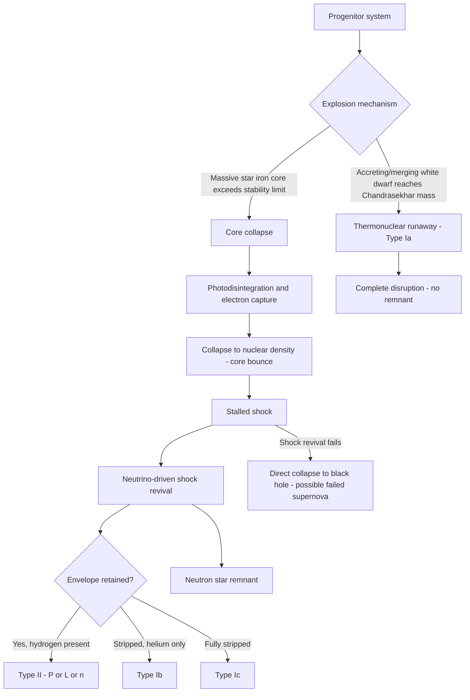

## Supernovae

### Overview

A supernova is a cataclysmic stellar explosion marking either the violent death of a massive star or the thermonuclear disruption of a white dwarf, releasing an enormous burst of energy ($\sim 10^{44}$ J total, comparable to the energy the Sun radiates over its entire lifetime) over a period of days to weeks. Supernovae are among the most luminous transient events in the universe, briefly outshining entire galaxies, and are the dominant mechanism by which heavy elements synthesized in stellar interiors are dispersed into the interstellar medium. Classification is based on observed spectral features and light curve shape, which in turn map onto two physically distinct explosion mechanisms: **core collapse** and **thermonuclear runaway**.

### Classification Scheme

**Key Points**

- Supernova types are defined observationally by spectroscopic features at peak brightness, then interpreted physically:
  - **Type I**: no hydrogen lines in the spectrum
    - **Type Ia**: strong silicon absorption line (Si II, 6150 Å) — thermonuclear white dwarf explosion
    - **Type Ib**: helium lines present, no silicon — core collapse, hydrogen envelope stripped
    - **Type Ic**: no hydrogen or strong helium lines — core collapse, both hydrogen and helium envelopes stripped
  - **Type II**: hydrogen lines present — core collapse, hydrogen envelope retained
    - **Type II-P**: light curve shows a extended "plateau" phase
    - **Type II-L**: light curve declines linearly after peak, no plateau
    - **Type IIn**: narrow emission lines, indicating interaction with dense pre-existing circumstellar material
    - **Type IIb**: transitional, initially hydrogen-rich but later resembles Type Ib as the thin hydrogen layer becomes optically thin

| Type | H lines | He lines | Si II line | Physical mechanism |
| --- | --- | --- | --- | --- |
| Ia | No | No | Yes | Thermonuclear (white dwarf) |
| Ib | No | Yes | No | Core collapse (stripped envelope) |
| Ic | No | No/weak | No | Core collapse (fully stripped envelope) |
| II-P/L | Yes | — | No | Core collapse (envelope retained) |
| IIn | Yes (narrow) | — | No | Core collapse with circumstellar interaction |

- Types Ib, Ic, and II are collectively termed **core-collapse supernovae**, all sharing the same underlying mechanism but differing in progenitor envelope retention at the time of explosion
- Type Ia is mechanistically unrelated to the "Type I" spectroscopic grouping's other members despite the shared naming convention — a historical classification artifact predating full understanding of the explosion physics

### Type Ia Supernovae: Thermonuclear Mechanism

**Key Points**

- Progenitor: a carbon-oxygen white dwarf in a binary system, supported by electron degeneracy pressure below the Chandrasekhar limit ($M_{\text{Ch}} \approx 1.4\, M_\odot$)
- Two principal progenitor scenarios remain under active investigation [Inference: relative contribution of each channel to the observed Type Ia population is not fully settled]:
  - **Single-degenerate**: white dwarf accretes hydrogen or helium from a non-degenerate companion star, gradually approaching $M_{\text{Ch}}$
  - **Double-degenerate**: merger of two white dwarfs in a binary, with combined mass exceeding $M_{\text{Ch}}$
- As the white dwarf approaches $M_{\text{Ch}}$, core density and temperature rise until carbon fusion ignites near the center under highly degenerate conditions
- Because degenerate matter's pressure is nearly independent of temperature, the ignited fusion does not trigger the expansion/cooling feedback that regulates burning in non-degenerate stars — instead, a **thermonuclear runaway** ensues
- The burning front propagates outward, converting a large fraction of the white dwarf's mass into iron-peak elements (particularly radioactive **nickel-56**) within roughly a second, via a subsonic deflagration, a supersonic detonation, or a transition between the two (deflagration-to-detonation transition, DDT) [Inference: the precise burning mode and its transition remain an active area of multidimensional hydrodynamic simulation research]
- The entire white dwarf is unbound — **no compact remnant remains** (distinguishing Type Ia fundamentally from core-collapse events)
- The optical light curve is powered by radioactive decay: $^{56}\text{Ni} \rightarrow {}^{56}\text{Co} \rightarrow {}^{56}\text{Fe}$, with half-lives of 6.1 and 77.2 days respectively, depositing gamma-ray and positron energy that thermalizes in the expanding ejecta

#### Standardizable Candles and Cosmology

- Type Ia supernovae exhibit a tight empirical relationship between peak luminosity and light curve decline rate (the **Phillips relation**): more luminous events decline more slowly
- After applying this correction, Type Ia peak absolute magnitudes can be standardized to within a small scatter, making them powerful **standardizable candles** for measuring cosmological distances
- Observations of high-redshift Type Ia supernovae in the late 1990s revealed they were systematically fainter (i.e., farther away) than expected in a decelerating universe, providing the key evidence for the universe's **accelerating expansion**, attributed to dark energy (Nobel Prize in Physics, 2011)

### Core-Collapse Supernovae: Mechanism

**Key Points**

- Progenitor: a massive star ($\gtrsim 8\, M_\odot$) that has fused successive fuels through to an inert iron core, since iron-56 sits near the peak of nuclear binding energy per nucleon and further fusion consumes rather than releases energy
- Once the iron core exceeds its effective stability limit (~1.4 $M_\odot$, modified by thermal and rotational effects), two processes rapidly remove pressure support:
  - **Photodisintegration**: high-energy photons break iron nuclei back into alpha particles and free nucleons, an endothermic process that drains thermal pressure
  - **Electron capture**: $p^+ + e^- \rightarrow n + \nu_e$, removing degenerate electrons (and their pressure contribution) while emitting a burst of neutrinos
- The core collapses catastrophically (free-fall) in roughly 0.1–1 second, reaching neutron-degenerate, nuclear densities
- Collapse halts abruptly at nuclear density due to the stiffening equation of state and neutron degeneracy pressure, producing a **core bounce**: the inner core overshoots equilibrium, rebounds, and launches an outward shock wave
- The initial bounce shock alone typically stalls due to energy losses from photodisintegrating infalling material; reviving the shock is understood to require additional energy deposition, primarily via the **neutrino-driven delayed mechanism**: the proto-neutron star emits an intense neutrino luminosity, a small fraction of which is absorbed behind the stalled shock, reheating and reinvigorating it into a successful explosion [Inference: detailed multidimensional simulations, including neutrino transport and convective/instability effects such as the standing accretion shock instability (SASI), are required to robustly produce explosions and remain an active computational astrophysics research area; some progenitor configurations may fail to explode entirely, collapsing directly to a black hole]
- The revived shock propagates outward, unbinding and ejecting the star's outer layers at velocities of thousands of km/s, while the collapsed core remains behind as a neutron star (or, for failed explosions/very massive progenitors, a black hole)

#### Nucleosynthesis in Core-Collapse Events

- **Explosive nucleosynthesis**: the passage of the shock through the overlying shells briefly heats material to temperatures sufficient for rapid fusion, producing intermediate-mass and iron-peak elements distinct from pre-collapse hydrostatic burning products
- **r-process (rapid neutron capture)**: under the extreme neutron flux near the collapsing core/proto-neutron star, seed nuclei rapidly capture neutrons faster than beta decay can occur, building very neutron-rich isotopes that subsequently decay toward stability, producing roughly half of elements heavier than iron [Inference: the relative contribution of core-collapse supernovae versus neutron star mergers to total galactic r-process abundance remains actively debated; observational evidence from GW170817 established neutron star mergers as a major, and possibly dominant, r-process site]
- The explosion disperses the star's entire nucleosynthetic history — hydrostatic burning products layer by layer, plus explosive and r-process yields — into the interstellar medium, seeding future generations of stars and planets

### Light Curve Comparison

**Key Points**

- **Type Ia**: rapid rise (~2–3 weeks) to peak, followed by decline powered by $^{56}\text{Ni}/^{56}\text{Co}$ decay; relatively homogeneous, well-standardized shape (post-Phillips correction)
- **Type II-P**: characterized by an extended plateau (~80–100 days) at roughly constant luminosity, powered by recombination of hydrogen in the expanding, cooling envelope (photosphere recedes through ionized/recombining hydrogen at roughly constant temperature), followed by a decline onto the radioactive tail
- **Type II-L / Ib/Ic**: decline more steadily after peak without a pronounced plateau, reflecting smaller or absent hydrogen envelopes

### Observational Signatures and Remnants

**Key Points**

- **Supernova remnants (SNRs)**: the expanding shock-heated gas and swept-up interstellar material persist as observable nebulae for tens of thousands of years (e.g., the Crab Nebula, remnant of the historically observed SN 1054; Cassiopeia A; Tycho's supernova remnant, SN 1572)
- **Neutrino burst**: core-collapse events release the overwhelming majority (~99%) of their total energy output as neutrinos, detected directly for SN 1987A in the Large Magellanic Cloud — providing direct observational confirmation of the core-collapse mechanism's basic energetics
- **Gravitational waves**: core-collapse supernovae are predicted to emit gravitational radiation from asymmetric collapse and convective/rotational instabilities, though no confirmed direct detection has yet been made [Inference: this remains a target for next-generation gravitational wave detectors]
- Historical naked-eye supernovae recorded across cultures include SN 1006, SN 1054 (Crab Nebula progenitor), SN 1572 (Tycho), and SN 1604 (Kepler) — no naked-eye galactic supernova has been observed since 1604, though SN 1987A (in a satellite galaxy, not the Milky Way) was visible to the unaided eye in 1987

### Rate and Galactic Significance

**Key Points**

- Estimated core-collapse supernova rate in a galaxy like the Milky Way: roughly 1–3 per century [Inference: inferred statistically from extragalactic surveys and historical records, since direct galactic detection is limited by interstellar dust obscuration]
- Type Ia rate is somewhat lower and depends on the delay-time distribution between progenitor formation and eventual explosion, since binary evolution timescales vary widely
- Supernovae are the principal astrophysical source of most elements between oxygen and the iron peak (core-collapse explosive nucleosynthesis) and a dominant source of iron-peak elements specifically (Type Ia), while also contributing to r-process heavy-element production
- Supernova shocks are thought to play a significant role in triggering new star formation by compressing surrounding molecular gas, and in regulating galactic evolution through mechanical and chemical feedback into the interstellar medium

**Conclusion**

Supernovae represent two fundamentally distinct physical processes converging on similarly extreme observational displays: the thermonuclear incineration of a degenerate white dwarf (Type Ia), and the gravitational collapse and explosive rebound of a massive star's core (Type Ib/Ic/II). Beyond their spectacular luminosity, supernovae are essential to astrophysics and cosmology in two ways — as standardizable candles that revealed the accelerating universe, and as the primary engines of heavy-element nucleosynthesis and interstellar chemical enrichment that ultimately made possible the elemental diversity of planets and life.

**Related Topics**

- Stellar life cycles and mass-dependent post-main-sequence evolution
- White dwarfs, the Chandrasekhar limit, and electron degeneracy pressure
- Neutron stars, black holes, and compact remnant formation
- The neutrino-driven core-collapse explosion mechanism and multidimensional simulations
- r-process and explosive nucleosynthesis
- Supernova remnants (Crab Nebula, Cassiopeia A, Tycho, Kepler)
- The Phillips relation and Type Ia supernovae as cosmological standard candles
- Dark energy and the accelerating expansion of the universe
- SN 1987A and neutrino astronomy
- Gravitational wave signatures of stellar collapse