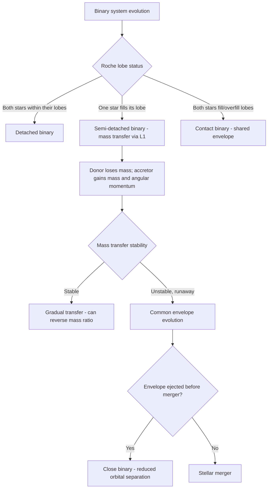

## Binary Star Systems

### Overview

A binary star system consists of two stars gravitationally bound to each other, orbiting a common center of mass. Binary and higher-order multiple systems are not a peripheral curiosity but the norm rather than the exception among stars — a substantial fraction of stars, particularly massive O and B stars, are members of binary or multiple systems [Inference: precise binary fraction estimates vary by spectral type, survey method, and detection sensitivity, generally ranging from roughly 50% for solar-type stars to higher fractions for massive stars]. Binary systems are of exceptional importance in astrophysics: they provide the only direct, model-independent method of measuring stellar masses, and binary interaction (mass transfer, common-envelope evolution, mergers) fundamentally alters stellar evolution in ways that single-star theory cannot capture, producing phenomena ranging from Type Ia supernovae to X-ray binaries to compact object mergers detectable via gravitational waves.

### Classification by Observational Method

**Key Points**

Binary systems are categorized primarily by how they are detected, since orbital separation, distance, and viewing geometry determine which observational signatures are accessible:

- **Visual binaries**: both components resolved as separate points of light via direct imaging; requires sufficiently wide separation and proximity to Earth
- **Astrometric binaries**: only one component is directly visible, but its position exhibits a periodic wobble on the sky due to orbital motion around an unseen companion (historically used to infer companions before direct detection, e.g., early evidence for Sirius B)
- **Spectroscopic binaries**: detected via periodic Doppler shifts in spectral lines as components orbit; **single-lined spectroscopic binaries (SB1)** show only one star's spectrum (companion too faint), **double-lined (SB2)** show both
- **Eclipsing binaries**: orbital plane is nearly edge-on to the observer, so components periodically eclipse each other, producing a characteristic periodic dip in combined brightness (light curve); enables direct determination of relative radii and inclination
- **Astrometric + spectroscopic + eclipsing binaries** (all three simultaneously observable) provide the most complete parameter determination, including absolute masses and radii without requiring an assumed distance

| Method | What is measured | Key limitation |
| --- | --- | --- |
| Visual | Angular separation, position angle over time | Requires wide, nearby systems |
| Astrometric | Positional wobble of visible star | Requires precise long-baseline astrometry |
| Spectroscopic | Radial velocity via Doppler shift | Gives $M \sin^3 i$ only (inclination degeneracy) unless eclipsing |
| Eclipsing | Light curve dips, eclipse timing/depth | Requires near edge-on orbital inclination |

### Orbital Dynamics and Mass Determination

**Key Points**

- Binary orbits obey Kepler's laws, generalized to two-body motion around the mutual center of mass. Kepler's third law, in its full Newtonian form, directly yields the **total system mass**:

$$P^2 = \frac{4\pi^2}{G(M_1 + M_2)} a^3$$

where $P$ is the orbital period, $a$ is the semi-major axis of the relative orbit, and $M_1, M_2$ are the component masses

- For visual binaries with measured individual orbits around the center of mass, the mass ratio follows from the ratio of each star's distance from the barycenter:

$$\frac{M_1}{M_2} = \frac{a_2}{a_1}$$

allowing individual masses to be separated once total mass and mass ratio are both known

- For spectroscopic binaries, radial velocity semi-amplitudes $K_1, K_2$ yield the **mass function**, but only the combination $M \sin^3 i$ is directly measurable due to the unknown orbital inclination $i$ unless additional constraints (eclipses, astrometry) break the degeneracy
- Binary mass measurement remains the **only fundamentally model-independent method** of directly determining stellar masses, underpinning the empirical calibration of the mass-luminosity relation used throughout stellar astrophysics

### Binary Interaction and the Roche Potential

#### The Roche Lobe

- In a binary system, the effective gravitational potential (combining both stars' gravity plus the centrifugal potential in the co-rotating frame) defines a set of equipotential surfaces
- The **Roche lobe** is the largest closed equipotential surface around each star, shaped teardrop-like and pinched at the inner **Lagrange point (L1)** between the two stars
- If a star expands (e.g., during post-main-sequence evolution) until it fills its Roche lobe, material at the L1 point becomes gravitationally unbound from its parent star and can transfer onto the companion — the onset of **mass transfer**

#### Classification by Roche Lobe Configuration

**Key Points**

- **Detached binaries**: both stars remain well within their Roche lobes; evolve essentially as isolated single stars, with mutual gravity affecting only the orbit, not internal stellar structure
- **Semi-detached binaries**: one star fills its Roche lobe and transfers mass onto its companion (e.g., Algol-type systems)
- **Contact binaries**: both stars fill or overfill their Roche lobes, sharing a common envelope of material (e.g., W Ursae Majoris-type systems)

#### Mass Transfer Dynamics

- Mass transfer can be **stable** (proceeding gradually, potentially over the donor's remaining nuclear-burning lifetime) or **dynamically unstable**, depending on how the donor's radius and Roche lobe radius respond to mass loss
- Unstable, rapid mass transfer from an evolved giant with a deep convective envelope onto a much less massive companion often leads to **common envelope evolution**: the companion becomes engulfed within the giant's envelope, and orbital energy dissipated via drag within the shared envelope can either eject the envelope (leaving a dramatically shrunken binary orbit) or, if insufficient energy is available, result in a **stellar merger**
- The **Algol paradox** — historically, Algol systems appeared to have the less massive star more evolved (a subgiant), seemingly contradicting the expectation that more massive stars evolve faster — is resolved by recognizing that the currently less massive star was originally the more massive one and has since transferred the bulk of its envelope to its companion, reversing the mass ratio

### Astrophysically Important Binary Phenomena

**Key Points**

- **Algol-type binaries (semi-detached)**: mass transfer from an evolved subgiant onto a still-main-sequence companion; historically important for resolving the mass-transfer paradox and demonstrating binary evolution's effect on stellar appearance
- **Cataclysmic variables**: a white dwarf accreting from a Roche-lobe-filling low-mass companion; accretion onto the white dwarf surface can trigger **nova** eruptions (thermonuclear runaway of accreted hydrogen on the white dwarf surface, distinct from and far less energetic than a supernova, and non-destructive — can recur)
- **Type Ia supernova progenitor channels**: as previously established for white dwarf evolution, binary mass transfer or merger is required to drive a white dwarf to the Chandrasekhar mass, making binarity essential to this entire class of thermonuclear explosion
- **X-ray binaries**: a neutron star or black hole accreting from a companion star via Roche lobe overflow or strong stellar wind capture, with the accretion disk heated to X-ray-emitting temperatures; subdivided into **low-mass X-ray binaries (LMXBs)**, where the donor is a low-mass, typically old star transferring via Roche lobe overflow, and **high-mass X-ray binaries (HMXBs)**, where the donor is a massive, young star typically losing mass via a strong stellar wind
- **Compact binary mergers**: binaries of two neutron stars, two black holes, or a neutron star and black hole can inspiral and merge due to gravitational wave energy loss over cosmological timescales, producing detectable gravitational wave chirps (e.g., GW150914 for a black hole merger, GW170817 for a neutron star merger with an electromagnetic kilonova counterpart) — a direct observational triumph confirming general relativity's strong-field predictions and establishing neutron star mergers as a major r-process nucleosynthesis site
- **Blue stragglers**: main-sequence stars in clusters that appear anomalously young/blue/massive relative to the cluster's main-sequence turnoff, explained by mass transfer or stellar mergers that rejuvenate a star by replenishing its hydrogen fuel supply

### Orbital Elements and Geometry (SVG)

<svg xmlns="http://www.w3.org/2000/svg" viewBox="0 0 720 380" font-family="Helvetica, Arial, sans-serif">
<text x="360" y="24" text-anchor="middle" font-size="16" font-weight="bold" fill="#1a1a1a">Binary Orbit and Roche Lobe Geometry (svg_diagram)</text>

<text x="170" y="55" text-anchor="middle" font-size="13" font-weight="bold" fill="#333">Orbital Motion</text>

<ellipse cx="170" cy="180" rx="120" ry="70" fill="none" stroke="#555" stroke-width="1.5" stroke-dasharray="4,3" />

<circle cx="170" cy="180" r="4" fill="#000" />

<text x="180" y="175" font-size="10" fill="#333">Barycenter</text>

<circle cx="60" cy="180" r="14" fill="`#f5a623`" />

<text x="60" y="210" text-anchor="middle" font-size="11" fill="#333">M1</text>

<circle cx="285" cy="180" r="8" fill="`#4a90d9`" />

<text x="285" y="200" text-anchor="middle" font-size="11" fill="#333">M2</text>

<text x="170" y="270" text-anchor="middle" font-size="10" fill="#666">M1 · a1 = M2 · a2</text>

<text x="540" y="55" text-anchor="middle" font-size="13" font-weight="bold" fill="#333">Roche Lobe Overflow</text>

<path d="M 420,180 C 420,140 470,130 500,180 C 470,230 420,220 420,180 Z" fill="`#e57373`" opacity="0.5" stroke="`#7a1f11`" stroke-width="1.2" />

<path d="M 660,180 C 660,150 620,140 600,180 C 620,220 660,210 660,180 Z" fill="`#a2d5f2`" opacity="0.5" stroke="`#1b4f72`" stroke-width="1.2" />

<circle cx="450" cy="180" r="16" fill="`#e57373`" stroke="`#7a1f11`" stroke-width="1" />

<text x="450" y="245" text-anchor="middle" font-size="11" fill="#333">Donor (fills lobe)</text>

<circle cx="630" cy="180" r="9" fill="`#a2d5f2`" stroke="`#1b4f72`" stroke-width="1" />

<text x="630" y="245" text-anchor="middle" font-size="11" fill="#333">Accretor</text>

<circle cx="540" cy="180" r="3" fill="#000" />

<text x="540" y="165" text-anchor="middle" font-size="10" fill="#333">L1</text>

<path d="M 500,178 Q 520,170 538,179" fill="none" stroke="#333" stroke-width="1.5" marker-end="url(#arrow)" />

</svg>

### Formation and Multiplicity

**Key Points**

- Binary and multiple star formation is thought to arise primarily from **fragmentation** of a collapsing, rotating molecular cloud core, where excess angular momentum during collapse naturally favors splitting into multiple bound objects rather than forming a single star [Inference: disk fragmentation and dynamical capture in dense clusters are also proposed contributing mechanisms; the relative importance of each formation channel across different mass ranges and environments remains an active area of star formation research]
- Orbital separations span an enormous range, from contact/near-contact binaries (periods of hours) to extremely wide pairs (separations of thousands of AU, periods of millions of years)
- Higher-order multiples (triple, quadruple systems) are also common, particularly hierarchical configurations where a close inner binary is orbited by a distant tertiary component, stable when the hierarchy is sufficiently pronounced (outer orbit period much longer than inner orbit period)

**Conclusion**

Binary star systems are far more than a special case of stellar astrophysics — they provide the empirical foundation for stellar mass measurement, and their interactions drive some of the most energetically significant and observationally important phenomena in the universe, from novae and Type Ia supernovae to X-ray binaries and gravitational-wave-emitting compact object mergers. A complete understanding of stellar evolution and its observable consequences requires accounting for binary interaction, since a substantial fraction of stars will, at some point, exchange mass or angular momentum with a companion in ways that single-star evolutionary models cannot capture.

**Related Topics**

- Kepler's laws and two-body orbital mechanics
- The mass-luminosity relation and its empirical calibration via binaries
- Roche lobe geometry and Lagrange points
- Common envelope evolution and compact binary formation
- Cataclysmic variables and classical novae
- X-ray binaries (LMXBs and HMXBs) and accretion disk physics
- Type Ia supernova progenitor channels (single- vs. double-degenerate)
- Gravitational wave astronomy and compact object mergers
- Blue stragglers and stellar collision/merger products
- Star formation, molecular cloud fragmentation, and multiplicity statistics