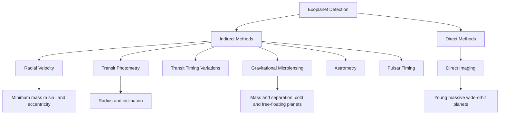
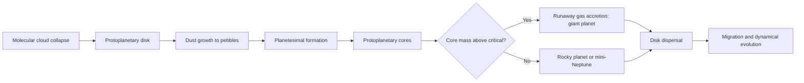

## Exoplanets and Planetary Systems


### Overview

An **exoplanet** (extrasolar planet) is a planet orbiting a star other than the Sun. Since the first confirmed detections in the early 1990s, the field has grown from a handful of curiosities into a statistical science: thousands of confirmed planets have been catalogued, and population studies show that planets are common, that most stars host at least one, and that the architecture of the Solar System is only one of many outcomes. Exoplanet science connects stellar astrophysics, orbital dynamics, planet formation theory, atmospheric physics, and astrobiology.

**Key Points**

- Exoplanets are almost always detected **indirectly**, through their effect on the host star's light or motion; direct imaging is limited to young, massive, widely separated planets.
- The two most productive techniques are the **transit method** (radius) and the **radial-velocity method** (minimum mass). Combined, they give bulk density.
- The observed population includes classes with no Solar System analog: hot Jupiters, super-Earths, and mini-Neptunes.
- Detection biases are strong. Raw counts of discovered planets do not reflect the true occurrence rates, which must be corrected for survey completeness.
- The number of confirmed exoplanets exceeds 5,500 as of the mid-2020s [Unverified: the catalogue count changes continually; consult the NASA Exoplanet Archive for the current figure].

### Historical Development

| Year | Milestone |
| --- | --- |
| 1992 | Wolszczan and Frail: planets around the pulsar PSR B1257+12 (timing method) |
| 1995 | Mayor and Queloz: 51 Pegasi b, the first planet around a Sun-like star (radial velocity) |
| 1999 | HD 209458 b: first transiting planet observed |
| 2004–2008 | First direct images of planetary-mass companions |
| 2009–2018 | Kepler mission: thousands of transiting candidates, establishing occurrence statistics |
| 2018– | TESS: all-sky transit survey of bright nearby stars |
| 2022– | JWST: transmission and emission spectroscopy of exoplanet atmospheres |

The 2019 Nobel Prize in Physics recognized Mayor and Queloz for the discovery of an exoplanet orbiting a solar-type star.

### Fundamentals of Planetary Orbits

#### Kepler's Third Law

For a planet of mass $m_p \ll M_\star$ on an orbit of semi-major axis $a$ and period $P$:

$$P^2 = \frac{4\pi^2}{G(M_\star + m_p)}\,a^3 \approx \frac{4\pi^2}{G M_\star}\,a^3$$

In convenient units (years, AU, solar masses):

$$P^2 = \frac{a^3}{M_\star}$$

**Example**

A planet orbits a $0.80\,M_\odot$ star with period $P = 10.0$ days. Convert: $P = 10/365.25 = 0.02738$ yr.

$$a^3 = M_\star P^2 = 0.80 \times (0.02738)^2 = 5.998 \times 10^{-4}\ \text{AU}^3$$


$$a = (5.998 \times 10^{-4})^{1/3} \approx 0.0843\ \text{AU}$$

**Output**

$$a \approx 0.084\ \text{AU}$$

This is about 22% of Mercury's orbital distance, placing the planet deep inside the inner Solar System equivalent.

#### Orbital Elements

An orbit is described by:

- Semi-major axis $a$ and eccentricity $e$
- Inclination $i$ (angle between the orbital plane normal and the line of sight)
- Longitude of ascending node $\Omega$ and argument of periastron $\omega$
- Time of periastron passage $T_0$

The inclination is critical because indirect methods measure only projections of orbital quantities.

### Detection Methods



#### 1. Radial Velocity (Doppler Spectroscopy)

The planet and star orbit their common center of mass. The star's motion along the line of sight Doppler-shifts its spectral lines. The stellar radial velocity semi-amplitude is:

$$K = \left(\frac{2\pi G}{P}\right)^{1/3}\frac{m_p \sin i}{(M_\star + m_p)^{2/3}}\frac{1}{\sqrt{1-e^2}}$$

For $m_p \ll M_\star$, this simplifies to:

$$K \approx 28.4\ \text{m/s}\ \times \frac{m_p \sin i}{M_{\text{Jup}}}\left(\frac{P}{1\ \text{yr}}\right)^{-1/3}\left(\frac{M_\star}{M_\odot}\right)^{-2/3}\frac{1}{\sqrt{1-e^2}}$$

The observable is $m_p \sin i$, a **minimum mass**, since $i$ is not determined by RV alone.

**Example**

A Jupiter-mass planet ($m_p \sin i = 1.0\,M_{\text{Jup}}$) on a circular orbit ($e = 0$) with $P = 3.5$ days around a $1.0\,M_\odot$ star:

$$P = \frac{3.5}{365.25} = 9.583 \times 10^{-3}\ \text{yr}, \qquad P^{-1/3} = (9.583\times10^{-3})^{-1/3} \approx 4.71$$


$$K \approx 28.4 \times 1.0 \times 4.71 \times 1.0 \approx 134\ \text{m/s}$$

**Output**

$$K \approx 134\ \text{m/s}$$

For comparison, Jupiter at 1 yr-scale periods induces only about $12.5$ m/s on the Sun (period 11.86 yr), and Earth induces about $0.09$ m/s. Detecting Earth analogs requires precision at or below $\sim 10$ cm/s, at the frontier of current spectrographs.

**Limitations of the RV method**

- Stellar activity (spots, plages, convective blueshift) introduces "jitter" of order m/s that can mimic or mask planets.
- Bias toward massive, short-period planets.
- The $\sin i$ degeneracy leaves the true mass uncertain unless the inclination is otherwise known (for example, from transits).

**Radial-velocity signal model (Python)**

Numerical output may vary with the solver settings used.

```python
import numpy as np
from scipy.optimize import brentq

def kepler_solve(M, e):
    """Solve Kepler's equation E - e sin E = M for E."""
    f = lambda E: E - e * np.sin(E) - M
    return brentq(f, 0.0, 2 * np.pi) if e > 0 else M

def rv_curve(t, P, K, e, omega, T0, gamma=0.0):
    """Radial velocity of the host star (m/s)."""
    M = (2 * np.pi * ((t - T0) / P)) % (2 * np.pi)
    E = np.array([kepler_solve(m, e) for m in np.atleast_1d(M)])
    nu = 2 * np.arctan2(
        np.sqrt(1 + e) * np.sin(E / 2),
        np.sqrt(1 - e) * np.cos(E / 2),
    )
    return K * (np.cos(nu + omega) + e * np.cos(omega)) + gamma

t = np.linspace(0, 10, 500)   # days
v = rv_curve(t, P=3.5, K=134.0, e=0.0, omega=0.0, T0=0.0)
print(f"Peak RV: {v.max():.1f} m/s, trough RV: {v.min():.1f} m/s")
```

**Output** (approximate)



```
Peak RV: 134.0 m/s, trough RV: -134.0 m/s
```

#### 2. Transit Photometry

If the orbit is viewed nearly edge-on, the planet periodically passes in front of the star, blocking a fraction of its light.

**Transit depth** (for a dark planet of radius $R_p$ on a uniform stellar disk of radius $R_\star$):

$$\delta = \frac{\Delta F}{F} \approx \left(\frac{R_p}{R_\star}\right)^2$$

**Geometric transit probability** for a circular orbit:

$$P_{\text{transit}} \approx \frac{R_\star}{a}$$

**Transit duration** (central transit, circular orbit, $R_p \ll R_\star$):

$$T_{14} \approx \frac{P}{\pi}\frac{R_\star}{a}\sqrt{(1 + k)^2 - b^2}\quad\text{with } k = \frac{R_p}{R_\star},\ b = \frac{a\cos i}{R_\star}$$

where $b$ is the **impact parameter**.

**Example**

A Jupiter-size planet ($R_p = 0.1005\,R_\odot$) transits a Sun-like star:

$$\delta = \left(\frac{0.1005}{1}\right)^2 \approx 0.0101 = 1.0\%$$

An Earth-size planet ($R_p = 0.00917\,R_\odot$):

$$\delta = (0.00917)^2 \approx 8.4 \times 10^{-5} = 84\ \text{ppm}$$

Transit probability for an Earth-like orbit at 1 AU ($R_\odot / 1\ \text{AU} = 0.00465$):

$$P_{\text{transit}} \approx 0.0047 = 0.47\%$$

A hot Jupiter at $a = 0.05$ AU:

$$P_{\text{transit}} \approx \frac{0.00465}{0.05} = 9.3\%$$

**Output**

$$\delta_{\text{Jup}} \approx 1.0\%, \quad \delta_{\oplus} \approx 84\ \text{ppm}, \quad P_{\text{transit},\ 1\text{AU}} \approx 0.47\%, \quad P_{\text{transit},\ 0.05\text{AU}} \approx 9.3\%$$

Because an Earth analog transits with under 0.5% probability, only a tiny fraction of such systems can be found by transits; surveys compensate by monitoring huge numbers of stars.

**Advantages and complications**

- Gives the planet radius (relative to the star) and the orbital period directly, plus inclination.
- Enables atmospheric characterization by transmission spectroscopy during transit and emission/reflection studies during secondary eclipse.
- Combined with RV, gives $m_p$ (with $\sin i \approx 1$) and thus bulk density.
- False positives include eclipsing binaries diluted by a foreground star, hierarchical triples, and background eclipsing binaries, requiring vetting and statistical validation.
- Stellar limb darkening, starspots, and flares affect the transit shape and depth.

#### 3. Transit Timing Variations (TTVs)

In multi-planet systems, gravitational interactions perturb orbital periods, causing transits to arrive earlier or later than a strict linear ephemeris. TTVs can reveal non-transiting planets and yield masses of the transiting planets without RV data. Near mean-motion resonances, the signal is amplified. Behavior depends on the resonance geometry and system architecture.

#### 4. Gravitational Microlensing

When a foreground star passes in front of a background source star, its gravity magnifies the source. A planet orbiting the lens star causes a short-lived additional anomaly. This method is sensitive to planets at several AU, including low-mass planets and free-floating planets, and the events are non-repeatable. Roughly, the Einstein radius is:

$$\theta_E = \sqrt{\frac{4 G M}{c^2}\frac{D_S - D_L}{D_L D_S}}$$

where $D_L$ and $D_S$ are the distances to the lens and the source.

#### 5. Direct Imaging

Direct imaging isolates the planet's light from the glare of the star using coronagraphs or starshades, adaptive optics, and differential imaging. It favors young, self-luminous, massive planets on wide orbits (tens of AU), since they are still hot from formation. The contrast ratio in reflected light is:

$$\frac{F_p}{F_\star} \approx A_g\left(\frac{R_p}{a}\right)^2\Phi(\alpha)$$

with geometric albedo $A_g$ and phase function $\Phi(\alpha)$.

**Example**

For Jupiter as seen from outside the Solar System ($R_p = 7.15 \times 10^{7}$ m, $a = 7.78\times10^{11}$ m, $A_g \approx 0.5$, full phase $\Phi = 1$):

$$\frac{F_p}{F_\star} \approx 0.5 \times \left(\frac{7.15\times10^{7}}{7.78\times10^{11}}\right)^2 \approx 0.5 \times 8.4\times10^{-9} \approx 4\times10^{-9}$$

For Earth ($R_p = 6.37\times10^{6}$ m, $a = 1.496\times10^{11}$ m, $A_g \approx 0.3$):

$$\frac{F_p}{F_\star} \approx 0.3 \times (4.26\times10^{-5})^2 \approx 5\times10^{-10}$$

**Output**

$$\left(\frac{F_p}{F_\star}\right)_{\text{Jup}} \approx 4\times10^{-9}, \qquad \left(\frac{F_p}{F_\star}\right)_{\oplus} \approx 5\times10^{-10}$$

Contrasts of $10^{-9}$ to $10^{-10}$ at sub-arcsecond separations are the target of next-generation coronagraphic missions.

#### 6. Astrometry

Astrometry measures the tiny periodic angular displacement of the star's position on the sky. The astrometric signature is:

$$\alpha = \frac{m_p}{M_\star}\frac{a}{d}$$

with $\alpha$ in arcseconds when $a$ is in AU and $d$ in parsecs. Gaia is producing astrometric planet candidates, and this method complements RV by providing $\sin i$-free masses.

#### 7. Pulsar Timing

Planets around pulsars alter the arrival times of the pulses. Sensitivity reaches sub-Earth masses, but the population of such systems is very small.

#### Method Comparison

| Method | Measures | Favors | Key limitation |
| --- | --- | --- | --- |
| Radial velocity | $m_p\sin i$, $P$, $e$ | Massive, close-in planets | $\sin i$ degeneracy; stellar jitter |
| Transit | $R_p/R_\star$, $P$, $i$ | Large, close-in planets; edge-on orbits | Geometric probability; false positives |
| TTV | Masses, hidden companions | Near-resonant multiples | Requires many transits; model-dependent |
| Microlensing | $m_p$, projected separation | Cold planets, distant hosts | One-time events; no follow-up |
| Direct imaging | Flux, spectra, position | Young, massive, wide-orbit planets | Contrast and angular resolution |
| Astrometry | True $m_p$, orbit | Massive, long-period planets around nearby stars | Microarcsecond precision required |

### Planetary Properties

#### Mass, Radius, and Density

Combining the transit radius and the RV mass gives the bulk density:

$$\rho = \frac{3 m_p}{4\pi R_p^3}$$

**Example**

A planet has $m_p = 5.0\,M_\oplus$ and $R_p = 1.6\,R_\oplus$. Earth's mean density is $5.51$ g/cm$^3$:

$$\rho = 5.51 \times \frac{5.0}{(1.6)^3} = 5.51 \times \frac{5.0}{4.096} \approx 6.73\ \text{g/cm}^3$$

**Output**

$$\rho \approx 6.7\ \text{g/cm}^3 \quad (\text{consistent with a rocky, possibly iron-rich composition})$$

The density is compared against composition models (iron, silicate, water, hydrogen/helium envelope) that form mass–radius curves; degeneracy among compositions is common.

#### Surface Gravity and Escape Velocity

$$g = \frac{G m_p}{R_p^2}, \qquad v_{\text{esc}} = \sqrt{\frac{2 G m_p}{R_p}}$$

**Example** (the same $5\,M_\oplus$, $1.6\,R_\oplus$ planet, with Earth's $g = 9.81$ m/s$^2$ and $v_{\text{esc}} = 11.2$ km/s):

$$g = 9.81 \times \frac{5.0}{(1.6)^2} = 9.81 \times 1.953 \approx 19.2\ \text{m/s}^2$$


$$v_{\text{esc}} = 11.2 \times \sqrt{\frac{5.0}{1.6}} = 11.2 \times 1.768 \approx 19.8\ \text{km/s}$$

**Output**

$$g \approx 19.2\ \text{m/s}^2, \qquad v_{\text{esc}} \approx 19.8\ \text{km/s}$$

#### Equilibrium Temperature

Assuming the planet absorbs starlight, reradiates as a blackbody, and redistributes heat efficiently:

$$T_{\text{eq}} = T_\star\sqrt{\frac{R_\star}{2a}}\,(1 - A_B)^{1/4}$$

where $A_B$ is the Bond albedo.

**Example**

For Earth ($T_\odot = 5772$ K, $R_\odot/a = 0.00465$, $A_B = 0.3$):

$$T_{\text{eq}} = 5772\times\sqrt{\frac{0.00465}{2}}\times(0.7)^{1/4} = 5772\times0.04822\times0.9147 \approx 254.6\ \text{K}$$

**Output**

$$T_{\text{eq}} \approx 255\ \text{K} \quad (\text{about } -18\,^\circ\text{C})$$

The actual mean surface temperature of Earth ($\approx 288$ K) is higher due to the greenhouse effect. $T_{\text{eq}}$ is a reference quantity, not a measured surface temperature.

### Planet Classes

| Class | Typical size / mass | Notes |
| --- | --- | --- |
| Hot Jupiter | $\sim 0.5$–$2\,M_{\text{Jup}}$, $P < 10$ d | Large transit signals; possibly inflated radii from stellar irradiation; rare (about $1\%$ of Sun-like stars) |
| Warm/cold Jupiter | $P \gtrsim 10$ d to years | More common than hot Jupiters; often eccentric |
| Neptune-like | $\sim 3$–$4\,R_\oplus$ | Hydrogen/helium envelope over an icy or rocky core |
| Mini-Neptune | $\sim 1.7$–$4\,R_\oplus$ | Substantial volatile envelope |
| Super-Earth | $\sim 1$–$1.7\,R_\oplus$ (or $1$–$10\,M_\oplus$) | Possibly rocky; no Solar System analog |
| Earth-size / rocky | $\lesssim 1.2\,R_\oplus$ | Prime targets for habitability studies |
| Lava world | Rocky, ultra-short period | Surface may be molten on the dayside |
| Free-floating planet | Various | Unbound from stars; detected by microlensing |

#### The Radius Valley

Kepler data show a deficit of planets with radii around $1.5$–$2\,R_\oplus$ at short periods, separating rocky super-Earths from gas-enveloped mini-Neptunes. Proposed explanations include photoevaporation (stellar XUV stripping atmospheres) and core-powered mass loss. [Inference: the relative roles of these processes are still debated, and both may operate.]

### Habitability

#### The Habitable Zone

The circumstellar **habitable zone (HZ)** is the range of orbital distances where a rocky planet with a suitable atmosphere could sustain liquid water on its surface. The inner and outer edges scale with stellar luminosity, approximately:

$$d_{\text{HZ}} \approx d_{\text{ref}}\sqrt{\frac{L_\star}{L_\odot}}$$

with the conservative Sun-based HZ extending from roughly $0.95$ to $1.7$ AU (published estimates vary by climate model).

**Example**

For an M dwarf with $L_\star = 0.0015\,L_\odot$:

$$d_{\text{inner}} \approx 0.95\times\sqrt{0.0015} = 0.95\times0.03873 \approx 0.037\ \text{AU}$$


$$d_{\text{outer}} \approx 1.7\times0.03873 \approx 0.066\ \text{AU}$$

**Output**

$$d_{\text{HZ}} \approx 0.037\text{–}0.066\ \text{AU}$$

Planets in such tight orbits are likely **tidally locked**, with one hemisphere permanently facing the star, and are exposed to stellar flares and XUV radiation, which may erode atmospheres. Whether such planets can retain habitable conditions is an open question.

#### Habitability Considerations

- **Atmosphere and greenhouse effect**: Determines surface temperature and pressure.
- **Stellar activity**: Flares and high-energy radiation influence atmospheric retention and chemistry.
- **Tidal locking** and heat redistribution by winds and oceans.
- **Magnetic field**: May help shield an atmosphere, though its role is debated.
- **Orbital stability**: Eccentricity and obliquity variations from companions.
- **Composition**: Water content, carbon cycle, plate tectonics.

The HZ describes conditions permitting surface liquid water, not whether a planet is inhabited or even habitable.

#### Biosignatures

Candidate atmospheric biosignatures include $\text{O}_2$, $\text{O}_3$, $\text{CH}_4$ in disequilibrium with $\text{CO}_2$, and $\text{N}_2\text{O}$. Abiotic processes can mimic some of them (for example, photochemical $\text{O}_2$ buildup on water-loss planets), so a robust claim requires ruling out false positives in context. [Speculation: whether any single molecule can serve as unambiguous evidence for life is contested.]

### Atmospheric Characterization

#### Transmission Spectroscopy

During transit, starlight filters through the planetary atmosphere's limb. The effective planetary radius varies with wavelength because absorbers make the atmosphere opaque at some wavelengths. The characteristic **scale height** is:

$$H = \frac{k_B T}{\mu m_H g}$$

where $\mu$ is the mean molecular weight and $g$ is the surface gravity. The amplitude of the spectral feature is approximately:

$$\Delta\delta \approx \frac{2 R_p N H}{R_\star^2}$$

where $N$ is the number of scale heights spanned by the feature (typically 1–5).

**Example**

A hot Jupiter with $T = 1500$ K, $\mu = 2.3$ (hydrogen-dominated), $g = 20$ m/s$^2$, $R_p = 1.2\,R_{\text{Jup}} = 8.6\times10^{7}$ m, and $R_\star = R_\odot = 6.957\times10^{8}$ m:

$$H = \frac{(1.381\times10^{-23})(1500)}{(2.3)(1.673\times10^{-27})(20)} = \frac{2.072\times10^{-20}}{7.696\times10^{-26}} \approx 2.69\times10^{5}\ \text{m} \approx 269\ \text{km}$$


$$\Delta\delta \approx \frac{2(8.6\times10^{7})(5)(2.69\times10^{5})}{(6.957\times10^{8})^2} = \frac{2.313\times10^{14}}{4.840\times10^{17}} \approx 4.8\times10^{-4}$$

**Output**

$$H \approx 270\ \text{km}, \qquad \Delta\delta \approx 480\ \text{ppm}$$

For a small rocky planet with a high-$\mu$ atmosphere, the scale height is much smaller, and the spectral signal is often only tens of ppm, making characterization extremely challenging. Clouds and hazes can flatten spectral features, a common obstacle in observed spectra.

#### Emission and Thermal Phase Curves

Measuring the total flux across an orbit, including the secondary eclipse (when the planet passes behind the star), constrains dayside temperature, heat redistribution, and albedo. JWST has extended these observations to a broad range of planets, including smaller and cooler worlds.

### Planet Formation

#### Core Accretion

The dominant paradigm for planet formation, in stages:

1. A protoplanetary disk of gas and dust forms around a young star.
2. Dust grains coagulate into pebbles and planetesimals (via streaming instability and pebble accretion, among other proposed mechanisms).
3. Planetesimals grow into protoplanetary cores.
4. A core exceeding roughly $5$–$10\,M_\oplus$ can accrete a gas envelope rapidly (runaway gas accretion), forming a giant planet before the disk dissipates.
5. The disk disperses in a few million years, ending gas accretion.



#### Gravitational Instability

An alternative mechanism in which a massive, cold disk fragments directly into gravitationally bound clumps. It is a candidate for forming giant planets on very wide orbits but is generally considered less important overall. The stability criterion is the Toomre parameter:

$$Q = \frac{c_s\,\Omega}{\pi G \Sigma}$$

Fragmentation is expected for $Q \lesssim 1$.

#### Migration

The existence of hot Jupiters at $a \lesssim 0.1$ AU, where in situ formation is difficult, indicates that planets migrate. Proposed channels include:

- **Disk (Type I/II) migration**: Gravitational torques from the disk drive inward migration.
- **High-eccentricity migration**: Planet-planet scattering or the Kozai–Lidov mechanism raises eccentricity; tidal dissipation then circularizes the orbit at a short period.

The relative importance is an open question. Observed stellar obliquities (spin–orbit misalignment) of hot Jupiter hosts, measured via the Rossiter–McLaughlin effect, provide evidence for the dynamical channels.

#### Snow Line

The **snow line** (frost line) is the disk radius beyond which water ice can condense, roughly $2.7$ AU in the early Solar System, though it varies with stellar luminosity and evolves in time. Beyond it, solid surface density increases, aiding the formation of massive cores.

### Planetary System Architecture

#### Resonances

Planets can lock into **mean-motion resonances**, in which the ratio of orbital periods is close to a ratio of small integers, for example:

$$\frac{P_2}{P_1} \approx \frac{p+q}{p}$$

Examples: TRAPPIST-1 has seven Earth-size planets in a chain of near-resonances, and Kepler-223 hosts a resonant multi-planet chain.

#### Orbital Stability

Multi-planet systems must satisfy dynamical stability. A common criterion uses the mutual Hill radius:

$$R_H = \left(\frac{m_1 + m_2}{3M_\star}\right)^{1/3}\frac{a_1 + a_2}{2}$$

Planets spaced by fewer than $\sim 2\sqrt{3}\approx 3.5$ mutual Hill radii are typically unstable for two-planet systems; for larger multiplicity, the stability threshold is larger, though exact values depend on masses and eccentricities.

**Example**

Two planets of $10\,M_\oplus$ each orbit a $1\,M_\odot$ star at $a_1 = 0.10$ AU and $a_2 = 0.14$ AU. With $M_\oplus/M_\odot = 3.003\times10^{-6}$:

$$\frac{m_1 + m_2}{3M_\star} = \frac{20\times3.003\times10^{-6}}{3} = 2.002\times10^{-5}$$


$$R_H = (2.002\times10^{-5})^{1/3}\times\frac{0.10 + 0.14}{2} = 0.02715\times0.12 \approx 3.26\times10^{-3}\ \text{AU}$$


$$\Delta = \frac{a_2 - a_1}{R_H} = \frac{0.04}{3.26\times10^{-3}} \approx 12.3$$

**Output**

$$\Delta \approx 12.3\ \text{mutual Hill radii} \quad (\text{well above the two-planet threshold of about } 3.5)$$

#### Common Architectures

- **Compact multi-planet systems** of sub-Neptunes and super-Earths ("peas in a pod"), frequently with similar sizes and regular spacing.
- **Hot Jupiter systems** that often lack close companions, though exceptions exist.
- **Circumbinary planets** (for example, Kepler-16b), orbiting both stars of a binary.
- **Solar System-like** arrangements of inner rocky planets and outer giants, whose prevalence is uncertain because of detection biases.

#### Comparison to the Solar System

| Feature | Solar System | Typical exoplanet finding |
| --- | --- | --- |
| Inner planet types | Small rocky planets | Super-Earths and mini-Neptunes common |
| Gas giant locations | Beyond 5 AU | Wide range, including hot Jupiters |
| Orbits | Nearly circular, coplanar | Broad eccentricity distribution among giants |
| Spacing | Wide | Compact packing frequently observed |
| Sub-Neptune-sized planets inside Mercury's orbit | None | Frequently observed |

### Occurrence Rates and Statistics

The observed sample is biased by detection probability. An occurrence rate $f$ is estimated by correcting the detected count $N_{\text{det}}$ for survey completeness:

$$f = \frac{N_{\text{det}}}{N_\star\,\langle p_{\text{det}}\rangle\,P_{\text{transit}}}$$

For a transit survey, the effective completeness depends on the planet's period, radius, the star's noise, and the pipeline's detection efficiency, so it is calibrated by injecting synthetic transits.

Findings (approximate; values depend on the sample and analysis):

- Roughly $30$–$50\%$ of Sun-like stars host a planet with $P < 100$ days and $R_p = 1$–$4\,R_\oplus$.
- Hot Jupiters occur around about $0.5$–$1\%$ of Sun-like stars.
- Small planets are common around M dwarfs, with higher occurrence per star than around Sun-like stars.
- Giant planet occurrence rises with stellar metallicity (the planet–metallicity correlation), a signature of core accretion.
- The fraction of Sun-like stars with an Earth-size planet in the habitable zone ($\eta_\oplus$) is uncertain, with published estimates spanning roughly $0.01$ to $0.5$ or more, depending on definitions and extrapolation. [Unverified: no measurement has yet constrained $\eta_\oplus$ tightly.]

### Notable Systems

| System | Significance |
| --- | --- |
| 51 Pegasi b | First planet around a Sun-like star; prototype hot Jupiter |
| HD 209458 b | First transiting planet; first atmosphere detected |
| Kepler-186 f | First Earth-size planet found in the habitable zone of another star |
| TRAPPIST-1 | Seven Earth-size planets around an ultracool dwarf, several in or near the HZ |
| Proxima Centauri b | Nearest known exoplanet (about $4.2$ ly), minimum mass $\sim 1.1\,M_\oplus$, in the HZ of an M dwarf |
| HR 8799 | Four directly imaged giant planets |
| Kepler-16b | First confirmed circumbinary planet |
| 55 Cancri e | Ultra-short-period super-Earth, likely a lava world |

### Upcoming and Active Facilities

| Facility | Approach | Role |
| --- | --- | --- |
| Kepler / K2 | Transit photometry (space) | Established occurrence rates |
| TESS | All-sky transit survey (space) | Bright nearby hosts suitable for follow-up |
| Gaia | Astrometry (space) | Astrometric candidates, precise stellar parameters |
| JWST | Infrared spectroscopy (space) | Atmospheric composition |
| CHEOPS | Precision photometry (space) | Characterizing known transiting planets |
| PLATO | Transit photometry (planned) | Earth-size planets around Sun-like stars |
| Roman Space Telescope | Microlensing and coronagraphy (planned) | Cold planets; coronagraph demonstration |
| Ground-based ELTs | High-contrast imaging, spectroscopy | Direct characterization of nearby planets |

Mission schedules and capabilities are subject to change.

### Common Misconceptions

| Misconception | Correction |
| --- | --- |
| Exoplanets are usually imaged directly | The majority are detected indirectly; images exist for only a small number |
| The habitable zone means the planet is habitable | It indicates conditions where surface liquid water is possible, subject to atmosphere and other factors |
| A transit gives the planet's mass | Transits give radius; mass requires RV, TTVs, or another method |
| RV gives the true mass | It gives $m_p\sin i$, a lower bound |
| Detected planets represent typical systems | Detection methods are biased toward large, close-in planets |
| Planets are rare | Statistical studies indicate planets are common around stars |
| The Solar System is typical | It appears to be one configuration among many; a lack of sub-Neptunes inside Mercury's orbit is unusual |

### Conclusion

Exoplanet science has shown that planetary systems are abundant and strikingly diverse. Radial-velocity and transit methods, complemented by microlensing, imaging, astrometry, and timing, provide masses, radii, and orbits that constrain composition and formation. Formation theory (core accretion, migration, dynamical evolution) explains part of the observed diversity, but questions remain about the origin of hot Jupiters, the radius valley, and the prevalence of habitable worlds. With JWST characterizing atmospheres and future missions targeting Earth-like planets, the field is progressing from detection toward comparative planetology and the search for biosignatures.

**Related Topics**

- Radial Velocity Precision and Stellar Activity Mitigation
- Transit Light-Curve Modeling and Limb Darkening
- Protoplanetary Disks and Planetesimal Formation
- Planetary Migration and Orbital Resonances
- Exoplanet Atmospheres and Transmission Spectroscopy
- Habitable Zones and Climate Models
- M Dwarf Planets and Tidal Locking
- Biosignatures and the Search for Life
- Microlensing Surveys and Free-Floating Planets
- Circumbinary and Multi-Planet System Dynamics