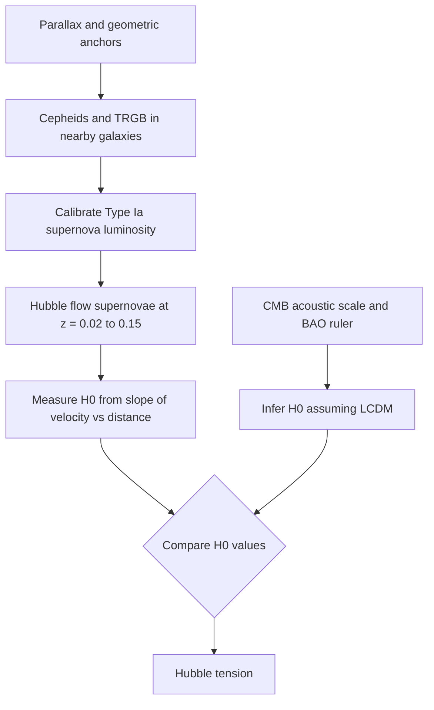

## The Expanding Universe and Hubble's Law


### Overview

Hubble's law states that, on large scales, galaxies recede from us with a speed proportional to their distance. This linear relation is the observational signature of the **expansion of space itself**, as described by general relativity in the Friedmann–Lemaître–Robertson–Walker (FLRW) framework. It is the empirical foundation of modern cosmology, and it provides both a means of measuring cosmic distances and a way to estimate the age and size of the universe.

**Key Points**

- Hubble's law: $v = H_0 d$, valid for cosmological distances where peculiar (local) velocities are small compared with the Hubble flow.
- The recession is not motion *through* space; the metric scale factor $a(t)$ grows, stretching the wavelengths of light in transit (cosmological redshift).
- Every observer in a homogeneous, isotropic universe sees the same law, so no galaxy is at a special "center."
- $H_0$ is currently measured at $\approx 67$–$74$ km/s/Mpc, and the discrepancy between methods (the Hubble tension) is unresolved.
- The law is exactly linear only to first order in $z$; at large redshift the full expansion history $H(z)$ must be used.

### Historical Development

| Year | Contributor | Contribution |
| --- | --- | --- |
| 1912 | Vesto Slipher | Measured Doppler shifts of spiral nebulae, finding most redshifted |
| 1915–1917 | Einstein | General relativity and a static universe with a cosmological constant |
| 1922 | Alexander Friedmann | Dynamical (expanding/contracting) solutions of Einstein's equations |
| 1927 | Georges Lemaître | Derived a linear velocity–distance relation from GR and estimated the expansion rate from existing data |
| 1929 | Edwin Hubble | Published the velocity–distance relation using Cepheid-based distances |
| 1998 | Riess et al.; Perlmutter et al. | Type Ia supernovae showed the expansion is accelerating |
| 2001 | HST Key Project (Freedman et al.) | $H_0 = 72 \pm 8$ km/s/Mpc from Cepheid calibration |
| 2013–2018 | Planck | $H_0 \approx 67.4$ km/s/Mpc inferred from the CMB within $\Lambda$CDM |
| 2019–present | SH0ES and others | Local distance ladder gives $H_0 \approx 73$ km/s/Mpc |

Hubble's original 1929 value, about $500$ km/s/Mpc, was roughly seven times too large because of miscalibrated distance indicators (Cepheid population confusion and misidentified HII regions).

### The Physics of Cosmic Expansion

#### Comoving and Proper Coordinates

In an expanding universe, the physical (proper) separation between two points is:

$$d_{\text{proper}}(t) = a(t)\,\chi$$

where $\chi$ is the constant **comoving distance** and $a(t)$ is the scale factor, normalized to $a(t_0) = 1$ today.

Differentiating with respect to time:

$$v_{\text{rec}} = \dot{d}_{\text{proper}} = \dot{a}\,\chi = \frac{\dot{a}}{a}\,d_{\text{proper}} = H(t)\,d_{\text{proper}}$$

This is Hubble's law, derived directly from the geometry of uniform expansion, where the **Hubble parameter** is:

$$H(t) = \frac{\dot{a}}{a}$$

Its present value is the **Hubble constant**, $H_0 = H(t_0)$. Despite the name, $H$ changes with time.

#### Why Linearity Follows from Homogeneity

Consider three galaxies A, B, C. If the expansion is homogeneous and isotropic, the relative velocity between any two must depend only on their separation. Requiring consistency of vector addition of velocities (from A to B and B to C giving A to C) forces $v \propto d$. Any nonlinear law would single out a special origin.

#### The Raisin-Bread Model


In the raisin-bread analogy, the dough is space and the raisins are galaxies. As the dough rises, each raisin sees every other raisin recede, with farther raisins receding faster. No raisin is at the center. Limitation: real dough has an edge and expands into surrounding air, while the FLRW universe need not.

### Cosmological Redshift

#### Definition

$$z = \frac{\lambda_{\text{obs}} - \lambda_{\text{emit}}}{\lambda_{\text{emit}}} = \frac{\lambda_{\text{obs}}}{\lambda_{\text{emit}}} - 1$$

#### Relation to the Scale Factor

As a light wave travels through expanding space, its wavelength stretches in proportion to $a(t)$:

$$1 + z = \frac{a(t_0)}{a(t_{\text{emit}})} = \frac{1}{a(t_{\text{emit}})}$$

**Example**

A quasar's Lyman-alpha line ($\lambda_{\text{emit}} = 121.6$ nm) is observed at $\lambda_{\text{obs}} = 486.4$ nm.

$$1 + z = \frac{486.4}{121.6} = 4.00 \implies z = 3.00$$

The scale factor at emission was:

$$a_{\text{emit}} = \frac{1}{1+z} = 0.25$$

**Output**

$$z = 3.00, \quad a_{\text{emit}} = 0.25$$

The universe was one quarter of its present linear size when the light was emitted.

#### Cosmological Redshift Versus Doppler Shift

| Property | Doppler redshift | Cosmological redshift |
| --- | --- | --- |
| Cause | Relative motion of source through space | Stretching of space during photon travel |
| Applicable formula | $1+z = \sqrt{\dfrac{1+\beta}{1-\beta}}$ (special relativity) | $1+z = a_0/a_{\text{emit}}$ |
| Can $z$ correspond to $v > c$? | No, $v < c$ always | Yes, recession speeds can exceed $c$ (no violation of relativity) |
| Frame | Depends on observer motion | Set by the global expansion |

For $z \ll 1$, both reduce to $z \approx v/c$. Interpreting large $z$ with the special-relativistic Doppler formula is a common error.

### Hubble's Law in Detail

#### Statement

$$v = H_0\,d$$

Standard units: $v$ in km/s, $d$ in Mpc, $H_0$ in km/s/Mpc.

Using $v \approx cz$ for small redshift:

$$d \approx \frac{c z}{H_0} \quad (z \ll 1)$$

#### Unit Conversion

$$1 \text{ Mpc} = 3.0857 \times 10^{19} \text{ km}$$


$$H_0 = 70 \text{ km/s/Mpc} = \frac{70}{3.0857 \times 10^{19}} \text{ s}^{-1} \approx 2.27 \times 10^{-18} \text{ s}^{-1}$$

The **Hubble time** and **Hubble distance** are:

$$t_H = \frac{1}{H_0}, \qquad d_H = \frac{c}{H_0}$$

**Example**

For $H_0 = 70$ km/s/Mpc:

$$t_H = \frac{1}{2.27 \times 10^{-18} \text{ s}^{-1}} = 4.41 \times 10^{17} \text{ s}$$


$$t_H = \frac{4.41 \times 10^{17}}{3.156 \times 10^{7}} \text{ yr} \approx 1.40 \times 10^{10} \text{ yr} = 14.0 \text{ Gyr}$$


$$d_H = \frac{2.998 \times 10^{5} \text{ km/s}}{70 \text{ km/s/Mpc}} \approx 4283 \text{ Mpc} \approx 13.97 \text{ Gly}$$

**Output**

$$t_H \approx 14.0 \text{ Gyr}, \qquad d_H \approx 4.28 \text{ Gpc}$$

The Hubble time is a rough upper-level estimate of the age of the universe if expansion had always proceeded at the current rate. The actual age (about 13.8 Gyr) is close by coincidence in $\Lambda$CDM, since deceleration in the matter era and later acceleration approximately offset.

#### Worked Example: Recession Speed and Distance

A galaxy has a measured redshift of $z = 0.0250$. With $H_0 = 70$ km/s/Mpc:

$$v \approx cz = (2.998 \times 10^{5} \text{ km/s})(0.0250) = 7495 \text{ km/s}$$


$$d = \frac{v}{H_0} = \frac{7495}{70} \approx 107 \text{ Mpc}$$

**Output**

$$v \approx 7.5 \times 10^{3} \text{ km/s}, \qquad d \approx 107 \text{ Mpc} \approx 349 \text{ Mly}$$

#### Worked Example: Peculiar Velocity Contamination

A nearby galaxy at true distance $d = 10$ Mpc has a peculiar velocity of $+300$ km/s toward us (i.e., $-300$ km/s along the line of sight) due to local gravitational attraction. The Hubble flow gives:

$$v_H = H_0 d = 70 \times 10 = 700 \text{ km/s}$$

Observed velocity:

$$v_{\text{obs}} = v_H + v_{\text{pec}} = 700 - 300 = 400 \text{ km/s}$$

Naively inferred distance:

$$d_{\text{inferred}} = \frac{400}{70} \approx 5.7 \text{ Mpc}$$

**Output**

$$d_{\text{inferred}} \approx 5.7 \text{ Mpc} \quad (\text{true value } 10 \text{ Mpc, an error of about } 43\%)$$

Peculiar velocities are typically of order a few hundred km/s (up to $\sim 1000$ km/s in cluster environments), so Hubble's law is only reliable for $d \gtrsim 50$–$100$ Mpc, where $H_0 d$ greatly exceeds them. Andromeda (M31), for example, is blueshifted because gravity dominates over expansion within the Local Group.

### Beyond the Linear Law

#### Full Redshift–Distance Relations

For arbitrary $z$, several distance measures are needed. In a flat universe with expansion history $H(z)$:

$$d_C(z) = c\int_0^{z} \frac{dz'}{H(z')} \qquad \text{(comoving distance)}$$


$$d_L(z) = (1+z)\,d_C(z) \qquad \text{(luminosity distance)}$$


$$d_A(z) = \frac{d_C(z)}{1+z} \qquad \text{(angular diameter distance)}$$

Where the Hubble parameter for a flat $\Lambda$CDM universe is:

$$H(z) = H_0\sqrt{\Omega_m(1+z)^3 + \Omega_r(1+z)^4 + \Omega_\Lambda}$$

The luminosity distance and flux are related by:

$$F = \frac{L}{4\pi d_L^2}$$

#### Series Expansion Around the Present

Expanding $d_L$ in redshift gives the low-$z$ form:

$$d_L = \frac{c z}{H_0}\left[1 + \frac{1 - q_0}{2}\,z + \mathcal{O}(z^2)\right]$$

where the **deceleration parameter** is:

$$q_0 = -\frac{\ddot{a}\,a}{\dot{a}^2}\bigg|_{t_0}$$

The linear Hubble law is the leading term; the correction depends on $q_0$. For $\Omega_m = 0.31$ and $\Omega_\Lambda = 0.69$:

$$q_0 = \frac{\Omega_m}{2} - \Omega_\Lambda \approx -0.54$$

The negative value indicates accelerated expansion, which is why distant Type Ia supernovae appear fainter than a decelerating model predicts.

#### Worked Example: Correction to the Linear Law

At $z = 0.1$, with $H_0 = 70$ km/s/Mpc and $q_0 = -0.54$:

Linear estimate:

$$d_{\text{lin}} = \frac{cz}{H_0} = \frac{(2.998 \times 10^5)(0.1)}{70} \approx 428 \text{ Mpc}$$

With the first-order correction:

$$d_L \approx 428\left[1 + \frac{1-(-0.54)}{2}(0.1)\right] = 428\left[1 + 0.077\right] \approx 461 \text{ Mpc}$$

**Output**

d_L \approx 461 \text{ Mpc versus } d_{\text{lin}} \approx 428 \text{ Mpc (about 8% difference)}

#### Superluminal Recession

The recession speed of a comoving object at proper distance $d$ is $v = H d$. It exceeds $c$ when $d > c/H$. This does not violate special relativity because no object moves through space faster than light locally. Galaxies beyond the Hubble radius today recede faster than $c$, yet light emitted from some of them can still reach us, because the Hubble radius itself changes with time. In an accelerating universe, however, there is an **event horizon**: light emitted now from beyond a finite comoving distance (about $16$ Gly in $\Lambda$CDM, depending on parameters) will never reach us.

### Measuring Distances: The Cosmic Distance Ladder

To use Hubble's law, one needs independent distance measurements. Each rung calibrates the next.

| Rung | Method | Approximate range | Principle |
| --- | --- | --- | --- |
| 1 | Radar ranging, parallax | up to $\sim$ kpc (Gaia extends this) | Geometry |
| 2 | Main-sequence fitting, RR Lyrae | up to $\sim$ 100 kpc | Standard luminosities |
| 3 | Cepheid variables | up to $\sim$ 30–40 Mpc | Period–luminosity relation |
| 4 | Tip of the Red Giant Branch (TRGB) | up to $\sim$ 20–30 Mpc | Fixed helium-flash luminosity |
| 5 | Tully–Fisher, Faber–Jackson, surface brightness fluctuations | up to $\sim$ 100+ Mpc | Empirical scaling relations |
| 6 | Type Ia supernovae | up to $\sim$ Gpc (and beyond) | Standardizable candles |
| 7 | Baryon acoustic oscillations | Gpc-scale | Standard ruler |



#### The Cepheid Period–Luminosity Relation

Classical Cepheids obey (Leavitt law):

$$M_V = a\log_{10}(P) + b$$

where $P$ is the pulsation period in days. The distance modulus then gives the distance:

$$m - M = 5\log_{10}\left(\frac{d}{10\text{ pc}}\right) \implies d = 10^{(m - M + 5)/5}\text{ pc}$$

**Example**

A Cepheid has $P = 10$ days, so from the calibrated relation $M_V \approx -4.0$ (approximate). Its apparent magnitude is $m_V = 22.0$.

$$m - M = 22.0 - (-4.0) = 26.0$$


$$d = 10^{(26.0 + 5)/5}\text{ pc} = 10^{6.2}\text{ pc} \approx 1.58 \times 10^{6}\text{ pc} \approx 1.6 \text{ Mpc}$$

**Output**

$$d \approx 1.6 \text{ Mpc}$$

Interstellar extinction adds an offset to $m$ that must be corrected, or distances are overestimated. In practice, multi-band photometry is used to correct for it.

#### Type Ia Supernovae as Standardizable Candles

Type Ia supernovae have a peak absolute magnitude of about $M_B \approx -19.3$, with an intrinsic scatter that shrinks to roughly $0.1$–$0.15$ mag after applying the **Phillips relation** (brighter events decline more slowly) and color corrections. Their brightness lets them probe $z \sim 1$–$2$, the regime where the expansion history departs from linearity.

**Example: Distance from Distance Modulus**

A supernova peaks at $m_B = 19.5$ with $M_B = -19.3$:

$$\mu = m - M = 19.5 - (-19.3) = 38.8$$


$$d_L = 10^{(38.8+5)/5}\text{ pc} = 10^{8.76}\text{ pc} \approx 5.75 \times 10^{8}\text{ pc} = 575 \text{ Mpc}$$

**Output**

$$d_L \approx 575 \text{ Mpc}$$

For $H_0 = 70$ km/s/Mpc this corresponds to a redshift of roughly $z \approx 0.13$ (after small nonlinear corrections).

### Determining the Hubble Constant

#### Fitting Hubble's Law to Data

Given measured pairs $(d_i, v_i)$, a least-squares fit through the origin gives:

$$H_0 = \frac{\sum_i d_i v_i}{\sum_i d_i^2}$$

**Example**

Five galaxies with (distance in Mpc, velocity in km/s):

| Galaxy | $d$ (Mpc) | $v$ (km/s) | $d\,v$ | $d^2$ |
| --- | --- | --- | --- | --- |
| A | 50 | 3600 | 180,000 | 2,500 |
| B | 100 | 7100 | 710,000 | 10,000 |
| C | 150 | 10,300 | 1,545,000 | 22,500 |
| D | 200 | 14,200 | 2,840,000 | 40,000 |
| E | 250 | 17,400 | 4,350,000 | 62,500 |

$$\sum dv = 9{,}625{,}000, \qquad \sum d^2 = 137{,}500$$


$$H_0 = \frac{9{,}625{,}000}{137{,}500} = 70.0 \text{ km/s/Mpc}$$

**Output**

$$H_0 = 70.0 \text{ km/s/Mpc}$$

#### Python Implementation

Numerical results may vary slightly with library versions and floating-point handling.

```python
import numpy as np

# Mock data: distances in Mpc, velocities in km/s
d = np.array([50.0, 100.0, 150.0, 200.0, 250.0])
v = np.array([3600.0, 7100.0, 10300.0, 14200.0, 17400.0])

# Least-squares fit through the origin: v = H0 * d
H0 = np.sum(d * v) / np.sum(d**2)

# Uncertainty estimate (one-parameter linear regression)
residuals = v - H0 * d
n = len(d)
sigma_v = np.sqrt(np.sum(residuals**2) / (n - 1))
sigma_H0 = sigma_v / np.sqrt(np.sum(d**2))

# Derived quantities
Mpc_km = 3.0857e19            # km per Mpc
sec_per_Gyr = 3.156e16
hubble_time_Gyr = (Mpc_km / H0) / sec_per_Gyr
hubble_dist_Mpc = 299792.458 / H0

print(f"H0 = {H0:.2f} +/- {sigma_H0:.2f} km/s/Mpc")
print(f"Hubble time     = {hubble_time_Gyr:.2f} Gyr")
print(f"Hubble distance = {hubble_dist_Mpc:.0f} Mpc")
```

**Output** (approximate)



```
H0 = 70.00 +/- 0.42 km/s/Mpc
Hubble time     = 13.97 Gyr
Hubble distance = 4283 Mpc
```

#### Current Measurements and the Hubble Tension

| Method | Type | Approximate $H_0$ (km/s/Mpc) |
| --- | --- | --- |
| Planck 2018 (CMB, $\Lambda$CDM) | Early universe, model-dependent | $67.4 \pm 0.5$ |
| BAO + BBN (with $\Lambda$CDM) | Early-universe calibrated | $\sim 67$–$68$ |
| SH0ES (Cepheids + SNe Ia) | Local distance ladder | $\sim 73.0 \pm 1.0$ |
| TRGB (CCHP, Freedman et al.) | Local distance ladder | $\sim 69.8 \pm 1.9$ |
| Time-delay lensing (H0LiCOW/TDCOSMO) | Geometric | $\sim 73$ (with large systematics debate) |

The gap between early-universe and late-universe values is around $4$–$5\sigma$ in some analyses. Proposed explanations include unrecognized systematic errors in either approach and new physics such as early dark energy, extra relativistic species, or interacting dark sectors. [Unverified: no proposed resolution has achieved broad consensus; the size of the tension depends on the choice of distance-ladder calibration.]

### Age of the Universe from the Expansion

#### Hubble-Time Estimate

$$t_0 \approx \frac{1}{H_0}$$

#### Model-Dependent Age

$$t_0 = \int_0^{1}\frac{da}{a\,H(a)}$$

Different cosmologies give different ages relative to the Hubble time:

| Universe model | $H_0 t_0$ |
| --- | --- |
| Empty (Milne, coasting) | $1$ |
| Flat, matter only (Einstein–de Sitter) | $2/3 \approx 0.667$ |
| Flat $\Lambda$CDM ($\Omega_m = 0.31$) | $\approx 0.95$ |

**Example**

For an Einstein–de Sitter universe with $H_0 = 70$ km/s/Mpc:

$$t_0 = \frac{2}{3}\times 13.97\text{ Gyr} \approx 9.3\text{ Gyr}$$

This is younger than the oldest globular cluster stars (about 12–13 Gyr), which historically motivated the reintroduction of a cosmological constant, later confirmed by supernova data.

**Output**

$$t_0^{\text{EdS}} \approx 9.3 \text{ Gyr (in tension with stellar ages)}, \qquad t_0^{\Lambda\text{CDM}} \approx 13.8 \text{ Gyr}$$

### Expansion Dynamics

#### The Friedmann Equation

$$H^2 = \left(\frac{\dot{a}}{a}\right)^2 = \frac{8\pi G}{3}\rho - \frac{kc^2}{a^2} + \frac{\Lambda c^2}{3}$$

#### Critical Density

$$\rho_c = \frac{3H_0^2}{8\pi G}$$

**Example**

With $H_0 = 70$ km/s/Mpc $= 2.27 \times 10^{-18}$ s$^{-1}$ and $G = 6.674 \times 10^{-11}$ m$^3$ kg$^{-1}$ s$^{-2}$:

$$\rho_c = \frac{3(2.27 \times 10^{-18})^2}{8\pi(6.674 \times 10^{-11})} = \frac{1.546 \times 10^{-35}}{1.678 \times 10^{-9}} \approx 9.2 \times 10^{-27} \text{ kg/m}^3$$

This equals about $5.5$ hydrogen atoms per cubic meter.

**Output**

$$\rho_c \approx 9.2 \times 10^{-27} \text{ kg/m}^3 \approx 5.5 \text{ protons/m}^3$$

#### Evolution of the Hubble Parameter

The expansion rate decreases as matter and radiation dilute, and asymptotes to a constant when a cosmological constant dominates:

$$H(t) \to H_\infty = \sqrt{\frac{\Lambda c^2}{3}} = H_0\sqrt{\Omega_\Lambda} \quad (t \to \infty)$$

For $\Omega_\Lambda = 0.69$, $H_\infty \approx 0.83\,H_0 \approx 58$ km/s/Mpc (for $H_0 = 70$).

#### The Hubble Radius Versus the Horizon

The **Hubble radius** $c/H$ is the distance at which the recession speed equals $c$. It is not the boundary of the observable universe (the **particle horizon**, about $46$ Gly comoving today). Objects beyond the Hubble radius can still be observed, since their light was emitted when the Hubble radius was larger or when the objects were closer in proper distance.

<svg xmlns="http://www.w3.org/2000/svg" viewBox="0 0 640 380" role="img" aria-label="Schematic Hubble diagram showing velocity versus distance with linear and accelerated regimes">
<title>Hubble Diagram: Velocity versus Distance (svg_diagram)</title>
<rect x="0" y="0" width="640" height="380" fill="#ffffff" stroke="#cccccc" />
<text x="320" y="26" text-anchor="middle" font-family="sans-serif" font-size="16" font-weight="bold">Hubble Diagram (svg_diagram)</text>
<line x1="80" y1="320" x2="600" y2="320" stroke="#000" stroke-width="2" />
<line x1="80" y1="320" x2="80" y2="50" stroke="#000" stroke-width="2" />
<text x="340" y="362" text-anchor="middle" font-family="sans-serif" font-size="13">Distance d (Mpc)</text>
<text x="26" y="185" text-anchor="middle" font-family="sans-serif" font-size="13" transform="rotate(-90 26 185)">Recession velocity v (km/s)</text>
<line x1="80" y1="320" x2="560" y2="80" stroke="#2874a6" stroke-width="2.5" />
<text x="440" y="160" font-family="sans-serif" font-size="12" fill="#2874a6">v = H0 d (linear regime)</text>
<circle cx="130" cy="299" r="4" fill="#c0392b" />
<circle cx="175" cy="280" r="4" fill="#c0392b" />
<circle cx="215" cy="262" r="4" fill="#c0392b" />
<circle cx="265" cy="232" r="4" fill="#c0392b" />
<circle cx="310" cy="216" r="4" fill="#c0392b" />
<circle cx="360" cy="188" r="4" fill="#c0392b" />
<circle cx="400" cy="170" r="4" fill="#c0392b" />
<circle cx="450" cy="140" r="4" fill="#c0392b" />
<circle cx="505" cy="108" r="4" fill="#c0392b" />
<path d="M 500 108 Q 540 85 590 55" fill="none" stroke="#1e8449" stroke-width="2" stroke-dasharray="6,4" />
<text x="548" y="48" font-family="sans-serif" font-size="12" fill="#1e8449">departure at large z</text>
<text x="140" y="120" font-family="sans-serif" font-size="12" fill="#c0392b">Observed galaxies (scatter from peculiar velocities)</text>
<line x1="80" y1="70" x2="600" y2="70" stroke="#888" stroke-dasharray="3,3" />
<text x="590" y="64" text-anchor="end" font-family="sans-serif" font-size="11" fill="#555">v = c (not a limit on recession)</text>
</svg>

### Common Misconceptions

| Misconception | Correction |
| --- | --- |
| Galaxies move away from a central point | Expansion has no center; every observer sees the same law |
| The redshift is a Doppler shift | It is due to stretching of space; the Doppler formula fails at large $z$ |
| Nothing can recede faster than light | Only local motion through space is limited to $c$; recession from expanding space can exceed $c$ |
| Everything, including atoms and the Solar System, expands | Bound systems are held together by gravity or electromagnetic forces and do not expand |
| Hubble's constant is constant | It is constant in space at a given time, but decreases with time (except in pure de Sitter space) |
| The law holds at all distances | It fails for nearby galaxies (peculiar velocities dominate) and is nonlinear at large $z$ |
| Andromeda is receding | M31 is approaching the Milky Way at about $110$ km/s |

### Alternative Interpretations and Tests

- **Tired-light hypotheses**: These propose that photons lose energy over distance by some interaction. They fail observational tests, including the time dilation of supernova light curves by a factor of $(1+z)$, the blackbody spectrum of the CMB, and surface brightness scaling (the Tolman test).
- **Time dilation**: Supernova light curves at redshift $z$ are stretched by $(1+z)$, as observed, consistent with expansion but not with simple tired-light models.
- **Tolman surface brightness test**: The surface brightness of galaxies dims as $(1+z)^{-4}$ in an expanding universe. Observations agree after accounting for galaxy evolution.
- **CMB temperature scaling**: $T(z) = T_0(1+z)$ has been verified using molecular excitation in high-redshift gas clouds.

### Applications

- **Distance estimation**: Converting observed redshifts to distances for galaxy surveys and large-scale structure mapping.
- **Cosmological parameter estimation**: Fitting $H(z)$ with supernovae, BAO, and cosmic chronometers to constrain $\Omega_m$, $\Omega_\Lambda$, and the dark-energy equation of state $w$.
- **Age constraints**: Bounding the age of the universe from the integrated expansion history.
- **Standard sirens**: Gravitational-wave events with electromagnetic counterparts, such as GW170817, provide luminosity distances independent of the distance ladder, giving $H_0 \approx 70^{+12}_{-8}$ km/s/Mpc from that single event.

### Conclusion

Hubble's law expresses the fact that space itself is expanding: the recession velocity of distant galaxies grows in proportion to their distance because the scale factor $a(t)$ increases uniformly. Its interpretation via cosmological redshift, calibration through the distance ladder, and extension to nonlinear $H(z)$ underpin the determination of the universe's age, geometry, and energy content. The persistent mismatch between early- and late-universe measurements of $H_0$ makes the expansion rate one of the most actively investigated quantities in modern cosmology.

**Related Topics**

- The Cosmic Distance Ladder in Detail
- Type Ia Supernovae and Cosmic Acceleration
- Cosmic Microwave Background Anisotropies
- Baryon Acoustic Oscillations as a Standard Ruler
- The Hubble Tension and Proposed Resolutions
- Dark Energy and the Equation of State
- Standard Sirens and Gravitational-Wave Cosmology
- Cosmic Horizons and the Observable Universe
- Peculiar Velocities and Large-Scale Flows