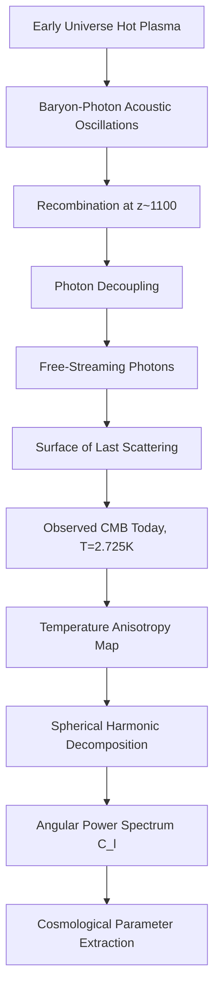

## The Cosmic Microwave Background

### Overview

The Cosmic Microwave Background (CMB) is the relic thermal radiation left over from the early universe, emitted approximately 380,000 years after the Big Bang during the epoch known as recombination. It is observed today as a nearly isotropic blackbody radiation field with a temperature of approximately 2.725 K, permeating all of space and detectable in the microwave region of the electromagnetic spectrum.

The CMB represents the oldest light observable in the universe and serves as one of the most important pieces of observational evidence supporting the Big Bang model of cosmology.

### Historical Background

**Key Points**

- Predicted theoretically by Ralph Alpher and Robert Herman in 1948 as a consequence of a hot early universe
- Discovered accidentally in 1964 by Arno Penzias and Robert Wilson at Bell Labs while testing a radio antenna
- The discovery earned Penzias and Wilson the 1978 Nobel Prize in Physics
- Confirmed as a near-perfect blackbody spectrum by the COBE satellite (1989–1993), led by John Mather and George Smoot, who received the 2006 Nobel Prize in Physics
- Subsequent missions (WMAP, 2001–2010; Planck, 2009–2013) mapped temperature anisotropies with increasing precision

### Physical Origin: Recombination and Decoupling

In the early universe, matter existed as a hot, dense plasma of free electrons, protons, and photons. Photons were constantly scattered by free electrons via Thomson scattering, making the universe opaque.

As the universe expanded and cooled, at approximately $t \approx 380{,}000$ years after the Big Bang (redshift $z \approx 1100$), the temperature dropped to around 3000 K—low enough for electrons and protons to combine into neutral hydrogen atoms. This process is called **recombination**.

Once neutral atoms formed, the mean free path of photons increased dramatically because Thomson scattering off free electrons ceased. Photons then streamed freely through space. This event is called **photon decoupling**, and the surface from which these photons last scattered is called the **surface of last scattering**.

The CMB we observe today is this decoupled radiation, redshifted by the expansion of the universe from ~3000 K to its current ~2.725 K.

### Blackbody Spectrum

The CMB exhibits an extremely precise blackbody (Planckian) spectrum, described by the Planck radiation law:

$$B(\nu, T) = \frac{2h\nu^3}{c^2} \frac{1}{e^{h\nu/k_B T} - 1}$$

Where:

- $B(\nu, T)$ is the spectral radiance
- $h$ is Planck's constant
- $\nu$ is frequency
- $c$ is the speed of light
- $k_B$ is Boltzmann's constant
- $T$ is the temperature (2.725 K)

**Example**

COBE's FIRAS instrument measured the CMB spectrum and found it matches a blackbody curve with deviations smaller than 1 part in $10^4$, making it the most precise blackbody spectrum ever measured in nature. This precision strongly constrains alternative cosmological models, since any significant energy injection into the early universe (e.g., from decaying particles) would distort the spectrum.

### Temperature Anisotropies

While the CMB is highly isotropic, it contains tiny temperature fluctuations of order $\Delta T / T \sim 10^{-5}$. These anisotropies are classified as:

**Primary Anisotropies** (imprinted at last scattering):

- **Sachs-Wolfe effect**: Photons climbing out of gravitational potential wells at last scattering lose energy, gaining differences in temperature
- **Acoustic oscillations**: Baryon-photon plasma oscillations before decoupling, driven by gravity (compression) and radiation pressure (rarefaction)
- **Doppler effect**: Velocity of the plasma at the surface of last scattering along the line of sight

**Secondary Anisotropies** (imprinted after last scattering):

- **Integrated Sachs-Wolfe (ISW) effect**: Changes in gravitational potentials as photons traverse large-scale structure
- **Sunyaev-Zel'dovich (SZ) effect**: Inverse Compton scattering of CMB photons by hot electrons in galaxy clusters
- **Gravitational lensing**: Deflection of CMB photons by intervening mass distributions
- **Reionization effects**: Scattering off free electrons produced when the universe reionized (~$z \approx 6$–20)

### The Angular Power Spectrum

The anisotropies are analyzed statistically by decomposing the temperature field on the sky into spherical harmonics:

$$\frac{\Delta T}{T}(\theta, \phi) = \sum_{\ell=0}^{\infty} \sum_{m=-\ell}^{\ell} a_{\ell m} Y_{\ell m}(\theta, \phi)$$

The **angular power spectrum** $C_\ell$ is defined as:

$$C_\ell = \frac{1}{2\ell+1} \sum_{m=-\ell}^{\ell} |a_{\ell m}|^2$$

This is typically plotted as $\ell(\ell+1)C_\ell / 2\pi$ against multipole moment $\ell$ (which corresponds inversely to angular scale on the sky).

**Key Points**

- The first acoustic peak (around $\ell \approx 220$) corresponds to the characteristic scale of sound waves at last scattering and constrains the geometry (flatness) of the universe
- The relative heights of subsequent peaks constrain the baryon density and dark matter density
- The power spectrum shape is one of the primary tools for extracting cosmological parameters

Mermaid diagram illustrating the pipeline from physical processes to observed power spectrum:

### Surface of Last Scattering (svg_diagram)

<svg xmlns="http://www.w3.org/2000/svg" viewBox="0 0 500 320" width="500" height="320">
<title>Surface of Last Scattering (svg_diagram)</title>
<rect x="0" y="0" width="500" height="320" fill="#0a0a1a" />
<circle cx="250" cy="160" r="140" fill="none" stroke="#ffcc66" stroke-width="2" stroke-dasharray="4,3" />
<circle cx="250" cy="160" r="6" fill="#ffffff" />
<text x="230" y="150" fill="#ffffff" font-size="11" font-family="sans-serif">Observer</text>
<circle cx="120" cy="90" r="4" fill="#ff6666" />
<line x1="250" y1="160" x2="120" y2="90" stroke="#ff6666" stroke-width="1" />
<circle cx="380" cy="230" r="4" fill="#66ccff" />
<line x1="250" y1="160" x2="380" y2="230" stroke="#66ccff" stroke-width="1" />
<circle cx="90" cy="220" r="4" fill="#99ff99" />
<line x1="250" y1="160" x2="90" y2="220" stroke="#99ff99" stroke-width="1" />
<text x="170" y="30" fill="#ffcc66" font-size="13" font-family="sans-serif">Surface of Last Scattering (z ~ 1100)</text>
<text x="10" y="300" fill="#cccccc" font-size="10" font-family="sans-serif">Photons travel radially inward from all directions on this shell to the observer</text>
</svg>

### Cosmological Parameters Derived from the CMB

| Parameter | Symbol | Approx. Value (Planck 2018) |
| --- | --- | --- |
| Hubble constant | $H_0$ | ~67.4 km/s/Mpc |
| Baryon density | $\Omega_b h^2$ | ~0.0224 |
| Cold dark matter density | $\Omega_c h^2$ | ~0.120 |
| Total matter density | $\Omega_m$ | ~0.315 |
| Dark energy density | $\Omega_\Lambda$ | ~0.685 |
| Spatial curvature | $\Omega_k$ | ~0 (flat universe) |
| Scalar spectral index | $n_s$ | ~0.965 |
| Age of universe | $t_0$ | ~13.8 billion years |

[Inference] Precise values vary slightly depending on the dataset combination used (e.g., Planck alone vs. Planck + BAO + supernovae), and ongoing tension exists between CMB-derived $H_0$ and local distance-ladder measurements (the "Hubble tension").

### Polarization of the CMB

Thomson scattering near recombination generates linear polarization in the CMB. This polarization is decomposed into two geometrically distinct patterns:

- **E-modes**: Curl-free polarization patterns, generated by scalar (density) perturbations; detected by WMAP and Planck
- **B-modes**: Divergence-free (curl-like) patterns, which can be generated by:
  - Gravitational lensing of E-modes by large-scale structure (confirmed detection)
  - Primordial gravitational waves from cosmic inflation (a key target of ongoing and future experiments, not yet confirmed)

**Example**

The BICEP2 experiment claimed a detection of primordial B-modes in 2014, but joint analysis with Planck dust data showed the signal was consistent with galactic dust foreground contamination rather than a primordial gravitational wave signal. [Unverified] Whether a genuine primordial B-mode signal exists at a detectable level remains an open question in current cosmology, actively pursued by experiments such as CMB-S4, LiteBIRD, and the Simons Observatory.

### Evidence Supporting the Big Bang Model

- **Blackbody spectrum**: Matches a thermal equilibrium spectrum predicted by an early hot, dense state
- **Isotropy**: The near-uniformity of the CMB across the sky supports the cosmological principle
- **Anisotropy spectrum**: The acoustic peak structure matches predictions from Big Bang nucleosynthesis and structure formation theory
- **Temperature-redshift relation**: The predicted scaling $T(z) = T_0(1+z)$ has been confirmed observationally via CMB temperature measurements at high-redshift gas clouds

### The Horizon and Flatness Problems

**Key Points**

- **Horizon problem**: Regions of the CMB sky separated by more than about 2° appear causally disconnected under standard Big Bang expansion, yet have nearly identical temperatures—this motivated the theory of cosmic inflation
- **Flatness problem**: The observed near-perfect spatial flatness ($\Omega_k \approx 0$) requires extreme fine-tuning of initial conditions unless inflation drove the universe toward flatness dynamically
- Cosmic inflation, a period of exponential expansion in the first fraction of a second, is the leading theoretical explanation resolving both problems and also predicts the nearly scale-invariant spectrum of primordial density fluctuations observed in the CMB

### Observational Missions

| Mission | Era | Key Contribution |
| --- | --- | --- |
| Penzias & Wilson (ground) | 1964 | Initial discovery |
| COBE | 1989–1993 | Confirmed blackbody spectrum, first anisotropy detection |
| WMAP | 2001–2010 | High-precision anisotropy mapping, refined cosmological parameters |
| Planck | 2009–2013 | Highest-precision full-sky map to date, polarization data |
| Ground/balloon (ACT, SPT, BICEP/Keck) | Ongoing | High-resolution small-scale measurements, polarization/B-mode searches |

### Conclusion

The Cosmic Microwave Background stands as one of the most powerful observational pillars of modern cosmology. Its near-perfect blackbody spectrum confirms the hot early universe predicted by Big Bang theory, while its minute anisotropies encode a wealth of information about the universe's geometry, composition, and initial conditions. Continued study of CMB polarization, particularly the search for primordial B-modes, remains at the frontier of observational cosmology, with the potential to provide direct evidence for cosmic inflation.

**Related Topics**

- Cosmic Inflation Theory
- Big Bang Nucleosynthesis
- Baryon Acoustic Oscillations (BAO)
- Large-Scale Structure Formation
- Dark Matter and Dark Energy
- The Hubble Tension
- Sunyaev-Zel'dovich Effect and Galaxy Clusters
- Reionization Era
- Gravitational Wave Backgrounds
- The ΛCDM Cosmological Model