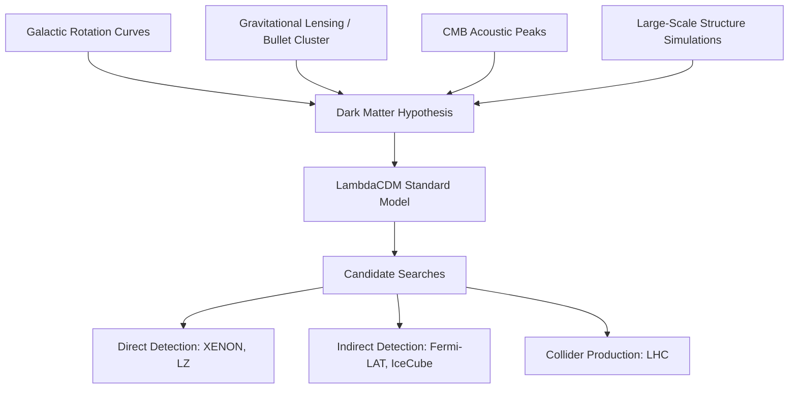

## Dark Matter

### Overview

Dark matter is a hypothesized form of matter that does not emit, absorb, or reflect electromagnetic radiation, making it undetectable by conventional telescopes across the electromagnetic spectrum. Its existence is inferred from gravitational effects on visible matter, radiation, and the large-scale structure of the universe. Current cosmological models estimate that dark matter constitutes approximately 27% of the universe's total mass-energy content, compared to roughly 5% for ordinary (baryonic) matter, with the remainder attributed to dark energy (~68%).

### Historical Development

**Key Points**

- **1933**: Swiss astronomer Fritz Zwicky studied the Coma Cluster of galaxies and found that the visible mass was far too small to gravitationally bind the cluster together given the observed velocities of individual galaxies. He coined the term "dunkle Materie" (dark matter).
- **1970s**: Vera Rubin and Kent Ford measured the rotation curves of spiral galaxies (notably Andromeda) and found that stars at large orbital radii moved at nearly constant velocities rather than declining as predicted by Keplerian dynamics based on visible mass alone.
- **1980s–present**: Cosmic microwave background (CMB) observations, gravitational lensing surveys, and large-scale structure simulations converged on a consistent picture requiring substantial non-baryonic mass.

### Observational Evidence

#### Galactic Rotation Curves

For a test object orbiting a galaxy at radius $r$, Newtonian dynamics predicts orbital velocity:

$$v(r) = \sqrt{\frac{GM(r)}{r}}$$

where $M(r)$ is the enclosed mass within radius $r$ and $G$ is the gravitational constant. If mass tracked light (i.e., $M(r)$ plateaus beyond the visible galactic disk), velocity should fall as $v \propto r^{-1/2}$ at large $r$. Observations instead show $v(r)$ remaining approximately flat, implying $M(r) \propto r$, i.e., mass continues to grow linearly with radius well beyond the visible disk — evidence for an extended, roughly spherical dark matter halo.

#### Gravitational Lensing

Massive objects bend light according to general relativity. The deflection angle $\alpha$ for light passing a mass $M$ at impact parameter $b$ is:

$$\alpha = \frac{4GM}{c^2 b}$$

Weak lensing (statistical distortion of background galaxy shapes) and strong lensing (visible arcs and multiple images) both reveal mass distributions in galaxy clusters that far exceed the visible baryonic mass. The **Bullet Cluster** (1E 0657-56) is a landmark case: X-ray observations (tracing hot baryonic gas, the dominant baryonic mass component) are spatially offset from the lensing-inferred mass concentration, which instead coincides with the collisionless galaxy distributions. This spatial separation is considered strong evidence against purely modified-gravity explanations, since the gravitational mass does not follow the dominant baryonic component.

#### Cosmic Microwave Background (CMB)

Anisotropies in the CMB, precisely measured by missions such as COBE, WMAP, and Planck, encode the relative densities of baryonic matter, dark matter, and radiation through the physics of acoustic oscillations in the primordial plasma. The relative heights of the acoustic peaks in the CMB power spectrum are sensitive to the baryon-to-dark-matter ratio; fitting the observed spectrum to the ΛCDM (Lambda Cold Dark Matter) model yields the ~27% dark matter fraction cited above. [Inference: precise percentage figures depend on the specific dataset release and cosmological parameter fit used.]

#### Large-Scale Structure Formation

N-body simulations show that the observed web-like distribution of galaxies (filaments, voids, and clusters) requires a non-baryonic, "cold" (non-relativistic at structure formation epoch) matter component to seed gravitational collapse early enough to match observations. Baryonic matter alone, coupled to radiation until recombination, cannot collapse quickly enough to produce the structure seen today.

#### Cluster Dynamics (Virial Mass Estimates)

Using the virial theorem, the total mass of a gravitationally bound cluster can be estimated from the velocity dispersion $\sigma_v$ of member galaxies:

$$M \approx \frac{\sigma_v^2 R}{G}$$

where $R$ is the cluster's characteristic radius. Applying this to galaxy clusters consistently yields masses far exceeding the sum of visible stellar and gas mass — Zwicky's original observation, since confirmed with modern data.

### Composition Candidates

#### Cold Dark Matter (CDM) Candidates

- **WIMPs (Weakly Interacting Massive Particles)**: Hypothetical particles interacting via gravity and the weak nuclear force, with masses roughly in the GeV–TeV range. WIMPs are motivated by the "WIMP miracle" — particles with weak-scale interaction cross-sections naturally produce the observed relic abundance through thermal freeze-out in the early universe.
- **Axions**: Very light hypothetical particles originally proposed to solve the strong CP problem in quantum chromodynamics; also a viable cold dark matter candidate due to their low velocity dispersion.
- **Primordial Black Holes**: Black holes formed from density fluctuations in the early universe rather than stellar collapse, proposed as a form of massive compact halo object (MACHO). Current constraints from microlensing surveys and CMB observations restrict the mass ranges in which they could constitute all dark matter.
- **Sterile Neutrinos**: Hypothetical neutrino-like particles that do not interact via the weak force, differing from the three known "active" neutrino flavors.

#### Alternative Candidates and Frameworks

- **MACHOs**: Baryonic dark matter candidates (brown dwarfs, black holes, neutron stars) that are massive but faint. Microlensing surveys (e.g., EROS, MACHO project) have largely ruled out MACHOs as a dominant component of galactic dark matter halos.
- **Modified Gravity (MOND/TeVeS)**: Alternative theoretical frameworks proposing modifications to Newtonian dynamics or general relativity at low accelerations, aiming to explain rotation curves without invoking unseen mass. [Unverified: MOND-type theories face significant challenges explaining cluster-scale lensing and CMB observations without additional non-baryonic components, and are not the mainstream consensus model, though they remain an active area of research.]

### Detection Strategies

**Key Points**

- **Direct Detection**: Experiments (e.g., XENON, LUX-ZEPLIN, PandaX) search for rare nuclear recoils caused by dark matter particles scattering off atomic nuclei in ultra-sensitive, deeply shielded detectors.
- **Indirect Detection**: Searches for products of dark matter annihilation or decay (gamma rays, cosmic rays, neutrinos) using instruments such as the Fermi Gamma-ray Space Telescope and IceCube.
- **Collider Production**: Experiments at the Large Hadron Collider search for missing transverse momentum signatures that could indicate dark matter particle production, though as of the current data, no conclusive signal has been confirmed. [Unverified: absence of detection to date constrains candidate parameter spaces but does not rule out dark matter's existence broadly.]

### The ΛCDM Cosmological Model

Dark matter is a foundational pillar of the Lambda Cold Dark Matter (ΛCDM) model, the current standard model of cosmology, alongside dark energy (Λ) and ordinary baryonic matter. Key parameters from Planck satellite data include:

$$\Omega_m \approx 0.315, \quad \Omega_\Lambda \approx 0.685$$

where $\Omega_m$ includes both baryonic and dark matter density parameters relative to the critical density.

### Diagram: Galaxy Rotation Curve Comparison

<svg xmlns="http://www.w3.org/2000/svg" viewBox="0 0 600 400">
<title>Galaxy Rotation Curve: Predicted vs Observed (svg_diagram)</title>
<rect width="600" height="400" fill="#0d1117" />
<line x1="60" y1="340" x2="560" y2="340" stroke="#8b949e" stroke-width="2" />
<line x1="60" y1="340" x2="60" y2="40" stroke="#8b949e" stroke-width="2" />
<text x="300" y="380" fill="#c9d1d9" font-size="16" text-anchor="middle">Radius from Galactic Center (r)</text>
<text x="25" y="190" fill="#c9d1d9" font-size="16" text-anchor="middle" transform="rotate(-90 25 190)">Orbital Velocity v(r)</text>
<path d="M 60 340 Q 150 100 250 90 Q 400 130 560 260" stroke="#58a6ff" stroke-width="3" fill="none" />
<text x="420" y="295" fill="#58a6ff" font-size="14">Predicted (visible mass only)</text>
<path d="M 60 340 Q 150 110 250 95 Q 400 95 560 95" stroke="#f85149" stroke-width="3" fill="none" stroke-dasharray="6,4" />
<text x="420" y="80" fill="#f85149" font-size="14">Observed (flat curve)</text>
<text x="300" y="30" fill="#e6edf3" font-size="18" text-anchor="middle">Predicted vs Observed Rotation Curves</text>
</svg>

### Diagram: Evidence Convergence

### Example: Estimating Halo Mass from Rotation Velocity

Given a flat rotation curve with $v \approx 220 \text{ km/s}$ at $r = 20 \text{ kpc}$ for a Milky Way-like galaxy, the enclosed mass is:

$$M(r) = \frac{v^2 r}{G}$$

Converting units and solving yields an enclosed mass on the order of $10^{11}$ solar masses at that radius — substantially more than the visible stellar mass concentrated in the galactic disk and bulge, with the discrepancy attributed to the dark matter halo. [Inference: exact numerical values depend on precise unit conversions and the specific galaxy's mass profile; this is a representative order-of-magnitude illustration.]

### Common Misconceptions

**Key Points**

- Dark matter is not the same as dark energy; dark matter clumps gravitationally and drives structure formation, while dark energy is associated with the accelerating expansion of the universe.
- Dark matter is not "antimatter" or composed of ordinary matter that is simply unlit; extensive searches have ruled out most conventional baryonic explanations at galactic scales.
- The absence of a confirmed particle detection does not falsify dark matter as a concept; it constrains which theoretical candidates remain viable.

### Conclusion

Dark matter remains one of the most well-evidenced yet unexplained phenomena in modern physics. Multiple independent lines of evidence — rotation curves, gravitational lensing, CMB structure, and large-scale structure formation — converge on a consistent requirement for substantial non-baryonic mass, even though the fundamental particle nature of dark matter has not yet been directly confirmed experimentally.

**Related Topics**

- Dark Energy and Cosmic Acceleration
- The Cosmic Microwave Background and ΛCDM Parameters
- Gravitational Lensing (Strong, Weak, Microlensing)
- WIMP Direct Detection Experiments
- Axion Physics and the Strong CP Problem
- N-body Simulations of Structure Formation
- Modified Newtonian Dynamics (MOND)
- Galaxy Cluster Dynamics and the Virial Theorem
- Big Bang Nucleosynthesis and Baryon Density Constraints