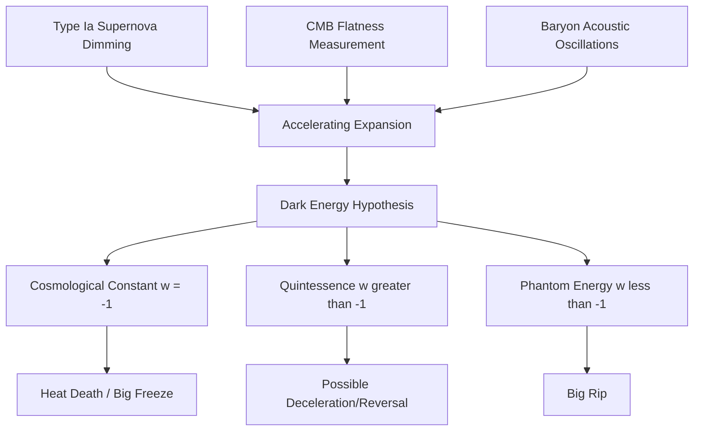

## Dark Energy

### Overview

Dark energy is the hypothesized form of energy permeating all of space that is responsible for the observed accelerating expansion of the universe. It constitutes approximately 68% of the universe's total mass-energy content according to the current ΛCDM cosmological model, making it the dominant component of the cosmos by energy density, despite remaining one of the least understood phenomena in physics.

### Historical Discovery

**Key Points**

- **1998**: Two independent teams — the Supernova Cosmology Project (led by Saul Perlmutter) and the High-Z Supernova Search Team (led by Brian Schmidt and Adam Riess) — measured distances to Type Ia supernovae and found them systematically dimmer (and thus farther away) than expected in a universe with decelerating expansion.
- **2011**: Perlmutter, Schmidt, and Riess were awarded the Nobel Prize in Physics for this discovery.
- **Subsequent confirmation**: Independent evidence from the cosmic microwave background (CMB), baryon acoustic oscillations (BAO), and large-scale structure surveys has consistently corroborated an accelerating expansion.

### Observational Evidence

#### Type Ia Supernovae as Standard Candles

Type Ia supernovae result from the thermonuclear detonation of a white dwarf accreting mass past the Chandrasekhar limit ($\approx 1.4$ solar masses), producing a remarkably consistent peak luminosity. This consistency allows their observed brightness to serve as a "standard candle" for measuring cosmological distances. The relationship between apparent magnitude $m$, absolute magnitude $M$, and luminosity distance $d_L$ (in parsecs) is:

$$m - M = 5 \log_{10}(d_L) - 5$$

By comparing distances derived from luminosity to distances inferred from redshift $z$ (assuming a non-accelerating expansion), researchers found high-redshift supernovae to be dimmer than predicted, indicating the universe's expansion rate has increased over cosmic time.

#### Cosmic Microwave Background (CMB)

Precision measurements of the CMB (COBE, WMAP, Planck) constrain the overall geometry and energy content of the universe. The CMB power spectrum indicates the universe is spatially flat, requiring a total energy density equal to the critical density $\rho_c$. Since baryonic and dark matter together account for only about 32% of this critical density, the remaining ~68% is attributed to dark energy.

#### Baryon Acoustic Oscillations (BAO)

Sound waves propagating through the early universe's photon-baryon plasma left a characteristic length scale imprinted in the distribution of galaxies. This scale acts as a "standard ruler," and its apparent size at different redshifts constrains the expansion history of the universe, independently corroborating accelerated expansion.

### The Friedmann Equations and Cosmic Acceleration

The dynamics of a homogeneous, isotropic universe are governed by the Friedmann equations, derived from general relativity. The first Friedmann equation relates the expansion rate to energy density:

$$\left(\frac{\dot{a}}{a}\right)^2 = \frac{8\pi G}{3}\rho - \frac{kc^2}{a^2}$$

where $a$ is the scale factor, $\rho$ is total energy density, and $k$ is the spatial curvature constant. The acceleration equation determines whether expansion speeds up or slows down:

$$\frac{\ddot{a}}{a} = -\frac{4\pi G}{3}\left(\rho + \frac{3p}{c^2}\right)$$

For the expansion to accelerate ($\ddot{a} > 0$), a component with sufficiently negative pressure is required, such that $\rho + 3p/c^2 < 0$, meaning $p < -\rho c^2/3$. Ordinary matter and radiation have positive pressure or zero pressure and cannot drive acceleration; dark energy's defining property is this negative pressure.

### The Equation of State Parameter

Dark energy's behavior is characterized by the equation of state parameter $w$, defined as the ratio of pressure to energy density:

$$w = \frac{p}{\rho c^2}$$

- **Cosmological Constant ($w = -1$)**: Consistent with Einstein's original cosmological constant $\Lambda$, representing a constant energy density inherent to space itself, unchanging as the universe expands.
- **Quintessence ($w > -1$, dynamic)**: A scalar field with evolving energy density, analogous to the inflaton field proposed for cosmic inflation, where $w$ may vary with time or redshift.
- **Phantom Energy ($w < -1$)**: A more exotic and theoretically speculative category with negative kinetic energy terms; models with persistent $w < -1$ imply an ever-increasing expansion rate potentially culminating in a "Big Rip" scenario. [Speculation: phantom energy models are theoretically motivated but currently disfavored or only weakly constrained by observational data, which remains broadly consistent with $w \approx -1$.]

Current observational constraints (combining supernovae, CMB, and BAO data) place $w$ close to $-1$, consistent with the simplest cosmological constant interpretation, though the precise value and any time-evolution remain active areas of investigation. [Inference: exact bounds on $w$ shift as new datasets, such as DESI results, are released, so cited numerical ranges should be treated as approximate and subject to revision.]

### Theoretical Interpretations

#### Cosmological Constant (Λ)

Originally introduced by Einstein in 1917 to allow a static universe solution to his field equations (before Hubble's discovery of cosmic expansion), the cosmological constant $\Lambda$ appears in the Einstein field equations as:

$$G_{\mu\nu} + \Lambda g_{\mu\nu} = \frac{8\pi G}{c^4} T_{\mu\nu}$$

Reinterpreted in the modern era, $\Lambda$ is often associated with the energy density of the vacuum itself.

#### The Cosmological Constant Problem

Quantum field theory predicts a vacuum energy density from zero-point fluctuations of quantum fields. When this theoretical value is compared to the observed dark energy density, the discrepancy is enormous — often cited as on the order of 60 to 120 orders of magnitude, depending on the energy scale (e.g., Planck scale) used in the calculation. [Unverified: the precise magnitude of this discrepancy depends heavily on assumptions about the cutoff scale and regularization scheme; it is widely regarded as one of the most significant unsolved problems in theoretical physics, but the exact numerical figure varies across sources.] This is known as the cosmological constant problem or "vacuum catastrophe."

#### Quintessence Models

Quintessence proposes a dynamical scalar field $\phi$ with a slowly varying potential $V(\phi)$, analogous to inflationary models. The field's energy density and pressure are:

$$\rho_\phi = \frac{1}{2}\dot{\phi}^2 + V(\phi), \quad p_\phi = \frac{1}{2}\dot{\phi}^2 - V(\phi)$$

When the potential energy dominates over kinetic energy ($V(\phi) \gg \dot{\phi}^2$), the equation of state approaches $w \approx -1$, mimicking a cosmological constant while still allowing subtle time-evolution distinguishable in principle through precision cosmological surveys.

#### Modified Gravity Alternatives

Some theoretical frameworks propose that cosmic acceleration arises not from an energy component but from modifications to general relativity itself on cosmological scales (e.g., $f(R)$ gravity). [Unverified: modified gravity models must satisfy stringent solar-system and astrophysical tests of general relativity, and as of current data, no modified gravity model has achieved consensus support over the standard ΛCDM interpretation.]

### The Hubble Tension

**Key Points**

- The Hubble constant $H_0$, measuring the current expansion rate, is derived through two broad methodological approaches: "early universe" methods (calibrated via the CMB, assuming ΛCDM) and "late universe" methods (direct distance-ladder measurements using Cepheid variables and Type Ia supernovae).
- These two approaches yield values that differ by several standard deviations — a discrepancy known as the Hubble tension.
- [Unverified: whether the Hubble tension reflects unaccounted systematic errors in one or both measurement methods, or points to genuinely new physics (potentially involving dark energy's properties or early-universe physics), remains an open and actively debated question in cosmology as of current data.]

### Future Fate of the Universe

The long-term evolution of the universe depends critically on dark energy's precise nature:

- **If $w = -1$ exactly (cosmological constant)**: Expansion continues to accelerate indefinitely, leading to a "Big Freeze" or "Heat Death" scenario where galaxies outside the Local Group eventually recede beyond observable horizons.
- **If $w < -1$ (phantom energy)**: Expansion could accelerate without bound, potentially tearing apart galaxies, solar systems, and eventually atomic structure in a finite-time future singularity (the "Big Rip").
- **If $w > -1$ and evolving toward positive values**: Expansion could theoretically decelerate or reverse in the distant future. [Speculation: this scenario is not currently favored by observational data but remains a theoretical possibility within quintessence model space.]

### Diagram: Cosmic Expansion History

<svg xmlns="http://www.w3.org/2000/svg" viewBox="0 0 600 380">
<title>Scale Factor Evolution: Matter-Dominated vs Dark-Energy-Dominated Eras (svg_diagram)</title>
<rect width="600" height="380" fill="#0d1117" />
<line x1="60" y1="320" x2="560" y2="320" stroke="#8b949e" stroke-width="2" />
<line x1="60" y1="320" x2="60" y2="30" stroke="#8b949e" stroke-width="2" />
<text x="300" y="360" fill="#c9d1d9" font-size="16" text-anchor="middle">Cosmic Time</text>
<text x="20" y="175" fill="#c9d1d9" font-size="16" text-anchor="middle" transform="rotate(-90 20 175)">Scale Factor a(t)</text>
<path d="M 60 320 Q 200 300 300 250 Q 450 150 560 40" stroke="#f0883e" stroke-width="3" fill="none" />
<text x="380" y="120" fill="#f0883e" font-size="14">Accelerating (dark energy dominated)</text>
<path d="M 60 320 Q 200 300 300 250" stroke="#58a6ff" stroke-width="3" fill="none" stroke-dasharray="6,4" />
<text x="90" y="280" fill="#58a6ff" font-size="13">Decelerating (matter dominated)</text>
<circle cx="300" cy="250" r="5" fill="#e6edf3" />
<text x="305" y="240" fill="#e6edf3" font-size="12">Transition (z≈0.6-0.7)</text>
<text x="300" y="20" fill="#e6edf3" font-size="18" text-anchor="middle">Universe Expansion History</text>
</svg>

### Diagram: Evidence and Theoretical Framework

### Example: Comparing Redshift-Distance Predictions

For a supernova at redshift $z = 0.5$, a matter-only decelerating universe model predicts a certain luminosity distance $d_L$. Observations instead show the supernova to be measurably dimmer than this prediction, corresponding to a larger actual $d_L$. This discrepancy, systematically observed across many supernovae at varying redshifts, is the core empirical signature that led to the dark energy hypothesis. [Inference: exact numerical distance discrepancies depend on the specific cosmological parameters and calibration used in a given study.]

### Common Misconceptions

**Key Points**

- Dark energy is not the same as dark matter; dark energy drives expansion via negative pressure, while dark matter gravitationally clumps and aids structure formation.
- Dark energy does not have a confirmed particle or field description; the "cosmological constant" label refers to a parameter in the equations of general relativity, not a proven physical mechanism.
- Accelerating expansion does not mean galaxies themselves are expanding; gravitationally bound systems (galaxies, solar systems, galaxy clusters) remain bound and do not visibly stretch under current understanding.

### Conclusion

Dark energy stands as the dominant yet most enigmatic component of the universe's energy budget, inferred robustly from multiple independent observational methods but lacking a confirmed theoretical explanation. Whether it represents a true cosmological constant, a dynamical field, or a signal of new gravitational physics remains one of the central open questions in modern cosmology.

**Related Topics**

- Dark Matter and Galactic Structure
- The Friedmann Equations and Cosmological Models
- Type Ia Supernovae as Standard Candles
- The Cosmological Constant Problem
- Quintessence and Scalar Field Cosmology
- The Hubble Tension
- Baryon Acoustic Oscillations as a Standard Ruler
- Cosmic Inflation Theory
- The Ultimate Fate of the Universe (Big Freeze, Big Rip, Big Crunch)