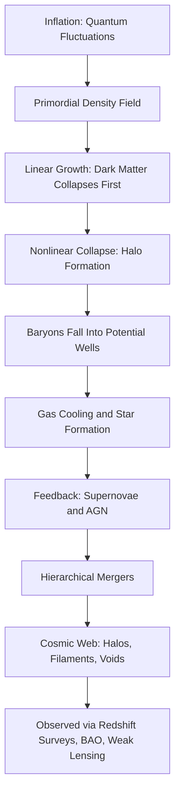

## Galaxy Formation and Large-Scale Structure

### Overview

Galaxy formation and large-scale structure describes the physical processes by which primordial density fluctuations in the early universe grew, through gravitational instability, into the hierarchy of stars, galaxies, galaxy clusters, and cosmic filaments observed today. This field bridges particle physics, general relativity, and astrophysical fluid dynamics, relying heavily on the ΛCDM (Lambda Cold Dark Matter) cosmological framework.

### Initial Conditions: Primordial Density Fluctuations

#### Origin in Cosmic Inflation

The seeds of structure are generally attributed to quantum fluctuations during cosmic inflation, stretched to macroscopic scales by rapid exponential expansion. These fluctuations left a nearly scale-invariant spectrum of density perturbations, observable today as temperature anisotropies in the cosmic microwave background (CMB) at the level of about 1 part in 100,000.

#### Characterizing Density Fluctuations

The density contrast at a given point is defined as:

$$\delta(\vec{x}) = \frac{\rho(\vec{x}) - \bar{\rho}}{\bar{\rho}}$$

where $\rho(\vec{x})$ is local density and $\bar{\rho}$ is the mean cosmic density. The statistical properties of these fluctuations are commonly described by the power spectrum $P(k)$, related to the Fourier transform of $\delta(\vec{x})$, which quantifies fluctuation amplitude as a function of spatial scale $k$.

### Gravitational Instability and Linear Growth

#### The Jeans Instability Framework

Small density perturbations grow under gravitational instability when self-gravity overcomes pressure support. The Jeans length $\lambda_J$ marks the critical scale above which a perturbation collapses rather than oscillates as a pressure wave:

$$\lambda_J = c_s \sqrt{\frac{\pi}{G\rho}}$$

where $c_s$ is the sound speed of the medium. For dark matter, which is effectively pressureless (collisionless) on relevant scales, this pressure support is negligible, allowing structure to grow from very early times, well before baryonic matter (coupled to radiation) could begin collapsing.

#### Linear Perturbation Growth

In the linear regime (small $\delta$), density perturbations grow with cosmic time as governed by the growth factor $D(t)$:

$$\delta(\vec{x}, t) = D(t)\, \delta_0(\vec{x})$$

During matter domination, $D(t) \propto a(t)$ (the scale factor), meaning perturbations grow linearly with cosmic expansion. During radiation domination and later during dark-energy domination, growth is suppressed, since radiation pressure resists collapse in the former, and accelerated expansion dilutes matter density and stretches space faster than gravity can pull matter together in the latter.

### The Role of Dark Matter in Structure Formation

**Key Points**

- Dark matter, being collisionless and interacting only gravitationally (and possibly weakly), begins collapsing into halos before baryonic recombination, since it is not coupled to the photon-baryon plasma.
- This head start allows dark matter to form gravitational potential wells that baryonic matter later falls into after recombination (when photons decouple and baryons are freed from radiation pressure), accelerating baryonic structure formation beyond what would be possible from baryons alone.
- "Cold" dark matter (non-relativistic at early times) is required to explain the observed structure; "hot" dark matter (relativistic, free-streaming) would erase small-scale structure, contradicting observations of galaxy-scale clustering. This is a central piece of evidence favoring the Cold Dark Matter (CDM) paradigm over Hot Dark Matter (HDM) alternatives.

### Nonlinear Collapse and Halo Formation

#### The Spherical Collapse Model

A simplified analytic approximation treats an overdense region as a uniform sphere that decouples from the overall Hubble expansion, reaches a maximum radius (turnaround), and then collapses. In this idealized model, virialization (the point at which the collapsing structure reaches dynamical equilibrium) occurs when the perturbation has collapsed to roughly half its turnaround radius, with the region reaching a characteristic overdensity relative to the background — commonly cited as approximately 200 times the mean cosmic density, though the precise value depends on the cosmological model assumed. [Inference: this numerical threshold is a standard analytic approximation and can vary modestly depending on the specific cosmology used, such as the presence of dark energy.]

#### N-body Simulations

Because nonlinear gravitational collapse cannot generally be solved analytically for realistic initial conditions, large-scale numerical N-body simulations (e.g., Millennium Simulation, IllustrisTNG, EAGLE) evolve millions to billions of particles representing dark matter (and, in hydrodynamical simulations, gas) forward in cosmic time from initial conditions matched to CMB-derived power spectra. These simulations reproduce the observed "cosmic web" structure: dense halos connected by filaments, surrounding vast underdense voids.

### The Cosmic Web

**Key Points**

- **Halos**: Dense, roughly virialized, gravitationally bound structures where galaxies form and reside, ranging from dwarf galaxy halos to massive cluster-scale halos.
- **Filaments**: Elongated structures connecting halos, containing significant amounts of both dark matter and diffuse baryonic gas.
- **Sheets/Walls**: Two-dimensional planar overdensities, such as the observed "Great Wall" structures.
- **Voids**: Vast underdense regions, occupying a large fraction of the universe's volume, with galaxy densities far below the cosmic average.

### Baryonic Physics in Galaxy Formation

While dark matter halos provide the gravitational scaffolding, baryonic (ordinary matter) physics determines the detailed properties of visible galaxies:

#### Gas Cooling and Collapse

Baryonic gas falling into dark matter potential wells must radiate away thermal energy to collapse further and form stars. Cooling mechanisms include atomic line cooling, molecular hydrogen cooling, and (at higher metallicities) metal-line cooling, each dominant in different temperature and density regimes.

#### Star Formation

Once gas cools and reaches sufficient density, it fragments and collapses into stars, governed by processes including the Jeans instability at molecular cloud scales, turbulence, and magnetic field support. Star formation rates in galaxies are often empirically related to gas surface density through the Kennicutt-Schmidt law:

$$\Sigma_{SFR} \propto \Sigma_{gas}^{N}$$

where $\Sigma_{SFR}$ is the star formation rate surface density, $\Sigma_{gas}$ is gas surface density, and $N$ is an empirically determined index (commonly cited near 1.4, though this can vary by galaxy type and environment). [Inference: the precise value of $N$ and the applicability of this relation varies across galaxy populations and is subject to ongoing refinement in the literature.]

#### Feedback Processes

- **Supernova Feedback**: Energy and momentum injected by supernova explosions can heat and expel gas, regulating (suppressing) star formation, particularly in lower-mass galaxies.
- **Active Galactic Nucleus (AGN) Feedback**: Energy released by accretion onto supermassive black holes can heat or expel gas on galactic scales, believed to be important in quenching star formation in massive galaxies.
- **Reionization Feedback**: UV radiation from early star formation and quasars reheats and ionizes the intergalactic medium, suppressing gas accretion onto the smallest halos.

### Hierarchical Structure Formation

The ΛCDM paradigm predicts "bottom-up" hierarchical structure formation: small-scale perturbations collapse first, and larger structures assemble later through the gravitational merging and accretion of smaller halos onto larger ones. This contrasts with a "top-down" scenario (historically associated with hot dark matter models), where large structures would form first and fragment into smaller ones — a scenario largely disfavored by observations of small-scale galaxy clustering.

#### Galaxy Mergers

Mergers between galaxies play a central role in hierarchical assembly, ranging from minor mergers (small satellite accretion) to major mergers (comparable-mass galaxy collisions), the latter often associated with morphological transformation (e.g., disk galaxies merging to form elliptical galaxies) and triggered bursts of star formation.

### Observational Probes of Large-Scale Structure

#### Galaxy Redshift Surveys

Large surveys (e.g., Sloan Digital Sky Survey, 2dF Galaxy Redshift Survey, DESI) map the three-dimensional positions of millions of galaxies using redshift as a distance proxy via Hubble's law, revealing the cosmic web directly.

#### The Correlation Function and Power Spectrum

The clustering of galaxies is quantified statistically using the two-point correlation function $\xi(r)$, which measures the excess probability (relative to a random distribution) of finding a galaxy pair separated by distance $r$:

$$1 + \xi(r) = \frac{dP}{\bar{n}^2\, dV_1\, dV_2}$$

This is closely related to the matter power spectrum $P(k)$ via Fourier transform, and both are key statistical tools for comparing observations to theoretical predictions and simulations.

#### Baryon Acoustic Oscillations (BAO)

As discussed in the context of dark energy, the characteristic scale imprinted by sound waves in the pre-recombination plasma also serves as a powerful probe of large-scale structure, appearing as a preferred clustering scale (a subtle "bump" in the correlation function) usable as a standard ruler across cosmic time.

### Diagram: Hierarchical Structure Formation Timeline

<svg xmlns="http://www.w3.org/2000/svg" viewBox="0 0 620 360">
<title>Hierarchical Galaxy Formation Timeline (svg_diagram)</title>
<rect width="620" height="360" fill="#0d1117" />
<line x1="60" y1="300" x2="580" y2="300" stroke="#8b949e" stroke-width="2" />
<text x="320" y="335" fill="#c9d1d9" font-size="15" text-anchor="middle">Cosmic Time (increasing right)</text>
<circle cx="110" cy="270" r="6" fill="#58a6ff" />
<text x="110" y="250" fill="#58a6ff" font-size="12" text-anchor="middle">Dark matter</text>
<text x="110" y="264" fill="#58a6ff" font-size="12" text-anchor="middle">seeds</text>
<circle cx="230" cy="230" r="12" fill="#3fb950" />
<text x="230" y="205" fill="#3fb950" font-size="12" text-anchor="middle">Small halos</text>
<text x="230" y="219" fill="#3fb950" font-size="12" text-anchor="middle">form</text>
<circle cx="360" cy="180" r="20" fill="#d29922" />
<text x="360" y="150" fill="#d29922" font-size="12" text-anchor="middle">Galaxies form,</text>
<text x="360" y="164" fill="#d29922" font-size="12" text-anchor="middle">mergers begin</text>
<circle cx="500" cy="110" r="32" fill="#f85149" />
<text x="500" y="70" fill="#f85149" font-size="12" text-anchor="middle">Clusters &amp;</text>
<text x="500" y="84" fill="#f85149" font-size="12" text-anchor="middle">cosmic web</text>
<text x="500" y="98" fill="#f85149" font-size="12" text-anchor="middle">today</text>
<line x1="110" y1="270" x2="230" y2="230" stroke="#6e7681" stroke-width="1.5" stroke-dasharray="3,3" />
<line x1="230" y1="230" x2="360" y2="180" stroke="#6e7681" stroke-width="1.5" stroke-dasharray="3,3" />
<line x1="360" y1="180" x2="500" y2="110" stroke="#6e7681" stroke-width="1.5" stroke-dasharray="3,3" />
<text x="310" y="30" fill="#e6edf3" font-size="18" text-anchor="middle">Bottom-Up Hierarchical Assembly</text>
</svg>

### Diagram: Structure Formation Process Flow

### Example: Estimating Halo Collapse Overdensity

A region with initial linear overdensity growing according to the spherical collapse model reaches virialization when the linearly extrapolated density contrast reaches a characteristic critical value, commonly cited as $\delta_c \approx 1.686$ for an Einstein-de Sitter (matter-dominated) universe. This value is used in analytic halo mass function models, such as the Press-Schechter formalism, to statistically predict the abundance of collapsed halos as a function of mass and redshift. [Inference: the exact critical value shifts slightly under different cosmological parameters, such as varying dark energy content, though $\delta_c \approx 1.686$ remains the standard reference figure in an Einstein-de Sitter approximation.]

### Common Misconceptions

**Key Points**

- Galaxies did not form in isolation; their formation is intrinsically tied to the growth of surrounding dark matter halos and their environment within the cosmic web.
- Large-scale structure formation is not a smooth, continuous process; it proceeds hierarchically through discrete merger events and phases of accretion.
- The cosmic web's voids are not perfectly empty; they contain sparse galaxies and diffuse gas at densities significantly below the cosmic average.

### Conclusion

Galaxy formation and large-scale structure formation represent the observable outcome of gravitational amplification of primordial density fluctuations, mediated critically by cold dark matter's early collapse and shaped in detail by complex baryonic astrophysics including cooling, star formation, and feedback. The resulting cosmic web — halos, filaments, and voids — provides one of the most powerful and well-corroborated tests of the ΛCDM cosmological model.

**Related Topics**

- Dark Matter and Halo Formation
- Cosmic Microwave Background Anisotropies
- N-body and Hydrodynamical Cosmological Simulations
- The Press-Schechter Halo Mass Function
- Galaxy Morphology and the Hubble Sequence
- Active Galactic Nuclei and Supermassive Black Hole Feedback
- Baryon Acoustic Oscillations as a Standard Ruler
- Cosmic Reionization
- Galaxy Clusters and Intracluster Medium