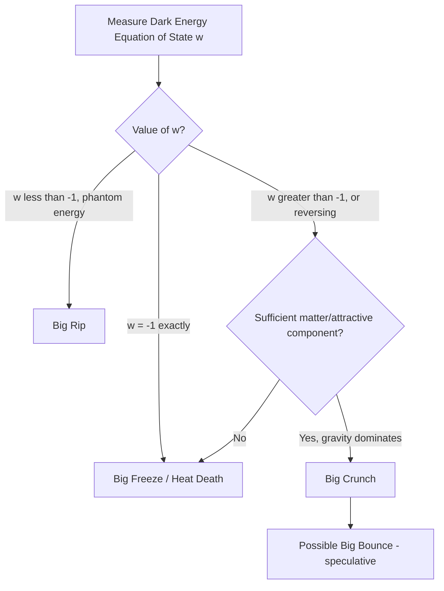

## The Fate of the Universe

### Overview

The long-term fate of the universe is determined by the interplay between its geometry, total energy content, and the properties of dark energy. Modern cosmology, grounded in general relativity and the Friedmann equations, offers several distinct scenarios for the universe's ultimate destiny, ranging from eternal accelerating expansion to catastrophic collapse or disintegration. Current observational evidence favors continued accelerated expansion, though the precise long-term outcome depends on parameters not yet fully constrained.

### Theoretical Framework: The Friedmann Equations

The evolution of a homogeneous, isotropic universe is governed by the Friedmann equations, derived from Einstein's field equations under the cosmological principle:

$$\left(\frac{\dot{a}}{a}\right)^2 = \frac{8\pi G}{3}\rho - \frac{kc^2}{a^2}$$

$$\frac{\ddot{a}}{a} = -\frac{4\pi G}{3}\left(\rho + \frac{3p}{c^2}\right)$$

where $a(t)$ is the scale factor, $\rho$ is total energy density, $p$ is pressure, and $k$ is the curvature parameter ($k = -1, 0, +1$ for open, flat, and closed geometries respectively). The eventual fate of the universe depends on the relative contributions of matter, radiation, curvature, and dark energy to these equations over cosmic time.

### The Critical Density and Geometry

The critical density $\rho_c$ is the density required for a spatially flat universe ($k=0$):

$$\rho_c = \frac{3H^2}{8\pi G}$$

The density parameter $\Omega$ is defined as the ratio of actual density to critical density, $\Omega = \rho/\rho_c$, with contributions from matter ($\Omega_m$), radiation ($\Omega_r$), and dark energy ($\Omega_\Lambda$). Planck satellite measurements indicate the universe is consistent with spatial flatness, with $\Omega_{total} \approx 1$, dominated by $\Omega_\Lambda \approx 0.685$ and $\Omega_m \approx 0.315$. [Inference: precise parameter values are subject to revision with updated datasets and depend on which combination of observational probes are used in the fit.]

Historically, before dark energy's discovery, cosmologists framed the universe's fate purely in terms of geometry:

- **Closed universe** ($\Omega > 1$, $k = +1$): Sufficient matter density to eventually halt and reverse expansion, leading to recollapse.
- **Flat universe** ($\Omega = 1$, $k = 0$): Expansion asymptotically approaches zero rate but never reverses (in a matter-only model).
- **Open universe** ($\Omega < 1$, $k = -1$): Expansion continues indefinitely at a non-zero rate.

This purely geometric framework has been superseded by models incorporating dark energy, since a flat or even closed geometry can still expand forever if dark energy's negative pressure dominates.

### Scenario 1: The Big Freeze (Heat Death)

#### Mechanism

If dark energy behaves as a true cosmological constant ($w = -1$, constant energy density as space expands), the universe will continue expanding at an accelerating rate indefinitely. This is currently the scenario most consistent with observational data.

#### Long-Term Evolution

- **Stelliferous Era (present, extending to roughly $10^{14}$ years)**: Ongoing star formation gradually depletes available hydrogen gas reservoirs in galaxies; stars progressively die out, and new star formation rates decline.
- **Degenerate Era (roughly $10^{14}$ to $10^{40}$ years)**: Stellar remnants (white dwarfs, neutron stars, black holes) dominate; some models predict proton decay over extremely long timescales would erode remaining baryonic matter. [Speculation: proton decay has not been experimentally observed; its existence and characteristic timescale, if it occurs at all, remain theoretical predictions from certain grand unified theories rather than confirmed physics.]
- **Black Hole Era (roughly $10^{40}$ to $10^{100}$ years)**: Black holes, the most durable structures remaining, gradually evaporate via Hawking radiation.
- **Dark Era (beyond $10^{100}$ years)**: The universe approaches a state of maximal entropy — extremely low temperature, low density, with only diffuse photons, neutrinos, and possibly stable leptons remaining, spread across increasingly separated causal horizons as accelerated expansion pushes galaxies beyond observable distances.

#### Cosmic Event Horizon

Under continued acceleration, distant galaxies eventually recede at a rate exceeding the speed of light (a consequence of space itself expanding, not local motion violating relativity), causing them to cross a cosmic event horizon beyond which no future communication is possible. Over sufficiently long timescales, this would leave the observable universe isolated, with only gravitationally bound structures (such as the Local Group of galaxies) remaining visible.

### Scenario 2: The Big Rip

#### Mechanism

If dark energy is "phantom energy" with equation of state $w < -1$, its energy density would increase over time as the universe expands (rather than remaining constant, as with a true cosmological constant). This runaway growth in effective repulsive force would eventually overcome gravitational binding at all scales.

#### Sequence of Disintegration

In this scenario, expansion accelerates without bound, unbinding structures in order of decreasing gravitational (and eventually electromagnetic/nuclear) binding energy:

1. Galaxy clusters become gravitationally unbound.
2. Individual galaxies are torn apart.
3. Solar systems are disrupted.
4. Planets and stars are ripped apart.
5. In the final moments, atomic and subatomic structures are destroyed as the effective repulsive force exceeds even nuclear and electromagnetic binding forces, culminating in a finite-time singularity.

[Unverified: observational constraints on the dark energy equation of state currently favor $w \approx -1$, placing the Big Rip scenario in a disfavored but not entirely excluded region of parameter space; if realized, the timescale to a Big Rip depends sensitively on the precise value of $w$, and it is not the leading candidate given current data.]

### Scenario 3: The Big Crunch

#### Mechanism

If total matter density (or a decaying/reversing dark energy component) were sufficient to eventually halt and reverse cosmic expansion, gravitational attraction would dominate, causing the universe to contract. This scenario requires either negligible dark energy or a dark energy component that weakens and eventually becomes attractive rather than repulsive over cosmic time.

#### Evolution Toward Collapse

Contraction would proceed as a time-reversed mirror of the early universe's expansion: increasing density and temperature, eventual reionization of atoms, breakdown of nuclei, and ultimately (in the most extreme extrapolation) a return to conditions resembling the initial singularity, sometimes referred to as a "Big Crunch."

[Unverified: current observational data on dark energy's equation of state strongly disfavor this scenario under the simplest cosmological constant interpretation, since $w \approx -1$ implies persistent rather than diminishing acceleration; a Big Crunch would require either new physics causing dark energy to reverse sign or additional undiscovered components, making this scenario currently considered unlikely relative to Big Freeze projections, though it cannot be entirely ruled out.]

### Scenario 4: The Big Bounce

Some theoretical frameworks (e.g., certain cyclic or ekpyrotic cosmological models) propose that a Big Crunch would not terminate in a singularity but instead "bounce" into a new expansion phase, potentially repeating cyclically. [Speculation: Big Bounce models remain speculative theoretical constructs, often requiring physics beyond the standard model (such as quantum gravity effects near the would-be singularity) that has not been empirically tested, and are not part of the current cosmological consensus.]

### Role of the Hubble Tension and Ongoing Research

The unresolved Hubble tension (a discrepancy between early- and late-universe measurements of the expansion rate $H_0$) has implications for fate-of-the-universe models, since it may hint at additional physics affecting dark energy's behavior or the standard ΛCDM model's completeness. Ongoing and upcoming surveys (e.g., DESI, Euclid, Vera C. Rubin Observatory/LSST) aim to more precisely measure the dark energy equation of state $w$ and its potential time-evolution, which is the single most critical parameter for determining which fate scenario is realized. [Inference: as these datasets mature, current constraints on $w$ and $H_0$ are expected to tighten or shift, and conclusions drawn from present data should be understood as provisional.]

### Diagram: Comparative Fate Scenarios

<svg xmlns="http://www.w3.org/2000/svg" viewBox="0 0 640 400">
<title>Comparative Scale Factor Trajectories for Universe Fate Scenarios (svg_diagram)</title>
<rect width="640" height="400" fill="#0d1117" />
<line x1="70" y1="340" x2="600" y2="340" stroke="#8b949e" stroke-width="2" />
<line x1="70" y1="340" x2="70" y2="30" stroke="#8b949e" stroke-width="2" />
<text x="335" y="375" fill="#c9d1d9" font-size="15" text-anchor="middle">Cosmic Time</text>
<text x="25" y="185" fill="#c9d1d9" font-size="15" text-anchor="middle" transform="rotate(-90 25 185)">Scale Factor a(t)</text>
<path d="M 70 340 Q 250 260 335 220 Q 480 150 600 60" stroke="#f0883e" stroke-width="3" fill="none" />
<text x="470" y="100" fill="#f0883e" font-size="13">Big Freeze (w = -1)</text>
<path d="M 70 340 Q 250 260 335 220 Q 420 130 460 60" stroke="#f85149" stroke-width="3" fill="none" />
<text x="380" y="55" fill="#f85149" font-size="13">Big Rip (w &lt; -1)</text>
<path d="M 70 340 Q 250 260 335 220 Q 420 260 480 340" stroke="#58a6ff" stroke-width="3" fill="none" stroke-dasharray="6,4" />
<text x="440" y="300" fill="#58a6ff" font-size="13">Big Crunch</text>
<circle cx="335" cy="220" r="5" fill="#e6edf3" />
<text x="335" y="210" fill="#e6edf3" font-size="12" text-anchor="middle">Today</text>
<text x="335" y="20" fill="#e6edf3" font-size="18" text-anchor="middle">Divergent Fates Based on Dark Energy Properties</text>
</svg>

### Diagram: Decision Framework for Cosmic Fate

### Example: Estimating the Cosmic Event Horizon

In an accelerating universe dominated by a cosmological constant, the future event horizon distance $d_H$ can be approximated using the de Sitter expansion rate at late times:

$$d_H \approx \frac{c}{H_\infty}$$

where $H_\infty$ is the asymptotic Hubble parameter as the universe approaches pure dark-energy domination. Using current best-fit values, this places the asymptotic event horizon at a finite comoving distance, meaning galaxies beyond this distance will eventually become permanently causally disconnected from our own, even though the universe continues expanding forever. [Inference: the specific numerical value of $d_H$ depends on the precise asymptotic value of $H_0$ and $\Omega_\Lambda$ adopted, and should be treated as an order-of-magnitude illustration rather than a precise prediction.]

### Common Misconceptions

**Key Points**

- The Big Bang was not an explosion into pre-existing empty space; similarly, the Big Rip and Big Crunch do not represent explosions or implosions into/from an external space, but changes in the geometry and scale of space itself.
- A "flat" universe does not necessarily imply eternal coasting expansion at a fixed rate; with dark energy included, a flat universe can still accelerate indefinitely.
- The currently favored Big Freeze scenario does not imply the universe becomes truly static; expansion continues, but observable activity (star formation, black hole evaporation) asymptotically declines toward a maximal-entropy state.

### Conclusion

The fate of the universe hinges critically on the still-uncertain nature of dark energy, particularly its equation of state parameter $w$ and any time-evolution thereof. Current data most strongly support a Big Freeze scenario of eternal, accelerating expansion toward a cold, diffuse, maximum-entropy state, though alternative scenarios such as the Big Rip remain within the bounds of ongoing observational uncertainty. Resolving this question remains a central goal of modern observational cosmology.

**Related Topics**

- Dark Energy and the Equation of State Parameter
- The Friedmann Equations and Cosmological Models
- The Hubble Tension
- Hawking Radiation and Black Hole Evaporation
- Proton Decay and Grand Unified Theories
- Cyclic and Ekpyrotic Cosmological Models
- The Cosmic Microwave Background and Universe Geometry
- Vacuum Energy and the Cosmological Constant Problem
- Entropy and the Arrow of Time in Cosmology