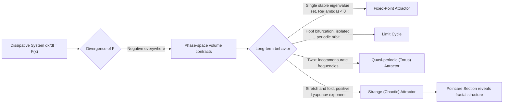

## Phase Space and Attractors

### Definition and Motivation

Phase space is the abstract mathematical space in which every possible state of a dynamical system is represented by a unique point. For a system described by $n$ independent variables (degrees of freedom, including velocities/momenta where relevant), the phase space is $n$-dimensional, and the evolution of the system over time traces a trajectory (or orbit) through this space.

**Key Points**

- Each point in phase space encodes complete information about the system's instantaneous state — no additional history is needed to determine future evolution (for deterministic systems).
- The dimension of phase space equals the number of first-order ODEs required to fully specify the system.
- A system governed by an $n$th-order ODE can be rewritten as $n$ coupled first-order ODEs, giving an $n$-dimensional phase space.

For a simple mechanical system with position $x$ and velocity $v$, the phase space is 2-dimensional, with coordinates $(x,v)$. For a pendulum, phase space coordinates are $(\theta,\omega)$, where $\theta$ is angular displacement and $\omega=\dot\theta$.

### Constructing Phase Space from Equations of Motion

Given a second-order ODE such as the damped pendulum:

$$\ddot\theta+\gamma\dot\theta+\frac{g}{L}\sin\theta=0$$

Define $\omega=\dot\theta$ to reduce to a first-order system:

$$\dot\theta=\omega$$

$$\dot\omega=-\gamma\omega-\frac{g}{L}\sin\theta$$

This pair $(\theta,\omega)$ evolves as a vector field $\dot{\mathbf{x}}=\mathbf{F}(\mathbf{x})$, where $\mathbf{x}=(\theta,\omega)$. The vector field $\mathbf{F}$ assigns a velocity vector to every point in phase space, and trajectories are integral curves that are everywhere tangent to this field.

### Phase Portraits

A **phase portrait** is a graphical representation of multiple trajectories in phase space, typically for varying initial conditions. Key features to identify in a phase portrait:

- **Fixed points (equilibria):** locations where $\mathbf{F}(\mathbf{x}^*)=0$, so the system remains stationary if placed there exactly.
- **Nullclines:** curves where one component of $\dot{\mathbf{x}}$ vanishes, useful for sketching flow direction.
- **Trajectory flow direction:** indicated by arrows following $\mathbf{F}$.

**Example**

For the undamped pendulum ($\gamma=0$), phase space trajectories are closed curves for small oscillations (near $\theta=0$) and open, rotating curves for large energy (full rotations), separated by a special trajectory called the **separatrix**, which connects unstable fixed points at $\theta=\pm\pi$.

### Classification of Fixed Points (Linear Stability Analysis)

Near a fixed point $\mathbf{x}^*$, linearize the vector field via the Jacobian matrix:

$$J=\begin{pmatrix}\frac{\partial F_1}{\partial x_1} & \frac{\partial F_1}{\partial x_2}\\\frac{\partial F_2}{\partial x_1} & \frac{\partial F_2}{\partial x_2}\end{pmatrix}\Bigg|_{\mathbf{x}^*}$$

The eigenvalues $\lambda_{1,2}$ of $J$ determine local behavior:

| Eigenvalue Pattern | Fixed Point Type | Stability |
| --- | --- | --- |
| Real, both negative | Stable node | Stable |
| Real, both positive | Unstable node | Unstable |
| Real, opposite signs | Saddle point | Unstable |
| Complex, negative real part | Stable spiral (focus) | Stable |
| Complex, positive real part | Unstable spiral (focus) | Unstable |
| Purely imaginary | Center | Marginally stable |

[Inference] Marginal (center) classifications from linear analysis can be structurally unstable — nonlinear terms often convert a center into a weak spiral, so this case typically requires higher-order or numerical analysis to confirm.

### Attractors

An **attractor** is a set in phase space toward which trajectories converge as $t\to\infty$, from a range of initial conditions (its **basin of attraction**). Attractors represent the long-term, asymptotic behavior of a dissipative system.

**Types of Attractors**

- **Fixed-point attractor:** trajectories converge to a single stable equilibrium point (e.g., a damped pendulum settling at $\theta=0$).
- **Limit cycle:** trajectories converge to an isolated closed periodic orbit. Example: the Van der Pol oscillator,

  $$\ddot x-\mu(1-x^2)\dot x+x=0$$

  exhibits a stable limit cycle for $\mu>0$, regardless of most initial conditions.
- **Quasi-periodic attractor (torus):** trajectories wind around a torus in phase space with two or more incommensurate frequencies, never exactly repeating but remaining bounded and structured.
- **Strange (chaotic) attractor:** a bounded, non-periodic set with fractal (non-integer) dimension, exhibiting sensitive dependence on initial conditions. Trajectories never intersect themselves or repeat, yet remain confined to a bounded region.

### Strange Attractors and Fractal Structure

Strange attractors combine two competing geometric mechanisms:

1. **Stretching:** nearby trajectories diverge exponentially (sensitive dependence, quantified by positive Lyapunov exponents).
2. **Folding:** the phase space is bounded, so divergent trajectories are folded back into a confined region.

This stretch-and-fold mechanism produces a self-similar, fractal structure with non-integer dimension. The classic example is the **Lorenz attractor**, arising from:

$$\dot x=\sigma(y-x)$$

$$\dot y=x(\rho-z)-y$$

$$\dot z=xy-\beta z$$

With canonical parameters $\sigma=10$, $\rho=28$, $\beta=8/3$, this system produces the iconic butterfly-shaped strange attractor with fractal dimension approximately 2.06 [Unverified — precise value depends on numerical estimation method].

### Dissipation and Phase-Space Volume Contraction

For dissipative systems, phase-space volume contracts over time, governed by the divergence of the vector field:

$$\nabla\cdot\mathbf{F}=\sum_i\frac{\partial F_i}{\partial x_i}$$

If $\nabla\cdot\mathbf{F}<0$ everywhere (as in the Lorenz system, where it equals $-(\sigma+1+\beta)$, a constant negative value), phase-space volumes shrink exponentially, guaranteeing that trajectories are attracted onto a lower-dimensional set — the attractor — even though the attractor itself may have fractal (non-integer) dimension. This is in contrast to conservative (Hamiltonian) systems, where Liouville's theorem ensures phase-space volume is preserved.

### Poincaré Sections

For continuous-time systems with 3+ dimensional phase space, a **Poincaré section** reduces the analysis to a lower-dimensional discrete map by recording where trajectories intersect a chosen cross-sectional surface transverse to the flow. This technique:

- Converts a continuous flow into a discrete-time map (Poincaré map).
- Reveals periodic orbits as fixed points of the map.
- Reveals quasi-periodic motion as closed curves.
- Reveals chaotic motion as a fractal set of points (cross-section of the strange attractor).

### Diagram: Stretch-and-Fold Mechanism (svg_diagram)

<svg xmlns="http://www.w3.org/2000/svg" viewBox="0 0 640 320">
<text x="320" y="24" font-size="16" font-weight="bold" text-anchor="middle">Stretch-and-Fold Mechanism in Strange Attractors (svg_diagram)</text>

<text x="100" y="60" font-size="13" text-anchor="middle">1. Initial region</text>

<ellipse cx="100" cy="120" rx="30" ry="20" fill="none" stroke="`#2b6cb0`" stroke-width="2" />

<text x="320" y="60" font-size="13" text-anchor="middle">2. Stretch (divergence)</text>

<ellipse cx="320" cy="120" rx="80" ry="10" fill="none" stroke="`#c05621`" stroke-width="2" />

<text x="540" y="60" font-size="13" text-anchor="middle">3. Fold (boundedness)</text>

<path d="M 470 120 C 500 90, 560 90, 590 120 C 560 150, 500 150, 470 120 Z" fill="none" stroke="`#276749`" stroke-width="2" />

<path d="M 135 120 L 235 120" stroke="black" stroke-width="1.5" marker-end="url(#arrow)" />
<path d="M 405 120 L 465 120" stroke="black" stroke-width="1.5" marker-end="url(#arrow)" />
<text x="320" y="220" font-size="13" text-anchor="middle">Repeated iteration produces a fractal (Cantor-like) cross-section</text>

<line x1="150" y1="250" x2="490" y2="250" stroke="`#4a5568`" stroke-width="2" />

<line x1="150" y1="270" x2="270" y2="270" stroke="`#4a5568`" stroke-width="2" />

<line x1="330" y1="270" x2="370" y2="270" stroke="`#4a5568`" stroke-width="2" />

<line x1="430" y1="270" x2="490" y2="270" stroke="`#4a5568`" stroke-width="2" />

<text x="320" y="295" font-size="12" text-anchor="middle" fill="`#718096`">Successive Poincaré-section slices thin into a fractal set</text>

</svg>

### Diagram: Fixed Point → Limit Cycle → Strange Attractor Progression

### Distinguishing Attractor Types Quantitatively

| Attractor Type | Lyapunov Exponent (largest) | Dimension | Power Spectrum |
| --- | --- | --- | --- |
| Fixed point | Negative (all) | 0 | N/A (no oscillation) |
| Limit cycle | Zero (largest), rest negative | 1 | Discrete peak(s) |
| Torus (quasi-periodic) | Zero (two largest), rest negative | 2 (or more, integer) | Multiple discrete peaks |
| Strange attractor | Positive | Non-integer (fractal) | Broadband, continuous |

### Practical Numerical Construction

To numerically generate a phase portrait or attractor:

1. Define the system as first-order ODEs $\dot{\mathbf{x}}=\mathbf{F}(\mathbf{x})$.
2. Choose a grid or scatter of initial conditions across the region of interest.
3. Integrate numerically (commonly RK4 or an adaptive-step integrator such as `solve_ivp` with `RK45` or `LSODA`) over a sufficiently long time window.
4. Discard an initial transient period to allow trajectories to settle onto the attractor.
5. Plot remaining trajectory points (or a Poincaré section) to visualize the attractor's structure.

[Inference] Step size and integration method matter significantly for chaotic systems because numerical integration error compounds with the system's own sensitive dependence on initial conditions — a coarse or non-adaptive step size can produce trajectories that diverge from the "true" solution well before long-time statistical properties (like the attractor shape) stabilize.

### Conclusion

Phase space provides the geometric framework for understanding a dynamical system's complete state and its evolution, while attractors describe the invariant sets that capture long-term asymptotic behavior in dissipative systems. The classification — fixed point, limit cycle, torus, or strange attractor — corresponds directly to increasing complexity in the underlying dynamics, culminating in chaotic behavior characterized by sensitive dependence on initial conditions, positive Lyapunov exponents, and fractal geometric structure.

**Related Topics**

- Lyapunov Exponents and Sensitive Dependence on Initial Conditions
- Bifurcation Theory (Hopf, Period-Doubling, Saddle-Node)
- The Lorenz System and the Butterfly Effect
- Fractal Dimension (Box-Counting and Correlation Dimension)
- Poincaré Maps and Return Maps
- Routes to Chaos (Period-Doubling Cascade, Intermittency, Quasi-periodicity)
- Conservative vs. Dissipative Systems and Liouville's Theorem