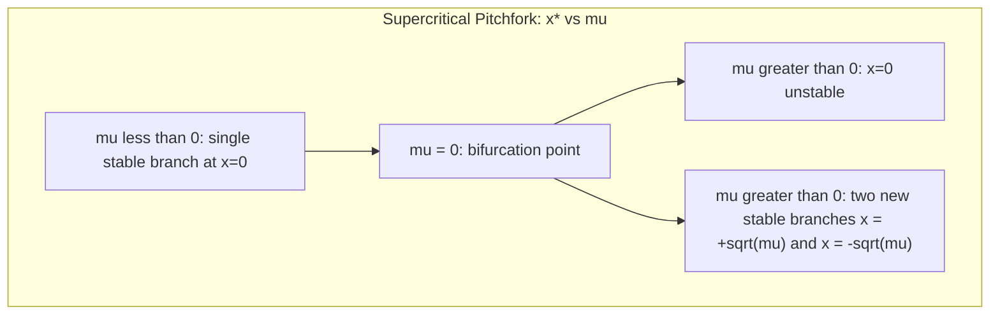

## Bifurcations

### Definition and Motivation

A **bifurcation** is a qualitative change in the topological structure of a dynamical system's phase portrait as a control parameter is varied continuously. At a bifurcation point (critical parameter value), the number, type, or stability of fixed points, limit cycles, or other invariant sets changes abruptly.

**Key Points**

- Bifurcation theory studies how the qualitative behavior of $\dot{\mathbf{x}}=\mathbf{F}(\mathbf{x};\mu)$ changes as the parameter $\mu$ is varied.
- The parameter value at which the transition occurs is the **bifurcation point** or **critical value**, $\mu_c$.
- A **bifurcation diagram** plots the location and stability of fixed points (or asymptotic states) as a function of the control parameter.
- Bifurcations are broadly divided into **local** (detectable via linearization near a fixed point) and **global** (involving larger-scale phase-space structures, e.g., homoclinic connections).

### Local Bifurcations in One-Dimensional Systems

For $\dot x=f(x;\mu)$, local bifurcations occur when a fixed point $x^*$ satisfies both $f(x^*;\mu)=0$ and $f'(x^*;\mu)=0$ simultaneously — i.e., the linear stability-determining derivative vanishes.

#### Saddle-Node Bifurcation (Fold Bifurcation)

Normal form:

$$\dot x=\mu+x^2$$

- For $\mu<0$: two fixed points exist, $x^*=\pm\sqrt{-\mu}$ (one stable, one unstable).
- For $\mu=0$: the two fixed points merge into one, semi-stable, point at $x=0$.
- For $\mu>0$: no fixed points exist.

This is the fundamental mechanism by which fixed points are **created or destroyed in pairs**.

#### Transcritical Bifurcation

Normal form:

$$\dot x=\mu x-x^2$$

Two fixed points, $x^*=0$ and $x^*=\mu$, exist for all $\mu$ but **exchange stability** as $\mu$ crosses zero. Unlike the saddle-node, no fixed points are created or destroyed — they persist but swap stability character.

#### Pitchfork Bifurcation

Normal form (supercritical):

$$\dot x=\mu x-x^3$$

- For $\mu\le0$: single stable fixed point at $x^*=0$.
- For $\mu>0$: $x^*=0$ becomes unstable, and two new stable fixed points appear at $x^*=\pm\sqrt\mu$.

This arises naturally in systems with symmetry ($f(-x)=-f(x)$), common in physical systems with reflection symmetry (e.g., buckling of a symmetrically loaded beam).

Normal form (subcritical):

$$\dot x=\mu x+x^3$$

Here the branching pair of fixed points is unstable and exists for $\mu<0$, while $x^*=0$ loses stability at $\mu=0$. Subcritical pitchforks are associated with **hysteresis** and abrupt jumps when higher-order (stabilizing) terms are included.

**Table: One-Dimensional Local Bifurcations**

| Bifurcation | Normal Form | Fixed Points Before | Fixed Points After |
| --- | --- | --- | --- |
| Saddle-node | $\dot x=\mu+x^2$ | 2 (μ<0) | 0 (μ>0) |
| Transcritical | $\dot x=\mu x-x^2$ | 2, stability exchanges | 2, stability exchanged |
| Supercritical pitchfork | $\dot x=\mu x-x^3$ | 1 stable | 3 (1 unstable, 2 stable) |
| Subcritical pitchfork | $\dot x=\mu x+x^3$ | 3 (1 stable, 2 unstable) | 1 unstable |

### Bifurcation Diagram Example (Supercritical Pitchfork)

### Hopf Bifurcation (Two-Dimensional Systems)

A **Hopf bifurcation** occurs in systems with two or more dimensions when a pair of complex-conjugate eigenvalues of the Jacobian crosses the imaginary axis (real part passes through zero) as $\mu$ varies, giving birth to a limit cycle from a fixed point.

**Supercritical Hopf:** the fixed point loses stability and a small, stable limit cycle grows continuously from it as $\mu$ increases past $\mu_c$. Amplitude scales as:

$$r\propto\sqrt{\mu-\mu_c}$$

**Subcritical Hopf:** an unstable limit cycle shrinks onto the fixed point as $\mu\to\mu_c^-$, and beyond $\mu_c$ trajectories jump to a distant, often large-amplitude, attractor. Subcritical Hopf bifurcations are associated with hysteresis and hard-onset oscillations.

**Example**

The Van der Pol oscillator (in reversed-time or parameter-varied forms) and many chemical oscillators (e.g., the Brusselator model) exhibit Hopf bifurcations, marking the onset of sustained periodic oscillation from a previously stable, quiescent equilibrium.

### Global Bifurcations

Global bifurcations cannot be detected by local linearization; they involve larger phase-space structures.

- **Saddle-node on invariant circle (SNIC) bifurcation:** a limit cycle is created/destroyed when a saddle-node pair of fixed points appears/disappears on a closed invariant curve, producing oscillations with diverging period near onset (infinite-period bifurcation).
- **Homoclinic bifurcation:** a limit cycle's period diverges as it approaches and merges with a saddle point's homoclinic orbit (a trajectory that leaves and returns to the same saddle).
- **Heteroclinic bifurcation:** analogous, but involving a connection between two distinct saddle points.

[Inference] Distinguishing SNIC from homoclinic bifurcations experimentally often relies on how oscillation period scales near onset (logarithmic divergence for homoclinic vs. a $1/\sqrt{\mu-\mu_c}$-type divergence for SNIC), since both produce large-period oscillations as the control parameter approaches threshold.

### Period-Doubling (Flip) Bifurcation

Occurs in discrete-time maps (or Poincaré sections of continuous flows) when a fixed point of period $n$ loses stability as a Floquet/map multiplier passes through $-1$, spawning a new stable orbit of period $2n$.

**Example: Logistic Map**

$$x_{n+1}=rx_n(1-x_n)$$

- For $r<3$: single stable fixed point.
- At $r=3$: period-doubling bifurcation to a period-2 cycle.
- At $r\approx3.449$: period-4 cycle.
- Successive period-doublings accumulate at $r_\infty\approx3.5699$, beyond which chaotic behavior emerges (with periodic windows interspersed).

The ratio of successive parameter intervals between period-doublings converges to the universal **Feigenbaum constant**:

$$\delta=\lim_{n\to\infty}\frac{r_n-r_{n-1}}{r_{n+1}-r_n}\approx4.6692$$

This constant is universal across a broad class of unimodal (single-hump) maps, making the period-doubling route to chaos a canonical, experimentally verified pathway [Unverified — universality class conditions such as map smoothness and single quadratic maximum must hold precisely for the exact constant to apply].

### Bifurcation Diagram: Logistic Map Structure (svg_diagram)

<svg xmlns="http://www.w3.org/2000/svg" viewBox="0 0 640 360">
<text x="320" y="24" font-size="16" font-weight="bold" text-anchor="middle">Logistic Map Bifurcation Diagram — Schematic (svg_diagram)</text>
<line x1="60" y1="320" x2="600" y2="320" stroke="black" stroke-width="1.5" />
<line x1="60" y1="320" x2="60" y2="50" stroke="black" stroke-width="1.5" />
<text x="320" y="345" font-size="13" text-anchor="middle">Control parameter r (2.8 to 4.0)</text>
<text x="30" y="180" font-size="13" text-anchor="middle" transform="rotate(-90 30 180)">x*</text>
<line x1="60" y1="260" x2="220" y2="260" stroke="#2b6cb0" stroke-width="2" />
<text x="140" y="250" font-size="11" text-anchor="middle" fill="#2b6cb0">Single stable point (r&lt;3)</text>
<line x1="220" y1="260" x2="220" y2="180" stroke="#718096" stroke-width="1" stroke-dasharray="2,2" />
<path d="M 220 260 Q 280 180, 340 150" stroke="#c05621" stroke-width="2" fill="none" />
<path d="M 220 260 Q 280 300, 340 310" stroke="#c05621" stroke-width="2" fill="none" />
<text x="280" y="130" font-size="11" fill="#c05621">Period-2 branch</text>
<path d="M 340 150 Q 370 130, 400 140" stroke="#276749" stroke-width="1.5" fill="none" />
<path d="M 340 150 Q 370 165, 400 158" stroke="#276749" stroke-width="1.5" fill="none" />
<path d="M 340 310 Q 370 320, 400 315" stroke="#276749" stroke-width="1.5" fill="none" />
<path d="M 340 310 Q 370 300, 400 305" stroke="#276749" stroke-width="1.5" fill="none" />
<text x="400" y="120" font-size="11" fill="#276749">Period-4</text>
<rect x="400" y="55" width="180" height="260" fill="#fed7d7" opacity="0.4" />
<text x="490" y="70" font-size="11" fill="#822727" text-anchor="middle">Chaotic region (with periodic windows)</text>
<line x1="220" y1="330" x2="220" y2="335" stroke="black" />
<text x="220" y="350" font-size="10" text-anchor="middle">r=3</text>
<line x1="400" y1="330" x2="400" y2="335" stroke="black" />
<text x="400" y="350" font-size="10" text-anchor="middle">r≈3.57</text>
</svg>

### Codimension and Bifurcation Classification

The **codimension** of a bifurcation is the minimum number of parameters that must be varied for the bifurcation to occur generically:

- **Codimension-1:** saddle-node, transcritical, pitchfork, Hopf, period-doubling — occur along a curve in parameter space by varying a single parameter.
- **Codimension-2:** e.g., Bogdanov-Takens, cusp bifurcations — require two parameters to be tuned simultaneously; these often act as organizing centers from which multiple codimension-1 bifurcation curves emanate.

### Bifurcations and Routes to Chaos

Bifurcation cascades are central to several well-documented routes by which a system transitions from regular to chaotic dynamics:

1. **Period-doubling cascade:** successive flip bifurcations accumulate at a finite parameter value (Feigenbaum scenario).
2. **Quasi-periodic route (Ruelle-Takens-Newhouse):** a sequence of Hopf bifurcations introduces additional incommensurate frequencies, and a third frequency can destabilize the torus into chaos.
3. **Intermittency route:** a saddle-node bifurcation causes long periods of near-regular behavior interrupted by irregular bursts, with burst frequency increasing as the parameter moves further from threshold.

### Practical Numerical Construction of Bifurcation Diagrams

1. Fix the system equations with a free parameter $\mu$.
2. For each value of $\mu$ across a swept range, integrate (or iterate, for maps) forward, discarding a transient.
3. Record the surviving asymptotic values (fixed points, or Poincaré-section/sampled points for periodic and chaotic orbits).
4. Plot recorded values against $\mu$ to reveal the bifurcation structure.

[Inference] Numerical bifurcation diagrams for chaotic regimes are sensitive to transient length and iteration count — insufficient transient discard can leave diagrams contaminated by pre-asymptotic behavior, particularly near bifurcation points where convergence to the true attractor slows (critical slowing down).

### Conclusion

Bifurcation theory provides the systematic framework for understanding how small, continuous changes in a system's parameters can produce sudden, qualitative changes in its dynamical behavior — from the creation and destruction of fixed points, to the birth of oscillations, to full-blown chaos. Local bifurcations (saddle-node, transcritical, pitchfork, Hopf, period-doubling) are characterized via linearization, while global bifurcations (homoclinic, SNIC) require analysis of larger phase-space structures. Bifurcation cascades form the essential bridge connecting regular dynamics to chaotic dynamics.

**Related Topics**

- Phase Space and Attractors
- Lyapunov Exponents and Sensitive Dependence on Initial Conditions
- The Logistic Map and Feigenbaum Universality
- Routes to Chaos: Period-Doubling, Quasi-Periodicity, and Intermittency
- Normal Form Theory and Center Manifold Reduction
- Structural Stability and Genericity in Dynamical Systems